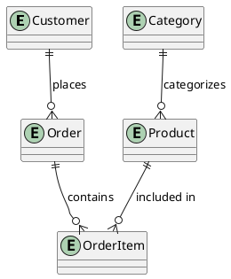

# DynamoDB Faux-SQL Design: Complete Guide

## Table of Contents

1. [Overview & Introduction](#1-overview--introduction)
   - 1.1. [What is DynamoDB Faux-SQL Design?](#11-what-is-dynamodb-faux-sql-design)
   - 1.2. [When to Use Faux-SQL](#12-when-to-use-faux-sql)
   - 1.3. [Trade-offs & Considerations](#13-trade-offs--considerations)
   - 1.4. [Migration Path (Faux-SQL → Single-Table)](#14-migration-path-faux-sql--single-table)
2. [Data Modeling Workflow](#2-data-modeling-workflow)
   - 2.1. [Step 1: Understand Your Requirements](#21-step-1-understand-your-requirements)
   - 2.2. [Step 2: Identify Core Entities](#22-step-2-identify-core-entities)
   - 2.3. [Step 3: Create Entity-Relationship Diagram (ERD)](#23-step-3-create-entity-relationship-diagram-erd)
   - 2.4. [Step 4: Define Access Patterns](#24-step-4-define-access-patterns)
   - 2.5. [Step 5: Review and Validate](#25-step-5-review-and-validate)
   - 2.6. [Step 6: Design Primary Keys](#26-step-6-design-primary-keys)
   - 2.7. [Step 7: Model Relationships](#27-step-7-model-relationships)
   - 2.8. [Step 8: Design Secondary Indexes (GSIs)](#28-step-8-design-secondary-indexes-gsis)
   - 2.9. [Step 9: Define Entity Attributes with Schemas](#29-step-9-define-entity-attributes-with-schemas)
   - 2.10. [Step 10: Validate Against Anti-Patterns](#210-step-10-validate-against-anti-patterns)
3. [Advanced Topics](#3-advanced-topics)
   - 3.1. [Handling Complex Queries](#31-handling-complex-queries)
   - 3.2. [Pagination Strategies](#32-pagination-strategies)
   - 3.3. [Optimistic Locking](#33-optimistic-locking)
   - 3.4. [Batch Operations](#34-batch-operations)
4. [Migration & Evolution](#4-migration--evolution)
5. [Complete Examples](#5-complete-examples)
6. [Reference](#6-reference)

---

## 1. Overview & Introduction

### 1.1. What is DynamoDB Faux-SQL Design?

DynamoDB Faux-SQL Design is an approach where you use DynamoDB but structure your data **like a relational database**. Instead of cramming multiple entity types into a single table with overloaded keys (single-table design), you create **separate tables for each entity type**, similar to traditional SQL databases.

**Core Principles:**

- **Multiple tables**: One table per entity type (Customers, Orders, Products, etc.)
- **Descriptive keys**: Meaningful names (CustomerId, OrderId) instead of generic (PK, SK)
- **Normalized data**: Follow relational normalization principles
- **Simple GSIs**: One index per access pattern, no overloading
- **Multiple requests**: Accept 2-3 serial requests for related data

---

### 1.2. When to Use Faux-SQL

**Use Faux-SQL when:**

#### A. Developer Agility Over Performance

**Context**: "In new applications where developer agility is more important than application performance"

When building new applications, especially at startups, you often:

- Don't know your exact access patterns yet
- Need to iterate quickly on your data model
- May pivot the entire application direction
- Can tolerate 100ms response times instead of 10ms

**Quote from the book**: "You may decide that the performance characteristics of a single-table design are not worth the loss of flexibility and more difficult analytics"

#### B. Easier Analytics and Reporting

Single-table design makes analytics difficult because:

- Data is denormalized and "twisted into a pretzel"
- You need to "unwind" the table to make it analytics-friendly
- Multiple entity types are mixed together

With Faux-SQL:

- Each entity is in its own table (easy to export)
- Data is normalized (standard SQL queries work)
- Business analysts can understand the structure

**Quote**: "A well-optimized single-table DynamoDB layout looks more like machine code than a simple spreadsheet" — Forrest Brazeal

#### C. Compatibility with Serverless Architecture

DynamoDB works perfectly with serverless because:

- No connection pooling issues (HTTP-based API)
- Pay-per-use pricing model
- Seamless integration with AWS Lambda
- Infrastructure-as-code friendly

Traditional relational databases have problems with serverless due to connection management.

#### D. AI/LLM Assistant Compatibility

While not explicitly stated in the book, Faux-SQL is dramatically easier for AI coding assistants because:

- **Standard CRUD patterns**: AI models are trained on millions of SQL examples
- **Descriptive naming**: Clear attribute names help with code generation
- **No complex overloading**: No need to understand partition key patterns like `CUSTOMER#<Id>#ORDER#<OrderId>`
- **Familiar patterns**: One-to-many relationships work like foreign keys

**Use Single-Table when:**

✅ Performance is critical (sub-10ms response times)  
✅ High throughput (>10K requests/second)  
✅ Access patterns are well-defined and stable  
✅ Team has DynamoDB expertise  
✅ Cost optimization at scale is priority

**Decision Matrix:**

| Factor                         | Use Faux-SQL                         | Use Single-Table                        |
| ------------------------------ | ------------------------------------ | --------------------------------------- |
| **Application Stage**          | MVP, early-stage, uncertain patterns | Production, known patterns              |
| **Response Time Needs**        | 50-200ms acceptable                  | Sub-10ms required                       |
| **Access Pattern Knowledge**   | Patterns still evolving              | Patterns well-defined                   |
| **Team Experience**            | Junior devs, new to DynamoDB         | Experienced DynamoDB modelers           |
| **Analytics Requirements**     | Frequent ad-hoc queries needed       | OLTP focus, separate analytics pipeline |
| **Scale Requirements**         | < 10K requests/sec                   | Millions of requests/sec                |
| **GraphQL Usage**              | Yes                                  | No (REST/RPC)                           |
| **Development Speed Priority** | High - need to ship fast             | Lower - performance critical            |

### Explicit Guidance from the Book

**When NOT to use single-table design** (i.e., when Faux-SQL is appropriate):

> "There are two occasions where [single-table benefits] don't outweigh the costs:
>
> - In new applications where developer agility is more important than application performance
> - In applications using GraphQL"

**Important caveat**:

> "But first I want to emphasize that these are exceptions, not general guidance. When modeling with DynamoDB, you should be following best practices... And even if you opt into a multi-table design, you should understand single-table design to know why it's not a good fit for your specific application."

---

### 1.3. Trade-offs & Considerations

**✅ Advantages of Faux-SQL:**

- **Fast development**: Familiar patterns, quick iteration
- **Easy to understand**: SQL-like structure, clear naming
- **Flexible**: Easy to add entities and access patterns
- **Analytics-friendly**: Normalized data, easy exports
- **AI-compatible**: Standard patterns for code generation
- **Lower cognitive load**: No complex key overloading

**⚠️ Disadvantages of Faux-SQL:**

- **Higher latency**: Multiple requests (50-100ms vs 10ms)
- **More expensive at scale**: More RCUs/WCUs consumed
- **No atomic transactions across tables**: Can't update Customer + Order atomically
- **Potential hot partitions**: If not careful with key design
- **Less efficient**: Can't pre-join related data

**Performance Comparison:**

```
Single-Table: 1 request → 10ms
Faux-SQL: 3 requests → 50-100ms

At 1K req/sec:
Single-Table: ~$10/month
Faux-SQL: ~$30/month

At 100K req/sec:
Single-Table: ~$1,000/month
Faux-SQL: ~$3,000/month
```

**When Trade-offs Are Acceptable:**

- MVP/early-stage (speed > performance)
- < 10K requests/second
- Analytics requirements high
- Team learning DynamoDB
- Using GraphQL

---

### 1.4. Migration Path (Faux-SQL → Single-Table)

**When to Migrate:**

- Traffic exceeds 10K requests/second
- Latency becomes user-facing issue
- Cost optimization becomes priority
- Access patterns have stabilized

**Migration Strategy:**

```
Phase 1: Design single-table schema
├─ Map Faux-SQL tables to single table
├─ Design GSIs for access patterns
└─ Document transformations

Phase 2: Dual-write implementation
├─ Write to both old and new tables
├─ Validate data parity
└─ Monitor for errors

Phase 3: Switch reads gradually
├─ Use feature flags
├─ Route % of traffic to new table
└─ Monitor performance

Phase 4: Deprecate old tables
├─ Stop dual-writes
├─ Archive old data
└─ Delete old tables
```

**Timeline**: Typically 2-4 weeks for complete migration

See [Section 7.3](#73-migrating-to-single-table-design) for detailed migration guide.

---

## 2. Data Modeling Workflow

**Goal**: Design DynamoDB tables and keys for your entities

**Key Principle**: "Model incrementally—focus on current job/sprint, not the entire application. Use descriptive names and simple patterns—optimize for developer clarity."

**Overview**:

The Faux-SQL data modeling workflow consists of 10 steps divided into two phases:

**Steps 1-5: Experience & Domain Design**

- Understand requirements and identify entities
- Create ERD and document access patterns
- Validate design decisions

**Steps 6-10: Table Design**

- Design primary keys and relationships
- Create secondary indexes
- Define entity schemas and validate against anti-patterns

**Key Difference from Single-Table:**

- Don't need ALL access patterns upfront
- Focus on current job/sprint requirements
- Can add patterns incrementally later
- Use descriptive key names (not PK/SK)
- One table per entity
- Simple GSIs (no overloading)

**Prerequisites**:

- [ ] Job card or user stories defined
- [ ] UI mockups available (if applicable)
- [ ] Basic understanding of current feature requirements

---

### 2.1. Step 1: Understand Your Requirements

**What:** Gather requirements from job cards, mockups, and user stories

**Why:** Unlike single-table design which requires comprehensive upfront planning, Faux-SQL allows incremental discovery. Focus on understanding the current job/sprint rather than the entire application.

**How:**

1. **Review functional requirements for current job**

   - Read job card, user stories, acceptance criteria
   - Interview stakeholders (PM, engineers)
   - Document user workflows for this feature

2. **Identify interactions for current job**

   - User-facing actions (search, view, create)
   - System-to-system (if applicable)
   - Admin operations (if applicable)

3. **Gather non-functional requirements (optional)**
   - Expected scale for this feature
   - Performance targets (less critical for Faux-SQL)
   - Cost constraints

**Key Questions:**

- What actions can users perform in this job/feature?
- What data needs to be displayed on each screen?
- What are the main workflows?
- Are there any related features we should consider?
- What's out of scope for this job?

**Output:** Application overview scoped to current job/sprint

**Example:** E-commerce "Product Catalog" feature

```markdown
# Job: Product Catalog Feature

## User Actions

- Browse products by category
- View product details
- Search products by keyword
- Filter products by price range

## Entities Needed

- Product
- Category
- ProductImage

## Workflows

1. User selects category → sees filtered product list
2. User clicks product → sees detail page with images
3. User searches keyword → sees matching products

## Out of Scope (Future Jobs)

- Shopping cart
- Order management
- User reviews
```

**Common Pitfalls:**

❌ **Trying to model entire application**: Leads to analysis paralysis  
✅ **Solution**: Focus only on current job/sprint entities

❌ **Skipping mockup analysis**: Missing key entities  
✅ **Solution**: Walk through each screen systematically

---

### 2.2. Step 2: Identify Core Entities

**What:** Extract the main business objects from your requirements

**Why:** Each entity will become its own DynamoDB table. Focus on current job entities only - you can add more tables later as new features require them.

**How:**

1. **List all nouns** from requirements
2. **Identify core entities** vs attributes
3. **Focus on current job** - don't model future entities yet
4. **Draft initial entity list** (3-7 entities typical for one job)

**Guidelines:**

- Entities are usually the main objects users interact with
- Start focused on current job, expand later
- Don't worry about implementation details yet

**Common Entity Types:**

| Entity Type  | Examples                                  | Typical for                  |
| ------------ | ----------------------------------------- | ---------------------------- |
| User/Account | User, Customer, Admin, Organization       | Authentication, profiles     |
| Content      | Product, Post, Article, Media, Document   | Core business objects        |
| Activity     | Order, Transaction, Booking, Reservation  | User actions                 |
| Metadata     | Category, Tag, Status, Type               | Classification               |
| Relationship | Review, Comment, Like, Follow, Membership | Connections between entities |
| System       | AuditLog, Notification, Session           | System operations            |

**Output:** Entity list for current job

**Example:** E-commerce "Product Catalog" feature

```markdown
## Core Entities (Current Job):

- **Product**: Items for sale with name, description, price, inventory
- **Category**: Product classifications (Electronics, Clothing, etc.)
- **ProductImage**: Images associated with products
- **Brand**: Manufacturer/brand information

## Future Entities (Not Modeling Yet):

- Customer (for order management)
- Order (for checkout feature)
- Review (for ratings feature)
```

**Common Pitfalls:**

❌ **Too granular**: Creating entities for every attribute  
✅ **Solution**: Focus on main business objects

❌ **Modeling future features**: Adding entities not needed yet  
✅ **Solution**: Only model what's required for current job

---

### 2.3. Step 3: Create Entity-Relationship Diagram (ERD)

**What:** Visual representation of entities and their relationships

**Why:** ERD translates **directly** to table structure. Each entity box = one DynamoDB table. No need to "twist" the model for single-table patterns.

**How:**

1. **Identify all entities** for your current job
2. **Identify relationships** between entities
3. **Classify relationship types** (1:1, 1:N, M:N)
4. **Create visual ERD** using PlantUML or Mermaid
5. **Keep it simple** - Show only entities and relationships (no attributes)

**ERD Components:**

- **Entities** (rectangles): Core objects that become tables
- **Relationships** (lines): Connections between entities
- **Cardinality** (symbols): One-to-one, one-to-many, many-to-many

**Important**: The ERD should NOT include attributes. Attributes are documented separately in entity files.

**Output:** `docs/project/specs/erd.puml`

**Example ERD:** E-commerce application



**Validation Checklist:**

- [ ] All entity types for current job identified
- [ ] Relationships clearly marked
- [ ] Relationship cardinality specified (1:1, 1:N, M:N)
- [ ] ERD reviewed with team
- [ ] No attributes included in ERD (attributes go in entity files)

**Common Pitfalls:**

❌ **Including attributes**: ERD cluttered with fields  
✅ **Solution**: Show only entities and relationships (no attributes)

❌ **Missing cardinality**: Unclear if 1:1, 1:N, or M:N  
✅ **Solution**: Always mark relationship type explicitly

---

### 2.4. Step 4: Define Access Patterns

**What:** Document how data will be queried in your application

**Why:** Access patterns drive your table and GSI design. Unlike single-table design which requires ALL patterns upfront, Faux-SQL allows incremental discovery—start with current job patterns and add more as features evolve.

**How:**

**Choose an approach:**

**A. API-Centric Approach:**

- List all API endpoints for current job
- Document request/response shapes
- Example: `GET /merchants/{merchantId}` returns Merchant object
- Example: `GET /merchants?category={category}` returns list of Merchants

**B. UI-Centric Approach (Recommended):**

- Review each screen/page in current job
- Document data needed to render each screen
- Example: Merchant detail page shows Merchant profile + Reviews + Location
- Example: Search results page shows list of Merchants filtered by category

**Access Pattern Documentation:**

The access patterns table documents how you'll query and access your data in DynamoDB. For each pattern, document:

- **Entity**: The type of entity being accessed (e.g., Customer, Order, Product)
- **Access Pattern**: A description of what you're trying to accomplish (e.g., "Get Customer by ID", "List Orders for Customer")
- **Table/Index**: Which table or index will be used (e.g., "Main table", "GSI1", "GSI2")
  - **Note**: Use descriptive names here for clarity (e.g., "EmailIndex", "CustomerIndex") during planning
  - In Step 8, you'll implement these using generic GSI names (GSI1, GSI2) for flexibility
- **Parameters**: The specific parameters used in your DynamoDB API calls (e.g., "customerId", "email", "category + limit")
- **Notes**: Additional information such as:
  - Which API operation to use (GetItem, Query, Scan, etc.)
  - Special considerations or constraints
  - Implementation details
  - Performance considerations
  - Use case or screen where this pattern is used

**Access Pattern Template:**

| Entity   | Access Pattern               | Table/Index   | Parameters        | Notes                            |
| -------- | ---------------------------- | ------------- | ----------------- | -------------------------------- |
| Merchant | Get Merchant by ID           | Main table    | merchantId        | GetItem - Detail page            |
| Merchant | Search Merchants by Category | CategoryIndex | category          | Query - Search results           |
| Merchant | Get Merchant by Email        | EmailIndex    | email             | Query - Merchant portal login    |
| Review   | Get Reviews for Merchant     | MerchantIndex | merchantId, limit | Query - Detail page, sorted DESC |

**Critical Requirements:**

- **Be specific**: "Get Merchant" is not enough; specify "Get Merchant by ID"
- **Include all parameters**: What does the client know at query time?
- **Specify table/index**: Which table or GSI will satisfy this pattern?
- **Note API operation**: GetItem, Query, Scan, UpdateItem, etc.
- **Document special requirements**: Pagination, sorting, filtering, date ranges

**Common Patterns by Entity Type:**

| Entity Type  | Common Patterns                                        |
| ------------ | ------------------------------------------------------ |
| User         | Get by ID/username/email, Update profile, List by role |
| Organization | Get by ID, List members, Add/remove members            |
| Content      | Get by ID, List by author, List by date range, Search  |
| Orders       | Get by ID, Get by customer, Get by status, Get by date |
| Products     | Get by ID, List by category, Search by keyword         |

**Faux-SQL Flexibility:**

Unlike single-table design, you can:

- Start with basic patterns (Get by ID)
- Add GSIs later when new patterns emerge
- Create new tables for new entities without migration

**Validation Checklist:**

- [ ] All user-facing queries for current job documented
- [ ] All system-to-system queries documented
- [ ] Parameters specified for each pattern
- [ ] Status tracked (Implemented/Planned/Future)
- [ ] Patterns reviewed with team

**Output:** Access patterns documented in entity files (`docs/project/specs/entities/<entity>.md`)

**Example:** E-commerce application

```markdown
# Access Patterns

| Entity   | Access Pattern            | Table/Index   | Parameters                   | Notes                                    |
| -------- | ------------------------- | ------------- | ---------------------------- | ---------------------------------------- |
| Customer | Get Customer by ID        | Main table    | customerId                   | GetItem - Profile page                   |
| Customer | Get Customer by email     | EmailIndex    | email                        | Query - Login flow                       |
| Customer | Update Customer profile   | Main table    | customerId, updates          | UpdateItem - Profile edit                |
| Product  | Get Product by ID         | Main table    | productId                    | GetItem - Product detail page            |
| Product  | List Products by Category | CategoryIndex | categoryId, limit, nextToken | Query - Category browse page (paginated) |
| Order    | Get Order by ID           | Main table    | orderId                      | GetItem - Order details page             |
| Order    | Get Orders for Customer   | CustomerIndex | customerId, limit            | Query - Order history (sorted by date)   |
```

**Common Pitfalls:**

❌ **Trying to define all patterns upfront**: Delays development, analysis paralysis  
✅ **Solution**: Start with current job, add patterns incrementally

❌ **Vague pattern descriptions**: "Get merchant data" or "Query orders"  
✅ **Solution**: Be specific - "Get Merchant by MerchantId for detail page"

❌ **Not documenting parameters**: Missing what client knows at query time  
✅ **Solution**: Always specify exact parameters (IDs, filters, pagination tokens)

---

### 2.5. Step 5: Review and Validate

**What:** Validate that all requirements for current job are captured before moving to design

**Why:** Ensure you have enough information to start modeling. Unlike single-table, you can add more later, but validate current job scope is complete.

**How:**

1. **Review entity list** with team
2. **Review ERD** for current job entities
3. **Review access patterns** for current screens/workflows
4. **Identify any gaps** in requirements
5. **Get stakeholder sign-off** on current job scope

**Review Questions:**

- Have we captured all entities for the current job?
- Have we captured all relationships between these entities?
- Have we documented access patterns for current screens/workflows?
- Are there any edge cases we're missing?
- Do our patterns align with the job card and user stories?
- Can we start modeling with what we have, or do we need more information?

**Sign-off Required:**

- [ ] Technical lead approval on entity list and ERD
- [ ] Product manager approval on access patterns
- [ ] Stakeholder confirmation that current job scope is complete

**Output:** Approved Phase 1 deliverables

**Common Pitfalls:**

❌ **Skipping validation**: Moving to design with incomplete requirements  
✅ **Solution**: Quick review meeting with team before Phase 2

❌ **Waiting for perfect requirements**: Analysis paralysis  
✅ **Solution**: Validate current job scope only, iterate later

---

### Phase 1 Deliverables

Upon completion of Phase 1, you should have:

1. **Entity List** (documented in job card or planning notes)

   - Core entities for current job/sprint
   - Brief description of each entity

2. **Entity-Relationship Diagram** (`docs/project/specs/erd.puml`)

   - Visual representation of entities and relationships
   - Key attributes and cardinality

3. **Access Patterns** (documented in entity files)
   - Access patterns for current job
   - Documented per entity, not centralized
   - Foundation for table and GSI design

---

### Phase 1 Common Pitfalls

**1. Trying to model entire application upfront**

- **Problem**: Analysis paralysis, delayed development
- **Why it happens**: SQL mindset of designing complete schema
- **Solution**: Focus only on current job/sprint entities

**2. Skipping ERD creation**

- **Problem**: Unclear relationships, poor table design
- **Why it happens**: "It's simple, I don't need a diagram"
- **Solution**: Even simple models benefit from visual representation

**3. Defining too few access patterns**

- **Problem**: Missing GSIs, inefficient queries
- **Why it happens**: Assuming you can add patterns easily later
- **Solution**: Document all patterns for current job screens

**4. Not involving stakeholders**

- **Problem**: Missing requirements discovered during implementation
- **Why it happens**: Working in isolation
- **Solution**: Quick review with PM and engineers before Phase 2

---

### 2.6. Step 6: Design Primary Keys

**What:** Structure table primary keys i.e. partition key (PK) and sort key (SK)

**Why:** For efficient access

**How:**

1. **Choose key type** - Simple (PK only) or Composite (PK + SK)
2. **Use descriptive names** - CustomerId, OrderId (not PK and SK, like in single-table design)
3. **Document in entity-key table** format
4. **Map access patterns** to key design
5. **Add GSIs** for alternate lookups

**Primary Key Design Principles:**

**1. Descriptive Names:** Use meaningful attribute names

- ✅ Good: CustomerId, OrderId, ProductId
- ❌ Bad: PK, SK, GSI1PK, GSI1SK (single-table patterns)

**2. Simple vs. Composite:** Choose based on access patterns

- **Simple (PK only)**: Direct lookups by ID
- **Composite (PK + SK)**: Hierarchical data or one-to-many within table

**3. Client Knowledge:** Client must know the key at query time

- ✅ Good: CustomerId (from URL or session)
- ❌ Bad: CreatedAt (client doesn't know timestamp)

**Simple Key Pattern:**

```typescript
// CustomersTable
{
  CustomerId: "C123",  // Partition Key
  Email: "alice@example.com",
  Name: "Alice Smith"
}

// Query: Get customer by ID
GetItemCommand({
  TableName: "Customers",
  Key: { CustomerId: "C123" }
})
```

**Composite Key Pattern:**

```typescript
// OrderItemsTable (hierarchical)
{
  OrderId: "O456",      // Partition Key
  ItemId: "I789",       // Sort Key
  ProductId: "P123",
  Quantity: 2
}

// Query: Get all items for an order
QueryCommand({
  TableName: "OrderItems",
  KeyConditionExpression: "OrderId = :orderId"
})
```

**Entity-Key Table Template:**

```markdown
## MerchantsTable

| Entity   | PK         | SK  | Notes                     |
| -------- | ---------- | --- | ------------------------- |
| Merchant | MerchantId | -   | Simple key, direct lookup |

### GSI: CategoryIndex

| Entity   | GSI PK   | GSI SK | Notes                       |
| -------- | -------- | ------ | --------------------------- |
| Merchant | Category | -      | Query merchants by category |
```

**Validation Checklist:**

- [ ] Each table has appropriate key type (simple or composite)
- [ ] All "Get by ID" patterns use primary key
- [ ] All "Get many" patterns use Query (not Scan)
- [ ] Descriptive key names used (not PK/SK)
- [ ] GSIs identified for alternate access patterns
- [ ] No timestamps in keys unless client knows them

**Output:** Entity-key tables for each table documented in entity files and master entity-key table updated

**Example:** E-commerce tables

```markdown
## CustomersTable

- **Primary Key**: CustomerId (HASH)
- **Attributes**: Email, Name, CreatedAt

## OrdersTable

- **Primary Key**: OrderId (HASH)
- **GSI: CustomerIndex**
  - CustomerId (HASH)
  - OrderDate (RANGE)
- **Attributes**: CustomerId, OrderDate, TotalAmount, Status

## OrderItemsTable

- **Primary Key**:
  - OrderId (HASH)
  - ItemId (RANGE)
- **Attributes**: ProductId, Quantity, PriceAtPurchase

## ProductsTable

- **Primary Key**: ProductId (HASH)
- **GSI: CategoryIndex**
  - CategoryId (HASH)
  - ProductName (RANGE)
- **Attributes**: Name, CategoryId, Price, Inventory
```

**Common Pitfalls:**

❌ **Using generic names**: PK, SK, GSI1PK  
✅ **Solution**: Use descriptive names - CustomerId, OrderId

❌ **Composite key when simple suffices**: Overcomplicating  
✅ **Solution**: Use composite only for hierarchies or 1:N in same table

---

### 2.7. Step 7: Model Relationships

**What:** Choose strategies for connecting entities

**Why:** Relationships use foreign keys and multiple requests, similar to SQL. Three main strategies: foreign key attributes, denormalization (bounded), or composite keys (hierarchies).

**How:**

1. **Review each relationship** in ERD
2. **Classify type** (1:1, 1:N, M:N)
3. **Choose strategy** based on decision tree
4. **Document decision** with rationale
5. **Update entity-key tables** if needed

**Relationship Strategy Decision Tree:**

```
Is relationship 1:1, 1:N, or M:N?
│
├─ 1:1 → Denormalize into single item
│
├─ 1:N → Is "N" bounded or unbounded?
│   ├─ Bounded (<20 items) → Denormalize with list/map attribute
│   └─ Unbounded → Choose:
│       ├─ Foreign key + GSI (separate tables)
│       └─ Composite key (hierarchical, same table)
│
└─ M:N → Choose:
    ├─ Junction table (normalized)
    └─ Denormalize in both directions (if bounded)
```

**Strategy 1: Foreign Key + GSI (Unbounded 1:N)**

```typescript
// OrdersTable
{
  OrderId: "O123",
  CustomerId: "C456",  // Foreign key
  OrderDate: "2024-01-15",
  TotalAmount: 99.99
}

// GSI: CustomerIndex
// - CustomerId (HASH)
// - OrderDate (RANGE)

// Query: Get orders for customer
QueryCommand({
  TableName: "Orders",
  IndexName: "CustomerIndex",
  KeyConditionExpression: "CustomerId = :customerId"
})
```

**Strategy 2: Denormalization (Bounded 1:N)**

```typescript
// CustomersTable (with embedded addresses)
{
  CustomerId: "C456",
  Name: "Alice",
  Email: "alice@example.com",
  Addresses: [  // Bounded list (max 5 addresses)
    { Type: "Home", Street: "123 Main St", City: "Seattle" },
    { Type: "Work", Street: "456 Oak Ave", City: "Portland" }
  ]
}
```

**Strategy 3: Composite Keys (Hierarchical 1:N)**

```typescript
// OrderItemsTable (items always queried with parent order)
{
  OrderId: "O123",     // Partition Key
  ItemId: "I456",      // Sort Key
  ProductId: "P789",
  Quantity: 2,
  Price: 29.99
}

// Query: Get all items for an order
QueryCommand({
  TableName: "OrderItems",
  KeyConditionExpression: "OrderId = :orderId"
})
```

**Strategy 4: Junction Table (M:N)**

```typescript
// ProductsTable
{
  ProductId: "P123",
  Name: "Laptop"
}

// CategoriesTable
{
  CategoryId: "C456",
  Name: "Electronics"
}

// ProductCategoriesTable (junction table)
{
  ProductId: "P123",      // Partition Key
  CategoryId: "C456",     // Sort Key
  IsPrimary: true
}

// Query: Get categories for product
QueryCommand({
  TableName: "ProductCategories",
  KeyConditionExpression: "ProductId = :productId"
})

// Query: Get products in category (requires GSI)
// GSI: CategoryIndex
// - CategoryId (HASH)
// - ProductId (RANGE)
```

**Output:** Relationship decisions documented

**Example Documentation:**

```markdown
## Merchant → Reviews (1:N, Unbounded)

**Strategy:** Composite key (MerchantId + ReviewId)

**Rationale:**

- Unbounded (could have 1000s of reviews)
- Always queried together ("show merchant with reviews")
- Reviews don't need independent access

**Implementation:**

- ReviewsTable: PK=MerchantId, SK=ReviewId
- Query: KeyConditionExpression="MerchantId = :id"
```

**Validation Checklist:**

- [ ] All ERD relationships have documented strategies
- [ ] Bounded 1:N relationships use lists (not separate tables)
- [ ] Unbounded 1:N relationships use separate tables or composite keys
- [ ] M:N relationships use junction tables or denormalization
- [ ] Foreign keys have GSIs for reverse lookups
- [ ] Relationship decisions documented with rationale

**Common Pitfalls:**

❌ **Unbounded lists as attributes**: Hits 400KB item limit  
✅ **Solution**: Use separate table with composite key or foreign key + GSI

❌ **No documentation**: Unclear why strategy chosen  
✅ **Solution**: Document rationale for each relationship

---

### 2.8. Step 8: Design Secondary Indexes (GSIs)

**What:** Add alternate access patterns via GSIs using a hybrid approach

**Why:** In agile development, you may not know all access patterns upfront. Using generic GSI attribute names (GSI1PK, GSI1SK) allows flexibility to add and reuse indexes for multiple related patterns without over-indexing, while maintaining Faux-SQL's simplicity through descriptive table and primary key names.

**Key Principle:** "Balanced Approach - Descriptive tables and primary keys, generic GSI attributes"

**How:**

1. **Identify alternate lookups** - What queries can't use primary key?
2. **Use generic GSI attribute names** - GSI1PK/GSI1SK, GSI2PK/GSI2SK (not CustomerId, Email)
3. **Use generic index names** - GSI1, GSI2, GSI3
4. **Group related patterns** - One GSI can serve multiple related access patterns
5. **Document GSI usage** - Track which patterns use which GSI

**Why Generic GSI Attributes?**

As stated in "The DynamoDB Book": _"New users often want to add a secondary index for each read pattern. This is overkill and will cost more. Instead, you can overload your secondary indexes."_

For Faux-SQL modeling, this means:

- ✅ You might not know all patterns upfront in agile development
- ✅ Adding GSIs later requires backfilling existing items with new attributes
- ✅ Generic names (GSI1PK) let you reuse indexes for multiple related patterns
- ✅ You avoid the "5+ GSIs with descriptive names" trap
- ✅ Cost-efficient: typically need only 1-2 GSIs per table

**Unlike single-table design**, you're NOT:

- ❌ Mixing entity types in one table
- ❌ Using complex prefixing schemes across entities
- ❌ Handling multiple entity types in one GSI

**Pattern: One Core GSI Per Access Pattern "Family"**

```typescript
// Example: Orders table needs 2-3 access pattern families

// Family 1: "Who" queries (customer, seller)
GSI1PK: CustomerId | SellerId
GSI1SK: OrderDate#OrderId

// Family 2: "What" queries (status, type)
GSI2PK: Status | OrderType
GSI2SK: OrderDate#OrderId

// Family 3: "When" queries (rare, often solved by GSI1SK/GSI2SK)
```

**Pattern: Unique Alternate Key**

```typescript
// CustomersTable
// Primary: CustomerId
// GSI1: Email lookup (for login by email)

{
  CustomerId: "C123",
  Email: "alice@example.com",
  Name: "Alice",
  GSI1PK: "alice@example.com",  // Generic attribute name
  GSI1SK: "alice@example.com"   // Generic attribute name
}

// Query by email
QueryCommand({
  TableName: "Customers",
  IndexName: "GSI1",
  KeyConditionExpression: "GSI1PK = :email",
  ExpressionAttributeValues: {
    ":email": "alice@example.com"
  }
})
```

**Pattern: Foreign Key Lookup with Reuse**

```typescript
// OrdersTable
// Primary: OrderId
// GSI1: Customer & Seller queries (reused for related patterns)

// Sprint 1: Customer orders
{
  OrderId: "O456",
  CustomerId: "C123",
  OrderDate: "2024-01-15",
  Total: 99.99,
  GSI1PK: "C123",                    // Customer ID
  GSI1SK: "2024-01-15#O456"          // Date + OrderId for sorting
}

// Sprint 5: Seller orders (reusing GSI1!)
{
  OrderId: "O789",
  CustomerId: "C456",
  SellerId: "S999",
  OrderDate: "2024-02-01",
  Total: 149.99,
  GSI1PK: "S999",                    // Seller ID (different partition key value)
  GSI1SK: "2024-02-01#O789"
}

// Query orders by customer
QueryCommand({
  TableName: "Orders",
  IndexName: "GSI1",
  KeyConditionExpression: "GSI1PK = :customerId",
  ExpressionAttributeValues: {
    ":customerId": "C123"
  }
})

// Query orders by seller (same GSI!)
QueryCommand({
  TableName: "Orders",
  IndexName: "GSI1",
  KeyConditionExpression: "GSI1PK = :sellerId",
  ExpressionAttributeValues: {
    ":sellerId": "S999"
  }
})
```

**Pattern: Status/Category Queries**

```typescript
// OrdersTable
// GSI2: Status-based queries (added in Sprint 7)

{
  OrderId: "O456",
  CustomerId: "C123",
  OrderDate: "2024-01-15",
  Status: "PENDING",
  Total: 99.99,
  GSI1PK: "C123",
  GSI1SK: "2024-01-15#O456",
  GSI2PK: "PENDING",                 // Status queries
  GSI2SK: "2024-01-15#O456"          // Same sort pattern
}

// Query orders by status
QueryCommand({
  TableName: "Orders",
  IndexName: "GSI2",
  KeyConditionExpression: "GSI2PK = :status",
  ExpressionAttributeValues: {
    ":status": "PENDING"
  }
})
```

**Output:** GSI definitions in entity files

**Example:**

```markdown
## OrdersTable

### Primary Key

- OrderId (HASH)

### GSI1: Customer & Seller Queries

- GSI1PK: CustomerId | SellerId
- GSI1SK: OrderDate#OrderId
- **Patterns**:
  - Get orders for customer
  - Get orders by seller
  - Date range queries for either

### GSI2: Status Queries

- GSI2PK: Status
- GSI2SK: OrderDate#OrderId
- **Patterns**:
  - Get orders by status
  - Status + date range queries

### GSI3: (Reserved for future use)
```

**When to Add a New GSI vs. Reuse Existing:**

**Reuse Existing GSI When:**

- New pattern is similar to existing (e.g., "filter by date range" + "sort by date")
- Can share the same partition key concept
- Example: GSI1PK for both `CustomerId` and `SellerId` queries (different requests, same structure)

**Add New GSI When:**

- Requires a fundamentally different partition key
- Example: Can't reuse customer-based GSI1 for status-based queries

**Agile Implementation Strategy:**

**Sprint 1**: Start with primary key only

```typescript
{
  OrderId: "order-123",
  CustomerId: "customer-456",
  OrderDate: "2024-01-15"
}
```

**Sprint 3**: Add GSI1 for customer queries

```typescript
// Add GSI1 to table definition
// Backfill existing items:
{
  OrderId: "order-123",
  CustomerId: "customer-456",
  OrderDate: "2024-01-15",
  GSI1PK: "customer-456",            // New!
  GSI1SK: "2024-01-15#order-123"     // New!
}
```

**Sprint 7**: Reuse GSI1 for seller queries

```typescript
// No schema change needed!
{
  OrderId: "order-124",
  CustomerId: "customer-789",
  SellerId: "seller-111",
  OrderDate: "2024-02-01",
  GSI1PK: "seller-111",              // Different partition key value
  GSI1SK: "2024-02-01#order-124"
}
```

**Common Pitfalls:**

❌ **Descriptive GSI attribute names**: Using `CustomerId`, `Email` as GSI attributes  
✅ **Solution**: Use generic names - GSI1PK, GSI1SK, GSI2PK, GSI2SK

❌ **One GSI per pattern**: Creating CustomerIndex, SellerIndex, StatusIndex separately  
✅ **Solution**: Group related patterns - GSI1 for "who" queries, GSI2 for "what" queries

❌ **Descriptive index names**: CustomerIndex, EmailIndex  
✅ **Solution**: Use generic names - GSI1, GSI2, GSI3

❌ **Not documenting GSI usage**: Forgetting which patterns use which GSI  
✅ **Solution**: Maintain clear documentation of GSI purpose and patterns

---

### 2.9. Step 9: Define Entity Attributes

**What:** Document all entity attributes with their types and purpose

**Why:** Attribute definitions provide a clear reference for what data each entity stores. This is a design-time activity; TypeScript interfaces will be created during implementation by the backend service team.

**How:**

1. **List all attributes** for each entity in your entity documentation
2. **Specify data types** (string, number, boolean, array, object)
3. **Use descriptive property names** matching your domain language
4. **Document purpose** for non-obvious attributes
5. **Group related attributes** (Core Identity, Location, Contact, etc.)
6. **Note any constraints** (required, optional, max length, format)

**Output:** Entity attribute documentation in entity files (e.g., `docs/project/specs/entities/<entity>.md`)

**Example:**

```markdown
## Entity Attributes

### Core Identity

- `MerchantId` (string, UUID) - Primary key
- `LegalName` (string, required) - Official business name
- `TradingName` (string, optional) - Display name if different from legal name
- `PrimaryCategory` (enum, required) - Repair | Refill | Recycling | Donate

### Location

- `PrimaryAddress` (string, required) - Street address
- `City` (string, required)
- `State` (string, required)
- `PostalCode` (string, required)
- `Latitude` (number, required) - GPS coordinate for distance calculations
- `Longitude` (number, required) - GPS coordinate for distance calculations

### Contact

- `PhoneNumber` (string, required)
- `Email` (string, required)
- `WebsiteUrl` (string, optional)

### Search Metadata

- `Categories` (string[], max 4) - Array of categories for multi-category merchants
- `Services` (Service[], max 10) - List of services offered (embedded object)

### Metrics (Denormalized)

- `RatingAverage` (number, 0-5) - Average rating from reviews
- `RatingCount` (number) - Total number of reviews

### Timestamps

- `CreatedAt` (datetime, ISO 8601)
- `UpdatedAt` (datetime, ISO 8601)
```

**Common Pitfalls:**

❌ **Missing key attributes**: Forgetting to include primary keys and GSI attributes  
✅ **Solution**: Include MerchantId, GSI1PK, and any other keys from entity-key table

❌ **Generic property names**: Using "id", "data", "info"  
✅ **Solution**: Descriptive names matching business domain (LegalName, not Name)

❌ **No type specifications**: Just listing attribute names  
✅ **Solution**: Always specify data type and constraints (required/optional, max length)

❌ **Mixing design and implementation**: Including TypeScript-specific details  
✅ **Solution**: Focus on business attributes; implementation details come later

---

### 2.10. Step 10: Validate Against Anti-Patterns

**What:** Review design against common DynamoDB anti-patterns

**Why:** Even with Faux-SQL's simplicity, you can still fall into DynamoDB-specific traps.

**How:**

1. **Review design** against anti-pattern checklist
2. **Validate table structure** is appropriate
3. **Check for common mistakes**

**Anti-Pattern Checklist:**

**❌ Unbounded attributes in items:**

- Problem: Storing unlimited reviews as list in Merchant item
- Solution: Use separate ReviewsTable with composite key

**❌ Hot partitions:**

- Problem: All merchants in one partition
- Solution: Each merchant has unique MerchantId partition

**❌ Scan operations for common queries:**

- Problem: No GSI for "get merchant by email"
- Solution: Add EmailIndex GSI

**❌ Large items (>400KB):**

- Problem: Embedding all product data in Order item
- Solution: Use foreign keys, fetch separately

**✅ Good Faux-SQL Patterns:**

- One table per entity type
- Descriptive key names
- Simple GSIs (one per pattern)
- Foreign keys for relationships
- Bounded denormalization only

**Output:** Validated design ready for implementation

**Common Pitfalls:**

❌ **Skipping validation**: Discovering issues during implementation  
✅ **Solution**: Quick 15-minute review before coding

❌ **Ignoring DynamoDB limits**: Assuming SQL-like flexibility  
✅ **Solution**: Remember 400KB item limit, partition key design

---

### Phase 2 Deliverables

Upon completion of Phase 2, you should have:

1. **Entity Files** (`docs/project/specs/entities/<entity>.md`)

   - Primary key design for each table
   - GSI definitions with descriptive names
   - Access patterns mapped to keys

2. **Master Entity-Key Table** (`docs/project/specs/entity-key-table-master.md`)

   - Quick reference for all entities across the application
   - **Must be updated** when current job adds new entities or tables
   - Provides at-a-glance view of table structure and keys

3. **Entity Schemas** (TypeScript interfaces in codebase)

   - TypeScript interfaces for each entity
   - All attributes documented
   - Type-safe definitions

4. **Relationship Documentation**

   - Strategy chosen for each relationship
   - Rationale for foreign keys vs denormalization
   - Updated access patterns in entity files

5. **Validated Design**
   - Anti-pattern review completed
   - Team sign-off on design
   - Ready for implementation

---

### Phase 2 Common Pitfalls

**1. Using generic PK/SK names**

- **Problem**: Trying to use single-table patterns in Faux-SQL approach
- **Solution**: Use descriptive names (CustomerId, OrderId, not PK/SK)

**2. Over-normalizing**

- **Problem**: Creating too many tables, excessive joins
- **Solution**: Denormalize bounded relationships, use composite keys

**3. Not planning for GSIs**

- **Problem**: Realizing too late that alternate access patterns need indexes
- **Solution**: Document access patterns early, add GSIs proactively

**4. Ignoring DynamoDB limits**

- **Problem**: Designing without considering 400KB item limit, partition key design
- **Solution**: Review DynamoDB limits during design phase

**5. Skipping validation**

- **Problem**: Moving to implementation with flawed design
- **Solution**: Quick peer review before implementation

---

## 3. Advanced Topics

### 3.1. Handling Complex Queries

**Filtering After Query:**

```typescript
// Get active orders for customer
const result = await docClient.send(
  new QueryCommand({
    TableName: "Orders",
    IndexName: "CustomerIndex",
    KeyConditionExpression: "CustomerId = :customerId",
    FilterExpression: "#status = :status",
    ExpressionAttributeNames: { "#status": "Status" },
    ExpressionAttributeValues: {
      ":customerId": customerId,
      ":status": "ACTIVE",
    },
  })
);
```

**Note:** FilterExpression still scans all items, just filters results. For frequent filters, consider adding GSI.

---

### 3.2. Pagination Strategies

```typescript
export async function getOrdersPaginated(
  customerId: string,
  lastKey?: Record<string, any>
) {
  const result = await docClient.send(
    new QueryCommand({
      TableName: "Orders",
      IndexName: "CustomerIndex",
      KeyConditionExpression: "CustomerId = :customerId",
      ExpressionAttributeValues: { ":customerId": customerId },
      Limit: 20,
      ExclusiveStartKey: lastKey,
    })
  );

  return {
    items: result.Items as Order[],
    nextKey: result.LastEvaluatedKey,
    hasMore: !!result.LastEvaluatedKey,
  };
}
```

---

### 3.3. Optimistic Locking

```typescript
export async function updateCustomer(customer: Customer) {
  await docClient.send(
    new PutCommand({
      TableName: "Customers",
      Item: { ...customer, Version: (customer.Version || 0) + 1 },
      ConditionExpression: "Version = :expectedVersion",
      ExpressionAttributeValues: {
        ":expectedVersion": customer.Version || 0,
      },
    })
  );
}
```

---

### 3.4. Batch Operations

```typescript
// Batch get multiple customers
export async function getCustomersBatch(customerIds: string[]) {
  const result = await docClient.send(
    new BatchGetCommand({
      RequestItems: {
        Customers: {
          Keys: customerIds.map((id) => ({ CustomerId: id })),
        },
      },
    })
  );

  return result.Responses?.Customers as Customer[];
}
```

---

## 4. Migration & Evolution

### 4.1. Adding New Entities

**Process:**

1. Create new table with CDK
2. Implement repository
3. Deploy infrastructure
4. No impact on existing tables

**Example:** Adding Products table to existing e-commerce app

```typescript
const productsTable = new dynamodb.Table(this, "ProductsTable", {
  tableName: "Products",
  partitionKey: { name: "ProductId", type: dynamodb.AttributeType.STRING },
  billingMode: dynamodb.BillingMode.PAY_PER_REQUEST,
});
```

---

### 4.2. Adding New Access Patterns

**Process:**

1. Add GSI to existing table
2. Backfill GSI attributes on existing items (if needed)
3. Implement new query method
4. Deploy

**Example:** Adding "Get orders by status" pattern

```typescript
// Add GSI to OrdersTable
ordersTable.addGlobalSecondaryIndex({
  indexName: "StatusIndex",
  partitionKey: { name: "Status", type: dynamodb.AttributeType.STRING },
  sortKey: { name: "OrderDate", type: dynamodb.AttributeType.STRING },
});

// Backfill script (if Status attribute missing on old items)
async function backfillStatus() {
  // Scan and update items...
}
```

---

### 4.3. Migrating to Single-Table Design

See [Section 1.4](#14-migration-path-faux-sql--single-table) for overview.

**Detailed Migration Steps:**

**Phase 1: Design Single-Table Schema**

- Map each Faux-SQL table to single-table patterns
- Design GSIs for all access patterns
- Create entity-key tables

**Phase 2: Dual-Write**

- Write to both old and new tables
- Validate data parity
- Monitor for errors

**Phase 3: Backfill Historical Data**

- Scan old tables
- Transform to new format
- Write to new table

**Phase 4: Switch Reads**

- Use feature flags
- Route traffic gradually
- Monitor performance

**Phase 5: Deprecate**

- Stop dual-writes
- Archive old tables
- Delete after safety period

---

## 5. Complete Examples

### 5.1. E-commerce Application

**Tables:**

- CustomersTable (PK: CustomerId, GSI: EmailIndex)
- OrdersTable (PK: OrderId, GSI: CustomerIndex)
- OrderItemsTable (PK: OrderId, SK: ItemId)
- ProductsTable (PK: ProductId)

**Access Patterns:**

1. Get customer by ID
2. Get customer by email (login)
3. Get orders for customer
4. Get order by ID
5. Get items for order
6. Get product by ID

---

### 5.2. SaaS Multi-Tenant Application

**Tables:**

- OrganizationsTable (PK: OrgId)
- UsersTable (PK: UserId, GSI: EmailIndex, GSI: OrgIndex)
- SubscriptionsTable (PK: OrgId)

**Access Patterns:**

1. Get organization
2. Get user by ID
3. Get user by email
4. Get users for organization
5. Get subscription for organization

---

## 6. Reference

### 6.1. Entity File Template

```markdown
# [EntityName]Table

## Primary Key

- [AttributeName] (HASH)
- [AttributeName] (RANGE) - if composite

## GSI: [IndexName]

- [AttributeName] (HASH)
- [AttributeName] (RANGE) - if needed
- Purpose: [Description]
- Access Pattern: [Pattern description]

## Implemented Access Patterns

✅ [Pattern 1]
✅ [Pattern 2]

## Planned Access Patterns

🔲 [Pattern 3]
🔲 [Pattern 4]
```

---

### 6.2. CDK Template

See Section 5.1 for complete CDK examples.

---

### 6.3. Glossary

**Faux-SQL**: DynamoDB modeling approach using multiple tables with descriptive names

**Foreign Key**: Attribute referencing primary key of another table

**GSI**: Global Secondary Index for alternate access patterns

**Composite Key**: Primary key with partition key + sort key

**Denormalization**: Embedding related data to avoid additional requests

---

### 6.4. Further Reading

- **The DynamoDB Book** by Alex DeBrie (Chapter 8: Multi-Table Design)
- [AWS DynamoDB Developer Guide](https://docs.aws.amazon.com/dynamodb/)
- [Single-Table Design Guide](single-table-design.md) - For when you need to migrate

---

## Conclusion

Faux-SQL DynamoDB modeling provides a pragmatic approach for teams prioritizing development velocity over maximum performance. It's ideal for MVPs, early-stage applications, and teams learning DynamoDB.

**Key Takeaways:**

1. **One table per entity** - Familiar, SQL-like structure
2. **Descriptive names** - CustomerId, OrderId (not PK, SK)
3. **Simple GSIs** - One per access pattern, no overloading
4. **Incremental patterns** - Don't need all patterns upfront
5. **Easy to evolve** - Add tables and GSIs as needed
6. **Migration path exists** - Can move to single-table when scale demands

**When to Use:**

- MVP/early-stage applications
- Teams learning DynamoDB
- Analytics requirements high
- Using GraphQL
- Traffic < 10K req/sec

**When to Migrate:**

- Traffic > 10K req/sec
- Latency becomes critical
- Cost optimization needed
- Access patterns stabilized

**Good luck with your Faux-SQL DynamoDB modeling!** 🚀
