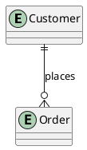
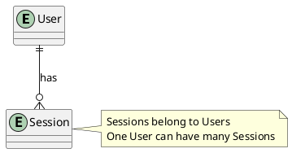
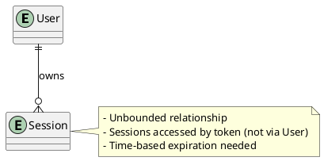

1. **ERD Creation Guide** - Foundation for understanding entities
2. **Access Patterns Definition Guide** - Bridge between UI/business needs and data model
3. **Primary Key Design Guide** - Core modeling decisions
4. **Entity Schema Guide** - Capturing non-key attributes in TypeScript
5. **Relationship Strategies Quick Reference** - Pattern library for implementation
6. **Secondary Index Strategies Guide** - When and how to use GSIs
7. **Common Anti-Patterns Guide** - What to avoid

# Guide 1: ERD Creation Guide

## When to Use This Guide

- [ ] Starting Phase 1 (Experience & Domain Design)
- [ ] Have completed job stories and identified actors
- [ ] Need to translate business requirements into entity relationships

## Purpose

Create a conceptual Entity-Relationship Diagram (ERD) that identifies the core entities in your system and their relationships, without getting bogged down in implementation details.

## Key Principles

### What Goes in a DynamoDB ERD

- **Entities**: Core business objects (User, Order, Product, Session)
- **Relationships**: How entities relate (one-to-one, one-to-many, many-to-many)
- **Cardinality**: Relationship constraints (optional vs required)

### What to Exclude

- **Attributes**: Don't clutter the ERD with entity properties
  - Reason: Attributes are application concerns, not data modeling concerns
  - Exception: Include attributes only if they're used in relationships (e.g., foreign key equivalents)
- **Implementation details**: No DynamoDB-specific constructs yet

## Step-by-Step Process

### Step 1: Extract Entities from Job Stories

Review your job cards in `docs/specs/jobs/<job>/job-card.md` and identify nouns that represent things you need to persist.

**Questions to ask:**

- What business objects do users interact with?
- What data needs to survive beyond a single request?
- What objects have identity (can be created, read, updated, deleted)?

**Example from E-commerce:**

```
Job Story: "When checking out, I want to review my cart so that I can confirm my order"
→ Entities: Customer, Order, OrderItem
```

### Step 2: Identify Relationships

For each pair of entities, ask:

- Does one entity "own" or "contain" the other? → One-to-many
- Can they exist independently? → Many-to-many
- Is there exactly one of each? → One-to-one

**Relationship Notation:**



- `||` = exactly one
- `o|` = zero or one
- `}o` = zero or many
- `}|` = one or many

### Step 3: Validate Against Access Patterns (Preview)

Even though you'll formally define access patterns next, do a quick sanity check:

- For each relationship, can you imagine needing to traverse it in a query?
- Are there entities that are never accessed directly (only through parents)?

### Step 4: Create PlantUML Diagram

Save to `docs/specs/jobs/<job>/erd.puml`:



## DynamoDB-Specific Considerations

### Bounded vs Unbounded Relationships

Mark relationships as bounded (limited number of related items) or unbounded:

- Bounded: User → Addresses (typically <10)
- Unbounded: User → Orders (could be thousands)

This affects whether you can denormalize later.

### Shared Resources

Identify entities that share identity across types:

- Example: GitHub Issues and Pull Requests share numbering within a Repo
- Mark these clearly—they'll need special handling in primary key design

### Reference Counts

If you need to display counts (e.g., "Repo has 247 stars"), note this on the relationship.

## Common Patterns

### Pattern 1: Hierarchical Data

```
Organization → Projects → Tasks
```

Consider if lower levels need independent access.

### Pattern 2: Lookup Tables

Small, rarely-changing reference data (Categories, Status values):

- Include in ERD only if they have relationships
- Often better as enums in application code

### Pattern 3: Event Sourcing

If tracking state changes over time:

```
Order → OrderHistory
```

One-to-many relationship where child entities are append-only.

## Validation Checklist

- [ ] All entities represent business concepts, not technical artifacts
- [ ] Relationships have clear cardinality marked
- [ ] No DynamoDB implementation details in diagram
- [ ] Bounded vs unbounded relationships identified
- [ ] ERD saved to `docs/specs/jobs/<job>/erd.puml`
- [ ] Diagram reviewed with product/design stakeholders

## Anti-Patterns to Avoid

❌ Including UI-specific entities (e.g., "Form", "Widget")  
❌ Modeling API structure instead of domain model  
❌ Adding attributes like `createdAt`, `updatedAt` to ERD  
❌ Showing DynamoDB tables or indexes

## Next Steps

Once your ERD is validated:

1. Create entity chart scaffolding (see Primary Key Design Guide)
2. Define access patterns (see Access Patterns Definition Guide)
3. Begin translating relationships into DynamoDB strategies

## Example: Session Store ERD



**Entity List:**

- User
- Session

**Relationships:**

- User → Session (one-to-many, unbounded)

Output: `docs/specs/jobs/session-store/erd.puml`
