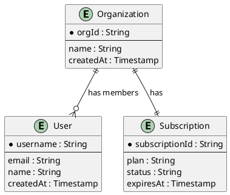

# Phase 1: Experience & Domain Design

## Overview

Phase 1 focuses on understanding your application requirements and translating them into a data modeling foundation. This phase is crucial for success with DynamoDB—you must know your access patterns before you can model your data effectively.

**Key Principle:** "You can't design your table until you know how you'll use your data".

## Objectives

By the end of Phase 1, you should have:

- [ ] Complete Entity-Relationship Diagram (ERD)
- [ ] Comprehensive list of all access patterns
- [ ] Draft entity chart identifying all entity types
- [ ] Clear understanding of relationships between entities

## Prerequisites

Before starting Phase 1:

- [ ] Functional requirements documented
- [ ] User stories or use cases defined
- [ ] Basic understanding of application workflows

## Steps

### Step 1: Understand Your Application

**Duration:** 1-2 days

**Activities:**

1. Review functional requirements
2. Interview stakeholders (PM, engineers, business analysts)
3. Document user workflows
4. Identify all user-facing and system-to-system interactions

**Key Questions:**

- What actions can users perform?
- What data needs to be displayed on each screen/page?
- What reports or analytics are needed?
- What are the latency requirements?
- What is the expected scale (users, requests, data size)?

**Output:** Application overview document

---

### Step 2: Identify Core Entities

**Duration:** 1 day

**Activities:**

1. List all nouns from your application overview
2. Identify which nouns represent core entities (User, Order, Product)
3. Identify which nouns represent attributes (Name, Email, Price)
4. Draft initial entity list

**Guidelines:**

- Entities are usually the main objects users interact with
- Start with 5-10 core entities; you can refine later
- Don't worry about implementation details yet

**Common Entity Types:**

- User management: User, Organization, Team, Role
- Content: Post, Comment, Article, Media
- Commerce: Product, Order, Cart, Payment
- Activity: Event, Notification, Audit Log

**Output:** Initial entity list

---

### Step 3: Create Entity-Relationship Diagram (ERD)

**Duration:** 1-2 days

**Use Guide:** [Guide 1: ERD Creation Guide](../guides/1-erd-creation.md)

**Activities:**

1. Document each entity with its attributes
2. Identify relationships between entities
3. Classify relationship types (one-to-one, one-to-many, many-to-many)
4. Create visual ERD using PlantUML or similar tool

**ERD Components:**

- **Entities** (rectangles): Core objects in your application
- **Attributes** (text within entities): Properties of each entity
- **Relationships** (diamonds/lines): Connections between entities

**Example ERD (SaaS Application):**



````

**Validation Checklist:**

- [ ] All entity types identified
- [ ] Key attributes listed for each entity
- [ ] Relationships clearly marked
- [ ] Relationship cardinality specified (1:1, 1:N, M:N)
- [ ] ERD reviewed with stakeholders

**Output:**

- `docs/specs/jobs/<job>/erd.puml`
- Draft entity chart

---

### Step 4: Define Access Patterns

**Duration:** 2-3 days

**Use Guide:** [Guide 2: Access Patterns Definition Guide](../guides/2-access-patterns-definition.md)

**Activities:**

1. Choose approach (API-centric or UI-centric)
2. Document every way data will be accessed
3. Specify parameters for each pattern
4. Estimate frequency and performance requirements

**Two Approaches:**

**A. API-Centric Approach:**

- List all API endpoints
- Document request/response shapes
- Example: `GET /users/{username}/orders` returns User + recent Orders

**B. UI-Centric Approach:**

- Review each screen/page in application
- Document data needed to render each screen
- Example: Dashboard shows User profile + Order history + Notifications

**Access Pattern Template:**

```markdown
| Entity | Access Pattern       | Parameters      | Response       | Frequency | Notes              |
| ------ | -------------------- | --------------- | -------------- | --------- | ------------------ |
| User   | Get User by username | username        | User object    | High      | Login flow         |
| Order  | Get Orders for User  | username, limit | List of Orders | High      | User dashboard     |
| Order  | Get Order by OrderId | orderId         | Order object   | Medium    | Order details page |
```

**Critical Requirements:**

- Be specific: "Get User" is not enough; specify "Get User by username"
- Include all parameters the client will know at query time
- Note any filtering, sorting, or pagination needs
- Estimate access frequency (helps prioritize optimization)

**Common Patterns by Entity Type:**

| Entity Type  | Common Patterns                                              |
| ------------ | ------------------------------------------------------------ |
| User         | Get by username/email, Update profile, Delete account        |
| Organization | Get by org ID, List members, Add/remove members              |
| Content      | Get by ID, List by author, List by date range, Search        |
| Orders       | Get by order ID, Get by customer, Get by status, Get by date |
| Events       | Get by ID, Get by timestamp range, Get by entity             |

**Anti-Pattern Warning:**
❌ Don't assume you can add patterns later without cost
✅ Document all patterns upfront; migrations are possible but require planning

**Validation Checklist:**

- [ ] All user-facing queries documented
- [ ] All system-to-system queries documented
- [ ] All background jobs documented
- [ ] Parameters specified for each pattern
- [ ] Frequency estimates added
- [ ] Patterns reviewed with stakeholders

**Output:** `docs/specs/jobs/<job>/data-access-patterns.md`

---

### Step 5: Review and Validate

**Duration:** 1 day

**Activities:**

1. Review ERD with technical team
2. Review access patterns with product team
3. Identify any missing entities or patterns
4. Confirm all requirements are captured

**Review Questions:**

- Have we captured all entities?
- Have we captured all relationships?
- Have we documented every access pattern?
- Are there any edge cases we're missing?
- Do our patterns align with user stories?

**Sign-off Required:**

- [ ] Technical lead approval on ERD
- [ ] Product manager approval on access patterns
- [ ] Stakeholder confirmation that requirements are complete

---

## Phase 1 Deliverables

Upon completion of Phase 1, you should have:

1. **Entity-Relationship Diagram** (`docs/specs/jobs/<job>/erd.puml`)

   - Visual representation of all entities and relationships
   - Includes key attributes for each entity

2. **Access Patterns Table** (`docs/specs/jobs/<job>/data-access-patterns.md`)

   - Complete list of all data access requirements
   - Parameters and frequency for each pattern

3. **Draft Entity Chart**
   - Initial list of entity types to be modeled
   - Foundation for Phase 2 primary key design

## Common Pitfalls

### 1. Skipping access pattern definition

**Problem:** Starting to model without knowing all access patterns
**Solution:** Invest time upfront to document every pattern

### 2. Being too generic

**Problem:** Patterns like "Query data" or "Get User"
**Solution:** Be specific: "Get User by username" with exact parameters

### 3. Assuming flexibility

**Problem:** Thinking you can add patterns easily later
**Solution:** Understand that migrations are possible but require planning

### 4. Not involving stakeholders

**Problem:** Missing requirements discovered during development
**Solution:** Review ERD and patterns with PM, engineers, and end users

## Moving to Phase 2

Before moving to Phase 2, ensure:

- [ ] All Phase 1 deliverables are complete
- [ ] ERD has been reviewed and approved
- [ ] Access patterns have been reviewed and approved
- [ ] No obvious missing entities or patterns
- [ ] Team consensus that requirements are stable

**Next Step:** [Phase 2: Data Modeling](phase-2.md)

---

## Additional Resources

- [Guide 1: ERD Creation Guide](../guides/1-erd-creation.md)
- [Guide 2: Access Patterns Definition Guide](../guides/2-access-patterns-definition.md)
- DynamoDB Book Chapter 7: "How to approach data modeling in DynamoDB"
````
