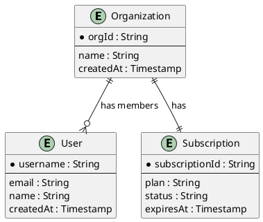

# Single-Table Design: Complete Guide

**Work in Progress** - This guide is being consolidated from existing phases and techniques documentation.

## Table of Contents

1. [Overview & Introduction](#1-overview--introduction)
2. [Quick Start](#2-quick-start)
3. [Phase 1: Experience & Domain Design](#3-phase-1-experience--domain-design)
4. [Phase 2: Data Modeling](#4-phase-2-data-modeling)
5. [Phase 3: Implementation](#5-phase-3-implementation)
6. [Advanced Topics](#6-advanced-topics)
7. [Migration & Evolution](#7-migration--evolution)
8. [Complete Examples](#8-complete-examples)
9. [Reference](#9-reference)

---

## 1. Overview & Introduction

### 1.1 What is Single-Table Design?

Single-table design is a DynamoDB data modeling approach where all entities and relationships are stored in a single table using generic key names (PK, SK) and overloaded indexes.

**Core Principles:**
- **One table for all entities**: User, Order, Product, etc. all in same table
- **Generic key names**: PK, SK, GSI1PK, GSI1SK (not CustomerId, OrderDate)
- **Overloaded indexes**: Single GSI handles multiple access patterns
- **Pre-joined data**: Related items stored together in item collections
- **Access pattern-driven**: Design keys to match exact query needs

### 1.2 When to Use Single-Table Design

**Use single-table design when:**

✅ Performance is critical (sub-10ms response times)
✅ High throughput (thousands of requests/second)
✅ Complex relationships (many-to-many)
✅ Massive scale (millions of items)
✅ Team has DynamoDB expertise

**Consider Faux-SQL approach when:**

❌ Development velocity is priority
❌ Team is learning DynamoDB
❌ Requirements change frequently
❌ Simple access patterns

### 1.3 Trade-offs

**Advantages:**
- ⚡ Fastest performance: Single request for related data
- 💰 Cost-efficient at scale: Fewer requests = lower cost
- 🔄 Atomic transactions: Related items in same partition

**Disadvantages:**
- 🧠 Steep learning curve: Complex key patterns
- 🐌 Slower development: More upfront planning required
- 🔧 Harder to change: Migrations require careful planning

---

## 2. Quick Start

### 2.1 Prerequisites

Before starting single-table design:

- [ ] Solid understanding of DynamoDB fundamentals
- [ ] All access patterns documented
- [ ] Team alignment on single-table approach
- [ ] Completed ERD showing entities and relationships

### 2.2 Tools Required

- **PlantUML or Mermaid**: For ERD diagrams
- **AWS CDK or CloudFormation**: Infrastructure-as-code
- **TypeScript/JavaScript**: For data access layer
- **NoSQL Workbench**: For testing queries (optional but recommended)

### 2.3 Your First Single-Table Model (5-minute example)

**Scenario**: Blog application with Users and Posts

**Entities:**
- User (username, email, name)
- Post (postId, title, content, author)

**Access Patterns:**
1. Get User by username
2. Get Posts by User
3. Get User by email
4. Get Post by postId

**Entity-Key Table:**

| Entity | PK | SK | GSI1PK | GSI1SK | Notes |
|--------|----|----|--------|--------|-------|
| User | USER#\<username\> | USER#\<username\> | EMAIL#\<email\> | EMAIL#\<email\> | Main user item |
| Post | USER#\<username\> | POST#\<timestamp\>#\<postId\> | POST#\<postId\> | POST#\<postId\> | Grouped by user |

**Query Examples:**

```typescript
// Pattern 1: Get User by username
const user = await dynamodb.get({
  TableName: 'BlogTable',
  Key: {
    PK: 'USER#alice',
    SK: 'USER#alice'
  }
});

// Pattern 2: Get Posts by User
const posts = await dynamodb.query({
  TableName: 'BlogTable',
  KeyConditionExpression: 'PK = :pk AND begins_with(SK, :sk)',
  ExpressionAttributeValues: {
    ':pk': 'USER#alice',
    ':sk': 'POST#'
  }
});

// Pattern 3: Get User by email
const user = await dynamodb.query({
  TableName: 'BlogTable',
  IndexName: 'GSI1',
  KeyConditionExpression: 'GSI1PK = :pk',
  ExpressionAttributeValues: {
    ':pk': 'EMAIL#alice@example.com'
  }
});

// Pattern 4: Get Post by postId
const post = await dynamodb.query({
  TableName: 'BlogTable',
  IndexName: 'GSI1',
  KeyConditionExpression: 'GSI1PK = :pk',
  ExpressionAttributeValues: {
    ':pk': 'POST#post123'
  }
});
```

**Key Insights:**

- User and Post items share same table
- Posts grouped under User's PK (item collection)
- GSI1 overloaded for both email lookup and post lookup
- Generic key names (PK, SK, GSI1PK, GSI1SK)

---

## 3. Phase 1: Experience & Domain Design

**Goal**: Understand requirements and translate into data modeling foundation

**Duration**: 3-5 days

**Key Principle**: "You can't design your table until you know how you'll use your data"

**Objectives**:

By the end of Phase 1, you should have:
- [ ] Complete Entity-Relationship Diagram (ERD)
- [ ] Comprehensive list of all access patterns
- [ ] Draft entity-key table identifying all entity types
- [ ] Clear understanding of relationships between entities

**Prerequisites**:

- [ ] Functional requirements documented
- [ ] User stories or use cases defined
- [ ] Basic understanding of application workflows

### 3.1 Step 1: Understand Your Application

**What**: Gather comprehensive requirements for your application

**Why**: Single-table design requires knowing ALL access patterns upfront. Missing patterns can require expensive migrations later.

**How**:

1. **Review functional requirements**
   - Read product specs, user stories, use cases
   - Interview stakeholders (PM, engineers, business analysts)
   - Document user workflows

2. **Identify all interactions**
   - User-facing actions (login, create post, search)
   - System-to-system (webhooks, batch jobs, analytics)
   - Admin operations (reporting, moderation)

3. **Gather non-functional requirements**
   - Latency requirements (p50, p99)
   - Expected scale (users, requests/sec, data size)
   - Consistency requirements
   - Cost constraints

**Key Questions**:

- What actions can users perform?
- What data needs to be displayed on each screen/page?
- What reports or analytics are needed?
- What are the latency requirements?
- What is the expected scale?

**Output**: Application overview document

**Example**: E-commerce application

```markdown
# Application Overview

## User Actions
- Browse products by category
- Search products by keyword
- View product details
- Add to cart
- Checkout
- View order history

## Admin Actions
- Manage inventory
- View sales reports
- Process refunds

## System Operations
- Send order confirmation emails
- Update inventory on purchase
- Generate daily sales reports

## Scale Requirements
- 10,000 active users
- 100 requests/second peak
- <50ms p99 latency
- 1M products
```

**Common Pitfalls**:

❌ **Incomplete requirements**: Missing access patterns discovered during development
✅ **Solution**: Invest time upfront, involve all stakeholders

❌ **Assuming flexibility**: Thinking patterns can be added easily later
✅ **Solution**: Understand that single-table migrations are complex

### 3.2 Step 2: Identify Core Entities

**What**: Extract the main business objects from your requirements

**Why**: Entities form the foundation of your data model. In single-table design, all entities will share the same table.

**How**:

1. **List all nouns** from your application overview
2. **Identify core entities** (User, Order, Product) vs attributes (Name, Email, Price)
3. **Draft initial entity list** (start with 5-10 core entities)

**Guidelines**:

- Entities are usually the main objects users interact with
- Start broad, refine later
- Don't worry about implementation details yet

**Common Entity Types**:

- **User management**: User, Organization, Team, Role
- **Content**: Post, Comment, Article, Media
- **Commerce**: Product, Order, Cart, Payment
- **Activity**: Event, Notification, Audit Log

**Output**: Initial entity list

**Example**: E-commerce application

```
Core Entities:
1. Customer
2. Product
3. Order
4. OrderItem
5. Category
6. Review
7. Cart
8. Payment
```

**Common Pitfalls**:

❌ **Too granular**: Creating entities for every attribute
✅ **Solution**: Focus on main business objects

❌ **Missing entities**: Forgetting system entities (Session, AuditLog)
✅ **Solution**: Review all workflows, not just user-facing

---

### 3.3 Step 3: Create Entity-Relationship Diagram (ERD)

**What**: Visual representation of entities and their relationships

**Why**: ERD helps identify relationships that will become item collections in single-table design. Unlike Faux-SQL where ERD maps directly to tables, single-table ERD shows logical relationships that you'll "twist" into key patterns.

**How**:

1. **Document each entity** with key attributes
2. **Identify relationships** between entities
3. **Classify relationship types** (1:1, 1:N, M:N)
4. **Create visual ERD** using PlantUML

**ERD Components**:

- **Entities** (rectangles): Core objects
- **Attributes** (text within entities): Key properties
- **Relationships** (lines): Connections between entities
- **Cardinality** (symbols): One-to-one, one-to-many, many-to-many

**Example ERD** (SaaS Application):



**Validation Checklist**:

- [ ] All entity types identified
- [ ] Key attributes listed for each entity
- [ ] Relationships clearly marked
- [ ] Relationship cardinality specified (1:1, 1:N, M:N)
- [ ] ERD reviewed with stakeholders

**Output**: `docs/specs/jobs/<job>/erd.puml`

**Common Pitfalls**:

❌ **Too many attributes**: ERD cluttered with every field
✅ **Solution**: Focus on key attributes and relationships

❌ **Missing relationships**: Not documenting how entities connect
✅ **Solution**: For each entity pair, ask "how are they related?"

---

### 3.4 Step 4: Define Access Patterns

**What**: Document every way data will be queried in your application

**Why**: Single-table design is access pattern-driven. Your key structure will be designed to satisfy these patterns efficiently. Missing patterns can require expensive migrations.

**How**:

**Choose an approach:**

**A. API-Centric Approach:**
- List all API endpoints
- Document request/response shapes
- Example: `GET /users/{username}/orders` returns User + recent Orders

**B. UI-Centric Approach (Recommended):**
- Review each screen/page in application
- Document data needed to render each screen
- Example: Dashboard shows User profile + Order history + Notifications

**Access Pattern Documentation**:

For each pattern, document:
- **Entity**: Primary entity being accessed
- **Pattern name**: Human-readable description
- **Parameters**: What the client knows at query time
- **Response**: What data is returned
- **Frequency**: Estimated requests per second/day
- **Performance target**: Required response time

**Access Pattern Template**:

| Entity | Access Pattern | Parameters | Response | Frequency | Notes |
|--------|---------------|------------|----------|-----------|-------|
| User | Get User by username | username | User object | High | Login flow |
| Order | Get Orders for User | username, limit | List of Orders | High | User dashboard |
| Order | Get Order by OrderId | orderId | Order object | Medium | Order details page |
| Product | Search Products | keyword, category | List of Products | High | Search page |

**Critical Requirements**:

- **Be specific**: "Get User" is not enough; specify "Get User by username"
- **Include all parameters**: What does the client know at query time?
- **Note filtering/sorting**: Any special requirements?
- **Estimate frequency**: Helps prioritize optimization

**Common Patterns by Entity Type**:

| Entity Type | Common Patterns |
|-------------|-----------------|
| User | Get by username/email, Update profile, Delete account |
| Organization | Get by org ID, List members, Add/remove members |
| Content | Get by ID, List by author, List by date range, Search |
| Orders | Get by order ID, Get by customer, Get by status, Get by date |
| Events | Get by ID, Get by timestamp range, Get by entity |

**Anti-Pattern Warning**:

❌ **Don't assume flexibility**: "We'll add patterns later"
✅ **Document all patterns upfront**: Migrations are possible but require planning

**Validation Checklist**:

- [ ] All user-facing queries documented
- [ ] All system-to-system queries documented
- [ ] All background jobs documented
- [ ] Parameters specified for each pattern
- [ ] Frequency estimates added
- [ ] Patterns reviewed with stakeholders

**Output**: `docs/specs/jobs/<job>/data-access-patterns.md`

**Example**: E-commerce access patterns

```markdown
# Access Patterns

## Customer Patterns
1. Get Customer by username
2. Get Customer by email
3. Update Customer profile
4. Get Orders for Customer (paginated, sorted by date DESC)

## Product Patterns
5. Get Product by productId
6. List Products by Category (paginated)
7. Search Products by keyword
8. Get Reviews for Product

## Order Patterns
9. Get Order by orderId
10. Create Order
11. Update Order status
12. Get Orders by status (for admin)

## Admin Patterns
13. Get all Customers (paginated)
14. Get sales by date range
15. Get top products by sales
```

**Common Pitfalls**:

❌ **Too generic**: "Query data" or "Get User"
✅ **Solution**: Be specific with parameters

❌ **Missing patterns**: Forgetting admin, analytics, or batch operations
✅ **Solution**: Review all workflows systematically

❌ **Not involving stakeholders**: Missing requirements discovered later
✅ **Solution**: Review with PM, engineers, and end users

### 3.5 Step 5: Review and Validate

**What**: Validate that all requirements are captured before moving to design

**Why**: Changes in Phase 2 are expensive. Ensure Phase 1 is complete.

**How**:

1. **Review ERD** with technical team
2. **Review access patterns** with product team
3. **Identify missing entities or patterns**
4. **Confirm all requirements captured**

**Review Questions**:

- Have we captured all entities?
- Have we captured all relationships?
- Have we documented every access pattern?
- Are there any edge cases we're missing?
- Do our patterns align with user stories?

**Sign-off Required**:

- [ ] Technical lead approval on ERD
- [ ] Product manager approval on access patterns
- [ ] Stakeholder confirmation that requirements are complete

**Output**: Approved Phase 1 deliverables

---

### Phase 1 Deliverables

Upon completion of Phase 1, you should have:

1. **Entity-Relationship Diagram** (`docs/specs/jobs/<job>/erd.puml`)
   - Visual representation of all entities and relationships
   - Includes key attributes for each entity

2. **Access Patterns Table** (`docs/specs/jobs/<job>/data-access-patterns.md`)
   - Complete list of all data access requirements
   - Parameters and frequency for each pattern

3. **Draft Entity-Key Table**
   - Initial list of entity types to be modeled
   - Foundation for Phase 2 primary key design

### Phase 1 Common Pitfalls Summary

**1. Skipping access pattern definition**
- **Problem**: Starting to model without knowing all access patterns
- **Solution**: Invest time upfront to document every pattern

**2. Being too generic**
- **Problem**: Patterns like "Query data" or "Get User"
- **Solution**: Be specific: "Get User by username" with exact parameters

**3. Assuming flexibility**
- **Problem**: Thinking you can add patterns easily later
- **Solution**: Understand that migrations are possible but require planning

**4. Not involving stakeholders**
- **Problem**: Missing requirements discovered during development
- **Solution**: Review ERD and patterns with PM, engineers, and end users

## 4. Phase 2: Data Modeling

**Goal**: Design DynamoDB table structure to efficiently satisfy all access patterns

**Duration**: 5-7 days

**Key Principle**: "You need to preassemble your data in the exact shape that is needed for a read operation"

**Objectives**:

By the end of Phase 2, you should have:
- [ ] Complete primary key design for all entities
- [ ] Entity-key tables for main table and all GSIs
- [ ] TypeScript entity schemas for all entities
- [ ] Documentation of relationship strategies
- [ ] Updated access patterns table with query details
- [ ] Validation that design avoids common anti-patterns

**Prerequisites**:

- [ ] Phase 1 complete and approved
- [ ] ERD finalized
- [ ] All access patterns documented
- [ ] Stakeholder sign-off on requirements

### 4.1 Step 4: Design Primary Keys

**What**: Design PK/SK patterns for each entity type

**Why**: Primary key design is the foundation of single-table design. Keys must support your access patterns efficiently.

**How**:

**Decision Point: Simple vs. Composite Primary Key**

Use **Simple Primary Key** (partition key only) when:
- All access patterns fetch single items by ID
- No "fetch many" requirements
- No relationships between entities

Use **Composite Primary Key** (partition + sort key) when:
- Need to fetch multiple related items in one request
- Have one-to-many or many-to-many relationships
- Need hierarchical or time-series queries

**For single-table design**: Always use composite primary key (PK + SK)

**Primary Key Design Principles**:

**1. Client Knowledge**: Client must know the key at read time

- ✅ Good: `PK: USER#<username>` (username from URL path)
- ❌ Bad: `PK: USER#<timestamp>` (client doesn't know timestamp)

**2. Entity Prefixes**: Use prefixes to distinguish entity types

```
PK: CUSTOMER#C123 (not just "C123")
SK: METADATA#C123 (not just "C123")
```

**3. Generic Names**: Use PK/SK, not descriptive names

- ✅ Good: PK, SK, GSI1PK, GSI1SK
- ❌ Bad: CustomerId, OrderDate

**Why generic names?**
- Enables overloading (multiple entity types per key)
- Easier to evolve (semantics in values, not attribute names)
- Follows DynamoDB best practices

**Entity-Key Table Template**:

| Entity | PK Pattern | SK Pattern | Notes |
|--------|-----------|------------|-------|
| User | USER#\<username\> | USER#\<username\> | Simple lookup |
| Order | CUSTOMER#\<customerId\> | ORDER#\<timestamp\>#\<orderId\> | Grouped by customer, sorted by time |
| Product | PRODUCT#\<productId\> | PRODUCT#\<productId\> | Simple lookup |

**Access Pattern Mapping**:

For each access pattern, document how it maps to your key design:

| Access Pattern | API Call | Key Condition | Notes |
|---------------|----------|---------------|-------|
| Get User by username | GetItem | PK = USER#\<username\> | Direct lookup |
| Get Orders for Customer | Query | PK = CUSTOMER#\<customerId\> | Returns all orders |
| Get Order by OrderId | GetItem (GSI) | GSI1PK = ORDER#\<orderId\> | Requires GSI |

**Validation Checklist**:

- [ ] Each entity has unique PK/SK combination
- [ ] All "Get by ID" patterns satisfied
- [ ] All "Get many" patterns grouped in item collections
- [ ] No timestamps in keys unless client knows them
- [ ] Generic key names used (PK, SK)
- [ ] Entity prefixes consistent across all entities

**Common Mistakes**:

- Using CreatedAt in primary key
- Descriptive key names (CustomerId, OrderDate)
- Not considering client knowledge at read time

**Output**: `docs/specs/jobs/<job>/entity-key-table-main.md`

**Example**: E-commerce entity-key table

| Entity | PK | SK | Notes |
|--------|----|----|-------|
| Customer | CUSTOMER#\<username\> | CUSTOMER#\<username\> | Main customer item |
| CustomerEmail | CUSTOMEREMAIL#\<email\> | CUSTOMEREMAIL#\<email\> | Email uniqueness tracking |
| Order | CUSTOMER#\<username\> | ORDER#\<orderDate\>#\<orderId\> | Unbounded, sorted by date |
| Product | PRODUCT#\<productId\> | PRODUCT#\<productId\> | Simple lookup |
| Review | PRODUCT#\<productId\> | REVIEW#\<timestamp\>#\<reviewId\> | Grouped by product |

**Common Pitfalls**:

❌ **Descriptive key names**: Using CustomerId instead of PK
✅ **Solution**: Use generic names (PK, SK) for flexibility

❌ **Timestamps in keys**: Client doesn't know timestamp at query time
✅ **Solution**: Only use timestamps when client knows them

### 4.2 Step 5: Model Relationships

**What**: Choose strategies for each relationship in your ERD

**Why**: Relationships in single-table design are modeled through item collections, denormalization, or adjacency lists. The strategy affects query patterns and performance.

**How**:

1. **Review each relationship** in ERD
2. **Classify relationship type** (1:1, 1:N, M:N)
3. **Choose appropriate strategy** for each relationship
4. **Update entity-key table** with relationship items (if needed)
5. **Document strategy decisions**

**Relationship Strategy Decision Tree**:

```
Is relationship 1:1, 1:N, or M:N?
│
├─ 1:1 → Denormalize into single item
│
├─ 1:N → Is "N" bounded or unbounded?
│   ├─ Bounded (<20 items) → Denormalize with complex attribute
│   └─ Unbounded → Item collection with composite key
│
└─ M:N → Choose strategy:
    ├─ Shallow duplication (copy limited attributes)
    ├─ Adjacency list (same table, multiple item collections)
    ├─ Materialized graph (GSI for reverse lookups)
    └─ Normalization (separate requests)
```

**Common Relationship Patterns**:

**One-to-One**:

```typescript
// Denormalize: Store related data on same item
interface User {
  PK: "USER#alexdebrie";
  SK: "USER#alexdebrie";
  Username: "alexdebrie";
  Profile: {
    // 1:1 relationship embedded
    Bio: "...";
    AvatarUrl: "...";
  };
}
```

**One-to-Many (Bounded)**:

```typescript
// Denormalize: Use List or Map attribute
interface Customer {
  PK: "CUSTOMER#C123";
  SK: "CUSTOMER#C123";
  Name: "Acme Corp";
  Addresses: [
    // Max 5 addresses
    { Street: "123 Main"; City: "Seattle" },
    { Street: "456 Oak"; City: "Portland" }
  ];
}
```

**One-to-Many (Unbounded)**:

```typescript
// Item collection: Separate items, same PK
// Customer item:
{ PK: 'CUSTOMER#C123', SK: 'CUSTOMER#C123', Name: 'Acme' }

// Order items (share PK):
{ PK: 'CUSTOMER#C123', SK: 'ORDER#2020-01-15#O456' }
{ PK: 'CUSTOMER#C123', SK: 'ORDER#2020-01-20#O789' }
```

**Many-to-Many**:

```typescript
// Adjacency list: Items represent relationships
// User item:
{ PK: 'USER#alice', SK: 'USER#alice', Name: 'Alice' }

// Membership items:
{ PK: 'USER#alice', SK: 'ORG#acme', Role: 'Admin' }
{ PK: 'USER#alice', SK: 'ORG#widgets', Role: 'Member' }

// Organization items:
{ PK: 'ORG#acme', SK: 'ORG#acme', Name: 'Acme Corp' }
{ PK: 'ORG#acme', SK: 'USER#alice', Role: 'Admin' }
```

**Relationship Documentation Template**:

Create `docs/specs/jobs/<job>/relationship-decisions.md`:

```markdown
# Relationship Strategy Decisions

## User → Orders (1:N, Unbounded)

**Strategy:** Item collection with composite primary key

**Rationale:**
- User can have unlimited orders (unbounded)
- Need to query "Get recent orders for user"
- Orders sorted by timestamp

**Implementation:**
- User: `PK: USER#<username>`, `SK: USER#<username>`
- Order: `PK: USER#<username>`, `SK: ORDER#<timestamp>#<orderId>`

**Query:**
KeyConditionExpression: PK = USER#alice AND SK begins_with ORDER#

## User → Profile (1:1)

**Strategy:** Denormalization into single item

**Rationale:**
- Always accessed together
- Profile data is small
- Simpler model

**Implementation:**
User item contains ProfileData map attribute
```

**Validation Checklist**:

- [ ] All ERD relationships have documented strategies
- [ ] Unbounded 1:N not stored as lists
- [ ] Bounded 1:N lists have reasonable limits (<20)
- [ ] M:N relationships support both access directions
- [ ] Relationship items added to entity-key table (if applicable)

**Output**: `docs/specs/jobs/<job>/relationship-decisions.md`, Updated entity-key table

**Common Pitfalls**:

❌ **Unbounded lists**: Storing unlimited items in a list attribute
✅ **Solution**: Use item collections for unbounded relationships

❌ **Missing reverse lookups**: M:N only supports one direction
✅ **Solution**: Use adjacency list or GSI for bidirectional access

### 4.3 Step 6: Design Secondary Indexes (GSIs)

**What**: Design Global Secondary Indexes to satisfy access patterns not covered by primary key

**Why**: GSIs enable additional query patterns. In single-table design, GSIs are overloaded to handle multiple patterns efficiently.

**How**:

1. **Identify access patterns** not satisfied by primary key
2. **Group patterns** by common access characteristics
3. **Design GSI key structures** to satisfy patterns
4. **Create entity-key tables** for each GSI
5. **Update access patterns table** with GSI queries
6. **Validate GSI overloading** opportunities

**When You Need a GSI**:

- Query by non-primary-key attribute
- Reverse lookup (e.g., Order → Customer when table is Customer → Order)
- Filter by attribute values (status, category, etc.)
- Sort by different attribute than primary SK

**GSI Design Principles**:

**1. Overload GSIs**

- Don't create one GSI per pattern
- Use generic names: GSI1PK, GSI1SK, GSI2PK, GSI2SK
- Handle multiple entity types per GSI

**2. Dedicated Attributes**

- Never reuse SK for GSI1SK
- Use separate attributes per index
- Easier to maintain and evolve

**3. Projection Strategy**

- KEYS_ONLY: Minimal storage, requires table lookup
- INCLUDE: Specify needed attributes
- ALL: Copy all attributes (highest cost)

**GSI Overloading Example**:

```typescript
// Single GSI handles multiple patterns
// GSI1: GSI1PK + GSI1SK

// Pattern 1: Get Order by OrderId
{
  PK: 'CUSTOMER#C123',
  SK: 'ORDER#O456',
  GSI1PK: 'ORDER#O456',  // Direct lookup
  GSI1SK: 'ORDER#O456'
}

// Pattern 2: Get Orders by Status
{
  PK: 'CUSTOMER#C123',
  SK: 'ORDER#O456',
  GSI1PK: 'STATUS#SHIPPED',  // Group by status
  GSI1SK: '2020-01-15#O456'  // Sort by date
}

// Pattern 3: Get User by Email
{
  PK: 'USER#alice',
  SK: 'USER#alice',
  GSI1PK: 'EMAIL#alice@example.com',  // Unique lookup
  GSI1SK: 'EMAIL#alice@example.com'
}
```

**GSI Entity-Key Table Template**:

Create `docs/specs/jobs/<job>/entity-key-table-gsi1.md`:

| Entity | GSI1PK Pattern | GSI1SK Pattern | Access Pattern | Notes |
|--------|---------------|----------------|----------------|-------|
| Order (by ID) | ORDER#\<orderId\> | ORDER#\<orderId\> | Get Order by OrderId | Direct lookup |
| Order (by Status) | STATUS#\<status\> | \<timestamp\>#\<orderId\> | Get Orders by Status | Sorted by date |
| User (by Email) | EMAIL#\<email\> | EMAIL#\<email\> | Get User by Email | Unique lookup |

**Sparse Index Pattern**:

```typescript
// Only include items in GSI when certain condition met
interface Order {
  PK: "CUSTOMER#C123";
  SK: "ORDER#O456";
  Status: "PENDING";
  GSI1PK: "PENDING#ORDER"; // Only set when Status=PENDING
  GSI1SK: "2020-01-15"; // Only set when Status=PENDING
}

// When Order ships, remove GSI attributes:
UpdateExpression: "SET Status = :status REMOVE GSI1PK, GSI1SK";
```

**Access Patterns Table Update**:

| Entity | Access Pattern | Index | Key Condition | Parameters | Notes |
|--------|---------------|-------|---------------|------------|-------|
| Order | Get Order by OrderId | GSI1 | GSI1PK = ORDER#\<orderId\> | orderId | Direct lookup |
| Order | Get Orders by Status | GSI1 | GSI1PK = STATUS#\<status\> | status, limit | Paginated |
| User | Get User by Email | GSI1 | GSI1PK = EMAIL#\<email\> | email | Unique |

**Validation Checklist**:

- [ ] All unsatisfied patterns have GSI strategy
- [ ] GSIs overloaded where possible
- [ ] Separate attributes per index
- [ ] Eventual consistency acceptable for all GSI queries
- [ ] Projection strategy chosen for each GSI
- [ ] Entity-key tables created for each GSI
- [ ] Access patterns table updated with query details

**Common Mistakes**:

- Creating one GSI per pattern
- Reusing attributes across indexes
- Not considering sparse index opportunities

**Output**: 
- `docs/specs/jobs/<job>/entity-key-table-gsi1.md`
- `docs/specs/jobs/<job>/entity-key-table-gsi2.md` (if needed)
- Updated access patterns table

**Common Pitfalls**:

❌ **One GSI per pattern**: Exhausting 20 GSI limit
✅ **Solution**: Overload GSIs with generic attribute names

❌ **Reusing attributes**: Using SK for both table and GSI
✅ **Solution**: Dedicated attributes (SK, GSI1SK, GSI2SK)

### 4.4 Step 7: Define Entity Schemas

**What**: Create TypeScript interfaces for each entity with all attributes

**Why**: Entity schemas document the structure of your data and provide type safety in your application code.

**How**:

1. **Create TypeScript interfaces** for each entity
2. **Document all application attributes** (non-key attributes)
3. **Define complex types** (nested objects, lists)
4. **Add Type attribute** to all entities
5. **Document attribute purposes and constraints**

**Schema Structure**:

```typescript
// Base interface for all items
interface BaseItem {
  PK: string;
  SK: string;
  Type: string; // Always include Type
  CreatedAt: string; // ISO-8601 timestamp
  UpdatedAt: string; // ISO-8601 timestamp
}

// Entity-specific interface
interface User extends BaseItem {
  Type: "User"; // Literal type
  Username: string;
  Email: string;
  Name: string;
  // ... other attributes
}

interface Order extends BaseItem {
  Type: "Order";
  OrderId: string;
  CustomerId: string;
  TotalAmount: number;
  Status: "PENDING" | "SHIPPED" | "DELIVERED";
  Items: OrderItem[]; // Nested complex type
}

interface OrderItem {
  ProductId: string;
  Quantity: number;
  PriceAtPurchase: number;
}
```

**Attribute Guidelines**:

**1. Always Include Type**
- Makes debugging easier
- Enables ETL filtering
- Clarifies console views

**2. Use Timestamps Appropriately**
- ISO-8601 format for human readability
- Unix timestamps for range queries
- Never in primary key unless client knows it

**3. Complex Attributes**
- Use maps for structured nested data
- Use lists for ordered collections (bounded size)
- Use sets for unique collections

**4. Avoid Over-Nesting**
- Keep nesting depth reasonable (≤3 levels)
- Consider separate items for deeply nested data

**Type Attribute Pattern**:

```typescript
// Filtering by Type in Scan operations
const users = await dynamodb.scan({
  TableName: "AppTable",
  FilterExpression: "Type = :type",
  ExpressionAttributeValues: {
    ":type": "User",
  },
});
```

**Validation Checklist**:

- [ ] All entities have TypeScript interfaces
- [ ] Type attribute included on every entity
- [ ] Complex attributes (maps, lists) properly defined
- [ ] No unbounded lists as attributes
- [ ] Timestamps in appropriate format
- [ ] Attribute names not DynamoDB reserved words

**Output**: `docs/specs/jobs/<job>/entity-schemas.ts`

**Common Pitfalls**:

❌ **Missing Type attribute**: Can't filter by entity type
✅ **Solution**: Add Type: 'EntityName' to every item

❌ **Unbounded lists**: Storing unlimited items in list attribute
✅ **Solution**: Use item collections instead

---

### 4.5 Step 8: Validate Against Anti-Patterns

**What**: Review design against common DynamoDB anti-patterns

**Why**: Catch design issues before implementation. Anti-patterns lead to poor performance, high costs, or maintenance nightmares.

**How**:

1. **Review design** against anti-pattern checklist
2. **Validate all access patterns** efficient at scale
3. **Confirm no relational database patterns**
4. **Check for proper separation of concerns**
5. **Get peer review** from team

**Validation Checklist**:

**Access Patterns:**

- [ ] No Scan operations in application code
- [ ] All patterns use Query or GetItem
- [ ] Filter expressions not primary access mechanism
- [ ] Each pattern documented with specific parameters

**Key Design:**

- [ ] Generic key names (PK, SK, GSI1PK, etc.)
- [ ] No timestamps in keys unless client knows them
- [ ] Separate attributes per index (no reuse)
- [ ] Type attribute on every item
- [ ] Entity prefixes consistent

**Relationships:**

- [ ] Related items pre-joined in item collections
- [ ] No multiple serial requests for fetching relations
- [ ] Unbounded lists not in single items
- [ ] Denormalization accepted for performance

**Architecture:**

- [ ] Data access layer at boundary
- [ ] Indexing separate from application attributes
- [ ] No ORM usage
- [ ] Single table for related entities

**Cost & Performance:**

- [ ] GSI overloading maximized
- [ ] Storage optimization not prioritized over compute
- [ ] No full-table scans expected

**Red Flags:**

- ❌ "We'll just Scan and filter for now"
- ❌ "Let's normalize this to save storage"
- ❌ "We can add patterns later without planning"
- ❌ "One GSI per entity type is cleaner"

**Peer Review:**

Schedule review with:
- [ ] Senior engineer familiar with DynamoDB
- [ ] Team member from Phase 1 discussions
- [ ] Someone not involved in modeling (fresh perspective)

**Output**: Validated, peer-reviewed data model, Anti-pattern review document

**Common Pitfalls**:

❌ **Skipping validation**: Discovering issues during implementation
✅ **Solution**: Invest time in thorough review

❌ **No peer review**: Missing blind spots
✅ **Solution**: Get fresh eyes on the design

---

### Phase 2 Deliverables

Upon completion of Phase 2, you should have:

1. **Primary Key Design**
   - `docs/specs/jobs/<job>/entity-key-table-main.md`
   - Complete PK/SK patterns for all entities

2. **Relationship Documentation**
   - `docs/specs/jobs/<job>/relationship-decisions.md`
   - Strategy for each relationship in ERD

3. **Entity Schemas**
   - `docs/specs/jobs/<job>/entity-schemas.ts`
   - TypeScript interfaces for all entities

4. **Secondary Index Designs**
   - `docs/specs/jobs/<job>/entity-key-table-gsi1.md`
   - `docs/specs/jobs/<job>/entity-key-table-gsi2.md` (if needed)
   - Complete GSI key patterns

5. **Updated Access Patterns Table**
   - All patterns mapped to specific queries
   - Index and parameters documented

6. **Anti-Pattern Review**
   - Validation checklist completed
   - Peer review sign-off

### Phase 2 Common Pitfalls Summary

**1. Skipping relationship strategy decisions**
- **Problem**: Jumping straight to keys without thinking through relationship patterns
- **Solution**: Use decision tree to explicitly choose strategy for each relationship

**2. Creating too many GSIs**
- **Problem**: One GSI per access pattern, exhausting 20 GSI limit
- **Solution**: Overload GSIs with generic attribute names

**3. Reusing attributes across indexes**
- **Problem**: Using SK for both table and GSI sort key
- **Solution**: Dedicated attributes (SK, GSI1SK, GSI2SK)

**4. Not including Type attribute**
- **Problem**: Can't filter by entity type in Scan/export operations
- **Solution**: Add Type: 'EntityName' to every item

**5. Descriptive key names**
- **Problem**: Using CustomerId, OrderDate as attribute names
- **Solution**: Use PK, SK, and store semantics in values

## 5. Phase 3: Implementation

**Goal**: Translate your data model into production code

**Duration**: 5-7 days

**Key Principle**: "Implement your data model at the very boundary of your application"

**Objectives**:

By the end of Phase 3, you should have:
- [ ] DynamoDB table(s) created via infrastructure-as-code
- [ ] Data access layer implemented
- [ ] All access patterns coded and tested
- [ ] Scripts for debugging and data exploration
- [ ] Monitoring and alerting configured
- [ ] Documentation updated with implementation details

**Prerequisites**:

- [ ] Phase 2 complete and approved
- [ ] Entity-key tables finalized for all indexes
- [ ] Access patterns table completely filled out
- [ ] Anti-pattern review passed
- [ ] Team sign-off on design

### 5.1 Step 9: Create Table with Infrastructure-as-Code

**What**: Define DynamoDB table in CDK, CloudFormation, or Terraform

**Why**: Infrastructure-as-code ensures consistency, enables version control, and makes deployments repeatable.

**How**:

1. **Define table** in IaC tool
2. **Configure primary key** (PK, SK)
3. **Add secondary indexes** (GSI1, GSI2, etc.)
4. **Set up billing mode** (on-demand or provisioned)
5. **Configure streams** (if needed)
6. **Add TTL configuration** (if needed)

**CDK Example**:

```typescript
import * as dynamodb from "aws-cdk-lib/aws-dynamodb";
import * as cdk from "aws-cdk-lib";

export class DataStack extends cdk.Stack {
  public readonly table: dynamodb.Table;

  constructor(scope: cdk.App, id: string, props?: cdk.StackProps) {
    super(scope, id, props);

    // Create table with composite primary key
    this.table = new dynamodb.Table(this, "AppTable", {
      tableName: "AppTable",
      partitionKey: {
        name: "PK",
        type: dynamodb.AttributeType.STRING,
      },
      sortKey: {
        name: "SK",
        type: dynamodb.AttributeType.STRING,
      },
      billingMode: dynamodb.BillingMode.PAY_PER_REQUEST, // Start with on-demand
      pointInTimeRecovery: true, // Enable backups
      stream: dynamodb.StreamViewType.NEW_AND_OLD_IMAGES, // Enable streams
      removalPolicy: cdk.RemovalPolicy.RETAIN, // Protect against accidental deletion
    });

    // Add GSI1
    this.table.addGlobalSecondaryIndex({
      indexName: "GSI1",
      partitionKey: {
        name: "GSI1PK",
        type: dynamodb.AttributeType.STRING,
      },
      sortKey: {
        name: "GSI1SK",
        type: dynamodb.AttributeType.STRING,
      },
      projectionType: dynamodb.ProjectionType.ALL,
    });

    // Add GSI2 (if needed)
    this.table.addGlobalSecondaryIndex({
      indexName: "GSI2",
      partitionKey: {
        name: "GSI2PK",
        type: dynamodb.AttributeType.STRING,
      },
      sortKey: {
        name: "GSI2SK",
        type: dynamodb.AttributeType.STRING,
      },
      projectionType: dynamodb.ProjectionType.ALL,
    });

    // Configure TTL
    this.table.addTimeToLive({
      attributeName: "TTL",
    });
  }
}
```

**Validation Checklist**:

- [ ] Table name matches documentation
- [ ] Primary key attributes match entity-key table
- [ ] All GSIs defined with correct key schema
- [ ] Billing mode appropriate for workload
- [ ] Streams enabled if needed
- [ ] TTL configured if needed
- [ ] Backups enabled
- [ ] Deletion protection configured

**Output**: Infrastructure-as-code files committed, Table deployed to development environment

**Common Pitfalls**:

❌ **Wrong attribute types**: Using NUMBER instead of STRING for keys
✅ **Solution**: Always use STRING for keys (can store numbers as strings)

❌ **Missing GSIs**: Forgetting to add all GSIs from design
✅ **Solution**: Cross-reference with entity-key tables

---

### 5.2 Step 10: Implement Data Access Layer

**What**: Create data access module with CRUD operations and query patterns

**Why**: Data access layer provides clean separation between application logic and DynamoDB-specific code.

**How**:

1. **Create data access module/package**
2. **Implement TypeScript interfaces** for entities
3. **Create helper functions** for key generation
4. **Implement CRUD operations** for each entity
5. **Implement query operations** for access patterns
6. **Add proper error handling**
7. **Write unit tests**

**Architecture Pattern**:

```
┌─────────────────────────────────────────┐
│         Application Logic               │
│  (Business rules, API handlers, etc.)   │
└─────────────────┬───────────────────────┘
                  │
                  ▼
┌─────────────────────────────────────────┐
│         Data Access Layer               │
│  (DynamoDB operations, key generation)  │
└─────────────────┬───────────────────────┘
                  │
                  ▼
┌─────────────────────────────────────────┐
│            DynamoDB Table               │
└─────────────────────────────────────────┘
```

**Key Principles**:

1. **Separation of Concerns**
   - Application code works with domain objects
   - Data layer handles DynamoDB-specific concerns
   - No DynamoDB code scattered throughout application

2. **Separate Indexing from Application Attributes**
   - Keep PK, SK, GSI1PK, GSI1SK separate from domain data
   - Makes migrations easier
   - Clearer separation of concerns

**File Structure**:

```
src/
├── entities/
│   ├── user.ts           # User entity interface & helpers
│   ├── order.ts          # Order entity interface & helpers
│   └── product.ts        # Product entity interface & helpers
├── data-access/
│   ├── dynamodb.ts       # DynamoDB client setup
│   ├── keys.ts           # Key generation helpers
│   ├── users.ts          # User CRUD operations
│   ├── orders.ts         # Order CRUD operations
│   └── products.ts       # Product CRUD operations
└── api/
    └── handlers.ts       # API route handlers
```

**Entity Interfaces Example**:

```typescript
// src/entities/user.ts

export interface User {
  username: string;
  email: string;
  name: string;
  createdAt: string;
  updatedAt: string;
}

// Internal DynamoDB item structure
export interface UserItem {
  PK: string; // USER#<username>
  SK: string; // USER#<username>
  Type: "User";
  Username: string;
  Email: string;
  Name: string;
  CreatedAt: string;
  UpdatedAt: string;
  GSI1PK?: string; // EMAIL#<email>
  GSI1SK?: string; // EMAIL#<email>
}
```

**Key Generation Helpers**:

```typescript
// src/data-access/keys.ts

export const keys = {
  user: {
    primary: (username: string) => ({
      PK: `USER#${username}`,
      SK: `USER#${username}`,
    }),
    byEmail: (email: string) => ({
      GSI1PK: `EMAIL#${email}`,
      GSI1SK: `EMAIL#${email}`,
    }),
  },

  order: {
    primary: (orderId: string) => ({
      PK: `ORDER#${orderId}`,
      SK: `ORDER#${orderId}`,
    }),
    byCustomer: (customerId: string, timestamp: string, orderId: string) => ({
      PK: `CUSTOMER#${customerId}`,
      SK: `ORDER#${timestamp}#${orderId}`,
    }),
    byStatus: (status: string, timestamp: string, orderId: string) => ({
      GSI1PK: `STATUS#${status}`,
      GSI1SK: `${timestamp}#${orderId}`,
    }),
  },
};
```

**CRUD Operations Example**:

```typescript
// src/data-access/users.ts

import { PutCommand, GetCommand, UpdateCommand, DeleteCommand } from "@aws-sdk/lib-dynamodb";
import { User, UserItem } from "../entities/user";
import { keys } from "./keys";

// Transform domain object to DynamoDB item
function toItem(user: User): UserItem {
  return {
    ...keys.user.primary(user.username),
    ...keys.user.byEmail(user.email),
    Type: "User",
    Username: user.username,
    Email: user.email,
    Name: user.name,
    CreatedAt: user.createdAt,
    UpdatedAt: user.updatedAt,
  };
}

// Transform DynamoDB item to domain object
function fromItem(item: UserItem): User {
  return {
    username: item.Username,
    email: item.Email,
    name: item.Name,
    createdAt: item.CreatedAt,
    updatedAt: item.UpdatedAt,
  };
}

export async function createUser(user: User): Promise<User> {
  const item = toItem(user);

  await docClient.send(
    new PutCommand({
      TableName: TABLE_NAME,
      Item: item,
      ConditionExpression: "attribute_not_exists(PK)", // Prevent overwrites
    })
  );

  return user;
}

export async function getUserByUsername(username: string): Promise<User | null> {
  const result = await docClient.send(
    new GetCommand({
      TableName: TABLE_NAME,
      Key: keys.user.primary(username),
    })
  );

  return result.Item ? fromItem(result.Item as UserItem) : null;
}
```

**Validation Checklist**:

- [ ] All entity interfaces defined
- [ ] Key generation helpers centralized
- [ ] CRUD operations for each entity
- [ ] Query operations for each access pattern
- [ ] Proper error handling
- [ ] Transform functions (toItem/fromItem) implemented
- [ ] No DynamoDB code in application logic
- [ ] Unit tests written

**Output**: Complete data access layer implementation, Unit tests passing

**Common Pitfalls**:

❌ **DynamoDB code scattered**: Direct DynamoDB calls in business logic
✅ **Solution**: Centralize all DynamoDB operations in data access layer

❌ **No transform functions**: Exposing DynamoDB structure to application
✅ **Solution**: Use toItem/fromItem to separate concerns

---

### 5.3 Step 11: Testing & Debugging

**What**: Create scripts to test access patterns and debug issues

**Why**: Console view is difficult with generic key names (PK, SK). Need tools to validate and troubleshoot.

**How**:

1. **Create scripts** to test each access pattern
2. **Add data seeding scripts**
3. **Create table exploration tools**
4. **Document usage** of scripts

**Example Script Structure**:

```
scripts/
├── seed-data.ts          # Populate table with test data
├── test-patterns.ts      # Test all access patterns
├── explore-table.ts      # Browse table contents
└── validate-model.ts     # Validate data model consistency
```

**Seed Data Script**:

```typescript
// scripts/seed-data.ts

import { createUser } from "../src/data-access/users";

async function seedData() {
  console.log("Seeding test data...");

  const users = [
    {
      username: "alice",
      email: "alice@example.com",
      name: "Alice Smith",
      createdAt: new Date().toISOString(),
      updatedAt: new Date().toISOString(),
    },
  ];

  for (const user of users) {
    await createUser(user);
    console.log(`✓ Created user: ${user.username}`);
  }

  console.log("✓ Seed data complete");
}

seedData().catch(console.error);
```

**Test Access Patterns Script**:

```typescript
// scripts/test-patterns.ts

import { getUserByUsername, getUserByEmail } from "../src/data-access/users";

async function testAccessPatterns() {
  console.log("Testing access patterns...\n");

  // Test: Get User by Username
  console.log("1. Get User by Username");
  const user1 = await getUserByUsername("alice");
  console.log(`   Result: ${user1 ? user1.name : "Not found"}`);
  console.log(`   ✓ Pattern works\n`);

  // Test: Get User by Email
  console.log("2. Get User by Email");
  const user2 = await getUserByEmail("alice@example.com");
  console.log(`   Result: ${user2 ? user2.name : "Not found"}`);
  console.log(`   ✓ Pattern works\n`);

  console.log("✓ All access patterns validated");
}

testAccessPatterns().catch(console.error);
```

**Validation Checklist**:

- [ ] Seed data script created
- [ ] Test script for each access pattern
- [ ] Table exploration tool created
- [ ] Scripts documented in README
- [ ] All access patterns validated

**Output**: Working debugging scripts, All access patterns tested

**Common Pitfalls**:

❌ **Skipping debugging tools**: Difficult to troubleshoot issues
✅ **Solution**: Invest time in creating good debugging scripts

---

### Phase 3 Deliverables

Upon completion of Phase 3, you should have:

1. **Infrastructure-as-Code**
   - CDK/CloudFormation/Terraform files
   - Table deployed to development environment

2. **Data Access Layer**
   - Complete implementation with CRUD operations
   - Query operations for all access patterns
   - Unit tests passing

3. **Debugging Scripts**
   - Seed data script
   - Test patterns script
   - Table exploration tool

4. **Documentation**
   - Implementation guide
   - API documentation
   - Troubleshooting guide

### Phase 3 Common Pitfalls Summary

**1. Wrong attribute types in IaC**
- **Problem**: Using NUMBER instead of STRING for keys
- **Solution**: Always use STRING for keys

**2. DynamoDB code scattered**
- **Problem**: Direct DynamoDB calls throughout codebase
- **Solution**: Centralize in data access layer

**3. No debugging tools**
- **Problem**: Difficult to troubleshoot issues
- **Solution**: Create seed, test, and exploration scripts

## 6. Advanced Topics

### 6.1 Pagination Strategies

**Challenge**: DynamoDB returns maximum 1MB per query. Need to handle large result sets.

**Solution**: Use LastEvaluatedKey for pagination

**Implementation**:

```typescript
export async function getOrdersForCustomerPaginated(
  customerId: string,
  limit: number = 20,
  lastKey?: Record<string, any>
): Promise<{ orders: Order[]; lastKey?: Record<string, any> }> {
  const result = await docClient.send(
    new QueryCommand({
      TableName: TABLE_NAME,
      KeyConditionExpression: "PK = :pk AND begins_with(SK, :sk)",
      ExpressionAttributeValues: {
        ":pk": `CUSTOMER#${customerId}`,
        ":sk": "ORDER#",
      },
      Limit: limit,
      ExclusiveStartKey: lastKey, // Continue from last position
      ScanIndexForward: false,
    })
  );

  return {
    orders: (result.Items || []).map((item) => fromItem(item as OrderItem)),
    lastKey: result.LastEvaluatedKey, // Return for next page
  };
}
```

**Best Practices**:

- Always return `LastEvaluatedKey` to client
- Client passes it back for next page
- Don't try to calculate page numbers (not possible with DynamoDB)
- Use cursor-based pagination in API

---

### 6.2 Transactions

**Challenge**: Need to update multiple items atomically

**Solution**: Use DynamoDB Transactions (up to 100 items)

**Implementation**:

```typescript
import { TransactWriteCommand } from "@aws-sdk/lib-dynamodb";

export async function transferFunds(
  fromAccount: string,
  toAccount: string,
  amount: number
): Promise<void> {
  await docClient.send(
    new TransactWriteCommand({
      TransactItems: [
        {
          // Deduct from source account
          Update: {
            TableName: TABLE_NAME,
            Key: { PK: `ACCOUNT#${fromAccount}`, SK: `ACCOUNT#${fromAccount}` },
            UpdateExpression: "SET Balance = Balance - :amount",
            ConditionExpression: "Balance >= :amount", // Ensure sufficient funds
            ExpressionAttributeValues: { ":amount": amount },
          },
        },
        {
          // Add to destination account
          Update: {
            TableName: TABLE_NAME,
            Key: { PK: `ACCOUNT#${toAccount}`, SK: `ACCOUNT#${toAccount}` },
            UpdateExpression: "SET Balance = Balance + :amount",
            ExpressionAttributeValues: { ":amount": amount },
          },
        },
      ],
    })
  );
}
```

**Limitations**:

- Maximum 100 items per transaction
- All items must be in same region
- Higher cost than individual operations
- Cannot use with Scan operations

---

### 6.3 Optimistic Locking

**Challenge**: Prevent concurrent updates from overwriting each other

**Solution**: Use version attribute with conditional expressions

**Implementation**:

```typescript
interface UserItem {
  PK: string;
  SK: string;
  Username: string;
  Email: string;
  Version: number; // Add version tracking
}

export async function updateUserWithOptimisticLock(
  username: string,
  currentVersion: number,
  updates: Partial<User>
): Promise<User> {
  try {
    const result = await docClient.send(
      new UpdateCommand({
        TableName: TABLE_NAME,
        Key: keys.user.primary(username),
        UpdateExpression: "SET #name = :name, Version = :newVersion",
        ConditionExpression: "Version = :currentVersion", // Only update if version matches
        ExpressionAttributeNames: { "#name": "Name" },
        ExpressionAttributeValues: {
          ":name": updates.name,
          ":currentVersion": currentVersion,
          ":newVersion": currentVersion + 1,
        },
        ReturnValues: "ALL_NEW",
      })
    );

    return fromItem(result.Attributes as UserItem);
  } catch (error) {
    if (error instanceof ConditionalCheckFailedException) {
      throw new Error("Item was modified by another process. Please retry.");
    }
    throw error;
  }
}
```

**Best Practices**:

- Always include version in read responses
- Client must send version back on update
- Increment version on every update
- Handle conflicts gracefully (retry or notify user)

---

### 6.4 Batch Operations

**Challenge**: Need to read/write many items efficiently

**Solution**: Use BatchGet and BatchWrite (up to 100 items)

**BatchGet Implementation**:

```typescript
import { BatchGetCommand } from "@aws-sdk/lib-dynamodb";

export async function getUsersByUsernames(
  usernames: string[]
): Promise<User[]> {
  // DynamoDB allows max 100 items per batch
  const batches = chunk(usernames, 100);
  const allUsers: User[] = [];

  for (const batch of batches) {
    const result = await docClient.send(
      new BatchGetCommand({
        RequestItems: {
          [TABLE_NAME]: {
            Keys: batch.map((username) => keys.user.primary(username)),
          },
        },
      })
    );

    const users = (result.Responses?.[TABLE_NAME] || []).map((item) =>
      fromItem(item as UserItem)
    );
    allUsers.push(...users);
  }

  return allUsers;
}
```

**BatchWrite Implementation**:

```typescript
import { BatchWriteCommand } from "@aws-sdk/lib-dynamodb";

export async function createUsers(users: User[]): Promise<void> {
  const batches = chunk(users, 25); // BatchWrite max 25 items

  for (const batch of batches) {
    await docClient.send(
      new BatchWriteCommand({
        RequestItems: {
          [TABLE_NAME]: batch.map((user) => ({
            PutRequest: {
              Item: toItem(user),
            },
          })),
        },
      })
    );
  }
}
```

**Limitations**:

- BatchGet: Max 100 items, 16MB total
- BatchWrite: Max 25 items
- No conditional expressions in BatchWrite
- Unprocessed items must be retried manually

---

### 6.5 Handling Complex Queries

**Challenge**: Query patterns that don't fit simple key conditions

**Strategies**:

**1. Composite Sort Keys**

```typescript
// Store multiple attributes in SK for flexible querying
// SK: STATUS#<status>#DATE#<date>#ID#<orderId>

// Query by status only
KeyConditionExpression: "PK = :pk AND begins_with(SK, :sk)"
ExpressionAttributeValues: {
  ":pk": "ORDERS",
  ":sk": "STATUS#SHIPPED#"
}

// Query by status and date range
KeyConditionExpression: "PK = :pk AND SK BETWEEN :start AND :end"
ExpressionAttributeValues: {
  ":pk": "ORDERS",
  ":start": "STATUS#SHIPPED#DATE#2024-01-01",
  ":end": "STATUS#SHIPPED#DATE#2024-12-31"
}
```

**2. Filter Expressions (Use Sparingly)**

```typescript
// Use only when you can't model in keys
// Note: Still reads all items, then filters (expensive)
const result = await docClient.send(
  new QueryCommand({
    TableName: TABLE_NAME,
    KeyConditionExpression: "PK = :pk",
    FilterExpression: "TotalAmount > :amount",
    ExpressionAttributeValues: {
      ":pk": `CUSTOMER#${customerId}`,
      ":amount": 100,
    },
  })
);
```

**3. Multiple GSIs for Different Patterns**

```typescript
// GSI1: By Status
GSI1PK: "STATUS#SHIPPED"
GSI1SK: "2024-01-15#O123"

// GSI2: By Product
GSI2PK: "PRODUCT#P456"
GSI2SK: "2024-01-15#O123"
```

---

### 6.6 Time-Series Data

**Challenge**: Efficiently query data by time ranges

**Solution**: Use ISO-8601 timestamps in sort keys

**Implementation**:

```typescript
// Store events with timestamp in SK
interface Event {
  PK: "EVENTS";
  SK: "2024-01-15T10:30:00.000Z#EVENT123"; // ISO-8601 timestamp
  EventId: "EVENT123";
  Type: "UserLogin";
  UserId: "user123";
}

// Query events in time range
const result = await docClient.send(
  new QueryCommand({
    TableName: TABLE_NAME,
    KeyConditionExpression: "PK = :pk AND SK BETWEEN :start AND :end",
    ExpressionAttributeValues: {
      ":pk": "EVENTS",
      ":start": "2024-01-01T00:00:00.000Z",
      ":end": "2024-01-31T23:59:59.999Z",
    },
  })
);
```

**Best Practices**:

- Use ISO-8601 format for lexicographic sorting
- Include entity ID after timestamp for uniqueness
- Consider partitioning by day/month for very high volume
- Use TTL for automatic cleanup of old data

## 7. Migration & Evolution

### 7.1 Adding New Entities

**Challenge**: Need to add new entity type to existing table

**Process**:

1. **Update ERD** with new entity
2. **Define access patterns** for new entity
3. **Design keys** (PK/SK patterns)
4. **Check for GSI needs** (can existing GSIs handle new patterns?)
5. **Update entity-key tables**
6. **Implement data access layer**
7. **Deploy and test**

**Example**: Adding "Category" entity

```typescript
// New entity-key patterns
| Entity | PK | SK | GSI1PK | GSI1SK | Notes |
|--------|----|----|--------|--------|-------|
| Category | CATEGORY#<categoryId> | CATEGORY#<categoryId> | - | - | Simple lookup |
| Product | PRODUCT#<productId> | PRODUCT#<productId> | CATEGORY#<categoryId> | PRODUCT#<productId> | Existing, add GSI1 |

// New access pattern: Get Products by Category
const result = await docClient.send(
  new QueryCommand({
    TableName: TABLE_NAME,
    IndexName: "GSI1",
    KeyConditionExpression: "GSI1PK = :pk",
    ExpressionAttributeValues: {
      ":pk": `CATEGORY#${categoryId}`,
    },
  })
);
```

**Considerations**:

- Can you reuse existing GSIs?
- Do you need to backfill existing items with new GSI attributes?
- Will this affect existing queries?

---

### 7.2 Adding New Access Patterns

**Challenge**: New feature requires new query pattern

**Process**:

1. **Document new access pattern**
2. **Check if primary key supports it** (if yes, done!)
3. **Check if existing GSI supports it** (can you overload?)
4. **If not, add new GSI** (requires table update)
5. **Backfill GSI attributes** on existing items
6. **Implement query in data access layer**

**Example**: Adding "Get Orders by Product"

```typescript
// Option 1: Add to existing GSI2
// Update Order items to include:
{
  PK: 'CUSTOMER#C123',
  SK: 'ORDER#O456',
  GSI2PK: 'PRODUCT#P789',  // New attribute
  GSI2SK: '2024-01-15#O456'  // New attribute
}

// Option 2: Create new GSI3 (if GSI2 already overloaded)
// Add GSI3 to table definition
this.table.addGlobalSecondaryIndex({
  indexName: "GSI3",
  partitionKey: { name: "GSI3PK", type: dynamodb.AttributeType.STRING },
  sortKey: { name: "GSI3SK", type: dynamodb.AttributeType.STRING },
  projectionType: dynamodb.ProjectionType.ALL,
});
```

**Backfill Script**:

```typescript
// scripts/backfill-gsi-attributes.ts

import { ScanCommand, UpdateCommand } from "@aws-sdk/lib-dynamodb";

async function backfillGSI2Attributes() {
  let lastKey: Record<string, any> | undefined;

  do {
    // Scan all Order items
    const scanResult = await docClient.send(
      new ScanCommand({
        TableName: TABLE_NAME,
        FilterExpression: "#type = :type",
        ExpressionAttributeNames: { "#type": "Type" },
        ExpressionAttributeValues: { ":type": "Order" },
        ExclusiveStartKey: lastKey,
      })
    );

    // Update each order with GSI2 attributes
    for (const item of scanResult.Items || []) {
      await docClient.send(
        new UpdateCommand({
          TableName: TABLE_NAME,
          Key: { PK: item.PK, SK: item.SK },
          UpdateExpression: "SET GSI2PK = :gsi2pk, GSI2SK = :gsi2sk",
          ExpressionAttributeValues: {
            ":gsi2pk": `PRODUCT#${item.ProductId}`,
            ":gsi2sk": `${item.OrderDate}#${item.OrderId}`,
          },
        })
      );
    }

    lastKey = scanResult.LastEvaluatedKey;
  } while (lastKey);

  console.log("✓ Backfill complete");
}

backfillGSI2Attributes().catch(console.error);
```

---

### 7.3 Migrating from Faux-SQL to Single-Table

**When to Migrate**:

- Application reaches significant scale (millions of items)
- Performance becomes critical (need sub-10ms queries)
- Cost optimization needed (reducing request count)
- Complex relationships require pre-joining

**Migration Strategy**:

**Phase 1: Design Single-Table Schema**

1. **Map Faux-SQL tables to single table**
   - MerchantsTable → PK: MERCHANT#<id>, SK: MERCHANT#<id>
   - ReviewsTable → PK: MERCHANT#<id>, SK: REVIEW#<timestamp>#<id>

2. **Design GSIs for existing patterns**
   - CategoryIndex → GSI1PK: CATEGORY#<id>, GSI1SK: MERCHANT#<id>

3. **Document all transformations**

**Phase 2: Dual-Write Implementation**

```typescript
export async function createMerchant(merchant: Merchant): Promise<Merchant> {
  // Write to both old and new tables
  await Promise.all([
    // Old Faux-SQL table
    docClient.send(
      new PutCommand({
        TableName: "MerchantsTable",
        Item: {
          MerchantId: merchant.id,
          Name: merchant.name,
          CategoryId: merchant.categoryId,
        },
      })
    ),
    // New single table
    docClient.send(
      new PutCommand({
        TableName: "AppTable",
        Item: {
          PK: `MERCHANT#${merchant.id}`,
          SK: `MERCHANT#${merchant.id}`,
          GSI1PK: `CATEGORY#${merchant.categoryId}`,
          GSI1SK: `MERCHANT#${merchant.id}`,
          Type: "Merchant",
          MerchantId: merchant.id,
          Name: merchant.name,
          CategoryId: merchant.categoryId,
        },
      })
    ),
  ]);

  return merchant;
}
```

**Phase 3: Backfill Historical Data**

```typescript
// scripts/migrate-merchants.ts

async function migrateMerchants() {
  let lastKey: Record<string, any> | undefined;
  let migratedCount = 0;

  do {
    // Read from old table
    const result = await docClient.send(
      new ScanCommand({
        TableName: "MerchantsTable",
        ExclusiveStartKey: lastKey,
        Limit: 25, // Batch size
      })
    );

    // Write to new table in batches
    if (result.Items && result.Items.length > 0) {
      await docClient.send(
        new BatchWriteCommand({
          RequestItems: {
            AppTable: result.Items.map((item) => ({
              PutRequest: {
                Item: {
                  PK: `MERCHANT#${item.MerchantId}`,
                  SK: `MERCHANT#${item.MerchantId}`,
                  GSI1PK: `CATEGORY#${item.CategoryId}`,
                  GSI1SK: `MERCHANT#${item.MerchantId}`,
                  Type: "Merchant",
                  ...item,
                },
              },
            })),
          },
        })
      );

      migratedCount += result.Items.length;
      console.log(`Migrated ${migratedCount} merchants...`);
    }

    lastKey = result.LastEvaluatedKey;
  } while (lastKey);

  console.log(`✓ Migration complete: ${migratedCount} merchants`);
}

migrateMerchants().catch(console.error);
```

**Phase 4: Switch Reads Gradually**

```typescript
// Use feature flag to control read source
export async function getMerchant(id: string): Promise<Merchant | null> {
  const useSingleTable = await featureFlags.isEnabled("single-table-reads");

  if (useSingleTable) {
    // Read from new single table
    const result = await docClient.send(
      new GetCommand({
        TableName: "AppTable",
        Key: { PK: `MERCHANT#${id}`, SK: `MERCHANT#${id}` },
      })
    );
    return result.Item ? fromSingleTableItem(result.Item) : null;
  } else {
    // Read from old Faux-SQL table
    const result = await docClient.send(
      new GetCommand({
        TableName: "MerchantsTable",
        Key: { MerchantId: id },
      })
    );
    return result.Item ? fromFauxSQLItem(result.Item) : null;
  }
}
```

**Phase 5: Validate and Monitor**

- Compare query results between old and new tables
- Monitor error rates and latency
- Gradually increase traffic to new table
- Keep dual-write for safety period

**Phase 6: Deprecate Old Tables**

- Stop dual-writes once confident
- Archive old table data
- Delete old tables

**Timeline**: 2-4 weeks for complete migration

---

### 7.4 Schema Evolution Best Practices

**1. Additive Changes Only**

✅ **Good**: Add new attributes
```typescript
// Old item
{ PK: 'USER#alice', SK: 'USER#alice', Name: 'Alice' }

// New item (backward compatible)
{ PK: 'USER#alice', SK: 'USER#alice', Name: 'Alice', Email: 'alice@example.com' }
```

❌ **Bad**: Rename or remove attributes
```typescript
// Breaking change - old code expects 'Name'
{ PK: 'USER#alice', SK: 'USER#alice', FullName: 'Alice' }
```

**2. Version Your Items**

```typescript
interface UserItem {
  PK: string;
  SK: string;
  Type: "User";
  SchemaVersion: number; // Track schema version
  // ... other attributes
}

// Handle multiple versions in code
function fromItem(item: any): User {
  if (item.SchemaVersion === 1) {
    return fromItemV1(item);
  } else if (item.SchemaVersion === 2) {
    return fromItemV2(item);
  }
  throw new Error(`Unknown schema version: ${item.SchemaVersion}`);
}
```

**3. Lazy Migration**

```typescript
// Update items to new schema on read/write
export async function getUser(username: string): Promise<User> {
  const result = await docClient.send(
    new GetCommand({
      TableName: TABLE_NAME,
      Key: keys.user.primary(username),
    })
  );

  if (!result.Item) return null;

  // Check if item needs migration
  if (result.Item.SchemaVersion === 1) {
    // Migrate to v2 schema
    const migratedItem = migrateToV2(result.Item);
    
    // Write back migrated version
    await docClient.send(
      new PutCommand({
        TableName: TABLE_NAME,
        Item: migratedItem,
      })
    );

    return fromItem(migratedItem);
  }

  return fromItem(result.Item);
}
```

**4. Test Migrations Thoroughly**

- Create test data with old schema
- Run migration scripts
- Validate all access patterns still work
- Check for data loss or corruption

## 8. Complete Examples

### 8.1 E-commerce Application

**Entities**: Customer, Product, Order, OrderItem, Category, Review

**Access Patterns**:
1. Get Customer by username
2. Get Customer by email
3. Get Orders for Customer (sorted by date DESC)
4. Get Order by orderId
5. Get Products by Category
6. Get Product by productId
7. Get Reviews for Product
8. Get Orders by status (admin)

**Entity-Key Table**:

| Entity | PK | SK | GSI1PK | GSI1SK | GSI2PK | GSI2SK |
|--------|----|----|--------|--------|--------|--------|
| Customer | CUSTOMER#\<username\> | CUSTOMER#\<username\> | EMAIL#\<email\> | EMAIL#\<email\> | - | - |
| Order | CUSTOMER#\<username\> | ORDER#\<date\>#\<orderId\> | ORDER#\<orderId\> | ORDER#\<orderId\> | STATUS#\<status\> | \<date\>#\<orderId\> |
| Product | PRODUCT#\<productId\> | PRODUCT#\<productId\> | CATEGORY#\<categoryId\> | PRODUCT#\<productId\> | - | - |
| Review | PRODUCT#\<productId\> | REVIEW#\<date\>#\<reviewId\> | - | - | - | - |
| Category | CATEGORY#\<categoryId\> | CATEGORY#\<categoryId\> | - | - | - | - |

**Key Insights**:
- Orders grouped under Customer for efficient "my orders" query
- Reviews grouped under Product for product detail page
- GSI1 handles email lookup, order lookup, and category browsing
- GSI2 handles admin queries (orders by status)

---

### 8.2 SaaS Multi-Tenant Application

**Entities**: Organization, User, Subscription, Team, Invitation

**Access Patterns**:
1. Get Organization by orgId
2. Get Users for Organization
3. Get User by username
4. Get User by email
5. Get Organizations for User (user can belong to multiple)
6. Get Subscription for Organization
7. Get Invitations for Organization

**Entity-Key Table**:

| Entity | PK | SK | GSI1PK | GSI1SK |
|--------|----|----|--------|--------|
| Organization | ORG#\<orgId\> | ORG#\<orgId\> | - | - |
| User | USER#\<username\> | USER#\<username\> | EMAIL#\<email\> | EMAIL#\<email\> |
| Membership | ORG#\<orgId\> | USER#\<username\> | USER#\<username\> | ORG#\<orgId\> |
| Subscription | ORG#\<orgId\> | SUBSCRIPTION#\<orgId\> | - | - |
| Invitation | ORG#\<orgId\> | INVITATION#\<email\> | EMAIL#\<email\> | INVITATION#\<orgId\> |

**Key Insights**:
- Adjacency list pattern for many-to-many User-Organization relationship
- Membership items enable bidirectional queries (users in org, orgs for user)
- Subscription stored as child of Organization
- Invitations queryable by organization or by email

---

### 8.3 Social Media Application

**Entities**: User, Post, Comment, Like, Follow

**Access Patterns**:
1. Get User by username
2. Get Posts for User (timeline)
3. Get Post by postId
4. Get Comments for Post
5. Get Likes for Post
6. Get Following for User
7. Get Followers for User
8. Get Feed for User (posts from followed users)

**Entity-Key Table**:

| Entity | PK | SK | GSI1PK | GSI1SK |
|--------|----|----|--------|--------|
| User | USER#\<username\> | USER#\<username\> | - | - |
| Post | USER#\<username\> | POST#\<timestamp\>#\<postId\> | POST#\<postId\> | POST#\<postId\> |
| Comment | POST#\<postId\> | COMMENT#\<timestamp\>#\<commentId\> | - | - |
| Like | POST#\<postId\> | LIKE#\<username\> | - | - |
| Follow | USER#\<follower\> | FOLLOW#\<following\> | USER#\<following\> | FOLLOWER#\<follower\> |

**Key Insights**:
- Posts grouped under User for profile timeline
- Comments and Likes grouped under Post
- Follow relationship uses adjacency list for bidirectional queries
- Feed generation requires fan-out pattern (query posts for each followed user)

---

## 9. Reference

### 9.1 Entity-Key Table Template

```markdown
# Entity-Key Table: [Table Name]

## Main Table

| Entity | PK Pattern | SK Pattern | Notes |
|--------|-----------|------------|-------|
| [Entity1] | [Pattern] | [Pattern] | [Description] |
| [Entity2] | [Pattern] | [Pattern] | [Description] |

## GSI1

| Entity | GSI1PK Pattern | GSI1SK Pattern | Access Pattern | Notes |
|--------|---------------|----------------|----------------|-------|
| [Entity1] | [Pattern] | [Pattern] | [Description] | [Notes] |

## GSI2

| Entity | GSI2PK Pattern | GSI2SK Pattern | Access Pattern | Notes |
|--------|---------------|----------------|----------------|-------|
| [Entity1] | [Pattern] | [Pattern] | [Description] | [Notes] |
```

---

### 9.2 Access Patterns Template

```markdown
# Access Patterns: [Application Name]

## [Entity Type] Patterns

| # | Access Pattern | Parameters | Response | Index | Frequency | Notes |
|---|---------------|------------|----------|-------|-----------|-------|
| 1 | [Description] | [Params] | [Response] | Main/GSI1 | High/Med/Low | [Notes] |
| 2 | [Description] | [Params] | [Response] | Main/GSI1 | High/Med/Low | [Notes] |
```

---

### 9.3 Relationship Documentation Template

```markdown
# Relationship Strategy Decisions

## [Entity1] → [Entity2] ([Cardinality])

**Strategy:** [Item collection / Denormalization / Adjacency list / etc.]

**Rationale:**
- [Reason 1]
- [Reason 2]

**Implementation:**
- [Entity1]: `PK: [pattern]`, `SK: [pattern]`
- [Entity2]: `PK: [pattern]`, `SK: [pattern]`

**Query:**
\`\`\`
KeyConditionExpression: [expression]
\`\`\`

**Trade-offs:**
- ✅ [Benefit]
- ❌ [Limitation]
```

---

### 9.4 CDK Table Definition Template

```typescript
import * as dynamodb from "aws-cdk-lib/aws-dynamodb";
import * as cdk from "aws-cdk-lib";

export class DataStack extends cdk.Stack {
  public readonly table: dynamodb.Table;

  constructor(scope: cdk.App, id: string, props?: cdk.StackProps) {
    super(scope, id, props);

    this.table = new dynamodb.Table(this, "AppTable", {
      tableName: "AppTable",
      partitionKey: { name: "PK", type: dynamodb.AttributeType.STRING },
      sortKey: { name: "SK", type: dynamodb.AttributeType.STRING },
      billingMode: dynamodb.BillingMode.PAY_PER_REQUEST,
      pointInTimeRecovery: true,
      stream: dynamodb.StreamViewType.NEW_AND_OLD_IMAGES,
      removalPolicy: cdk.RemovalPolicy.RETAIN,
    });

    // Add GSIs as needed
    this.table.addGlobalSecondaryIndex({
      indexName: "GSI1",
      partitionKey: { name: "GSI1PK", type: dynamodb.AttributeType.STRING },
      sortKey: { name: "GSI1SK", type: dynamodb.AttributeType.STRING },
      projectionType: dynamodb.ProjectionType.ALL,
    });

    // Configure TTL if needed
    this.table.addTimeToLive({ attributeName: "TTL" });
  }
}
```

---

### 9.5 Glossary

**Access Pattern**: A specific way data will be queried in your application

**Adjacency List**: Pattern for modeling many-to-many relationships using bidirectional items

**Composite Key**: Primary key with both partition key (PK) and sort key (SK)

**Denormalization**: Storing duplicate data to optimize reads

**Entity-Key Table**: Document showing PK/SK patterns for all entities (also called "entity chart")

**GSI (Global Secondary Index)**: Alternative key structure for additional query patterns

**GSI Overloading**: Using single GSI to handle multiple access patterns with different entity types

**Item Collection**: Group of items sharing same partition key

**Partition Key (PK)**: Primary key attribute that determines item's partition

**Sort Key (SK)**: Optional key attribute for sorting items within partition

**Sparse Index**: GSI where only some items have the index attributes

**Type Attribute**: Attribute identifying entity type (e.g., "User", "Order")

---

### 9.6 Further Reading

**Books:**
- **The DynamoDB Book** by Alex DeBrie (Essential reading)
- **AWS DynamoDB Developer Guide** (Official documentation)

**Articles:**
- [Best Practices for DynamoDB](https://docs.aws.amazon.com/amazondynamodb/latest/developerguide/best-practices.html)
- [From Relational to DynamoDB](https://www.alexdebrie.com/posts/dynamodb-from-relational/)
- [DynamoDB Single-Table Design](https://www.alexdebrie.com/posts/dynamodb-single-table/)

**Tools:**
- **NoSQL Workbench**: Visual tool for designing and testing DynamoDB models
- **DynamoDB Toolbox**: TypeScript library for single-table design
- **AWS SDK v3**: Latest DynamoDB client

**Community:**
- [DynamoDB Subreddit](https://reddit.com/r/dynamodb)
- [AWS re:Invent DynamoDB Sessions](https://www.youtube.com/results?search_query=reinvent+dynamodb)
- [Alex DeBrie's Blog](https://www.alexdebrie.com/)

---

## Conclusion

Single-table design is a powerful pattern for DynamoDB that enables:
- ⚡ **Maximum performance**: Sub-10ms queries with pre-joined data
- 💰 **Cost efficiency**: Fewer requests = lower costs
- 🔄 **Atomic operations**: Transactions within same partition
- 📈 **Scalability**: Handles millions of items efficiently

**Key Takeaways:**

1. **Know your access patterns upfront** - Single-table design requires comprehensive planning
2. **Use generic key names** - PK, SK, GSI1PK enable flexibility and overloading
3. **Overload GSIs** - Don't create one GSI per pattern; reuse with prefixes
4. **Pre-join related data** - Use item collections to fetch related items in one query
5. **Separate concerns** - Keep DynamoDB logic in data access layer
6. **Test thoroughly** - Validate all access patterns before production
7. **Plan for evolution** - Use versioning and additive changes

**When to Use Single-Table:**
- High-scale applications (millions of items)
- Performance-critical systems (sub-10ms requirements)
- Complex relationships requiring pre-joining
- Cost optimization at scale

**When to Use Faux-SQL Instead:**
- Development velocity is priority
- Team learning DynamoDB
- Requirements change frequently
- Simple access patterns

**Migration Path:**
Start with Faux-SQL for faster development, migrate to single-table when scale demands it.

---

**Guide Complete!** You now have everything needed to design, implement, and maintain single-table DynamoDB applications. Good luck! 🚀
