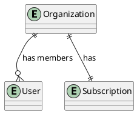

# DynamoDB Single-Table Design: Complete Guide

## Table of Contents

1. [Overview & Introduction](#1-overview--introduction)
   - 1.1. [What is DynamoDB Single-Table Design?](#11-what-is-dynamodb-single-table-design)
   - 1.2. [When to Use Single-Table Design](#12-when-to-use-single-table-design)
   - 1.3. [Trade-offs & Considerations](#13-trade-offs--considerations)
2. [Data Modeling Workflow](#2-data-modeling-workflow)
   - 2.1. [Step 1: Understand Your Requirements](#21-step-1-understand-your-requirements)
   - 2.2. [Step 2: Identify Core Entities](#22-step-2-identify-core-entities)
   - 2.3. [Step 3: Create Entity-Relationship Diagram (ERD)](#23-step-3-create-entity-relationship-diagram-erd)
   - 2.4. [Step 4: Define Access Patterns](#24-step-4-define-access-patterns)
   - 2.5. [Step 5: Review and Validate](#25-step-5-review-and-validate)
   - 2.6. [Step 6: Design Primary Keys](#26-step-6-design-primary-keys)
   - 2.7. [Step 7: Model Relationships](#27-step-7-model-relationships)
   - 2.8. [Step 8: Design Secondary Indexes (GSIs)](#28-step-8-design-secondary-indexes-gsis)
   - 2.9. [Step 9: Define Entity Schemas](#29-step-9-define-entity-schemas)
   - 2.10. [Step 10: Validate Against Anti-Patterns](#210-step-10-validate-against-anti-patterns)
3. [Advanced Topics](#3-advanced-topics)
   - 3.1. [Pagination Strategies](#31-pagination-strategies)
   - 3.2. [Transactions](#32-transactions)
   - 3.3. [Sparse Indexes](#33-sparse-indexes)
   - 3.4. [Time-To-Live (TTL)](#34-time-to-live-ttl)
4. [Migration & Evolution](#4-migration--evolution)
   - 4.1. [Adding New Access Patterns](#41-adding-new-access-patterns)
   - 4.2. [Changing Key Structure](#42-changing-key-structure)
5. [Complete Examples](#5-complete-examples)
   - 5.1. [E-Commerce Application](#51-e-commerce-application)
6. [Reference](#6-reference)
   - 6.1. [Key Design Patterns](#61-key-design-patterns)
   - 6.2. [Common Anti-Patterns](#62-common-anti-patterns)
   - 6.3. [Resources](#63-resources)
7. [Appendix](#7-appendix)
   - 7.1. [Comparison with Faux-SQL Approach](#71-comparison-with-faux-sql-approach)

---

## 1. Overview & Introduction

### 1.1. What is DynamoDB Single-Table Design?

DynamoDB Single-Table Design is a DynamoDB data modeling approach where all entities and relationships are stored in a single table using generic key names (PK, SK) and overloaded indexes.

**Core Principles:**

- **One table for all entities**: User, Order, Product, etc. all in same table
- **Generic key names**: PK, SK, GSI1PK, GSI1SK (not CustomerId, OrderDate)
- **Overloaded indexes**: Single GSI handles multiple access patterns
- **Pre-joined data**: Related items stored together in item collections
- **Access pattern-driven**: Design keys to match exact query needs

---

### 1.2. When to Use Single-Table Design

**Use Single-Table when:**

#### A. Performance is Critical

**Context**: "When sub-10ms response times are required for your application"

Single-table design excels when performance is paramount:

- **Pre-joined data**: Related items stored together, fetched in one request
- **Minimal latency**: Single Query operation vs. multiple serial requests
- **Predictable performance**: No cascading queries or N+1 problems
- **Optimized for reads**: Data structured exactly how it's queried

**Example**: Social media feed where users expect instant load times, real-time notifications, or high-frequency trading applications.

#### B. High Throughput & Scale

**Context**: "When handling thousands to millions of requests per second"

At scale, single-table design provides significant advantages:

- **Fewer requests**: One request instead of 3-5 reduces load
- **Lower cost**: Fewer RCUs/WCUs consumed per operation
- **Better resource utilization**: Less network overhead
- **Horizontal scaling**: DynamoDB's partition system works optimally

**Cost comparison at scale**:

- At 100K req/sec: Single-table ~$1,000/month vs. Faux-SQL ~$3,000/month
- At 1M req/sec: Single-table ~$10,000/month vs. Faux-SQL ~$30,000/month

#### C. Complex Relationships & Access Patterns

**Context**: "When you have many-to-many relationships and need to query them efficiently"

Single-table design handles complex patterns elegantly:

- **Adjacency lists**: Model graphs and hierarchies efficiently
- **Multiple access paths**: Same data queryable different ways via GSIs
- **Composite sort keys**: Enable range queries and filtering
- **Item collections**: Group related items for efficient retrieval

**Example**: E-commerce with products in multiple categories, users with multiple roles, or social networks with follower relationships.

#### D. Stable, Well-Defined Access Patterns

**Context**: "When your application's query patterns are known and unlikely to change"

Single-table design requires upfront knowledge:

- **Mature applications**: Access patterns proven and stable
- **Production systems**: Requirements well-understood
- **Defined scope**: Clear boundaries on what queries are needed
- **Expert team**: Engineers experienced with DynamoDB modeling

**Quote from the book**: "You can't design your table until you know how you'll use your data"

**Use Faux-SQL approach when:**

✅ Development velocity is priority over performance  
✅ Team is learning DynamoDB (steep learning curve)  
✅ Requirements change frequently (hard to migrate)  
✅ Simple access patterns (overhead not justified)  
✅ Analytics requirements are high (normalized data easier)  
✅ Using GraphQL (multiple resolvers complicate single-table)

**Decision Matrix:**

| Factor                         | Use Single-Table                        | Use Faux-SQL                         |
| ------------------------------ | --------------------------------------- | ------------------------------------ |
| **Application Stage**          | Production, known patterns              | MVP, early-stage, uncertain patterns |
| **Response Time Needs**        | Sub-10ms required                       | 50-200ms acceptable                  |
| **Access Pattern Knowledge**   | Patterns well-defined                   | Patterns still evolving              |
| **Team Experience**            | Experienced DynamoDB modelers           | Junior devs, new to DynamoDB         |
| **Analytics Requirements**     | OLTP focus, separate analytics pipeline | Frequent ad-hoc queries needed       |
| **Scale Requirements**         | Millions of requests/sec                | < 10K requests/sec                   |
| **Development Speed Priority** | Lower - performance critical            | High - need to ship fast             |
| **Cost Sensitivity**           | High - optimizing at scale              | Lower - early stage                  |

### Explicit Guidance from the Book

**When to use single-table design** (the default recommendation):

> "When modeling with DynamoDB, you should be following best practices and using a single-table design in most circumstances."

**When NOT to use single-table design**:

> "There are two occasions where [single-table benefits] don't outweigh the costs:
>
> - In new applications where developer agility is more important than application performance
> - In applications using GraphQL"

**Important context**:

> "These are exceptions, not general guidance... And even if you opt into a multi-table design, you should understand single-table design to know why it's not a good fit for your specific application."

---

### 1.3. Trade-offs & Considerations

**✅ Advantages of Single-Table:**

- **Fastest performance**: Single request for related data (sub-10ms possible)
- **Cost-efficient at scale**: Fewer requests = lower RCU/WCU consumption
- **Atomic transactions**: Related items in same partition enable ACID operations
- **Optimal for DynamoDB**: Leverages partition design and item collections
- **Predictable costs**: Easier to forecast at high scale
- **No N+1 queries**: Pre-joined data eliminates cascading requests

**⚠️ Disadvantages of Single-Table:**

- **Steep learning curve**: Complex key patterns and overloading concepts
- **Slower development**: Requires extensive upfront planning
- **Hard to change**: Migrations require careful data transformation
- **Analytics unfriendly**: Denormalized data difficult to query ad-hoc
- **Requires expertise**: Team needs deep DynamoDB knowledge
- **Upfront commitment**: Must know all access patterns before implementation

**Performance Comparison:**

```
Single-Table Design:
└── 1 Query request → 10ms response
    └── Fetches Customer + Orders + Items in one call

Faux-SQL Design:
├── 1. GetItem (Customer) → 15ms
├── 2. Query (Orders) → 20ms
└── 3. Query (OrderItems) → 15ms
    └── Total: 50ms response (serial requests)

Latency Impact:
- Single-Table: 10ms (1 request)
- Faux-SQL: 50-100ms (3-5 requests)
```

**Cost Comparison:**

```
At 1K req/sec:
Single-Table: ~$10/month (1K RCUs)
Faux-SQL: ~$30/month (3K RCUs)

At 100K req/sec:
Single-Table: ~$1,000/month
Faux-SQL: ~$3,000/month

At 1M req/sec:
Single-Table: ~$10,000/month
Faux-SQL: ~$30,000/month
```

**When Trade-offs Are Worth It:**

Single-table complexity is justified when:

- Response time < 10ms is critical for user experience
- Handling > 10K requests/second
- Cost optimization at scale is priority
- Access patterns are stable and well-defined
- Team has DynamoDB expertise

**When Trade-offs Are NOT Worth It:**

Consider Faux-SQL when:

- MVP/early-stage (speed > performance)
- < 10K requests/second
- Requirements changing frequently
- Team learning DynamoDB
- Analytics requirements high
- Using GraphQL

---

## 2. Data Modeling Workflow

**Goal**: Design a single DynamoDB table to support all your access patterns

**Key Principle**: "You can't design your table until you know how you'll use your data. Design keys to match exact query needs."

**Overview**:

The Single-Table data modeling workflow consists of 10 steps divided into two phases:

**Steps 1-5: Experience & Domain Design**
- Understand requirements and identify ALL access patterns
- Create ERD and document relationships
- Validate completeness

**Steps 6-10: Table Design**
- Design overloaded keys (PK, SK, GSI1PK, GSI1SK)
- Model relationships using item collections
- Define entity schemas and validate against anti-patterns

**Key Difference from Faux-SQL:**

- Must know ALL access patterns upfront
- Use generic key names (PK, SK, not CustomerId, OrderId)
- Overload indexes for multiple patterns
- Pre-join data using item collections

**Prerequisites**:

- [ ] Functional requirements documented
- [ ] User stories or use cases defined
- [ ] Basic understanding of application workflows

---

### 2.1. Step 1: Understand Your Requirements

**What**: Gather comprehensive requirements for your application

**Why**: Single-table design requires knowing ALL access patterns upfront. Missing patterns can require expensive migrations later.

**How**:

1. **Review functional requirements**

   - Read product specs, user stories, use cases
   - Interview stakeholders (PM, engineers, business analysts)
   - Document user workflows

2. **Identify all interactions**

   - User-facing actions (login, create post, search)
   - System-to-system (webhooks, batch jobs, analytics)
   - Admin operations (reporting, moderation)

3. **Gather non-functional requirements**
   - Latency requirements (p50, p99)
   - Expected scale (users, requests/sec, data size)
   - Consistency requirements
   - Cost constraints

**Key Questions**:

- What actions can users perform?
- What data needs to be displayed on each screen/page?
- What reports or analytics are needed?
- What are the latency requirements?
- What is the expected scale?

**Output**: Application overview document

**Example**: E-commerce application

```markdown
# Application Overview

## User Actions

- Browse products by category
- Search products by keyword
- View product details
- Add to cart
- Checkout
- View order history

## Admin Actions

- Manage inventory
- View sales reports
- Process refunds

## System Operations

- Send order confirmation emails
- Update inventory on purchase
- Generate daily sales reports

## Scale Requirements

- 10,000 active users
- 100 requests/second peak
- <50ms p99 latency
- 1M products
```

**Common Pitfalls**:

❌ **Incomplete requirements**: Missing access patterns discovered during development  
✅ **Solution**: Invest time upfront, involve all stakeholders

❌ **Assuming flexibility**: Thinking patterns can be added easily later  
✅ **Solution**: Understand that single-table migrations are complex

---

### 2.2. Step 2: Identify Core Entities

**What**: Extract the main business objects from your requirements

**Why**: Entities form the foundation of your data model. In single-table design, all entities will share the same table.

**How**:

1. **List all nouns** from your application overview
2. **Identify core entities** (User, Order, Product) vs attributes (Name, Email, Price)
3. **Draft initial entity list** (start with 5-10 core entities)

**Guidelines**:

- Entities are usually the main objects users interact with
- Start broad, refine later
- Don't worry about implementation details yet

**Common Entity Types:**

| Entity Type  | Examples                                  | Typical for                  |
| ------------ | ----------------------------------------- | ---------------------------- |
| User/Account | User, Customer, Admin, Organization       | Authentication, profiles     |
| Content      | Product, Post, Article, Media, Document   | Core business objects        |
| Activity     | Order, Transaction, Booking, Reservation  | User actions                 |
| Metadata     | Category, Tag, Status, Type               | Classification               |
| Relationship | Review, Comment, Like, Follow, Membership | Connections between entities |
| System       | AuditLog, Notification, Session           | System operations            |

**Output**: Initial entity list

**Example:** E-commerce application

```markdown
## Core Entities:

- **Customer**: User accounts with profile information
- **Product**: Items for sale with name, description, price, inventory
- **Order**: Purchase transactions
- **OrderItem**: Line items within orders
- **Category**: Product classifications (Electronics, Clothing, etc.)
- **Review**: Customer ratings and comments on products
- **Cart**: Shopping cart for active sessions
- **Payment**: Payment method and transaction details
```

**Common Pitfalls**:

❌ **Too granular**: Creating entities for every attribute  
✅ **Solution**: Focus on main business objects

❌ **Missing entities**: Forgetting system entities (Session, AuditLog)  
✅ **Solution**: Review all workflows, not just user-facing

---

### 2.3. Step 3: Create Entity-Relationship Diagram (ERD)

**What**: Visual representation of entities and their relationships

**Why**: ERD helps identify relationships that will become item collections in single-table design. Unlike Faux-SQL where ERD maps directly to tables, single-table ERD shows logical relationships that you'll "twist" into key patterns.

**How**:

1. **Identify all entities** for your application
2. **Identify relationships** between entities
3. **Classify relationship types** (1:1, 1:N, M:N)
4. **Create visual ERD** using PlantUML
5. **Keep it simple** - Show only entities and relationships (no attributes)

**ERD Components**:

- **Entities** (rectangles): Core objects
- **Relationships** (lines): Connections between entities
- **Cardinality** (symbols): One-to-one, one-to-many, many-to-many

**Important**: The ERD should NOT include attributes. Attributes are documented separately in entity schemas.

**Output**: `docs/project/specs/erd.puml`

**Example ERD** (SaaS Application):



**Validation Checklist**:

- [ ] All entity types identified
- [ ] Relationships clearly marked
- [ ] Relationship cardinality specified (1:1, 1:N, M:N)
- [ ] ERD reviewed with stakeholders
- [ ] No attributes included in ERD (attributes go in entity schemas)

**Common Pitfalls**:

❌ **Including attributes**: ERD cluttered with fields  
✅ **Solution**: Show only entities and relationships (no attributes)

❌ **Missing relationships**: Not documenting how entities connect  
✅ **Solution**: For each entity pair, ask "how are they related?"

---

### 2.4. Step 4: Define Access Patterns

**What**: Document every way data will be queried in your application

**Why**: Single-table design is access pattern-driven. Your key structure will be designed to satisfy these patterns efficiently. Missing patterns can require expensive migrations.

**How**:

**Choose an approach:**

**A. API-Centric Approach:**

- List all API endpoints
- Document request/response shapes
- Example: `GET /users/{username}/orders` returns User + recent Orders

**B. UI-Centric Approach (Recommended):**

- Review each screen/page in application
- Document data needed to render each screen
- Example: Dashboard shows User profile + Order history + Notifications

**Access Pattern Documentation**:

The access patterns table documents how you'll query and access your data in DynamoDB. For each pattern, document:

- **Entity**: The type of entity being accessed (e.g., User, Order, Product)
- **Access Pattern**: A description of what you're trying to accomplish (e.g., "Get User by username", "List Orders for User")
- **Table/Index**: Which table or index will be used (e.g., "Main table", "GSI1", "GSI2")
- **Parameters**: The specific parameters used in your DynamoDB API calls (e.g., "PK=USER#username", "GSI1PK=ORG#orgId")
- **Notes**: Additional information such as:
  - Which API operation to use (GetItem, Query, Scan, TransactWriteItems, etc.)
  - Special considerations or constraints
  - Implementation details
  - Performance considerations
  - Frequency estimates (High/Medium/Low)
  - Use case or screen where this pattern is used

**Access Pattern Template**:

| Entity  | Access Pattern       | Table/Index | Parameters                     | Notes                           |
| ------- | -------------------- | ----------- | ------------------------------ | ------------------------------- |
| User    | Get User by username | Main table  | PK=USER#username               | GetItem - Login flow (High)     |
| Order   | Get Orders for User  | Main table  | PK=USER#username, SK begins_with ORDER# | Query - User dashboard (High)   |
| Order   | Get Order by OrderId | GSI1        | GSI1PK=ORDER#orderId           | Query - Order details (Medium)  |
| Product | Search Products      | GSI2        | GSI2PK=CATEGORY#category       | Query - Search page (High)      |

**Critical Requirements**:

- **Be specific**: "Get User" is not enough; specify "Get User by username"
- **Include all parameters**: What does the client know at query time? Use actual PK/SK patterns
- **Specify table/index**: Which table or GSI will satisfy this pattern?
- **Note API operation**: GetItem, Query, Scan, TransactWriteItems, etc.
- **Document special requirements**: Pagination, sorting, filtering, ScanIndexForward=False
- **Estimate frequency**: Helps prioritize optimization (High/Medium/Low)

**Common Patterns by Entity Type**:

| Entity Type  | Common Patterns                                              |
| ------------ | ------------------------------------------------------------ |
| User         | Get by username/email, Update profile, Delete account        |
| Organization | Get by org ID, List members, Add/remove members              |
| Content      | Get by ID, List by author, List by date range, Search        |
| Orders       | Get by order ID, Get by customer, Get by status, Get by date |
| Events       | Get by ID, Get by timestamp range, Get by entity             |

**Anti-Pattern Warning**:

❌ **Don't assume flexibility**: "We'll add patterns later"  
✅ **Document all patterns upfront**: Migrations are possible but require planning

**Validation Checklist**:

- [ ] All user-facing queries documented
- [ ] All system-to-system queries documented
- [ ] All background jobs documented
- [ ] Parameters specified for each pattern
- [ ] Frequency estimates added
- [ ] Patterns reviewed with stakeholders

**Output**: Access patterns documented in entity files (`docs/project/specs/entities/<entity>.md`)

**Example**: E-commerce access patterns

```markdown
# Access Patterns

| Entity   | Access Pattern           | Table/Index | Parameters                           | Notes                                      |
| -------- | ------------------------ | ----------- | ------------------------------------ | ------------------------------------------ |
| Customer | Get Customer by username | Main table  | PK=USER#username                     | GetItem - Login flow (High)                |
| Customer | Get Customer by email    | GSI1        | GSI1PK=EMAIL#email                   | Query - Password reset (Medium)            |
| Customer | Update Customer profile  | Main table  | PK=USER#username                     | UpdateItem - Profile edit (Medium)         |
| Order    | Get Orders for Customer  | Main table  | PK=USER#username, SK begins_with ORDER# | Query - Order history, sorted DESC (High)  |
| Product  | Get Product by ID        | GSI1        | GSI1PK=PRODUCT#productId             | Query - Product detail page (High)         |
| Product  | List Products by Category| GSI2        | GSI2PK=CATEGORY#category             | Query - Category browse (High)             |
| Product  | Search Products          | GSI2        | GSI2PK=SEARCH#keyword                | Query - Search page (High)                 |
| Review   | Get Reviews for Product  | Main table  | PK=PRODUCT#productId, SK begins_with REVIEW# | Query - Product reviews, sorted DESC (High)|
| Order    | Get Order by ID          | GSI1        | GSI1PK=ORDER#orderId                 | Query - Order details (Medium)             |
| Order    | Create Order             | Main table  | PK=USER#username, SK=ORDER#timestamp | TransactWriteItems - Checkout (High)       |
| Order    | Get Orders by status     | GSI3        | GSI3PK=STATUS#pending                | Query - Admin dashboard (Low)              |
```

**Common Pitfalls**:

❌ **Too generic**: "Query data" or "Get User"  
✅ **Solution**: Be specific with parameters

❌ **Missing patterns**: Forgetting admin, analytics, or batch operations  
✅ **Solution**: Review all workflows systematically

❌ **Not involving stakeholders**: Missing requirements discovered later  
✅ **Solution**: Review with PM, engineers, and end users

---

### 2.5. Step 5: Review and Validate

**What**: Validate that all requirements are captured before moving to design

**Why**: Changes in Phase 2 are expensive. Ensure Phase 1 is complete.

**How**:

1. **Review ERD** with technical team
2. **Review access patterns** with product team
3. **Identify missing entities or patterns**
4. **Confirm all requirements captured**

**Review Questions**:

- Have we captured all entities?
- Have we captured all relationships?
- Have we documented every access pattern?
- Are there any edge cases we're missing?
- Do our patterns align with user stories?

**Sign-off Required**:

- [ ] Technical lead approval on ERD
- [ ] Product manager approval on access patterns
- [ ] Stakeholder confirmation that requirements are complete

**Output**: Approved Phase 1 deliverables

**Common Pitfalls:**

❌ **Skipping validation**: Moving to Phase 2 with incomplete requirements  
✅ **Solution**: Invest time in thorough review before design phase

❌ **Incomplete access patterns**: Missing critical query patterns  
✅ **Solution**: Review all user stories, admin workflows, and system operations

---

### Phase 1 Deliverables

Upon completion of Phase 1, you should have:

1. **Entity-Relationship Diagram** (`docs/project/specs/erd.puml`)

   - Visual representation of all entities and relationships
   - Includes key attributes for each entity

2. **Access Patterns** (documented in entity files)

   - Complete list of all data access requirements
   - Parameters and frequency for each pattern
   - Documented per entity in `docs/project/specs/entities/<entity>.md`

3. **Draft Entity-Key Table**
   - Initial list of entity types to be modeled
   - Foundation for Phase 2 primary key design

---

### Phase 1 Common Pitfalls

**1. Skipping access pattern definition**

- **Problem**: Starting to model without knowing all access patterns
- **Solution**: Invest time upfront to document every pattern

**2. Being too generic**

- **Problem**: Patterns like "Query data" or "Get User"
- **Solution**: Be specific: "Get User by username" with exact parameters

**3. Assuming flexibility**

- **Problem**: Thinking you can add patterns easily later
- **Solution**: Understand that migrations are possible but require planning

**4. Not involving stakeholders**

- **Problem**: Missing requirements discovered during development
- **Solution**: Review ERD and patterns with PM, engineers, and end users

---

### 2.6. Step 6: Design Primary Keys

**What**: Design PK/SK patterns for each entity type

**Why**: Primary key design is the foundation of single-table design. Keys must support your access patterns efficiently.

**How**:

**Decision Point: Simple vs. Composite Primary Key**

Use **Simple Primary Key** (partition key only) when:

- All access patterns fetch single items by ID
- No "fetch many" requirements
- No relationships between entities

Use **Composite Primary Key** (partition + sort key) when:

- Need to fetch multiple related items in one request
- Have one-to-many or many-to-many relationships
- Need hierarchical or time-series queries

**For single-table design**: Always use composite primary key (PK + SK)

**Primary Key Design Principles**:

**1. Client Knowledge**: Client must know the key at read time

- ✅ Good: `PK: USER#<username>` (username from URL path)
- ❌ Bad: `PK: USER#<timestamp>` (client doesn't know timestamp)

**2. Entity Prefixes**: Use prefixes to distinguish entity types

```
PK: CUSTOMER#C123 (not just "C123")
SK: METADATA#C123 (not just "C123")
```

**3. Generic Names**: Use PK/SK, not descriptive names

- ✅ Good: PK, SK, GSI1PK, GSI1SK
- ❌ Bad: CustomerId, OrderDate

**Why generic names?**

- Enables overloading (multiple entity types per key)
- Easier to evolve (semantics in values, not attribute names)
- Follows DynamoDB best practices

**Entity-Key Table Template**:

| Entity  | PK Pattern              | SK Pattern                      | Notes                               |
| ------- | ----------------------- | ------------------------------- | ----------------------------------- |
| User    | USER#\<username\>       | USER#\<username\>               | Simple lookup                       |
| Order   | CUSTOMER#\<customerId\> | ORDER#\<timestamp\>#\<orderId\> | Grouped by customer, sorted by time |
| Product | PRODUCT#\<productId\>   | PRODUCT#\<productId\>           | Simple lookup                       |

**Access Pattern Mapping**:

For each access pattern, document how it maps to your key design:

| Access Pattern          | API Call      | Key Condition                | Notes              |
| ----------------------- | ------------- | ---------------------------- | ------------------ |
| Get User by username    | GetItem       | PK = USER#\<username\>       | Direct lookup      |
| Get Orders for Customer | Query         | PK = CUSTOMER#\<customerId\> | Returns all orders |
| Get Order by OrderId    | GetItem (GSI) | GSI1PK = ORDER#\<orderId\>   | Requires GSI       |

**Validation Checklist**:

- [ ] Each entity has unique PK/SK combination
- [ ] All "Get by ID" patterns satisfied
- [ ] All "Get many" patterns grouped in item collections
- [ ] No timestamps in keys unless client knows them
- [ ] Generic key names used (PK, SK)
- [ ] Entity prefixes consistent across all entities

**Common Mistakes**:

- Using CreatedAt in primary key
- Descriptive key names (CustomerId, OrderDate)
- Not considering client knowledge at read time

**Output**: Entity-key table documented in entity files and master table (`docs/project/specs/entity-key-table-master.md`)

**Example**: E-commerce entity-key table

| Entity        | PK                      | SK                                | Notes                     |
| ------------- | ----------------------- | --------------------------------- | ------------------------- |
| Customer      | CUSTOMER#\<username\>   | CUSTOMER#\<username\>             | Main customer item        |
| CustomerEmail | CUSTOMEREMAIL#\<email\> | CUSTOMEREMAIL#\<email\>           | Email uniqueness tracking |
| Order         | CUSTOMER#\<username\>   | ORDER#\<orderDate\>#\<orderId\>   | Unbounded, sorted by date |
| Product       | PRODUCT#\<productId\>   | PRODUCT#\<productId\>             | Simple lookup             |
| Review        | PRODUCT#\<productId\>   | REVIEW#\<timestamp\>#\<reviewId\> | Grouped by product        |

**Common Pitfalls**:

❌ **Descriptive key names**: Using CustomerId instead of PK  
✅ **Solution**: Use generic names (PK, SK) for flexibility

❌ **Timestamps in keys**: Client doesn't know timestamp at query time  
✅ **Solution**: Only use timestamps when client knows them

---

### 2.7. Step 7: Model Relationships

**What**: Choose strategies for each relationship in your ERD

**Why**: Relationships in single-table design are modeled through item collections, denormalization, or adjacency lists. The strategy affects query patterns and performance.

**How**:

1. **Review each relationship** in ERD
2. **Classify relationship type** (1:1, 1:N, M:N)
3. **Choose appropriate strategy** for each relationship
4. **Update entity-key table** with relationship items (if needed)
5. **Document strategy decisions**

**Relationship Strategy Decision Tree**:

```
Is relationship 1:1, 1:N, or M:N?
│
├─ 1:1 → Denormalize into single item
│
├─ 1:N → Is "N" bounded or unbounded?
│   ├─ Bounded (<20 items) → Denormalize with complex attribute
│   └─ Unbounded → Item collection with composite key
│
└─ M:N → Choose strategy:
    ├─ Shallow duplication (copy limited attributes)
    ├─ Adjacency list (same table, multiple item collections)
    ├─ Materialized graph (GSI for reverse lookups)
    └─ Normalization (separate requests)
```

**Common Relationship Patterns**:

**One-to-One**:

```typescript
// Denormalize: Store related data on same item
interface User {
  PK: "USER#alexdebrie";
  SK: "USER#alexdebrie";
  Username: "alexdebrie";
  Profile: {
    // 1:1 relationship embedded
    Bio: "...";
    AvatarUrl: "...";
  };
}
```

**One-to-Many (Bounded)**:

```typescript
// Denormalize: Use List or Map attribute
interface Customer {
  PK: "CUSTOMER#C123";
  SK: "CUSTOMER#C123";
  Name: "Acme Corp";
  Addresses: [
    // Max 5 addresses
    { Street: "123 Main"; City: "Seattle" },
    { Street: "456 Oak"; City: "Portland" }
  ];
}
```

**One-to-Many (Unbounded)**:

```typescript
// Item collection: Separate items, same PK
// Customer item:
{ PK: 'CUSTOMER#C123', SK: 'CUSTOMER#C123', Name: 'Acme' }

// Order items (share PK):
{ PK: 'CUSTOMER#C123', SK: 'ORDER#2020-01-15#O456' }
{ PK: 'CUSTOMER#C123', SK: 'ORDER#2020-01-20#O789' }
```

**Many-to-Many**:

```typescript
// Adjacency list: Items represent relationships
// User item:
{ PK: 'USER#alice', SK: 'USER#alice', Name: 'Alice' }

// Membership items:
{ PK: 'USER#alice', SK: 'ORG#acme', Role: 'Admin' }
{ PK: 'USER#alice', SK: 'ORG#widgets', Role: 'Member' }

// Organization items:
{ PK: 'ORG#acme', SK: 'ORG#acme', Name: 'Acme Corp' }
{ PK: 'ORG#acme', SK: 'USER#alice', Role: 'Admin' }
```

**Relationship Documentation Template**:

Create `docs/specs/jobs/<job>/relationship-decisions.md`:

```markdown
# Relationship Strategy Decisions

## User → Orders (1:N, Unbounded)

**Strategy:** Item collection with composite primary key

**Rationale:**

- User can have unlimited orders (unbounded)
- Need to query "Get recent orders for user"
- Orders sorted by timestamp

**Implementation:**

- User: `PK: USER#<username>`, `SK: USER#<username>`
- Order: `PK: USER#<username>`, `SK: ORDER#<timestamp>#<orderId>`

**Query:**
KeyConditionExpression: PK = USER#alice AND SK begins_with ORDER#

## User → Profile (1:1)

**Strategy:** Denormalization into single item

**Rationale:**

- Always accessed together
- Profile data is small
- Simpler model

**Implementation:**
User item contains ProfileData map attribute
```

**Validation Checklist**:

- [ ] All ERD relationships have documented strategies
- [ ] Unbounded 1:N not stored as lists
- [ ] Bounded 1:N lists have reasonable limits (<20)
- [ ] M:N relationships support both access directions
- [ ] Relationship items added to entity-key table (if applicable)

**Output**: Relationship decisions documented in entity files, Updated entity-key table

**Common Pitfalls**:

❌ **Unbounded lists**: Storing unlimited items in a list attribute  
✅ **Solution**: Use item collections for unbounded relationships

❌ **Missing reverse lookups**: M:N only supports one direction  
✅ **Solution**: Use adjacency list or GSI for bidirectional access

---

### 2.8. Step 8: Design Secondary Indexes (GSIs)

**What**: Design Global Secondary Indexes to satisfy access patterns not covered by primary key

**Why**: GSIs enable additional query patterns. In single-table design, GSIs are overloaded to handle multiple patterns efficiently.

**How**:

1. **Identify access patterns** not satisfied by primary key
2. **Group patterns** by common access characteristics
3. **Design GSI key structures** to satisfy patterns
4. **Create entity-key tables** for each GSI
5. **Update access patterns table** with GSI queries
6. **Validate GSI overloading** opportunities

**When You Need a GSI**:

- Query by non-primary-key attribute
- Reverse lookup (e.g., Order → Customer when table is Customer → Order)
- Filter by attribute values (status, category, etc.)
- Sort by different attribute than primary SK

**GSI Design Principles**:

**1. Overload GSIs**

- Don't create one GSI per pattern
- Use generic names: GSI1PK, GSI1SK, GSI2PK, GSI2SK
- Handle multiple entity types per GSI

**2. Dedicated Attributes**

- Never reuse SK for GSI1SK
- Use separate attributes per index
- Easier to maintain and evolve

**3. Projection Strategy**

- KEYS_ONLY: Minimal storage, requires table lookup
- INCLUDE: Specify needed attributes
- ALL: Copy all attributes (highest cost)

**GSI Overloading Example**:

```typescript
// Single GSI handles multiple patterns
// GSI1: GSI1PK + GSI1SK

// Pattern 1: Get Order by OrderId
{
  PK: 'CUSTOMER#C123',
  SK: 'ORDER#O456',
  GSI1PK: 'ORDER#O456',  // Direct lookup
  GSI1SK: 'ORDER#O456'
}

// Pattern 2: Get Orders by Status
{
  PK: 'CUSTOMER#C123',
  SK: 'ORDER#O456',
  GSI1PK: 'STATUS#SHIPPED',  // Group by status
  GSI1SK: '2020-01-15#O456'  // Sort by date
}

// Pattern 3: Get User by Email
{
  PK: 'USER#alice',
  SK: 'USER#alice',
  GSI1PK: 'EMAIL#alice@example.com',  // Unique lookup
  GSI1SK: 'EMAIL#alice@example.com'
}
```

**GSI Entity-Key Table Template**:

Create `docs/specs/jobs/<job>/entity-key-table-gsi1.md`:

| Entity            | GSI1PK Pattern    | GSI1SK Pattern            | Access Pattern       | Notes          |
| ----------------- | ----------------- | ------------------------- | -------------------- | -------------- |
| Order (by ID)     | ORDER#\<orderId\> | ORDER#\<orderId\>         | Get Order by OrderId | Direct lookup  |
| Order (by Status) | STATUS#\<status\> | \<timestamp\>#\<orderId\> | Get Orders by Status | Sorted by date |
| User (by Email)   | EMAIL#\<email\>   | EMAIL#\<email\>           | Get User by Email    | Unique lookup  |

**Sparse Index Pattern**:

```typescript
// Only include items in GSI when certain condition met
interface Order {
  PK: "CUSTOMER#C123";
  SK: "ORDER#O456";
  Status: "PENDING";
  GSI1PK: "PENDING#ORDER"; // Only set when Status=PENDING
  GSI1SK: "2020-01-15"; // Only set when Status=PENDING
}

// When Order ships, remove GSI attributes:
UpdateExpression: "SET Status = :status REMOVE GSI1PK, GSI1SK";
```

**Access Patterns Table Update**:

| Entity | Access Pattern       | Index | Key Condition              | Parameters    | Notes         |
| ------ | -------------------- | ----- | -------------------------- | ------------- | ------------- |
| Order  | Get Order by OrderId | GSI1  | GSI1PK = ORDER#\<orderId\> | orderId       | Direct lookup |
| Order  | Get Orders by Status | GSI1  | GSI1PK = STATUS#\<status\> | status, limit | Paginated     |
| User   | Get User by Email    | GSI1  | GSI1PK = EMAIL#\<email\>   | email         | Unique        |

**Validation Checklist**:

- [ ] All unsatisfied patterns have GSI strategy
- [ ] GSIs overloaded where possible
- [ ] Separate attributes per index
- [ ] Eventual consistency acceptable for all GSI queries
- [ ] Projection strategy chosen for each GSI
- [ ] Entity-key tables created for each GSI
- [ ] Access patterns table updated with query details

**Common Mistakes**:

- Creating one GSI per pattern
- Reusing attributes across indexes
- Not considering sparse index opportunities

**Output**:

- GSI designs documented in entity files (`docs/project/specs/entities/<entity>.md`)
- Master entity-key table updated (`docs/project/specs/entity-key-table-master.md`) with new entities
- Access patterns updated in entity files

**Common Pitfalls**:

❌ **One GSI per pattern**: Exhausting 20 GSI limit  
✅ **Solution**: Overload GSIs with generic attribute names

❌ **Reusing attributes**: Using SK for both table and GSI  
✅ **Solution**: Dedicated attributes (SK, GSI1SK, GSI2SK)

---

### 2.9. Step 9: Define Entity Schemas

**What**: Create TypeScript interfaces for each entity with all attributes

**Why**: Entity schemas document the structure of your data and provide type safety in your application code.

**How**:

1. **Create TypeScript interfaces** for each entity
2. **Document all application attributes** (non-key attributes)
3. **Define complex types** (nested objects, lists)
4. **Add Type attribute** to all entities
5. **Document attribute purposes and constraints**

**Schema Structure**:

```typescript
// Base interface for all items
interface BaseItem {
  PK: string;
  SK: string;
  Type: string; // Always include Type
  CreatedAt: string; // ISO-8601 timestamp
  UpdatedAt: string; // ISO-8601 timestamp
}

// Entity-specific interface
interface User extends BaseItem {
  Type: "User"; // Literal type
  Username: string;
  Email: string;
  Name: string;
  // ... other attributes
}

interface Order extends BaseItem {
  Type: "Order";
  OrderId: string;
  CustomerId: string;
  TotalAmount: number;
  Status: "PENDING" | "SHIPPED" | "DELIVERED";
  Items: OrderItem[]; // Nested complex type
}

interface OrderItem {
  ProductId: string;
  Quantity: number;
  PriceAtPurchase: number;
}
```

**Attribute Guidelines**:

**1. Always Include Type**

- Makes debugging easier
- Enables ETL filtering
- Clarifies console views

**2. Use Timestamps Appropriately**

- ISO-8601 format for human readability
- Unix timestamps for range queries
- Never in primary key unless client knows it

**3. Complex Attributes**

- Use maps for structured nested data
- Use lists for ordered collections (bounded size)
- Use sets for unique collections

**4. Avoid Over-Nesting**

- Keep nesting depth reasonable (≤3 levels)
- Consider separate items for deeply nested data

**Type Attribute Pattern**:

```typescript
// Filtering by Type in Scan operations
const users = await dynamodb.scan({
  TableName: "AppTable",
  FilterExpression: "Type = :type",
  ExpressionAttributeValues: {
    ":type": "User",
  },
});
```

**Validation Checklist**:

- [ ] All entities have TypeScript interfaces
- [ ] Type attribute included on every entity
- [ ] Complex attributes (maps, lists) properly defined
- [ ] No unbounded lists as attributes
- [ ] Timestamps in appropriate format
- [ ] Attribute names not DynamoDB reserved words

**Output**: TypeScript interfaces in codebase (e.g., `lib/entities/`)

**Common Pitfalls**:

❌ **Missing Type attribute**: Can't filter by entity type  
✅ **Solution**: Add Type: 'EntityName' to every item

❌ **Unbounded lists**: Storing unlimited items in list attribute  
✅ **Solution**: Use item collections instead

---

### 2.10. Step 10: Validate Against Anti-Patterns

**What**: Review design against common DynamoDB anti-patterns

**Why**: Catch design issues before implementation. Anti-patterns lead to poor performance, high costs, or maintenance nightmares.

**How**:

1. **Review design** against anti-pattern checklist
2. **Validate all access patterns** efficient at scale
3. **Confirm no relational database patterns**
4. **Check for proper separation of concerns**
5. **Get peer review** from team

**Validation Checklist**:

**Access Patterns:**

- [ ] No Scan operations in application code
- [ ] All patterns use Query or GetItem
- [ ] Filter expressions not primary access mechanism
- [ ] Each pattern documented with specific parameters

**Key Design:**

- [ ] Generic key names (PK, SK, GSI1PK, etc.)
- [ ] No timestamps in keys unless client knows them
- [ ] Separate attributes per index (no reuse)
- [ ] Type attribute on every item
- [ ] Entity prefixes consistent

**Relationships:**

- [ ] Related items pre-joined in item collections
- [ ] No multiple serial requests for fetching relations
- [ ] Unbounded lists not in single items
- [ ] Denormalization accepted for performance

**Architecture:**

- [ ] Data access layer at boundary
- [ ] Indexing separate from application attributes
- [ ] No ORM usage
- [ ] Single table for related entities

**Cost & Performance:**

- [ ] GSI overloading maximized
- [ ] Storage optimization not prioritized over compute
- [ ] No full-table scans expected

**Red Flags:**

- ❌ "We'll just Scan and filter for now"
- ❌ "Let's normalize this to save storage"
- ❌ "We can add patterns later without planning"
- ❌ "One GSI per entity type is cleaner"

**Peer Review:**

Schedule review with:

- [ ] Senior engineer familiar with DynamoDB
- [ ] Team member from Phase 1 discussions
- [ ] Someone not involved in modeling (fresh perspective)

**Output**: Validated, peer-reviewed data model, Anti-pattern review document

**Common Pitfalls**:

❌ **Skipping validation**: Discovering issues during implementation  
✅ **Solution**: Invest time in thorough review

❌ **No peer review**: Missing blind spots  
✅ **Solution**: Get fresh eyes on the design

---

### Phase 2 Deliverables

Upon completion of Phase 2, you should have:

1. **Entity Files** (`docs/project/specs/entities/<entity>.md`)

   - Primary key design (PK/SK patterns)
   - GSI designs with key patterns
   - Access patterns with query details
   - Relationship strategies

2. **Master Entity-Key Table** (`docs/project/specs/entity-key-table-master.md`)

   - Quick reference for all entities across the application
   - **Must be updated** when adding new entities
   - PK/SK patterns for all entity types
   - GSI patterns
   - Updated with new entities from current job

3. **Entity Schemas** (TypeScript interfaces in codebase)

   - TypeScript interfaces for all entities
   - All attributes documented
   - Type-safe definitions

4. **Anti-Pattern Review**
   - Validation checklist completed
   - Peer review sign-off
   - Design approved for implementation

---

### Phase 2 Common Pitfalls Summary

**1. Skipping relationship strategy decisions**

- **Problem**: Jumping straight to keys without thinking through relationship patterns
- **Solution**: Use decision tree to explicitly choose strategy for each relationship

**2. Creating too many GSIs**

- **Problem**: One GSI per access pattern, exhausting 20 GSI limit
- **Solution**: Overload GSIs with generic attribute names

**3. Reusing attributes across indexes**

- **Problem**: Using SK for both table and GSI sort key
- **Solution**: Dedicated attributes (SK, GSI1SK, GSI2SK)

**4. Not including Type attribute**

- **Problem**: Can't filter by entity type in Scan/export operations
- **Solution**: Add Type: 'EntityName' to every item

**5. Descriptive key names**

- **Problem**: Using CustomerId, OrderDate as attribute names
- **Solution**: Use PK, SK, and store semantics in values

---

## 3. Advanced Topics

### 3.1. Pagination Strategies

**Challenge**: DynamoDB returns maximum 1MB per query. Need to handle large result sets.

**Solution**: Use LastEvaluatedKey for pagination

**Implementation**:

```typescript
export async function getOrdersForCustomerPaginated(
  customerId: string,
  limit: number = 20,
  lastKey?: Record<string, any>
): Promise<{ orders: Order[]; lastKey?: Record<string, any> }> {
  const result = await docClient.send(
    new QueryCommand({
      TableName: TABLE_NAME,
      KeyConditionExpression: "PK = :pk AND begins_with(SK, :sk)",
      ExpressionAttributeValues: {
        ":pk": `CUSTOMER#${customerId}`,
        ":sk": "ORDER#",
      },
      Limit: limit,
      ExclusiveStartKey: lastKey, // Continue from last position
      ScanIndexForward: false,
    })
  );

  return {
    orders: (result.Items || []).map((item) => fromItem(item as OrderItem)),
    lastKey: result.LastEvaluatedKey, // Return for next page
  };
}
```

**Best Practices**:

- Always return `LastEvaluatedKey` to client
- Client passes it back for next page
- Don't try to calculate page numbers (not possible with DynamoDB)
- Use cursor-based pagination in API

---

### 3.2. Transactions

**Challenge**: Need to update multiple items atomically

**Solution**: Use DynamoDB Transactions (up to 100 items)

**Implementation**:

```typescript
import { TransactWriteCommand } from "@aws-sdk/lib-dynamodb";

export async function transferFunds(
  fromAccount: string,
  toAccount: string,
  amount: number
): Promise<void> {
  await docClient.send(
    new TransactWriteCommand({
      TransactItems: [
        {
          // Deduct from source account
          Update: {
            TableName: TABLE_NAME,
            Key: { PK: `ACCOUNT#${fromAccount}`, SK: `ACCOUNT#${fromAccount}` },
            UpdateExpression: "SET Balance = Balance - :amount",
            ConditionExpression: "Balance >= :amount", // Ensure sufficient funds
            ExpressionAttributeValues: { ":amount": amount },
          },
        },
        {
          // Add to destination account
          Update: {
            TableName: TABLE_NAME,
            Key: { PK: `ACCOUNT#${toAccount}`, SK: `ACCOUNT#${toAccount}` },
            UpdateExpression: "SET Balance = Balance + :amount",
            ExpressionAttributeValues: { ":amount": amount },
          },
        },
      ],
    })
  );
}
```

---

### 3.3. Sparse Indexes

**Challenge**: Not all items have values for GSI attributes

**Solution**: DynamoDB automatically handles sparse indexes - only items with GSI key attributes appear in the index

**Use Cases**:
- Filter items by optional attributes
- Create "active" vs "archived" views
- Implement feature flags

---

### 3.4. Time-To-Live (TTL)

**Challenge**: Need to automatically delete expired items

**Solution**: Configure TTL attribute in table definition

**Implementation**:

```typescript
// Add TTL when creating item
const item = {
  PK: `SESSION#${sessionId}`,
  SK: `SESSION#${sessionId}`,
  TTL: Math.floor(Date.now() / 1000) + 3600, // Expire in 1 hour
  ...sessionData
};
```

**Best Practices**:
- TTL value must be in Unix epoch seconds
- Deletion happens within 48 hours of expiration
- Don't rely on TTL for immediate deletion
- Use DynamoDB Streams to react to deletions

---

## 4. Migration & Evolution

### 4.1. Adding New Access Patterns

**Challenge**: Need to support new query without breaking existing patterns

**Steps**:

1. **Analyze new pattern** - Can it use existing indexes?
2. **Add GSI if needed** - Create new GSI for pattern
3. **Backfill data** - Update existing items with new GSI keys
4. **Deploy code** - Add new query functions
5. **Test** - Validate new pattern works

**Example**: Adding "Get Orders by Status"

```typescript
// 1. Add GSI2 to table (if not exists)
// 2. Backfill existing orders
await updateOrder(orderId, {
  GSI2PK: `STATUS#${status}`,
  GSI2SK: `${timestamp}#${orderId}`
});

// 3. Update createOrder to include GSI2 keys
// 4. Add new query function
export async function getOrdersByStatus(status: string) {
  return await docClient.send(
    new QueryCommand({
      TableName: TABLE_NAME,
      IndexName: "GSI2",
      KeyConditionExpression: "GSI2PK = :pk",
      ExpressionAttributeValues: {
        ":pk": `STATUS#${status}`
      }
    })
  );
}
```

---

### 4.2. Changing Key Structure

**Challenge**: Need to change PK/SK format for existing items

**Approach**: Blue-Green Migration

1. **Write to both** old and new key formats
2. **Backfill** existing items with new keys
3. **Switch reads** to new keys
4. **Clean up** old keys

---

## 5. Complete Examples

### 5.1. E-Commerce Application

**Entities**: Customer, Order, Product, OrderItem

**Access Patterns**:
1. Get Customer by ID
2. Get Customer by Email
3. Get Orders for Customer (sorted by date)
4. Get Order by ID
5. Get Order Items for Order
6. Get Product by ID
7. Get Orders by Status

**Entity-Key Table**:

| Entity | PK | SK | GSI1PK | GSI1SK | GSI2PK | GSI2SK |
|--------|----|----|--------|--------|--------|--------|
| Customer | CUSTOMER#\{id\} | CUSTOMER#\{id\} | EMAIL#\{email\} | EMAIL#\{email\} | - | - |
| Order | ORDER#\{id\} | ORDER#\{id\} | CUSTOMER#\{customerId\} | ORDER#\{timestamp\}#\{id\} | STATUS#\{status\} | \{timestamp\}#\{id\} |
| OrderItem | ORDER#\{orderId\} | ITEM#\{productId\} | PRODUCT#\{productId\} | ORDER#\{orderId\} | - | - |
| Product | PRODUCT#\{id\} | PRODUCT#\{id\} | - | - | - | - |

---

## 6. Reference

### 6.1. Key Design Patterns

**Pattern 1: Simple Entity**
- PK: `ENTITY#<id>`
- SK: `ENTITY#<id>`
- Use for: Direct lookups only

**Pattern 2: One-to-Many Relationship**
- Parent: PK=`PARENT#<id>`, SK=`PARENT#<id>`
- Children: PK=`PARENT#<id>`, SK=`CHILD#<timestamp>#<id>`
- Use for: Get parent with children in one query

**Pattern 3: Many-to-Many Relationship**
- Use GSI to create bidirectional access
- Example: Orders ↔ Products via OrderItems

### 6.2. Common Anti-Patterns

❌ **Using descriptive key names** (CustomerId, OrderDate)
✅ Use generic names (PK, SK, GSI1PK, GSI1SK)

❌ **Creating GSI per access pattern**
✅ Overload GSIs for multiple patterns

❌ **Storing relationships in application code**
✅ Pre-join data using item collections

❌ **Not planning all access patterns upfront**
✅ Document all patterns before designing keys

### 6.3. Resources

- [AWS DynamoDB Best Practices](https://docs.aws.amazon.com/amazondynamodb/latest/developerguide/best-practices.html)
- [The DynamoDB Book by Alex DeBrie](https://www.dynamodbbook.com/)
- [AWS re:Invent Videos on DynamoDB](https://www.youtube.com/results?search_query=aws+reinvent+dynamodb)

---

## 7. Appendix

### 7.1. Comparison with Faux-SQL Approach

| Aspect | Single-Table | Faux-SQL |
|--------|--------------|----------|
| **Tables** | One table | Multiple tables |
| **Key Names** | Generic (PK, SK) | Descriptive (CustomerId, OrderDate) |
| **Access Patterns** | All upfront | Incremental |
| **Relationships** | Pre-joined | Separate queries |
| **GSI Usage** | Overloaded | One per pattern |
| **Complexity** | Higher upfront | Lower upfront |
| **Performance** | Optimized | Good enough |
| **When to Use** | High scale, complex patterns | Rapid development, simpler patterns |

---

**End of Single-Table Design Guide**
