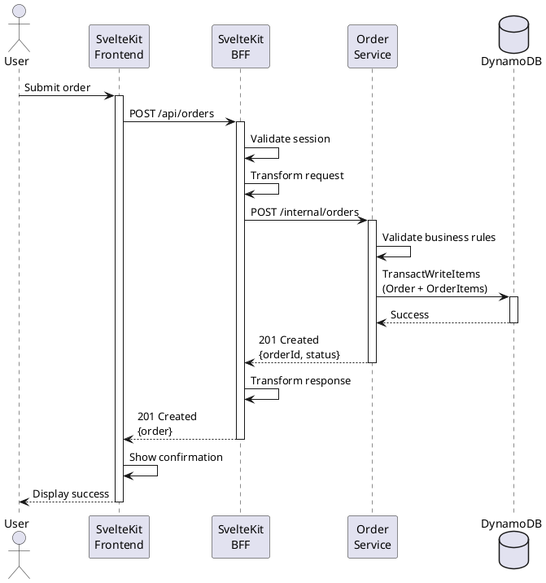

# Comprehensive Full-Stack Development Guide

**A High-Level Methodology for Cross-Team Coordination and Design**

## Table of Contents

1. [Introduction](#1-introduction)
   - 1.1. [Purpose & Scope](#11-purpose--scope)
   - 1.2. [Core Methodology](#12-core-methodology)
   - 1.3. [Key Principles](#13-key-principles)
2. [Team Roles & Responsibilities](#2-team-roles--responsibilities)
   - 2.1. [Product Owner (PO)](#21-product-owner-po)
   - 2.2. [Frontend UI Developer](#22-frontend-ui-developer)
   - 2.3. [Frontend BFF Developer](#23-frontend-bff-developer)
   - 2.4. [Backend Engineer](#24-backend-engineer)
   - 2.5. [QA Engineer](#25-qa-engineer)
   - 2.6. [Designer (Optional)](#26-designer-optional)
3. [Technology Stack](#3-technology-stack)
   - 3.1. [Frontend](#31-frontend)
   - 3.2. [BFF (Backend for Frontend)](#32-bff-backend-for-frontend)
   - 3.3. [Backend Microservices](#33-backend-microservices)
   - 3.4. [Infrastructure](#34-infrastructure)
4. [Architecture Overview](#4-architecture-overview)
   - 4.1. [High-level Architecture Diagram](#41-high-level-architecture-diagram)
   - 4.2. [Key Architectural Principles](#42-key-architectural-principles)
5. [Development Workflow](#5-development-workflow)
   - 5.1. [Phase 1: Requirements (Product Discovery)](#51-phase-1-requirements-product-discovery)
     - 5.1.1. [Step 1: Identify Actors](#511-step-1-identify-actors)
     - 5.1.2. [Step 2: Identify Stories and Create Story Map](#512-step-2-identify-stories-and-create-story-map)
     - 5.1.3. [Exit Criteria for Phase 1](#513-exit-criteria-for-phase-1)
   - 5.2. [Phase 2: Conceptual Design](#52-phase-2-conceptual-design)
     - 5.2.1. [Step 3: UI Mockups Creation](#521-step-3-ui-mockups-creation)
     - 5.2.2. [Step 4: Data Modeling](#522-step-4-data-modeling)
     - 5.2.3. [Exit Criteria for Phase 2](#523-exit-criteria-for-phase-2)
   - 5.3. [Phase 3: API Design & Contracts](#53-phase-3-api-design--contracts)
     - 5.3.1. [Step 5: Sequence Diagrams](#531-step-5-sequence-diagrams)
     - 5.3.2. [Step 6: Actions & Queries](#532-step-6-actions--queries)
     - 5.3.3. [Step 7: API Specification](#533-step-7-api-specification)
     - 5.3.4. [Exit Criteria for Phase 3](#534-exit-criteria-for-phase-3)
   - 5.4. [Phase 4: Implementation & Testing](#54-phase-4-implementation--testing)
     - 5.4.1. [Step 8: Parallel Implementation](#541-step-8-parallel-implementation)
       - 5.4.1.1. [Frontend UI Implementation](#5411-frontend-ui-implementation)
       - 5.4.1.2. [Frontend BFF Implementation](#5412-frontend-bff-implementation)
       - 5.4.1.3. [Backend Implementation](#5413-backend-implementation)
       - 5.4.1.4. [QA Testing](#5414-qa-testing)
     - 5.4.2. [Step 9: Testing & Demo](#542-step-9-testing--demo)
       - 5.4.2.1. [Code Review](#5421-code-review)
       - 5.4.2.2. [Integration Testing](#5422-integration-testing)
       - 5.4.2.3. [Demo to Product Owner](#5423-demo-to-product-owner)
     - 5.4.3. [Exit Criteria for Phase 4](#543-exit-criteria-for-phase-4)
6. [Artifact Repository Structure](#6-artifact-repository-structure)
7. [Definition of Ready](#7-definition-of-ready)
8. [Definition of Done](#8-definition-of-done)
9. [Best Practices & Conventions](#9-best-practices--conventions)

---

## 1. Introduction

This guide establishes a **high-level development methodology** for cross-functional teams to coordinate on feature design and delivery. It focuses on the collaborative design phases that enable teams to align on requirements, user experience, and API contracts **before** diving into detailed implementation.

### 1.1. Purpose & Scope

**What this guide covers:**

- Cross-team coordination and alignment processes
- High-level design artifacts (mockups, ERDs, sequence diagrams, API specs)
- Interface contracts between frontend, BFF, and backend layers
- Shared understanding of requirements and user flows

**What this guide does NOT cover:**

- Detailed frontend architecture and component design (owned by Frontend team)
- Detailed backend data modeling and infrastructure design (owned by Backend team)
- Implementation-level technical decisions within each layer

**Philosophy**: This methodology provides the **scaffolding for collaboration** at feature/story level. Once teams align on contracts and interfaces, they have autonomy to design and implement their respective layers using appropriate techniques and best practices for their domain.

### 1.2. Core Methodology

This guide integrates:

- **SEED(S) Process** - Customer-centric service design (Actors → Stories/Jobs to Be Done → Experience → Design → Specification)
- **Design-Driven Development** - Start with user experience and work backward to technical design
- **Contract-First APIs** - Define interfaces before implementation
- **Agile/Scrum** - Iterative delivery with continuous feedback

The methodology is designed for full-stack teams building scalable applications with SvelteKit (frontend + BFF) and microservices backends using AWS serverless services.

### 1.3. Key Principles

1. **Customer-Centric Design**: Start with actors and their stories
2. **Early Validation**: Get feedback before expensive implementation work
3. **Contract-First**: Define interfaces between components before implementation
4. **Parallel Development**: Enable frontend and backend teams to work simultaneously after contracts are defined
5. **Documentation as Code**: All artifacts version-controlled and maintainable
6. **Team Autonomy**: Teams own detailed design and implementation within their layers

---

## 2. Team Roles & Responsibilities

### 2.1. Product Owner (PO)

- Define actors and their stories
- Create and prioritize story cards
- Lead UI mockup creation with design collaboration
- Validate implementation against acceptance criteria
- Final approval on completed work

### 2.2. Frontend UI Developer

- Implement user interface components
- Collaborate on UI mockups
- Build responsive, accessible interfaces
- Write frontend unit and integration tests

### 2.3. Frontend BFF Developer

- Design and implement SvelteKit API routes (`+server.ts`)
- Lead API specification creation
- Lead sequence diagram creation
- Orchestrate calls to backend microservices
- Handle authentication, authorization, and session management
- Transform backend responses for frontend consumption

### 2.4. Backend Engineer

- Design DynamoDB data models
- Implement microservice business logic
- Create and maintain ERDs
- Lead data access pattern definition
- Optimize database queries and performance
- Write backend unit and integration tests

### 2.5. QA Engineer

- Review all technical artifacts for testability
- Write test plans based on story cards
- Perform integration and end-to-end testing
- Validate acceptance criteria
- Report and track defects

### 2.6. Designer (Optional)

- Create high-fidelity UI mockups
- Establish design systems and component libraries
- Ensure consistent visual language
- Conduct usability testing

---

## 3. Technology Stack

### 3.1. Frontend

- **Framework**: SvelteKit 2.x
- **Language**: TypeScript
- **Styling**: TailwindCSS
- **State Management**: Svelte stores
- **HTTP Client**: Built-in `fetch`

### 3.2. BFF (Backend for Frontend)

- **Framework**: SvelteKit (server routes)
- **Runtime**: Node.js
- **API Style**: RESTful

### 3.3. Backend Microservices

- **Runtime**: Node.js (recommended)
- **Database**: AWS DynamoDB
- **SDK**: AWS SDK v3
- **Architecture**: Microservices pattern
- **Deployment**: AWS Lambda (serverless)

### 3.4. Infrastructure

- **IaC**: AWS CDK
- **API Gateway**: AWS API Gateway
- **Authentication**: AWS Cognito or custom JWT

---

## 4. Architecture Overview

### 4.1. High-level Architecture Diagram

```
┌─────────────────────────────────────────────────────────────┐
│                         Browser                             │
│                    (SvelteKit Frontend)                     │
└────────────────────────────┬────────────────────────────────┘
                             │
                             │ HTTPS
                             │
┌────────────────────────────▼────────────────────────────────┐
│                    SvelteKit BFF Layer                      │
│                   (+server.ts routes)                       │
│                                                             │
│  • Orchestration of backend services                        │
│  • Authentication/Authorization                             │
│  • Response transformation                                  │
└─────┬──────────────────────┬─────────────────────┬──────────┘
      │                      │                     │
      │ API Gateway          │ API Gateway         │ API Gateway
      │                      │                     │
┌─────▼──────────┐  ┌────────▼──────────┐   ┌──────▼──────────┐
│  Microservice  │  │  Microservice     │   │  Microservice   │
│      A         │  │      B            │   │      C          │
│                │  │                   │   │                 │
│  ┌──────────┐  │  │  ┌──────────┐     │   │  ┌──────────┐   │
│  │DynamoDB  │  │  │  │DynamoDB  │     │   │  │DynamoDB  │   │
│  │ Table    │  │  │  │ Table    │     │   │  │ Table    │   │
│  └──────────┘  │  │  └──────────┘     │   │  └──────────┘   │
└────────────────┘  └───────────────────┘   └─────────────────┘
```

### 4.2. Key Architectural Principles

1. **APIs as Orchestration Layer**: The BFF acts as the outward-facing interface
2. **Microservices as Implementation**: Backend services provide internal business logic and are unaware of each other
3. **No Direct Microservice-to-Microservice Calls**: All orchestration happens in the BFF layer
4. **Single-Table Design per Service**: Each microservice typically uses one DynamoDB table

---

## 5. Development Workflow

### 5.1. Phase 1: Requirements (Product Discovery)

**When**: Continuous activity driven by Product Owner

**Goal**: Identify users and their needs, create prioritized backlog

#### 5.1.1. Step 1: Identify Actors

**Participants**: Product Owner (Lead), Stakeholders

**Output**: `docs/project/specs/actors.md`

**Activities**:

1. Identify key user types (actors) who will use the system
2. Limit to approximately 5 actors maximum
3. Use specific rather than precise definitions with minimal overlap
4. Document each actor with:
   - Name
   - Description
   - Key characteristics
   - Goals and motivations

**Example Actors**:

- Frequent Flyer
- Family Vacationer
- Airline Customer Service Agent
- Travel Agent
- Group Travel Coordinator

**Template**: `docs/project/specs/actors.md`

```markdown
# System Actors

## Actor 1: [Actor Name]

**Description**: Brief description of who this actor is

**Characteristics**:

- Key characteristic 1
- Key characteristic 2
- Key characteristic 3

**Primary Goals**:

- Goal 1
- Goal 2
- Goal 3

---

## Actor 2: [Actor Name]

...
```

#### 5.1.2. Step 2: Identify Stories and Create Story Map

**Participants**: Product Owner (Lead), Actors/Stakeholders

**Outputs**:

- `docs/project/specs/story-map.md` - Hierarchical story map
- Story cards in `docs/project/specs/stories/[actor]/[story-name]/story-card-[ID].md`

**Activities**:

1. **Create Story Map Structure** - Build a hierarchical breakdown using the User Story Mapping technique:

   - **User (Actor)** - Top level: Who is using the system
   - **Goal** - What the user wants to achieve
   - **Epic** - Major capability areas
   - **Story** - Individual implementable units of work

2. **Use Story Map Format** with labels and emojis for visual clarity:

   ```markdown
   - 👤 User: [Actor Name]
     - 🎯 Goal: [High-level user goal]
       - 📝 Epic: [Major capability area]
         - 📄 Story: [Specific implementable story] `[Story-ID]`
         - 📄 Story: [Specific implementable story] `[Story-ID]`
   ```

3. **Assign Story IDs** - Use simple sequential numbering (`[001]`, `[002]`, etc.) to:

   - Track which stories are bundled into a single story card
   - Reference work in commits, PRs, and discussions
   - Maintain traceability between story map and story cards

4. **Bundle Related Stories** - Stories with the same Story ID will be implemented together when they:

   - Work on the same page/component
   - Pull from the same data model
   - Require similar UI/technical work
   - Are naturally tested together

5. **Create Story Cards** - For each unique Story ID, create a detailed story card using the template at `docs/project/specs/stories/story-card-template.md`

6. **Prioritize in Backlog** - Order story cards by business value and dependencies

**Story Map Benefits**:

- **Discovery Space**: Quickly capture ideas as they emerge during development
- **Big Picture View**: See all user needs at a glance
- **Flexible Granularity**: Break down to story level for planning, but bundle for implementation
- **Traceability**: Story IDs link story map to story cards and code commits

**Quick Reference**: For a comprehensive cheat sheet on story mapping workflow, bundling decisions, and BDD scenarios, see `docs/guides/design-and-development/story-map-quick-reference.md`.

**Story Card Template**:

Use the comprehensive template at `docs/project/specs/stories/story-card-template.md` which includes:

- **Story Description** - When/I want/So I can format (using Job Story format, see below)
- **Bundled Stories** - List of stories from story map combined in this story card
- **Acceptance Criteria** - Testable, specific outcomes
- **Scenarios (BDD Style)** - Given-When-Then format for behavior specification
- **Extended Requirements** - Business rules, implementation notes, phase scope, data requirements
- **Technical Notes** - Components, APIs, dependencies, performance targets
- **Definition of Done** - Comprehensive checklist
- **Design References** - Links to mockups and design assets
- **Related Artefacts** - Links to sequence diagrams, APIs, ERDs, etc.

**Key Sections Explained**:

**Bundled Stories**: When multiple stories from the story map share the same Story ID, list them here with checkboxes. This shows which granular stories are being implemented together.

**Scenarios (BDD Style)**: Write testable scenarios in Given-When-Then format:

- **Given** - Initial context/state
- **When** - Action/event that occurs
- **Then** - Expected outcome
- **And** - Additional conditions or outcomes

Each scenario becomes an automated test and validates acceptance criteria.

**Story vs Scenario Relationship**:

- **Stories** define **scope** (what capability we need)
- **Scenarios** define **acceptance tests** (how we know it works correctly)
- Stories answer "What capability do we need?"
- Scenarios answer "How do we know it works correctly?"

**Job Story Format vs User Story Format**:

We use the **Job Story format** (not the traditional User Story format) because it focuses on **circumstances and context** rather than personas. This aligns with Clayton Christensen's principle that "the job, not the customer, is the fundamental unit of analysis."

**Job Story Format:**

```
When <circumstance>
I want to <motivation>
So I can <goal>
```

**Traditional User Story Format (NOT used):**

```
As a <persona>
I want <feature>
So that <benefit>
```

**Why Job Story Format?**

- **Focuses on circumstances, not personas**: The situation matters more than who the user is
- **Context-driven**: Emphasizes the specific context that triggers the need
- **Universal applicability**: Whether you're a novice or expert, the circumstance defines the need
- **Better design outcomes**: Keeps focus on solving actual problems in specific contexts

**Example:**

- ❌ User Story: "As a frequent flyer, I want to check in online, so that I can save time"
- ✅ Job Story: "When I need to check in for my flight, I want to do it from my phone, so I can avoid airport queues"

The Job Story removes the persona assumption and focuses on the actual circumstance and motivation.

**Note on Terminology**: While we call them "story cards" (because "story" is more widely understood), we use the **Job Story format** for describing them.

**Example Story Cards**:

See these real examples:

- `docs/project/specs/stories/consumers/browse-providers-by-waste-category/story-card-001.md` - Search and filtering
- `docs/project/specs/stories/consumers/view-detailed-business-information/story-card-002.md` - Detail view

**File Naming Convention**: `docs/project/specs/stories/[actor]/[story-name]/story-card-[ID].md`

Where `[ID]` matches the Story ID from the story map (e.g., `001`, `002`, `003`).

#### 5.1.3. Exit Criteria for Phase 1

- ✅ Actors documented in `docs/project/specs/actors.md`
- ✅ Story map created at `docs/project/specs/story-map.md` with User → Goal → Epic → Story hierarchy
- ✅ Story IDs assigned to stories (bundling related stories with same ID)
- ✅ Story cards created for prioritized stories using the template
- ✅ Story cards prioritized in backlog
- ✅ Top priority story cards ready to move to "To Do"

### 5.2. Phase 2: Conceptual Design

**When**: Story card moves from "To Do" → "Doing"

**Goal**: Understand what to build from user and data perspectives

#### 5.2.1. Step 3: UI Mockups Creation

**Participants**: Product Owner (Lead), Frontend UI, Designer

**Output**: `docs/project/specs/stories/[actor]/[story-name]/mockups/[page-name].png`

**Activities**:

1. Review story description and acceptance criteria
2. Sketch low-fidelity wireframes (whiteboard, Figma, Excalidraw)
3. Create high-fidelity mockups showing:
   - All screens involved in the user flow
   - Different states (loading, error, success, empty)
   - Responsive layouts (mobile, tablet, desktop)
   - Interactive elements and transitions
4. Annotate mockups with:
   - Data fields displayed
   - User actions available
   - Navigation flows

**Tools**:

- UX Pilot (recommended)
- Figma
- Sketch
- Adobe XD
- Excalidraw (for quick sketches)

**File Naming Convention**:

```
01-landing-page.png
02-search-form.png
03-results-list.png
04-detail-view.png
05-confirmation-modal.png
```

**Documentation**: Create `mockups/README.md` with:

- Screen flow diagram
- Key user interactions
- Design decisions and rationale

#### 5.2.2. Step 4: Data Modeling

**Participants**: Backend (Lead), Frontend BFF, Product Owner

**Outputs**:

- `docs/project/specs/erd.puml` - Application-level ERD
- `docs/project/specs/entity-key-table-master.md` - Master entity-key reference (updated per story)
- `docs/project/specs/entities/<entity>.md` - Entity files with keys, GSIs, access patterns, and entity attributes

**Overview**:

Data modeling for DynamoDB is fundamentally different from relational databases. You must define your access patterns BEFORE designing your table structure. This step involves creating an ERD, defining access patterns, designing primary keys, and documenting entities comprehensively.

**Follow the Data Modeling Guides**:

📖 **Start here**: [`docs/guides/data-modeling/README.md`](../../data-modeling/README.md)

The data modeling guide provides:

- **Approach**: Faux-SQL or single-table methodology and when to use either
- **Phases**: Step-by-step process (Phase 1: ERD & Access Patterns, Phase 2: Keys & Schemas)
- **Techniques**: Detailed how-tos for ERD creation, access patterns, primary keys, relationships, GSIs
- **Examples and templates**: Real-world patterns and anti-patterns

**Key Workflow**:

1. **Choose faux-sql or single table approach** → Read [Faux-SQL guide](../../data-modeling/faux-sql-dynamodb-modeling.md) or [Single-Table Design Guide](../../data-modeling/single-table-design.md)
2. **Create/update ERD** → Application-level `docs/project/specs/erd.puml`
3. **Define access patterns** → Document in entity files, per entity
4. **Design primary keys** → Update entity-key table and entity files
5. **Create entity files** → `docs/project/specs/entities/<entity>.md` with:
   - Entity-key tables (main table + GSIs)
   - Access patterns
   - Design decisions and rationale
   - Query examples

**Key Artifacts**:

| Artifact                | Purpose                            | Location                                        |
| ----------------------- | ---------------------------------- | ----------------------------------------------- |
| Application ERD         | Visual entity relationships        | `docs/project/specs/erd.puml`                   |
| Master Entity-Key Table | Quick reference for all entities   | `docs/project/specs/entity-key-table-master.md` |
| Entity Files            | Comprehensive entity documentation | `docs/project/specs/entities/*.md`              |

**Entity Files Structure**:

Each entity file (e.g., `merchants.md`, `reviews.md`) contains:

- Main table entity-key structure
- GSI definitions with rationale
- Access patterns with query examples
- Design decisions log
- Evolution history (which stories modified this entity)

**Important Notes**:

- **ERD is application-level**, not story-level (evolves as stories add entities)
- **Entity files are project-level**, not story-level (shared across all stories)
- **Access patterns are entity-specific**, documented in entity files
- Story cards create/update entity files as they introduce new entities or access patterns

#### 5.2.3. Exit Criteria for Phase 2

- ✅ UI mockups created for all user flows
- ✅ ERD updated with new entities (if any) at `docs/project/specs/erd.puml`
- ✅ Entity files created/updated with access patterns at `docs/project/specs/entities/`
- ✅ Master entity-key table updated at `docs/project/specs/entity-key-table-master.md` (add new entities from current story)
- ✅ Team alignment on data model and requirements

### 5.3. Phase 3: API Design & Contracts

**When**: After Phase 2 complete

**Goal**: Define API contracts and component interactions for cross-team alignment

**Duration**: 2-4 days depending on complexity

**Scope**: This phase focuses on **interface design** between components (UI ↔ BFF ↔ Backend). Detailed technical design and implementation within each layer (frontend architecture, backend data modeling, infrastructure) happens during development by respective teams.

#### 5.3.1. Step 5: Sequence Diagram

**Participants**: Frontend BFF (Lead), Backend

**Output**: `docs/project/specs/stories/[actor]/[story-name]/sequence-diagram.puml/`

**Activities**:

1. Discover the service interaction patterns from the story card:
   - Create sequence diagram showing component interactions
   - Show flow: UI → BFF → Microservice(s) → Database
   - **Important**: Focus on **backend data flows**, not UI scenarios
   - Multiple UI scenarios may share the same backend interaction (e.g., different filters/views using same search API)
2. Use PlantUML (text-based, version-controllable)
3. Document:
   - Request/response messages
   - Error handling flows
   - Timing considerations
   - Authentication/authorization points

**Guidelines**:

- Focus on technical interactions, not business logic
- Show synchronous vs asynchronous calls
- Include error paths
- Annotate timing-sensitive operations
- **One diagram per backend interaction**, not per UI scenario
- Client-side data manipulation (filtering, sorting, transforming) doesn't need separate diagrams

**Tools**:

- PlantUML (recommended)
- Mermaid
- Excalidraw

**Example PlantUML**:



#### 5.3.2. Step 6: Actions & Queries

**Participants**: Frontend BFF (Lead), Backend

**Output**: `docs/project/specs/stories/[actor]/[story-name]/actions-queries.md`

**Activities**:

1. Apply **Command Query Separation (CQS)** principle
2. Separate all operations into two categories:

**Queries** (Reads):

- Lookups with defined inputs and outputs
- **No side effects** - doesn't modify system state
- Can be cached
- Idempotent (same input always returns same output at a given time)

**Actions** (Commands):

- Requests that modify system state
- Have expected outcomes and side effects
- Not idempotent (repeating may have different effects)
- May trigger events or notifications

3. Document each in standardized format

**Template**: `docs/project/specs/stories/[actor]/[story-name]/actions-queries.md`

````markdown
# Actions and Queries

**Story**: [Story ID] - [Story Name]  
**Last Updated**: [YYYY-MM-DD]

---

## Overview

An overview of the overall actions and queries in this story, and other relevant details.

---

## Queries

### Query 1: [Query Name]

**Description**: What data this query retrieves

**Type**: Query (Read-only, no side effects)

**API Endpoint**:

- **BFF**: `GET /api/[resource]?param=value`
- **Backend Service**: `GET /internal/[resource]?param=value`

**Inputs**:

- parameter1: type - description - validation rules
- parameter2: type - description - validation rules

**Expected Output**:

```json
{
  "field1": "value",
  "field2": "value"
}
```

**Error Cases**:

- `400 Bad Request`: Invalid parameter
  ```json
  {
    "error": "Error type",
    "message": "Human-readable message",
    "code": "ERROR_CODE"
  }
  ```
- `404 Not Found`: Resource not found
- `500 Internal Server Error`: Server error

**Caching**:

- **BFF Layer**: Can be cached for [duration]
- **CDN**: [Yes/No] - cache strategy
- **Cache Invalidation**: [When to invalidate]

**Performance Target**:

- **Backend Query**: <[X]ms
- **BFF Response**: <[Y]ms
- **Total (UI → BFF → Backend → UI)**: <[Z]ms

**Database Query Details** (if applicable):

```typescript
{
  // DynamoDB/SQL query structure
}
```

**Client-Side Processing** (if applicable):

- List any data transformations or filtering done in the frontend
- Explain why certain operations are client-side vs backend

**Validation**:

- **Input Validation**:
  - parameter1: [validation rules - required, format, min/max, pattern]
  - parameter2: [validation rules]
- **Validation Layers**:
  - Client-side: [What to validate in UI for immediate feedback]
  - API Gateway: [Request validation before Lambda invocation]
  - Lambda: [Security validation before database operations]
- **Error Messages**: [Standardized error message format]

---

### Query 2: [Query Name]

...

---

## Actions

### Action 1: [Action Name]

**Description**: What state change this action performs

**Type**: Action (Modifies state, has side effects)

**Inputs**:

- parameter1: type - description - validation rules
- parameter2: type - description - validation rules

**Expected Outcomes**:

- Primary: New [Entity] created
- Side effects:
  - Notification sent to user
  - Audit log entry created
  - Event published to stream

**Responses**:

- 201 Created: Action successful
  ```json
  {
    "id": "newly-created-id",
    "status": "pending"
  }
  ```
- 400 Bad Request: Invalid input
- 409 Conflict: Resource already exists

**Idempotency**: [Yes/No] - explanation

**Transaction Requirements**: [Yes/No] - which operations must be atomic

**Performance Target**: <200ms

**Validation**:

- **Input Validation**:
  - field1: [validation rules - required, format, min/max, pattern, business rules]
  - field2: [validation rules]
- **Validation Layers**:
  - Client-side: [Form validation for immediate UX feedback]
  - BFF/Server-side: [Comprehensive validation before API call]
  - API Gateway: [Request schema validation]
  - Lambda: [Security validation and business rule enforcement]
- **Error Messages**: [Standardized error message format with field-specific errors]
- **Security Validations**: [Authentication, authorization, rate limiting, input sanitization]

---

### Action 2: [Action Name]

...

## Summary

| Operation           | Type   | Modifies State | Idempotent                 | Cacheable | Priority |
| ------------------- | ------ | -------------- | -------------------------- | --------- | -------- |
| Get User Profile    | Query  | No             | Yes                        | Yes (5m)  | High     |
| Create Order        | Action | Yes            | No                         | No        | High     |
| Update Order Status | Action | Yes            | Yes (with idempotency key) | No        | Medium   |

---

## Notes

### Architecture Decisions

Document key architectural choices made for this story's API design:

1. **[Decision 1]**: Rationale and benefits
2. **[Decision 2]**: Rationale and benefits
3. **[Decision 3]**: Rationale and benefits

### Future Considerations

- **Phase [X]**: Planned enhancements or changes
- **Phase [Y]**: Additional features or optimizations
````

**Guidelines**:

- Clearly separate queries from actions
- Document all side effects for actions
- Specify idempotency behavior
- Note transaction requirements
- Consider error handling strategies
- **Define caching strategy for each query** (see [Caching Strategy Guide](./caching-strategy.md)):
  - Determine if query is cacheable
  - Set appropriate TTL based on data freshness requirements
  - Document cache layers (browser, BFF, API Gateway, Lambda, Redis/DAX)
  - Define cache invalidation strategy
  - Consider client-side caching (Svelte stores, IndexedDB) for offline support
- **Define validation rules for each query and action** (see [Validation Standardization Guide](./validation-standardization.md)):
  - Document input validation requirements (required fields, formats, constraints)
  - Specify validation error responses and messages
  - Define validation layers (client-side, BFF, API Gateway, Lambda)
  - Note which validations are security-critical vs UX-focused
  - Plan for shared validation schemas across layers

---

#### 5.3.3. Step 7: API Specification

**Participants**: Frontend BFF (Lead), Backend

**Output**: `docs/project/specs/api/openapi.yaml`

**Activities**:

1. Formalize interface contracts using **OpenAPI Specification (OAS) 3.0+**
2. Based on:
   - Sequence diagrams (component interactions)
   - Actions & Queries (operations and data shapes)
   - Data model (understanding of data constraints)
3. Document:
   - All BFF endpoints (external API)
   - All microservice endpoints (internal API)
   - Request/response schemas
   - Authentication requirements
   - Error responses
   - Examples

**Why After Data Model?**:

- Data model reveals what the API can efficiently return
- Ensures API design aligns with DynamoDB access pattern constraints
- Prevents promising response shapes that are inefficient to fulfill
- Backend engineers can provide input on feasibility

**OpenAPI Structure**:

```yaml
openapi: 3.0.3
info:
  title: [Service Name] API
  version: 1.0.0
  description: API for [story brief description]

servers:
  - url: https://api.example.com/v1
    description: Production
  - url: http://localhost:5173/api
    description: Local development

paths:
  /users/{userId}:
    get:
      summary: Get user profile
      operationId: getUserProfile
      tags:
        - Users
      parameters:
        - name: userId
          in: path
          required: true
          schema:
            type: string
          description: Unique user identifier
      responses:
        '200':
          description: User profile retrieved successfully
          content:
            application/json:
              schema:
                $ref: '#/components/schemas/User'
              example:
                userId: "user_123"
                email: "user@example.com"
                name: "John Doe"
                createdAt: "2024-01-15T10:30:00Z"
        '404':
          description: User not found
          content:
            application/json:
              schema:
                $ref: '#/components/schemas/Error'
        '401':
          $ref: '#/components/responses/Unauthorized'
      security:
        - bearerAuth: []

  /orders:
    post:
      summary: Create new order
      operationId: createOrder
      tags:
        - Orders
      requestBody:
        required: true
        content:
          application/json:
            schema:
              $ref: '#/components/schemas/CreateOrderRequest'
            example:
              items:
                - productId: "prod_456"
                  quantity: 2
                - productId: "prod_789"
                  quantity: 1
      responses:
        '201':
          description: Order created successfully
          content:
            application/json:
              schema:
                $ref: '#/components/schemas/Order'
        '400':
          description: Invalid request
          content:
            application/json:
              schema:
                $ref: '#/components/schemas/Error'
      security:
        - bearerAuth: []

components:
  schemas:
    User:
      type: object
      required:
        - userId
        - email
        - name
      properties:
        userId:
          type: string
          description: Unique user identifier
        email:
          type: string
          format: email
        name:
          type: string
        createdAt:
          type: string
          format: date-time

    Order:
      type: object
      required:
        - orderId
        - userId
        - status
        - totalAmount
      properties:
        orderId:
          type: string
        userId:
          type: string
        status:
          type: string
          enum: [pending, confirmed, shipped, delivered, cancelled]
        totalAmount:
          type: number
          format: decimal
        items:
          type: array
          items:
            $ref: '#/components/schemas/OrderItem'
        createdAt:
          type: string
          format: date-time

    OrderItem:
      type: object
      properties:
        itemId:
          type: string
        productId:
          type: string
        quantity:
          type: integer
          minimum: 1
        price:
          type: number
          format: decimal

    CreateOrderRequest:
      type: object
      required:
        - items
      properties:
        items:
          type: array
          items:
            type: object
            required:
              - productId
              - quantity
            properties:
              productId:
                type: string
              quantity:
                type: integer
                minimum: 1

    Error:
      type: object
      required:
        - code
        - message
      properties:
        code:
          type: string
        message:
          type: string
        details:
          type: object

  responses:
    Unauthorized:
      description: Authentication required
      content:
        application/json:
          schema:
            $ref: '#/components/schemas/Error'

  securitySchemes:
    bearerAuth:
      type: http
      scheme: bearer
      bearerFormat: JWT
```

**Tools**:

- **Editor**: VS Code with OpenAPI (Swagger) Editor extension
- **Validation**: Swagger Editor (online or local)
- **Mock Server**: Prism (for parallel development)
- **Documentation**: Swagger UI or Redoc

**File Structure**:

```
docs/specs/stories/[story-id]/
  api.yml              # Full OpenAPI specification
  api/
    README.md          # Overview and usage instructions
    schemas/           # Referenced schema files (if split)
    examples/          # Example requests/responses
```

**Parallel Development Enabler**:  
Once API spec is complete:

- **Frontend BFF** can generate TypeScript types and mock server
- **Backend** can generate API stubs and validation
- Both teams work simultaneously against the contract

#### 5.3.4. Exit Criteria for Phase 3

- ✅ Sequence diagrams created for key flows
- ✅ Actions and Queries separated per CQS principle
- ✅ DynamoDB data model designed to satisfy access patterns
- ✅ Entity charts completed with primary key patterns
- ✅ OpenAPI specification (api.yml) finalized
- ✅ Team alignment on technical approach

---

### 5.4. Phase 4: Implementation & Testing

**When**: After API Specification (Step 7) is complete

**Goal**: Build, test, and deploy the feature

#### 5.4.1. Step 8: Parallel Implementation

**Approach**: Frontend and Backend teams work simultaneously against the agreed API contract

##### 5.4.1.1. Frontend UI Implementation

**Responsibilities**: Frontend UI Developer

**Location**: `src/routes/[feature]/`

**Activities**:

1. Set up mock BFF server using Prism or MSW (Mock Service Worker)
2. Implement UI components based on mockups
3. Implement state management
4. Handle loading, error, and empty states
5. Implement responsive layouts
6. Add accessibility features (ARIA labels, keyboard navigation)
7. Write component unit tests
8. Write integration tests

**Tools**:

- Vitest (unit testing)
- Playwright or Cypress (E2E testing)
- Storybook (component development)

**File Structure**:

```
src/
  routes/
    [feature]/
      +page.svelte              # Main page component
      +page.ts                  # Page load function
      components/
        FeatureForm.svelte      # Form component
        FeatureList.svelte      # List component
        FeatureItem.svelte      # Item component
      __tests__/
        FeatureForm.test.ts
        FeatureList.test.ts
```

**Testing Strategy**:

```typescript
// Component unit test
import { render, fireEvent } from "@testing-library/svelte";
import FeatureForm from "./FeatureForm.svelte";

describe("FeatureForm", () => {
  it("should submit form with valid data", async () => {
    const { getByLabelText, getByRole } = render(FeatureForm);

    await fireEvent.input(getByLabelText("Name"), {
      target: { value: "Test Name" },
    });

    await fireEvent.click(getByRole("button", { name: "Submit" }));

    // Assert form submission
  });
});
```

##### 5.4.1.2. Frontend BFF Implementation

**Responsibilities**: Frontend BFF Developer

**Location**: `src/routes/api/[endpoint]/`

**Activities**:

1. Implement SvelteKit API routes (`+server.ts`)
2. Add authentication/authorization middleware
3. Implement request validation using OpenAPI schema
4. Orchestrate calls to backend microservices
5. Transform backend responses for frontend consumption
6. Add error handling and logging
7. Implement rate limiting (if needed)
8. Write API route tests

**File Structure**:

```
src/
  routes/
    api/
      users/
        [userId]/
          +server.ts            # GET /api/users/:userId
          orders/
            +server.ts          # GET /api/users/:userId/orders
      orders/
        +server.ts              # POST /api/orders, GET /api/orders
        [orderId]/
          +server.ts            # GET /api/orders/:orderId
      __tests__/
        users.test.ts
        orders.test.ts
  lib/
    server/
      auth.ts                   # Authentication utilities
      microservices/
        orderService.ts         # Order microservice client
        userService.ts          # User microservice client
      validation.ts             # Request validation
```

**Implementation Example**:

```typescript
// src/routes/api/orders/+server.ts
import type { RequestHandler } from "./$types";
import { z } from "zod";
import { orderService } from "$lib/server/microservices/orderService";
import { requireAuth } from "$lib/server/auth";

const createOrderSchema = z.object({
  items: z
    .array(
      z.object({
        productId: z.string(),
        quantity: z.number().int().positive(),
      })
    )
    .min(1),
});

export const POST: RequestHandler = async ({ request, locals }) => {
  // Authentication
  const user = await requireAuth(locals);

  // Validation
  const body = await request.json();
  const validatedData = createOrderSchema.parse(body);

  try {
    // Call backend microservice
    const order = await orderService.createOrder({
      userId: user.id,
      items: validatedData.items,
    });

    // Transform and return response
    return new Response(JSON.stringify(order), {
      status: 201,
      headers: { "Content-Type": "application/json" },
    });
  } catch (error) {
    console.error("Failed to create order:", error);
    return new Response(
      JSON.stringify({
        code: "ORDER_CREATION_FAILED",
        message: "Failed to create order",
      }),
      {
        status: 500,
        headers: { "Content-Type": "application/json" },
      }
    );
  }
};
```

**Testing Strategy**:

```typescript
// src/routes/api/orders/__tests__/orders.test.ts
import { describe, it, expect, vi } from "vitest";
import { POST } from "../+server";
import * as orderService from "$lib/server/microservices/orderService";

vi.mock("$lib/server/microservices/orderService");

describe("POST /api/orders", () => {
  it("should create order with valid request", async () => {
    const mockOrder = { orderId: "order_123", status: "pending" };
    vi.mocked(orderService.createOrder).mockResolvedValue(mockOrder);

    const request = new Request("http://localhost/api/orders", {
      method: "POST",
      body: JSON.stringify({
        items: [{ productId: "prod_123", quantity: 2 }],
      }),
    });

    const response = await POST({
      request,
      locals: { user: { id: "user_123" } },
    });

    expect(response.status).toBe(201);
    const data = await response.json();
    expect(data.orderId).toBe("order_123");
  });
});
```

##### 5.4.1.3. Backend Implementation

**Responsibilities**: Backend Engineer

**Location**: `services/[service-name]/`

**Overview**:

This section covers implementing your DynamoDB data model in production code. The implementation approach depends on which data modeling strategy you chose during the data modeling phase:

- **Faux-SQL Design**: Multiple tables with descriptive key names
- **Single-Table Design**: One table with generic key names (PK, SK)

Refer to the appropriate subsection based on your chosen approach.

**General Activities** (applies to both approaches):

1. Set up microservice structure
2. Create infrastructure-as-code for DynamoDB tables
3. Implement data access layer
4. Implement Lambda handlers (or equivalent)
5. Implement business logic
6. Add input validation
7. Implement error handling
8. Add logging and monitoring
9. Write unit tests
10. Write integration tests with DynamoDB Local
11. Create debugging and testing scripts

**File Structure**:

```
services/
  order-service/
    src/
      handlers/
        createOrder.ts          # POST /internal/orders
        getOrder.ts             # GET /internal/orders/:orderId
        listUserOrders.ts       # GET /internal/users/:userId/orders
      lib/
        dynamodb.ts             # DynamoDB client
        validation.ts           # Input validation
        models/
          Order.ts              # Order entity
          OrderItem.ts          # OrderItem entity
      __tests__/
        createOrder.test.ts
        getOrder.test.ts
    infrastructure/
      main.tf                   # Terraform config
    package.json
    tsconfig.json
```

**Implementation Example**:

```typescript
// services/order-service/src/handlers/createOrder.ts
import { DynamoDBClient } from "@aws-sdk/client-dynamodb";
import {
  DynamoDBDocumentClient,
  TransactWriteCommand,
} from "@aws-sdk/lib-dynamodb";
import { v4 as uuidv4 } from "uuid";
import { generateKSUID } from "../lib/ksuid";

const client = DynamoDBDocumentClient.from(new DynamoDBClient({}));
const TABLE_NAME = process.env.TABLE_NAME!;

interface CreateOrderInput {
  userId: string;
  items: Array<{
    productId: string;
    quantity: number;
    price: number;
  }>;
}

export async function createOrder(input: CreateOrderInput) {
  const orderId = generateKSUID(); // Sortable unique ID
  const timestamp = new Date().toISOString();

  const totalAmount = input.items.reduce(
    (sum, item) => sum + item.price * item.quantity,
    0
  );

  // Create Order item
  const orderItem = {
    PK: `CUSTOMER#${input.userId}`,
    SK: `ORDER#${orderId}`,
    GSI1PK: `ORDER#${orderId}`,
    GSI1SK: `ORDER#${orderId}`,
    Type: "Order",
    orderId,
    userId: input.userId,
    status: "pending",
    totalAmount,
    createdAt: timestamp,
  };

  // Create OrderItem items
  const orderItemItems = input.items.map((item, index) => ({
    PK: `ORDER#${orderId}`,
    SK: `ITEM#${index + 1}`,
    GSI1PK: `ORDER#${orderId}`,
    GSI1SK: `ITEM#${index + 1}`,
    Type: "OrderItem",
    itemId: `${index + 1}`,
    orderId,
    productId: item.productId,
    quantity: item.quantity,
    price: item.price,
    createdAt: timestamp,
  }));

  // Use transaction to write all items atomically
  const command = new TransactWriteCommand({
    TransactItems: [
      {
        Put: {
          TableName: TABLE_NAME,
          Item: orderItem,
        },
      },
      ...orderItemItems.map((item) => ({
        Put: {
          TableName: TABLE_NAME,
          Item: item,
        },
      })),
    ],
  });

  await client.send(command);

  return {
    orderId,
    userId: input.userId,
    status: "pending",
    totalAmount,
    items: input.items.map((item, index) => ({
      itemId: `${index + 1}`,
      ...item,
    })),
    createdAt: timestamp,
  };
}

// Lambda handler
export async function handler(event: any) {
  try {
    const body = JSON.parse(event.body);

    // Validation
    if (!body.userId || !body.items || !Array.isArray(body.items)) {
      return {
        statusCode: 400,
        body: JSON.stringify({
          code: "INVALID_INPUT",
          message: "Invalid request body",
        }),
      };
    }

    const order = await createOrder(body);

    return {
      statusCode: 201,
      body: JSON.stringify(order),
    };
  } catch (error) {
    console.error("Error creating order:", error);
    return {
      statusCode: 500,
      body: JSON.stringify({
        code: "INTERNAL_ERROR",
        message: "Failed to create order",
      }),
    };
  }
}
```

**Testing Strategy**:

```typescript
// services/order-service/src/__tests__/createOrder.test.ts
import { describe, it, expect, beforeAll, afterAll } from "vitest";
import { DynamoDBClient } from "@aws-sdk/client-dynamodb";
import { DynamoDBDocumentClient, GetCommand } from "@aws-sdk/lib-dynamodb";
import { createOrder } from "../handlers/createOrder";

// Use DynamoDB Local for testing
const client = DynamoDBDocumentClient.from(
  new DynamoDBClient({
    endpoint: "http://localhost:8000",
    region: "local",
  })
);

describe("createOrder", () => {
  it("should create order and order items in transaction", async () => {
    const input = {
      userId: "user_123",
      items: [
        { productId: "prod_456", quantity: 2, price: 29.99 },
        { productId: "prod_789", quantity: 1, price: 49.99 },
      ],
    };

    const result = await createOrder(input);

    expect(result.orderId).toBeDefined();
    expect(result.userId).toBe("user_123");
    expect(result.status).toBe("pending");
    expect(result.totalAmount).toBe(109.97);
    expect(result.items).toHaveLength(2);

    // Verify items in DynamoDB
    const orderItem = await client.send(
      new GetCommand({
        TableName: process.env.TABLE_NAME,
        Key: {
          PK: `CUSTOMER#user_123`,
          SK: `ORDER#${result.orderId}`,
        },
      })
    );

    expect(orderItem.Item).toBeDefined();
    expect(orderItem.Item!.Type).toBe("Order");
  });
});
```

---

###### 5.4.1.3.1. Faux-SQL Implementation Approach

**When to Use**: You chose the Faux-SQL data modeling approach with multiple tables and descriptive key names.

**Key Principles**:

1. **One table per entity** - Customers, Orders, Products each have their own table
2. **Descriptive primary key names** - Use `CustomerId`, `OrderId` for primary keys
3. **Generic GSI attribute names** - Use `GSI1PK`, `GSI1SK`, `GSI2PK`, `GSI2SK` for flexibility
4. **Reusable GSIs** - One GSI can serve multiple related access patterns
5. **Incremental development** - Add tables and patterns as needed

**Step 1: Create Infrastructure (CDK)**

Define each table separately with descriptive attribute names:

```typescript
// infrastructure/lib/data-stack.ts
import * as dynamodb from "aws-cdk-lib/aws-dynamodb";
import * as cdk from "aws-cdk-lib";

export class DataStack extends cdk.Stack {
  public readonly customersTable: dynamodb.Table;
  public readonly ordersTable: dynamodb.Table;

  constructor(scope: cdk.App, id: string, props?: cdk.StackProps) {
    super(scope, id, props);

    // Customers Table
    this.customersTable = new dynamodb.Table(this, "CustomersTable", {
      tableName: "Customers",
      partitionKey: {
        name: "CustomerId", // Descriptive primary key
        type: dynamodb.AttributeType.STRING,
      },
      billingMode: dynamodb.BillingMode.PAY_PER_REQUEST,
      pointInTimeRecovery: true,
    });

    // GSI1 for email lookup (generic attribute names for flexibility)
    this.customersTable.addGlobalSecondaryIndex({
      indexName: "GSI1",
      partitionKey: {
        name: "GSI1PK", // Generic attribute name
        type: dynamodb.AttributeType.STRING,
      },
      sortKey: {
        name: "GSI1SK", // Generic attribute name
        type: dynamodb.AttributeType.STRING,
      },
      projectionType: dynamodb.ProjectionType.ALL,
    });

    // Orders Table
    this.ordersTable = new dynamodb.Table(this, "OrdersTable", {
      tableName: "Orders",
      partitionKey: {
        name: "OrderId", // Descriptive primary key
        type: dynamodb.AttributeType.STRING,
      },
      billingMode: dynamodb.BillingMode.PAY_PER_REQUEST,
      pointInTimeRecovery: true,
    });

    // GSI1 for customer & seller queries (reusable for related patterns)
    this.ordersTable.addGlobalSecondaryIndex({
      indexName: "GSI1",
      partitionKey: {
        name: "GSI1PK", // Generic attribute name
        type: dynamodb.AttributeType.STRING,
      },
      sortKey: {
        name: "GSI1SK", // Generic attribute name
        type: dynamodb.AttributeType.STRING,
      },
      projectionType: dynamodb.ProjectionType.ALL,
    });

    // GSI2 for status queries (added later as needed)
    this.ordersTable.addGlobalSecondaryIndex({
      indexName: "GSI2",
      partitionKey: {
        name: "GSI2PK",
        type: dynamodb.AttributeType.STRING,
      },
      sortKey: {
        name: "GSI2SK",
        type: dynamodb.AttributeType.STRING,
      },
      projectionType: dynamodb.ProjectionType.ALL,
    });
  }
}
```

**Step 2: Implement Data Access Layer**

Create repository pattern with clear separation:

```typescript
// src/data-access/customers.ts
import { PutCommand, GetCommand, QueryCommand } from "@aws-sdk/lib-dynamodb";
import { docClient } from "./dynamodb";

const TABLE_NAME = process.env.CUSTOMERS_TABLE_NAME!;

export interface Customer {
  customerId: string;
  email: string;
  name: string;
  createdAt: string;
  updatedAt: string;
}

export async function createCustomer(customer: Customer): Promise<Customer> {
  await docClient.send(
    new PutCommand({
      TableName: TABLE_NAME,
      Item: {
        ...customer,
        GSI1PK: customer.email, // Generic GSI attribute for email lookup
        GSI1SK: customer.email, // Generic GSI attribute
      },
      ConditionExpression: "attribute_not_exists(CustomerId)",
    })
  );
  return customer;
}

export async function getCustomerById(
  customerId: string
): Promise<Customer | null> {
  const result = await docClient.send(
    new GetCommand({
      TableName: TABLE_NAME,
      Key: { CustomerId: customerId },
    })
  );
  return (result.Item as Customer) || null;
}

export async function getCustomerByEmail(
  email: string
): Promise<Customer | null> {
  const result = await docClient.send(
    new QueryCommand({
      TableName: TABLE_NAME,
      IndexName: "GSI1", // Generic index name
      KeyConditionExpression: "GSI1PK = :email", // Generic attribute name
      ExpressionAttributeValues: {
        ":email": email,
      },
      Limit: 1,
    })
  );
  return (result.Items?.[0] as Customer) || null;
}
```

```typescript
// src/data-access/orders.ts
import { PutCommand, GetCommand, QueryCommand } from "@aws-sdk/lib-dynamodb";
import { docClient } from "./dynamodb";

const TABLE_NAME = process.env.ORDERS_TABLE_NAME!;

export interface Order {
  orderId: string;
  customerId: string;
  orderDate: string;
  status: string;
  totalAmount: number;
  items: OrderItem[];
}

export interface OrderItem {
  productId: string;
  quantity: number;
  price: number;
}

export async function createOrder(order: Order): Promise<Order> {
  await docClient.send(
    new PutCommand({
      TableName: TABLE_NAME,
      Item: {
        ...order,
        GSI1PK: order.customerId, // Generic GSI for customer queries
        GSI1SK: `${order.orderDate}#${order.orderId}`, // Date + OrderId for sorting
        GSI2PK: order.status, // Generic GSI for status queries
        GSI2SK: `${order.orderDate}#${order.orderId}`, // Same sort pattern
      },
    })
  );
  return order;
}

export async function getOrderById(orderId: string): Promise<Order | null> {
  const result = await docClient.send(
    new GetCommand({
      TableName: TABLE_NAME,
      Key: { OrderId: orderId },
    })
  );
  return (result.Item as Order) || null;
}

export async function getOrdersForCustomer(
  customerId: string
): Promise<Order[]> {
  const result = await docClient.send(
    new QueryCommand({
      TableName: TABLE_NAME,
      IndexName: "GSI1", // Generic index name
      KeyConditionExpression: "GSI1PK = :customerId", // Generic attribute name
      ExpressionAttributeValues: {
        ":customerId": customerId,
      },
      ScanIndexForward: false, // Most recent first
    })
  );
  return (result.Items as Order[]) || [];
}

export async function getOrdersByStatus(status: string): Promise<Order[]> {
  const result = await docClient.send(
    new QueryCommand({
      TableName: TABLE_NAME,
      IndexName: "GSI2", // Reusing GSI2 for status queries
      KeyConditionExpression: "GSI2PK = :status",
      ExpressionAttributeValues: {
        ":status": status,
      },
      ScanIndexForward: false,
    })
  );
  return (result.Items as Order[]) || [];
}
```

**Step 3: Testing & Debugging**

Create scripts to validate implementation:

```typescript
// scripts/seed-data.ts
import { createCustomer } from "../src/data-access/customers";
import { createOrder } from "../src/data-access/orders";

async function seedData() {
  console.log("Seeding test data...");

  // Create customer
  const customer = await createCustomer({
    customerId: "cust_001",
    email: "alice@example.com",
    name: "Alice Smith",
    createdAt: new Date().toISOString(),
    updatedAt: new Date().toISOString(),
  });
  console.log(`✓ Created customer: ${customer.name}`);

  // Create order
  const order = await createOrder({
    orderId: "ord_001",
    customerId: customer.customerId,
    orderDate: new Date().toISOString(),
    status: "pending",
    totalAmount: 99.99,
    items: [{ productId: "prod_001", quantity: 2, price: 49.99 }],
  });
  console.log(`✓ Created order: ${order.orderId}`);

  console.log("✓ Seed data complete");
}

seedData().catch(console.error);
```

**Common Pitfalls**:

❌ **Using descriptive GSI attribute names**: Using `Email`, `CustomerId` as GSI attributes  
✅ **Solution**: Use generic names - GSI1PK, GSI1SK, GSI2PK, GSI2SK for flexibility

❌ **Creating one GSI per pattern**: Separate indexes for customer, seller, status  
✅ **Solution**: Group related patterns - GSI1 for "who" queries, GSI2 for "what" queries

❌ **Scattered DynamoDB code**: Direct DynamoDB calls in business logic  
✅ **Solution**: Centralize all operations in data access layer

❌ **Missing error handling**: Not handling ConditionalCheckFailedException  
✅ **Solution**: Add try-catch blocks and proper error types

❌ **No debugging tools**: Difficult to explore table contents  
✅ **Solution**: Create seed and exploration scripts

---

###### 5.4.1.3.2. Single-Table Implementation Approach

**When to Use**: You chose the Single-Table data modeling approach with one table and generic key names.

**Key Principles**:

1. **One table for all entities** - All data in single table
2. **Generic key names** - Use `PK`, `SK`, `GSI1PK`, `GSI1SK`
3. **Overloaded indexes** - Multiple patterns per GSI
4. **Separation of concerns** - Keep indexing attributes separate from domain data

**Step 1: Create Infrastructure (CDK)**

Define single table with generic keys and multiple GSIs:

```typescript
// infrastructure/lib/data-stack.ts
import * as dynamodb from "aws-cdk-lib/aws-dynamodb";
import * as cdk from "aws-cdk-lib";

export class DataStack extends cdk.Stack {
  public readonly table: dynamodb.Table;

  constructor(scope: cdk.App, id: string, props?: cdk.StackProps) {
    super(scope, id, props);

    // Single table for all entities
    this.table = new dynamodb.Table(this, "AppTable", {
      tableName: "AppTable",
      partitionKey: {
        name: "PK",
        type: dynamodb.AttributeType.STRING,
      },
      sortKey: {
        name: "SK",
        type: dynamodb.AttributeType.STRING,
      },
      billingMode: dynamodb.BillingMode.PAY_PER_REQUEST,
      pointInTimeRecovery: true,
      stream: dynamodb.StreamViewType.NEW_AND_OLD_IMAGES,
      removalPolicy: cdk.RemovalPolicy.RETAIN,
    });

    // GSI1 - Overloaded for multiple patterns
    this.table.addGlobalSecondaryIndex({
      indexName: "GSI1",
      partitionKey: {
        name: "GSI1PK",
        type: dynamodb.AttributeType.STRING,
      },
      sortKey: {
        name: "GSI1SK",
        type: dynamodb.AttributeType.STRING,
      },
      projectionType: dynamodb.ProjectionType.ALL,
    });

    // GSI2 - Additional patterns
    this.table.addGlobalSecondaryIndex({
      indexName: "GSI2",
      partitionKey: {
        name: "GSI2PK",
        type: dynamodb.AttributeType.STRING,
      },
      sortKey: {
        name: "GSI2SK",
        type: dynamodb.AttributeType.STRING,
      },
      projectionType: dynamodb.ProjectionType.ALL,
    });

    // Configure TTL
    this.table.addTimeToLive({
      attributeName: "TTL",
    });
  }
}
```

**Step 2: Implement Data Access Layer**

Use key generation helpers and transform functions:

```typescript
// src/data-access/keys.ts
export const keys = {
  customer: {
    primary: (customerId: string) => ({
      PK: `CUSTOMER#${customerId}`,
      SK: `CUSTOMER#${customerId}`,
    }),
    byEmail: (email: string) => ({
      GSI1PK: `EMAIL#${email}`,
      GSI1SK: `EMAIL#${email}`,
    }),
  },

  order: {
    primary: (orderId: string) => ({
      PK: `ORDER#${orderId}`,
      SK: `ORDER#${orderId}`,
    }),
    byCustomer: (customerId: string, timestamp: string, orderId: string) => ({
      PK: `CUSTOMER#${customerId}`,
      SK: `ORDER#${timestamp}#${orderId}`,
    }),
    byStatus: (status: string, timestamp: string, orderId: string) => ({
      GSI1PK: `STATUS#${status}`,
      GSI1SK: `${timestamp}#${orderId}`,
    }),
  },
};
```

```typescript
// src/data-access/customers.ts
import { PutCommand, GetCommand, QueryCommand } from "@aws-sdk/lib-dynamodb";
import { docClient } from "./dynamodb";
import { keys } from "./keys";

const TABLE_NAME = process.env.TABLE_NAME!;

export interface Customer {
  customerId: string;
  email: string;
  name: string;
  createdAt: string;
  updatedAt: string;
}

interface CustomerItem {
  PK: string;
  SK: string;
  GSI1PK: string;
  GSI1SK: string;
  Type: "Customer";
  CustomerId: string;
  Email: string;
  Name: string;
  CreatedAt: string;
  UpdatedAt: string;
}

function toItem(customer: Customer): CustomerItem {
  return {
    ...keys.customer.primary(customer.customerId),
    ...keys.customer.byEmail(customer.email),
    Type: "Customer",
    CustomerId: customer.customerId,
    Email: customer.email,
    Name: customer.name,
    CreatedAt: customer.createdAt,
    UpdatedAt: customer.updatedAt,
  };
}

function fromItem(item: CustomerItem): Customer {
  return {
    customerId: item.CustomerId,
    email: item.Email,
    name: item.Name,
    createdAt: item.CreatedAt,
    updatedAt: item.UpdatedAt,
  };
}

export async function createCustomer(customer: Customer): Promise<Customer> {
  const item = toItem(customer);

  await docClient.send(
    new PutCommand({
      TableName: TABLE_NAME,
      Item: item,
      ConditionExpression: "attribute_not_exists(PK)",
    })
  );

  return customer;
}

export async function getCustomerById(
  customerId: string
): Promise<Customer | null> {
  const result = await docClient.send(
    new GetCommand({
      TableName: TABLE_NAME,
      Key: keys.customer.primary(customerId),
    })
  );

  return result.Item ? fromItem(result.Item as CustomerItem) : null;
}

export async function getCustomerByEmail(
  email: string
): Promise<Customer | null> {
  const result = await docClient.send(
    new QueryCommand({
      TableName: TABLE_NAME,
      IndexName: "GSI1",
      KeyConditionExpression: "GSI1PK = :pk",
      ExpressionAttributeValues: {
        ":pk": `EMAIL#${email}`,
      },
      Limit: 1,
    })
  );

  return result.Items?.[0] ? fromItem(result.Items[0] as CustomerItem) : null;
}
```

**Step 3: Testing & Debugging**

Create scripts that handle generic key names:

```typescript
// scripts/explore-table.ts
import { ScanCommand } from "@aws-sdk/lib-dynamodb";
import { docClient } from "../src/data-access/dynamodb";

const TABLE_NAME = process.env.TABLE_NAME!;

async function exploreTable() {
  console.log("Exploring table contents...\n");

  const result = await docClient.send(
    new ScanCommand({
      TableName: TABLE_NAME,
      Limit: 20,
    })
  );

  // Group by entity type
  const byType: Record<string, any[]> = {};

  result.Items?.forEach((item) => {
    const type = item.Type || "Unknown";
    if (!byType[type]) byType[type] = [];
    byType[type].push(item);
  });

  // Display grouped results
  Object.entries(byType).forEach(([type, items]) => {
    console.log(`\n=== ${type} (${items.length}) ===`);
    items.forEach((item) => {
      console.log(`  PK: ${item.PK}`);
      console.log(`  SK: ${item.SK}`);
      if (item.GSI1PK) console.log(`  GSI1PK: ${item.GSI1PK}`);
      console.log("  ---");
    });
  });
}

exploreTable().catch(console.error);
```

**Common Pitfalls**:

❌ **Descriptive key names**: Using `CustomerId` instead of `PK`  
✅ **Solution**: Always use generic names (PK, SK, GSI1PK, GSI1SK)

❌ **No transform functions**: Exposing DynamoDB structure to application  
✅ **Solution**: Use toItem/fromItem to separate concerns

❌ **Lack of debugging tools**: Console view is difficult with generic keys  
✅ **Solution**: Create exploration scripts that decode keys

---

**Deliverables** (both approaches):

1. **Infrastructure-as-Code**

   - CDK/CloudFormation/Terraform files
   - Table(s) deployed to development environment

2. **Data Access Layer**

   - Complete implementation with CRUD operations
   - Query operations for all access patterns
   - Unit tests passing

3. **Debugging Scripts**

   - Seed data script
   - Test patterns script
   - Table exploration tool

4. **Documentation**
   - Implementation guide
   - API documentation
   - Troubleshooting guide

##### 5.4.1.4. QA Testing

**Responsibilities**: QA Engineer

**Activities**:

1. Review all artifacts for testability
2. Create test plan based on story card acceptance criteria
3. Write integration test scenarios
4. Perform manual testing
5. Write automated E2E tests
6. Verify API contract compliance
7. Performance testing (if needed)
8. Security testing
9. Report and track defects

**Test Plan Template**:

```markdown
# Test Plan: [Story Card Title]

## Test Scope

- Features covered
- Out of scope items

## Test Approach

- Manual testing areas
- Automated testing areas
- Performance testing strategy
- Security testing strategy

## Test Cases

### TC1: [Test Case Title]

**Priority**: High/Medium/Low

**Type**: Functional/Integration/E2E

**Preconditions**:

- Precondition 1
- Precondition 2

**Steps**:

1. Step 1
2. Step 2
3. Step 3

**Expected Results**:

- Result 1
- Result 2

**Acceptance Criteria Coverage**: [Which AC this covers]

---

### TC2: [Test Case Title]

...

## Test Execution Log

| Test Case | Status | Date       | Notes           |
| --------- | ------ | ---------- | --------------- |
| TC1       | Pass   | 2024-01-15 |                 |
| TC2       | Fail   | 2024-01-15 | Bug #123 logged |

## Defects

### Bug #123: [Bug Title]

**Severity**: Critical/High/Medium/Low  
**Status**: Open/In Progress/Resolved/Closed  
**Found In**: [Component]  
**Steps to Reproduce**:  
**Expected**: ...  
**Actual**: ...
```

#### 5.4.2. Step 9: Testing & Demo

##### 5.4.2.1. Code Review

**Process**:

1. Developer creates Pull Request
2. PR includes:
   - Code changes
   - Unit tests
   - Updated documentation
   - Link to story card
3. At least one peer review required
4. Automated checks must pass:
   - Linting
   - Type checking
   - Unit tests
   - Code coverage threshold

**Review Checklist**:

- [ ] Code follows style guide
- [ ] Tests provide adequate coverage
- [ ] Error handling is comprehensive
- [ ] Documentation is updated
- [ ] No security vulnerabilities introduced
- [ ] Performance considerations addressed
- [ ] Accessibility requirements met

##### 5.4.2.2. Integration Testing

**Activities**:

1. Deploy to staging environment
2. Run automated integration tests
3. Manual QA testing
4. Verify API contracts between components
5. Test error scenarios
6. Performance testing

##### 5.4.2.3. Demo to Product Owner

**Activities**:

1. Schedule demo session
2. Walk through story card acceptance criteria
3. Demonstrate feature in staging environment
4. Gather feedback
5. Document any issues or adjustments needed
6. Get final approval

**Demo Checklist**:

- [ ] All acceptance criteria met
- [ ] Happy path demonstrated
- [ ] Error cases handled gracefully
- [ ] Performance acceptable
- [ ] Mobile responsive (if applicable)
- [ ] Accessibility verified
- [ ] Product Owner approves

#### 5.4.3. Exit Criteria for Phase 4

- ✅ All code merged to main branch
- ✅ Unit test coverage meets threshold (e.g., 80%)
- ✅ Integration tests passing
- ✅ QA sign-off
- ✅ Product Owner acceptance
- ✅ Documentation complete
- ✅ Deployed to production
- ✅ Monitoring/alerting configured
- ✅ Story card meets Definition of Done

---

## 6. Artifact Repository Structure

```
project-root/
├── docs/
│   ├── project/
│   │   ├── actors.md                    # System actors (SEED(S) Step 1)
│   │   ├── architecture.md              # Overall architecture
│   │   └── glossary.md                  # Terms and definitions
│   │
│   ├── backlog/
│   │   └── story-cards/                 # Story cards (SEED(S) Step 2)
│   │       ├── SC001-filter-flights.md
│   │       ├── SC002-book-flight.md
│   │       └── ...
│   │
│   └── specs/
│       └── stories/
│           ├── SC001-filter-flights/
│           │   ├── README.md            # Overview and status
│           │   ├── mockups/             # UI mockups
│           │   │   ├── README.md
│           │   │   ├── 01-search-form.png
│           │   │   └── 02-results-list.png
│           │   ├── erd.md               # Entity-relationship diagram
│           │   ├── access-patterns.md   # Data access patterns
│           │   ├── sequence-diagrams/   # SEED(S) Step 3
│           │   │   ├── README.md
│           │   │   ├── 01-search-flights.puml
│           │   │   └── 02-filter-results.puml
│           │   ├── actions-queries.md   # SEED(S) Step 4 (CQS)
│           │   ├── data-model.md        # DynamoDB data model
│           │   ├── api.yml              # SEED(S) Step 5 (OpenAPI)
│           │   └── feedback-log.md      # SEED(S) Step 6
│           │
│           └── JS002-book-flight/
│               └── ...
│
├── src/                                 # SvelteKit application
│   ├── routes/
│   │   ├── flights/
│   │   │   ├── +page.svelte            # Flight search page
│   │   │   ├── +page.ts
│   │   │   └── components/
│   │   │       ├── SearchForm.svelte
│   │   │       └── ResultsList.svelte
│   │   │
│   │   └── api/                         # BFF API routes
│   │       ├── flights/
│   │       │   ├── +server.ts          # GET /api/flights
│   │       │   └── [flightId]/
│   │       │       └── +server.ts      # GET /api/flights/:id
│   │       └── bookings/
│   │           └── +server.ts          # POST /api/bookings
│   │
│   └── lib/
│       ├── components/                  # Shared UI components
│       └── server/                      # Server-side utilities
│           ├── auth.ts
│           ├── validation.ts
│           └── microservices/
│               ├── flightService.ts
│               └── bookingService.ts
│
├── services/                            # Backend microservices
│   ├── flight-service/
│   │   ├── src/
│   │   │   ├── handlers/
│   │   │   │   ├── searchFlights.ts
│   │   │   │   └── getFlight.ts
│   │   │   ├── lib/
│   │   │   │   ├── dynamodb.ts
│   │   │   │   └── models/
│   │   │   │       └── Flight.ts
│   │   │   └── __tests__/
│   │   ├── infrastructure/
│   │   │   └── main.tf
│   │   └── package.json
│   │
│   └── booking-service/
│       └── ...
│
├── infrastructure/                      # Shared infrastructure
│   ├── environments/
│   │   ├── dev.tfvars
│   │   ├── staging.tfvars
│   │   └── prod.tfvars
│   └── modules/
│       ├── dynamodb/
│       └── api-gateway/
│
└── tests/
    ├── e2e/                            # End-to-end tests
    │   ├── flight-search.spec.ts
    │   └── booking-flow.spec.ts
    └── integration/                     # Cross-service integration tests
        └── flight-booking.test.ts
```

---

## 7. Definition of Ready

A story card is ready to move from "To Do" to "Doing" when:

### Pre-Development Checklist

- ✅ **Story card documented** with clear acceptance criteria (SEED(S) Steps 1-2)
- ✅ **Actors identified** and documented
- ✅ **Job story format** complete: "When [circumstance], I want to [motivation], so I can [goal]"
- ✅ **Priority assigned** and agreed upon by Product Owner

### Phase 1: Design & Requirements Complete

- ✅ **UI mockups created** for all screens and states
- ✅ **ERD created** showing entities and relationships
- ✅ **ALL access patterns documented** comprehensively
  - UI-centric approach applied
  - Every screen's data needs captured
  - Input/output shapes defined

### Phase 2: API Design Complete

- ✅ **Sequence diagrams** created for key user flows (SEED(S) Step 3)
- ✅ **Actions and Queries** separated per CQS principle (SEED(S) Step 4)
- ✅ **DynamoDB data model** designed:
  - Entity charts complete with PK/SK patterns
  - Access pattern mapping documented
  - Secondary indexes defined
  - Example items provided
- ✅ **API specification** (OpenAPI) finalized (SEED(S) Step 5)
  - All endpoints documented
  - Request/response schemas defined
  - Error responses specified

### Phase 3: Validation Complete

- ✅ **Feedback collected** from end users (SEED(S) Step 6)
- ✅ **Feedback collected** from client developers (SEED(S) Step 6)
- ✅ **All critical feedback incorporated**
- ✅ **Final sign-off** from:
  - Product Owner
  - Frontend UI Developer
  - Frontend BFF Developer
  - Backend Engineer
  - QA Engineer

### Team Readiness

- ✅ **Team has capacity** to work on this story
- ✅ **Dependencies identified** and resolved
- ✅ **No blockers** preventing development

---

## 8. Definition of Done

A story is considered "Done" when:

### Code Quality

- ✅ **Code complete** for all components (UI, BFF, Backend)
- ✅ **Code reviewed** and approved by at least one peer
- ✅ **All automated checks pass**:
  - Linting
  - Type checking
  - Unit tests
  - Code coverage meets threshold (80%)
- ✅ **No critical or high-severity bugs**

### Testing

- ✅ **Unit tests written** and passing
- ✅ **Integration tests written** and passing
- ✅ **E2E tests written** and passing
- ✅ **Manual QA testing complete**
- ✅ **All acceptance criteria verified**

### Documentation

- ✅ **Technical documentation updated**
- ✅ **API documentation updated** (OpenAPI spec)
- ✅ **Code comments added** where necessary
- ✅ **README files updated**

### Deployment

- ✅ **Deployed to staging** and tested
- ✅ **Deployed to production**
- ✅ **Monitoring/alerting configured**
- ✅ **Rollback plan documented**

### Acceptance

- ✅ **Demoed to Product Owner**
- ✅ **Product Owner acceptance** obtained
- ✅ **No outstanding critical feedback**

### Compliance

- ✅ **Security review** complete (if required)
- ✅ **Performance requirements** met
- ✅ **Accessibility standards** met (WCAG 2.1 Level AA)
- ✅ **Privacy/data protection** requirements met

---

## 9. Best Practices & Conventions

### Naming Conventions

#### DynamoDB

**Primary Keys**:

- Use generic names: `PK`, `SK`
- Use prefixes to distinguish entity types: `USER#`, `ORDER#`, `PRODUCT#`
- For composite keys, use meaningful delimiters: `ORDER#2024-01-15#order_123`

**Secondary Indexes**:

- Use generic names: `GSI1PK`, `GSI1SK`, `GSI2PK`, `GSI2SK`
- Don't reuse attributes across indexes
- Document purpose in data model

**Attributes**:

- Use camelCase: `userId`, `createdAt`, `totalAmount`
- Add `Type` attribute to every item
- Separate indexing attributes from application attributes
- Consider shortening names for high-volume tables (advanced optimization)

**Example Item**:

```json
{
  "PK": "USER#user_123",
  "SK": "USER#user_123",
  "GSI1PK": "ORG#org_456",
  "GSI1SK": "USER#user_123",
  "Type": "User",
  "userId": "user_123",
  "email": "user@example.com",
  "name": "John Doe",
  "orgId": "org_456",
  "createdAt": "2024-01-15T10:30:00Z"
}
```

#### API Routes (SvelteKit)

**File naming**:

- Use `+server.ts` for API endpoints
- Use `+page.svelte` for pages
- Use `+page.ts` for page load functions

**URL patterns**:

- Use kebab-case: `/api/user-orders`, `/api/flight-bookings`
- Use plural nouns for collections: `/api/orders`, `/api/users`
- Use singular for single resources: `/api/orders/[orderId]`

#### Components (Svelte)

**File naming**:

- Use PascalCase: `FlightSearchForm.svelte`, `OrderList.svelte`
- Keep component names descriptive

**Component structure**:

```svelte
<script lang="ts">
  // 1. Imports
  import { onMount } from 'svelte';
  import type { Order } from '$lib/types';

  // 2. Props
  export let orderId: string;

  // 3. State
  let order: Order | null = null;
  let loading = true;
  let error: string | null = null;

  // 4. Lifecycle
  onMount(async () => {
    // Load data
  });

  // 5. Functions
  async function handleSubmit() {
    // Handle form submission
  }
</script>

<!-- 6. Template -->
<div class="container">
  {#if loading}
    <p>Loading...</p>
  {:else if error}
    <p class="error">{error}</p>
  {:else if order}
    <h1>Order #{order.orderId}</h1>
    <!-- Display order -->
  {/if}
</div>

<!-- 7. Styles -->
<style>
  .container {
    max-width: 800px;
    margin: 0 auto;
  }

  .error {
    color: red;
  }
</style>
```

### Code Organization

#### Separation of Concerns

**Application Boundary**:

- Transform DynamoDB items to application objects at the boundary
- Don't leak DynamoDB structure into business logic
- Keep indexing attributes separate from application attributes

```typescript
// ❌ Bad: DynamoDB structure leaking into app
function displayUser(item: any) {
  const username = item.PK.split("#")[1];
  return `Hello ${item.Name}`;
}

// ✅ Good: Transform at boundary
interface User {
  userId: string;
  email: string;
  name: string;
}

function transformDynamoDBItem(item: any): User {
  return {
    userId: item.userId,
    email: item.email,
    name: item.name,
  };
}

function displayUser(user: User) {
  return `Hello ${user.name}`;
}
```

#### Error Handling

**Frontend**:

```typescript
try {
  const response = await fetch("/api/orders", {
    method: "POST",
    body: JSON.stringify(orderData),
  });

  if (!response.ok) {
    const error = await response.json();
    throw new Error(error.message);
  }

  const order = await response.json();
  // Handle success
} catch (error) {
  // Handle error
  console.error("Failed to create order:", error);
  errorMessage = error.message;
}
```

**Backend**:

```typescript
try {
  // Business logic
} catch (error) {
  console.error("Error:", error);

  if (error instanceof ValidationError) {
    return {
      statusCode: 400,
      body: JSON.stringify({
        code: "VALIDATION_ERROR",
        message: error.message,
      }),
    };
  }

  // Generic error
  return {
    statusCode: 500,
    body: JSON.stringify({
      code: "INTERNAL_ERROR",
      message: "An unexpected error occurred",
    }),
  };
}
```

### DynamoDB Best Practices

#### Access Pattern Design

1. **Know all access patterns upfront**

   - Define comprehensively before modeling
   - Failure to do so causes problems later

2. **Design for access patterns, not flexibility**

   - Shape data to fit patterns
   - Don't expect flexible queries later

3. **Minimize requests per pattern**

   - Ideally 1 request per access pattern
   - Use item collections to co-locate related data

4. **Use Query over Scan**
   - Queries are efficient, Scans are not
   - Design primary keys and indexes for Query operations

#### Data Modeling Strategies

**One-to-Many Relationships**:

- Denormalization with complex attributes
- Denormalization by duplicating data
- Composite primary key + Query
- Secondary index + Query
- Composite sort keys with hierarchical data

**Many-to-Many Relationships**:

- Shallow duplication
- Adjacency list pattern
- Materialized graph
- Normalization with multiple requests (fallback)

**Ensuring Uniqueness**:

- Use DynamoDB Transactions with condition expressions
- Create tracking items for unique attributes

**Sortable IDs**:

- Use KSUIDs for sortable, unique identifiers
- Prefix-based for chronological ordering

#### Single-Table Design

**Benefits**:

- Fewer network requests
- Better performance
- Lower cost
- Simpler infrastructure

**When NOT to use**:

- New applications prioritizing flexibility over performance
- GraphQL applications (execution model doesn't benefit)
- Heavy analytics workloads (export to data warehouse instead)

**Implementation**:

- Multiple entity types in one table
- Generic attribute names (PK, SK)
- Overloaded indexes
- Item collections for relationships

### Testing Strategy

#### Unit Tests

- Test individual functions and components
- Mock external dependencies
- Aim for 80%+ code coverage
- Fast execution (<5s for entire suite)

#### Integration Tests

- Test component interactions
- Use DynamoDB Local for backend tests
- Mock external APIs in BFF tests
- Test error paths

#### E2E Tests

- Test complete user flows
- Run against staging environment
- Cover critical paths
- Keep tests maintainable and reliable

#### Testing Pyramid

```
        /\
       /  \  E2E (10%)
      /____\
     /      \
    / Integ. \ (30%)
   /__________\
  /            \
 /     Unit     \ (60%)
/________________\
```

### Documentation Standards

#### Code Comments

- Explain "why", not "what"
- Document complex algorithms
- Add TODOs with owner and date
- Use JSDoc for public APIs

```typescript
/**
 * Creates a new order with the provided items.
 * Uses a DynamoDB transaction to ensure atomicity.
 *
 * @param userId - The ID of the user placing the order
 * @param items - Array of items to include in the order
 * @returns The created order with generated ID
 * @throws {ValidationError} If items array is empty
 * @throws {DynamoDBError} If transaction fails
 */
async function createOrder(userId: string, items: OrderItem[]): Promise<Order> {
  // Implementation
}
```

#### README Files

- Include purpose and overview
- Document setup instructions
- List dependencies
- Provide examples
- Keep up-to-date

#### Architecture Decision Records (ADRs)

- Document important decisions
- Include context, decision, and consequences
- Store in `docs/adr/`

**Template**:

```markdown
# ADR-001: Use Single-Table Design for DynamoDB

## Status

Accepted

## Context

We need to decide how to organize our DynamoDB tables...

## Decision

We will use a single-table design...

## Consequences

**Positive:**

- Fewer network requests
- Better performance

**Negative:**

- Steeper learning curve
- Less flexible for new patterns

## Alternatives Considered

1. Multi-table design
2. Hybrid approach
```

### Security Best Practices

#### Authentication & Authorization

- Use AWS Cognito or JWT tokens
- Validate tokens in BFF layer
- Implement RBAC (Role-Based Access Control)
- Never trust client input

#### Input Validation

- Validate all inputs at BFF layer
- Use schema validation (Zod, Joi)
- Sanitize user input
- Implement rate limiting

#### Data Protection

- Encrypt sensitive data at rest
- Use HTTPS for all communications
- Don't log sensitive information
- Implement proper error handling (don't leak internal details)

#### AWS IAM

- Follow principle of least privilege
- Use IAM roles for services
- Rotate credentials regularly
- Enable CloudTrail logging

### Performance Optimization

#### Frontend

- Code splitting and lazy loading
- Image optimization
- Caching strategies
- Minimize bundle size

#### BFF

- Response caching where appropriate
- Connection pooling for backend services
- Implement request timeouts
- Use async/await properly

#### Backend

- Design efficient access patterns
- Use DynamoDB batch operations when possible
- Implement pagination for large result sets
- Monitor and optimize slow queries
- Use DynamoDB Accelerator (DAX) for hot data

#### DynamoDB

- Provision appropriate capacity
- Use on-demand pricing for unpredictable workloads
- Monitor CloudWatch metrics
- Implement auto-scaling for provisioned capacity

---

## Conclusion

This comprehensive guide integrates:

1. **SEED(S) Methodology** - Customer-centric service design from actors to implementation
2. **DynamoDB Data Modeling** - Access pattern-driven design for scalable NoSQL
3. **UI-First Approach** - Design-driven development starting with user experience
4. **Agile Practices** - Iterative delivery with continuous feedback

**Key Takeaways**:

✅ **Start with users** - Identify actors and their stories to be done  
✅ **Design before coding** - Complete all design phases before implementation  
✅ **Validate early** - Get feedback before expensive development work  
✅ **Model for access patterns** - Design DynamoDB tables for specific query needs  
✅ **Enable parallel work** - API contracts allow frontend and backend to work simultaneously  
✅ **Document everything** - All artifacts version-controlled and maintainable

By following this guide, teams can build scalable, maintainable applications with clear processes, strong collaboration, and high-quality outcomes.

---

**Version**: 1.0  
**Last Updated**: 2024-01-15  
**Maintained By**: [Team Name]
