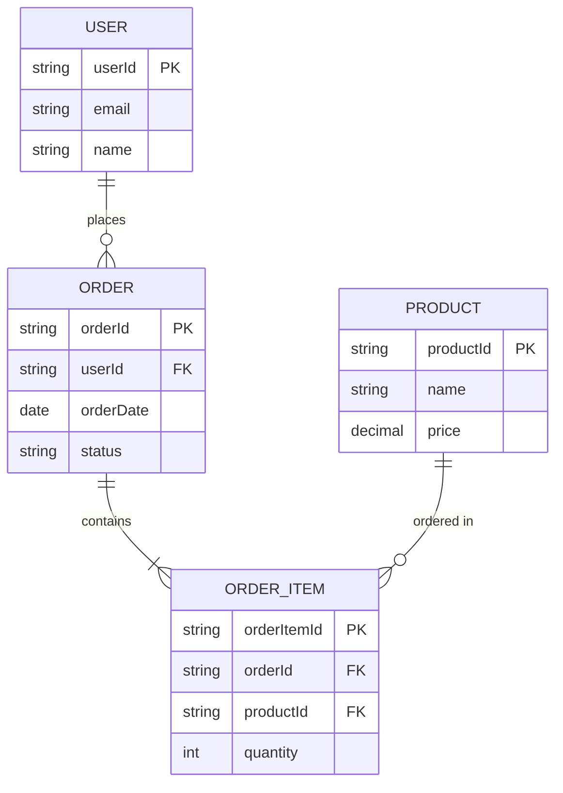

# Comprehensive Full-Stack Development Guide

**Integrating SEED(S) Methodology, DynamoDB Data Modeling, UI-First Design, and Agile Practices**

---

## Table of Contents

1. [Introduction](#introduction)
2. [Team Roles & Responsibilities](#team-roles--responsibilities)
3. [Technology Stack](#technology-stack)
4. [Architecture Overview](#architecture-overview)
5. [Development Workflow](#development-workflow)
6. [Phase 0: Pre-Backlog (Product Discovery)](#phase-0-pre-backlog-product-discovery)
7. [Phase 1: Design & Requirements](#phase-1-design--requirements)
8. [Phase 2: Technical Design](#phase-2-technical-design)
9. [Phase 3: Validation](#phase-3-validation)
10. [Phase 4: Implementation](#phase-4-implementation)
11. [Artifact Repository Structure](#artifact-repository-structure)
12. [Definition of Ready](#definition-of-ready)
13. [Definition of Done](#definition-of-done)
14. [Best Practices & Conventions](#best-practices--conventions)

---

## Introduction

This guide establishes a unified development methodology that combines:

- **SEED(S) Process** (Seven Essential Evolutions of Design for Services) - Customer-centric service design methodology
- **DynamoDB Single-Table Design** - NoSQL data modeling optimized for access patterns
- **UI-First Approach** - Design-driven development starting with user interfaces
- **Agile/Scrum** - Iterative delivery with continuous feedback

The methodology is specifically designed for full-stack teams building scalable applications with SvelteKit (frontend + BFF) and microservices backends using AWS.

### Key Principles

1. **Customer-Centric Design**: Start with actors and their jobs to be done
2. **Access Pattern-Driven Data Modeling**: Design data structures to match specific query needs
3. **Early Validation**: Get feedback before expensive implementation work
4. **Parallel Development**: Enable frontend and backend teams to work simultaneously
5. **Documentation as Code**: All artifacts version-controlled and maintainable

---

## Team Roles & Responsibilities

### Product Owner (PO)

- Define actors and their jobs to be done
- Create and prioritize job stories
- Lead UI mockup creation with design collaboration
- Validate implementation against acceptance criteria
- Final approval on completed work

### Frontend UI Developer

- Implement user interface components
- Collaborate on UI mockups
- Build responsive, accessible interfaces
- Write frontend unit and integration tests

### Frontend BFF Developer

- Design and implement SvelteKit API routes (`+server.ts`)
- Lead API specification creation
- Lead sequence diagram creation
- Orchestrate calls to backend microservices
- Handle authentication, authorization, and session management
- Transform backend responses for frontend consumption

### Backend Engineer

- Design DynamoDB data models
- Implement microservice business logic
- Create and maintain ERDs
- Lead data access pattern definition
- Optimize database queries and performance
- Write backend unit and integration tests

### QA Engineer

- Review all technical artifacts for testability
- Write test plans based on job stories
- Perform integration and end-to-end testing
- Validate acceptance criteria
- Report and track defects

### Designer (Optional)

- Create high-fidelity UI mockups
- Establish design systems and component libraries
- Ensure consistent visual language
- Conduct usability testing

---

## Technology Stack

### Frontend

- **Framework**: SvelteKit 2.x
- **Language**: TypeScript
- **Styling**: TailwindCSS
- **State Management**: Svelte stores
- **HTTP Client**: Built-in `fetch`

### BFF (Backend for Frontend)

- **Framework**: SvelteKit (server routes)
- **Runtime**: Node.js
- **API Style**: RESTful

### Backend Microservices

- **Runtime**: Node.js (recommended) or Python
- **Database**: AWS DynamoDB
- **SDK**: AWS SDK v3
- **Architecture**: Microservices pattern
- **Deployment**: AWS Lambda (serverless)

### Infrastructure

- **IaC**: Terraform or AWS CDK
- **API Gateway**: AWS API Gateway
- **Authentication**: AWS Cognito or custom JWT

---

## Architecture Overview

```
┌─────────────────────────────────────────────────────────────┐
│                         Browser                              │
│                    (SvelteKit Frontend)                      │
└────────────────────────────┬────────────────────────────────┘
                             │
                             │ HTTPS
                             │
┌────────────────────────────▼────────────────────────────────┐
│                    SvelteKit BFF Layer                       │
│                   (+server.ts routes)                        │
│                                                              │
│  • Orchestration of backend services                        │
│  • Authentication/Authorization                             │
│  • Response transformation                                  │
└─────┬──────────────────────┬─────────────────────┬──────────┘
      │                      │                     │
      │ Internal API         │ Internal API        │ Internal API
      │                      │                     │
┌─────▼──────────┐  ┌────────▼──────────┐  ┌──────▼──────────┐
│  Microservice  │  │  Microservice      │  │  Microservice   │
│      A         │  │      B             │  │      C          │
│                │  │                    │  │                 │
│  ┌──────────┐ │  │  ┌──────────┐     │  │  ┌──────────┐  │
│  │DynamoDB  │ │  │  │DynamoDB  │     │  │  │DynamoDB  │  │
│  │ Table    │ │  │  │ Table    │     │  │  │ Table    │  │
│  └──────────┘ │  │  └──────────┘     │  │  └──────────┘  │
└────────────────┘  └───────────────────┘  └─────────────────┘
```

### Key Architectural Principles

1. **APIs as Orchestration Layer**: The BFF acts as the outward-facing interface
2. **Microservices as Implementation**: Backend services provide internal business logic and are unaware of each other
3. **No Direct Microservice-to-Microservice Calls**: All orchestration happens in the BFF layer
4. **Single-Table Design per Service**: Each microservice typically uses one DynamoDB table

---

## Development Workflow

### Kanban Board States

```
┌──────────┐   ┌──────────┐   ┌──────────┐   ┌──────────┐   ┌──────────┐
│ Backlog  │──▶│ To Do    │──▶│  Doing   │──▶│ Review   │──▶│  Done    │
└──────────┘   └──────────┘   └──────────┘   └──────────┘   └──────────┘
```

### State Transitions

- **Backlog → To Do**: Job story meets Definition of Ready
- **To Do → Doing**: Team begins active work on the job story
- **Doing → Review**: Implementation complete, PR submitted
- **Review → Done**: PR approved, merged, and meets Definition of Done

---

## Phase 0: Pre-Backlog (Product Discovery)

**When**: Continuous activity driven by Product Owner  
**Goal**: Identify users and their needs, create prioritized backlog

### SEED(S) Steps 1-2: Actors & Jobs to Be Done

#### Step 1: Identify Actors

**Participants**: Product Owner (Lead), Stakeholders  
**Output**: `docs/project/actors.md`

**Activities**:

1. Identify key user types (actors) who will use the system
2. Limit to approximately 5 actors maximum
3. Use specific rather than precise definitions with minimal overlap
4. Document each actor with:
   - Name
   - Description
   - Key characteristics
   - Goals and motivations

**Example Actors**:

- Frequent Flyer
- Family Vacationer
- Airline Customer Service Agent
- Travel Agent
- Group Travel Coordinator

**Template**: `docs/project/actors.md`

```markdown
# System Actors

## Actor 1: [Actor Name]

**Description**: Brief description of who this actor is

**Characteristics**:

- Key characteristic 1
- Key characteristic 2
- Key characteristic 3

**Primary Goals**:

- Goal 1
- Goal 2
- Goal 3

---

## Actor 2: [Actor Name]

...
```

#### Step 2: Identify Jobs to Be Done (JTBDs)

**Participants**: Product Owner (Lead), Actors/Stakeholders  
**Output**: Job story cards in backlog

**Activities**:

1. For each actor, identify the jobs they need to accomplish
2. Use Job Story format: **"When [circumstance], I want to [motivation], so I can [goal]"**
3. Focus on circumstances and goals rather than personas
4. Create job story card for each identified job
5. Prioritize in backlog

**Job Story Format**:

```markdown
# Job Story: [Brief Title]

**Actor**: [Which actor(s) this applies to]

**Job Story**:  
When [circumstance],  
I want to [motivation],  
so I can [goal].

**Acceptance Criteria**:

- [ ] Criterion 1
- [ ] Criterion 2
- [ ] Criterion 3

**Priority**: [High/Medium/Low]

**Estimated Complexity**: [Small/Medium/Large]
```

**Example**:

```markdown
# Job Story: Filter Flights for Family Vacation

**Actor**: Family Vacationer

**Job Story**:  
When Riley is planning a flight for their family vacation,  
I want to filter available flights by multiple criteria (price, duration, layovers),  
so that their family can fly with maximum comfort and within budget.

**Acceptance Criteria**:

- [ ] User can filter by price range
- [ ] User can filter by maximum number of layovers
- [ ] User can filter by departure time windows
- [ ] User can sort results by price, duration, or departure time
- [ ] Filters update results in real-time

**Priority**: High

**Estimated Complexity**: Medium
```

**Location**: `docs/backlog/job-stories/` (one file per job story)

### Exit Criteria

- ✅ Actors documented in `docs/project/actors.md`
- ✅ Job stories created for each actor
- ✅ Job stories prioritized in backlog
- ✅ Top priority job stories ready to move to "To Do"

---

## Phase 1: Design & Requirements

**When**: Job story moves from "To Do" → "Doing"  
**Goal**: Understand what to build from user and data perspectives  
**Duration**: 1-3 days depending on complexity

### Step 1: UI Mockups Creation

**Participants**: Product Owner (Lead), Frontend UI, Designer  
**Output**: `docs/specs/jobs/[job-id]/mockups/`

**Activities**:

1. Review job story and acceptance criteria
2. Sketch low-fidelity wireframes (whiteboard, Figma, Excalidraw)
3. Create high-fidelity mockups showing:
   - All screens involved in the user flow
   - Different states (loading, error, success, empty)
   - Responsive layouts (mobile, tablet, desktop)
   - Interactive elements and transitions
4. Annotate mockups with:
   - Data fields displayed
   - User actions available
   - Navigation flows

**Tools**:

- Figma (recommended)
- Sketch
- Adobe XD
- Excalidraw (for quick sketches)

**File Naming Convention**:

```
01-landing-page.png
02-search-form.png
03-results-list.png
04-detail-view.png
05-confirmation-modal.png
```

**Documentation**: Create `mockups/README.md` with:

- Screen flow diagram
- Key user interactions
- Design decisions and rationale

### Step 2: Create Entity-Relationship Diagram (ERD)

**Participants**: Backend (Lead), Frontend BFF, Product Owner  
**Output**: `docs/specs/jobs/[job-id]/erd.md`

**Activities**:

1. Review UI mockups to understand application needs
2. Identify main entities (nouns) in the system
3. Define relationships between entities:
   - One-to-one
   - One-to-many
   - Many-to-many
4. Create ERD showing:
   - Entity boxes
   - Relationship lines with cardinality
   - Key attributes (optional - keep minimal)
5. Document relationship types and constraints

**Guidelines**:

- Focus on relationships, not exhaustive attributes
- Use standard ERD notation (crow's foot)
- Keep it simple and focused on this job story's needs
- Can be added to over time as more patterns emerge

**Tools**:

- Mermaid (text-based, version-controllable)
- Lucidchart
- Draw.io
- PlantUML

**Example ERD (Mermaid)**:



**Documentation Template**: `docs/specs/jobs/[job-id]/erd.md`

```markdown
# Entity-Relationship Diagram

## Entities

### Entity 1: [Name]

Brief description of this entity and its purpose.

**Key Attributes**:

- attribute1
- attribute2

### Entity 2: [Name]

...

## Relationships

### [Entity1] → [Entity2]

- **Type**: One-to-Many
- **Description**: One Entity1 can have many Entity2
- **Example**: One User can place many Orders

### [Entity2] → [Entity3]

...

## ERD Diagram

[Include Mermaid diagram or image here]

## Notes

- Any special considerations
- Future extensions
- Known limitations
```

### Step 3: Define Access Patterns

**Participants**: Product Owner, Frontend UI, Frontend BFF (Lead), Backend  
**Output**: `docs/specs/jobs/[job-id]/access-patterns.md`

**Activities**:

1. **UI-Centric Approach** (Recommended):
   - Look at each screen from UI mockups
   - Identify the URL for each screen
   - List ALL data needed to build each screen
   - Document how data will be accessed
2. For each screen, ask:

   - What data is displayed?
   - What filters or sorts are applied?
   - What user actions trigger data changes?
   - Are there any pagination requirements?
   - What happens on error states?

3. Document each access pattern with:
   - Pattern name
   - Description
   - Input parameters
   - Expected output
   - Frequency/volume estimates
   - Performance requirements

**Critical Rule**:

> Define ALL access patterns upfront. Failure to do this correctly may lead to problems down the line as you find your DynamoDB table isn't as flexible to new patterns as your relational database was.

**Format**: Create a comprehensive chart

| Access Pattern   | Parameters            | Response Shape             | Index               | Notes                        |
| ---------------- | --------------------- | -------------------------- | ------------------- | ---------------------------- |
| Get User Profile | userId                | User object with addresses | Main table          | Primary lookup               |
| List User Orders | userId, limit, cursor | Paginated list of Orders   | GSI1                | Sorted by date desc          |
| Search Products  | searchTerm, category  | List of Products           | Main table + filter | May need ElasticSearch later |

**Template**: `docs/specs/jobs/[job-id]/access-patterns.md`

````markdown
# Access Patterns

## Overview

Brief description of the data access needs for this job story.

## Pattern 1: [Pattern Name]

**Description**: What this pattern accomplishes

**Trigger**: When/how is this pattern invoked

**Input Parameters**:

- parameter1: type - description
- parameter2: type - description

**Expected Output**:

```json
{
  "field1": "value",
  "field2": "value",
  "nestedObject": {
    "field3": "value"
  }
}
```
````

**Frequency**: Estimated requests per second/day

**Performance Requirement**: Target response time

**Index**: [Main table / GSI1 / GSI2 / etc.] (to be determined in Phase 2)

**Notes**:

- Any special considerations
- Edge cases
- Future enhancements

---

## Pattern 2: [Pattern Name]

...

## Summary Table

| Pattern   | Parameters | Index | Performance Target | Priority |
| --------- | ---------- | ----- | ------------------ | -------- |
| Pattern 1 | userId     | TBD   | <50ms              | High     |
| Pattern 2 | orderId    | TBD   | <100ms             | Medium   |

````

**Important**: Access patterns are defined BEFORE data model design. The data model will be designed to satisfy these patterns.

### Exit Criteria for Phase 1

- ✅ UI mockups created for all user flows
- ✅ ERD created showing entities and relationships
- ✅ ALL access patterns documented comprehensively
- ✅ Team alignment on requirements

---

## Phase 2: Technical Design

**When**: After Phase 1 complete
**Goal**: Design the technical implementation
**Duration**: 2-4 days depending on complexity

### Step 4: Sequence Diagrams (SEED(S) Step 3)

**Participants**: Frontend BFF (Lead), Backend
**Output**: `docs/specs/jobs/[job-id]/sequence-diagrams/`

**Activities**:
1. For each major user interaction from mockups:
   - Create sequence diagram showing component interactions
   - Show flow: UI → BFF → Microservice(s) → Database
2. Use PlantUML (text-based, version-controllable)
3. Document:
   - Request/response messages
   - Error handling flows
   - Timing considerations
   - Authentication/authorization points

**Guidelines**:
- Focus on technical interactions, not business logic
- Show synchronous vs asynchronous calls
- Include error paths
- Annotate timing-sensitive operations

**Tools**:
- PlantUML (recommended)
- Mermaid
- Excalidraw

**Example PlantUML**:


01-create-order.puml
02-view-order-history.puml
03-update-order-status.puml
```

**Documentation**: Create `sequence-diagrams/README.md` with:

- Index of all diagrams
- Key architectural decisions
- Component responsibilities

### Step 5: Actions & Queries (SEED(S) Step 4)

**Participants**: Frontend BFF (Lead), Backend  
**Output**: `docs/specs/jobs/[job-id]/actions-queries.md`

**Activities**:

1. Apply **Command Query Separation (CQS)** principle
2. Separate all operations into two categories:

**Queries** (Reads):

- Lookups with defined inputs and outputs
- **No side effects** - doesn't modify system state
- Can be cached
- Idempotent (same input always returns same output at a given time)

**Actions** (Commands):

- Requests that modify system state
- Have expected outcomes and side effects
- Not idempotent (repeating may have different effects)
- May trigger events or notifications

3. Document each in standardized format

**Template**: `docs/specs/jobs/[job-id]/actions-queries.md`

````markdown
# Actions and Queries

## Queries

### Query 1: [Query Name]

**Description**: What data this query retrieves

**Type**: Query (Read-only, no side effects)

**Inputs**:

- parameter1: type - description - validation rules
- parameter2: type - description - validation rules

**Expected Output**:

```json
{
  "field1": "value",
  "field2": "value"
}
```
````

**Error Cases**:

- 404: Resource not found
- 403: Unauthorized access

**Caching**: Can be cached for [duration]

**Performance Target**: <50ms

---

### Query 2: [Query Name]

...

## Actions

### Action 1: [Action Name]

**Description**: What state change this action performs

**Type**: Action (Modifies state, has side effects)

**Inputs**:

- parameter1: type - description - validation rules
- parameter2: type - description - validation rules

**Expected Outcomes**:

- Primary: New [Entity] created
- Side effects:
  - Notification sent to user
  - Audit log entry created
  - Event published to stream

**Responses**:

- 201 Created: Action successful
  ```json
  {
    "id": "newly-created-id",
    "status": "pending"
  }
  ```
- 400 Bad Request: Invalid input
- 409 Conflict: Resource already exists

**Idempotency**: [Yes/No] - explanation

**Transaction Requirements**: [Yes/No] - which operations must be atomic

**Performance Target**: <200ms

---

### Action 2: [Action Name]

...

## Summary

| Operation           | Type   | Modifies State | Idempotent                 | Priority |
| ------------------- | ------ | -------------- | -------------------------- | -------- |
| Get User Profile    | Query  | No             | Yes                        | High     |
| Create Order        | Action | Yes            | No                         | High     |
| Update Order Status | Action | Yes            | Yes (with idempotency key) | Medium   |

````

**Guidelines**:
- Clearly separate queries from actions
- Document all side effects for actions
- Specify idempotency behavior
- Note transaction requirements
- Consider error handling strategies

### Step 6: Design DynamoDB Data Model

**Participants**: Backend (Lead), Frontend BFF (Review)
**Output**: `docs/specs/jobs/[job-id]/data-model.md`

**Activities**:

1. **Decide Primary Key Structure**:
   - Simple (partition key only) vs Composite (partition + sort key)
   - Most applications use composite primary key

2. **Ask Three Key Questions**:
   - Should I use a simple or composite primary key?
   - What interesting requirements do I have? (uniqueness, time-based access, relationships)
   - Which entity should I start modeling first?

3. **Create Entity Chart**:
   - List all entities from ERD
   - Define primary key pattern for each entity type
   - Track in a table

4. **Model Primary Key Patterns**:
   - Choose starting entity (typically a "core" entity that is parent in relationships)
   - Design primary key structure to handle access patterns
   - Use generic names: `PK`, `SK` for attributes
   - Use prefixes to distinguish entity types (e.g., `USER#`, `ORDER#`)

5. **Add Secondary Indexes**:
   - Only after exhausting primary key options
   - Use generic names: `GSI1PK`, `GSI1SK`
   - Overload indexes to handle multiple patterns
   - Document which patterns each index handles

6. **Design for Access Patterns**:
   - Each access pattern should map to table or index
   - Minimize number of requests per pattern (ideally 1)
   - Consider item collections for related data

7. **Document with Examples**:
   - Show actual item structures
   - Include sample primary key values
   - Demonstrate how queries would work

**Critical Principles**:
> "You design your data to handle the specific access patterns you have, rather than designing for flexibility in the future."

> "When using a relational database, you can usually just ship your ERD straight to the database... This is not the case when data modeling in DynamoDB."

**Template**: `docs/specs/jobs/[job-id]/data-model.md`

```markdown
# DynamoDB Data Model

## Overview
Brief description of the data model design decisions.

## Table Structure

**Table Name**: `[ServiceName]Table`

**Primary Key**:
- Partition Key (PK): [Description of what goes here]
- Sort Key (SK): [Description of what goes here]

**Global Secondary Indexes**:

### GSI1
- Partition Key (GSI1PK): [Description]
- Sort Key (GSI1SK): [Description]
- **Purpose**: Handles access patterns [list patterns]

### GSI2
- Partition Key (GSI2PK): [Description]
- Sort Key (GSI2SK): [Description]
- **Purpose**: Handles access patterns [list patterns]

## Entity Chart

| Entity | PK | SK | GSI1PK | GSI1SK | Notes |
|--------|----|----|--------|--------|-------|
| User | USER#\{userId\} | USER#\{userId\} | - | - | Main entity |
| Order | CUSTOMER#\{userId\} | ORDER#\{orderId\} | ORDER#\{orderId\} | ORDER#\{orderId\} | Customer's orders |
| OrderItem | ORDER#\{orderId\} | ITEM#\{itemId\} | ORDER#\{orderId\} | ITEM#\{itemId\} | Items in order |

## Entity Details

### User

**Purpose**: Represents a user account

**Primary Key Structure**:
- PK: `USER#{userId}`
- SK: `USER#{userId}`

**Attributes**:
- userId (String): Unique identifier
- email (String): User email
- name (String): User full name
- createdAt (String): ISO 8601 timestamp

**Example Item**:
```json
{
  "PK": "USER#user_123",
  "SK": "USER#user_123",
  "Type": "User",
  "userId": "user_123",
  "email": "user@example.com",
  "name": "John Doe",
  "createdAt": "2024-01-15T10:30:00Z"
}
````

---

### Order

**Purpose**: Represents a customer order

**Primary Key Structure**:

- PK: `CUSTOMER#{userId}` - Groups all orders for a customer
- SK: `ORDER#{orderId}` - Unique order identifier with timestamp for sorting

**GSI1 Structure**:

- GSI1PK: `ORDER#{orderId}` - Direct order lookup
- GSI1SK: `ORDER#{orderId}`

**Attributes**:

- orderId (String): Unique order ID (KSUID format for sorting)
- userId (String): Customer who placed order
- totalAmount (Number): Order total
- status (String): Order status (pending, confirmed, shipped, delivered)
- createdAt (String): ISO 8601 timestamp

**Example Item**:

```json
{
  "PK": "CUSTOMER#user_123",
  "SK": "ORDER#1YnlHOfSSk3DhX4BR6lMAceAo1V",
  "GSI1PK": "ORDER#1YnlHOfSSk3DhX4BR6lMAceAo1V",
  "GSI1SK": "ORDER#1YnlHOfSSk3DhX4BR6lMAceAo1V",
  "Type": "Order",
  "orderId": "1YnlHOfSSk3DhX4BR6lMAceAo1V",
  "userId": "user_123",
  "totalAmount": 99.99,
  "status": "pending",
  "createdAt": "2024-01-15T14:22:00Z"
}
```

---

### OrderItem

...

## Access Pattern Mapping

| Access Pattern    | Implementation | Index      | Parameters                                  | Notes                       |
| ----------------- | -------------- | ---------- | ------------------------------------------- | --------------------------- |
| Get User Profile  | GetItem        | Main table | PK=USER#{userId}, SK=USER#{userId}          | Single item retrieval       |
| List User Orders  | Query          | Main table | PK=CUSTOMER#{userId}, SK begins_with ORDER# | Returns all orders for user |
| Get Order Details | Query          | GSI1       | GSI1PK=ORDER#{orderId}                      | Returns order + all items   |

## Design Decisions

### Item Collections

**User + Orders Collection**:

- All orders for a user stored in same partition: `CUSTOMER#{userId}`
- Enables fetching user's orders in single Query
- Sort key pattern allows chronological ordering

### Uniqueness Constraints

[Document any uniqueness requirements and how they're enforced]

### Reference Counts

[Document any reference count patterns used]

### Relationships

#### User → Orders (One-to-Many)

- Strategy: Composite primary key with item collection
- Implementation: Orders use `PK=CUSTOMER#{userId}` to co-locate with user
- Supports: Fetch user and all orders in single Query

#### Order → OrderItems (One-to-Many)

- Strategy: Composite sort key
- Implementation: Items use `PK=ORDER#{orderId}`, `SK=ITEM#{itemId}`
- Supports: Fetch order and all items in single Query using GSI1

## Capacity Planning

**Read Patterns**:

- Pattern 1: ~100 req/sec, 4KB per request = 100 RCU
- Pattern 2: ~50 req/sec, 8KB per request = 100 RCU
- **Total Estimated**: 200 RCU

**Write Patterns**:

- Pattern 1: ~20 req/sec, 2KB per request = 40 WCU
- Pattern 2: ~10 req/sec, 1KB per request = 10 WCU
- **Total Estimated**: 50 WCU

## Notes

- Using KSUID for orderId to get sortable unique identifiers
- Type attribute added to all items for filtering and debugging
- Indexing attributes (PK, SK, GSI\*) separate from application attributes

````

**Best Practices**:

1. **Separate indexing attributes from application attributes**
2. **Implement at application boundary** - transform DynamoDB items to app objects at edges
3. **Don't reuse attributes across indexes**
4. **Add Type attribute to every item** for filtering and debugging
5. **Use prefixes** (USER#, ORDER#) to distinguish entity types
6. **Write debugging scripts** to help explore data

### Step 7: API Specification (SEED(S) Step 5)

**Participants**: Frontend BFF (Lead), Backend
**Output**: `docs/specs/jobs/[job-id]/api.yml`

**Activities**:
1. Formalize interface contracts using **OpenAPI Specification (OAS) 3.0+**
2. Based on:
   - Sequence diagrams (component interactions)
   - Actions & Queries (operations and data shapes)
   - Data model (understanding of data constraints)
3. Document:
   - All BFF endpoints (external API)
   - All microservice endpoints (internal API)
   - Request/response schemas
   - Authentication requirements
   - Error responses
   - Examples

**Why After Data Model?**:
- Data model reveals what the API can efficiently return
- Ensures API design aligns with DynamoDB access pattern constraints
- Prevents promising response shapes that are inefficient to fulfill
- Backend engineers can provide input on feasibility

**OpenAPI Structure**:

```yaml
openapi: 3.0.3
info:
  title: [Service Name] API
  version: 1.0.0
  description: API for [job story brief description]

servers:
  - url: https://api.example.com/v1
    description: Production
  - url: http://localhost:5173/api
    description: Local development

paths:
  /users/{userId}:
    get:
      summary: Get user profile
      operationId: getUserProfile
      tags:
        - Users
      parameters:
        - name: userId
          in: path
          required: true
          schema:
            type: string
          description: Unique user identifier
      responses:
        '200':
          description: User profile retrieved successfully
          content:
            application/json:
              schema:
                $ref: '#/components/schemas/User'
              example:
                userId: "user_123"
                email: "user@example.com"
                name: "John Doe"
                createdAt: "2024-01-15T10:30:00Z"
        '404':
          description: User not found
          content:
            application/json:
              schema:
                $ref: '#/components/schemas/Error'
        '401':
          $ref: '#/components/responses/Unauthorized'
      security:
        - bearerAuth: []

  /orders:
    post:
      summary: Create new order
      operationId: createOrder
      tags:
        - Orders
      requestBody:
        required: true
        content:
          application/json:
            schema:
              $ref: '#/components/schemas/CreateOrderRequest'
            example:
              items:
                - productId: "prod_456"
                  quantity: 2
                - productId: "prod_789"
                  quantity: 1
      responses:
        '201':
          description: Order created successfully
          content:
            application/json:
              schema:
                $ref: '#/components/schemas/Order'
        '400':
          description: Invalid request
          content:
            application/json:
              schema:
                $ref: '#/components/schemas/Error'
      security:
        - bearerAuth: []

components:
  schemas:
    User:
      type: object
      required:
        - userId
        - email
        - name
      properties:
        userId:
          type: string
          description: Unique user identifier
        email:
          type: string
          format: email
        name:
          type: string
        createdAt:
          type: string
          format: date-time

    Order:
      type: object
      required:
        - orderId
        - userId
        - status
        - totalAmount
      properties:
        orderId:
          type: string
        userId:
          type: string
        status:
          type: string
          enum: [pending, confirmed, shipped, delivered, cancelled]
        totalAmount:
          type: number
          format: decimal
        items:
          type: array
          items:
            $ref: '#/components/schemas/OrderItem'
        createdAt:
          type: string
          format: date-time

    OrderItem:
      type: object
      properties:
        itemId:
          type: string
        productId:
          type: string
        quantity:
          type: integer
          minimum: 1
        price:
          type: number
          format: decimal

    CreateOrderRequest:
      type: object
      required:
        - items
      properties:
        items:
          type: array
          items:
            type: object
            required:
              - productId
              - quantity
            properties:
              productId:
                type: string
              quantity:
                type: integer
                minimum: 1

    Error:
      type: object
      required:
        - code
        - message
      properties:
        code:
          type: string
        message:
          type: string
        details:
          type: object

  responses:
    Unauthorized:
      description: Authentication required
      content:
        application/json:
          schema:
            $ref: '#/components/schemas/Error'

  securitySchemes:
    bearerAuth:
      type: http
      scheme: bearer
      bearerFormat: JWT
````

**Tools**:

- **Editor**: VS Code with OpenAPI (Swagger) Editor extension
- **Validation**: Swagger Editor (online or local)
- **Mock Server**: Prism (for parallel development)
- **Documentation**: Swagger UI or Redoc

**File Structure**:

```
docs/specs/jobs/[job-id]/
  api.yml              # Full OpenAPI specification
  api/
    README.md          # Overview and usage instructions
    schemas/           # Referenced schema files (if split)
    examples/          # Example requests/responses
```

**Parallel Development Enabler**:  
Once API spec is complete:

- **Frontend BFF** can generate TypeScript types and mock server
- **Backend** can generate API stubs and validation
- Both teams work simultaneously against the contract

### Exit Criteria for Phase 2

- ✅ Sequence diagrams created for key flows
- ✅ Actions and Queries separated per CQS principle
- ✅ DynamoDB data model designed to satisfy access patterns
- ✅ Entity charts completed with primary key patterns
- ✅ OpenAPI specification (api.yml) finalized
- ✅ Team alignment on technical approach

---

## Phase 3: Validation (SEED(S) Step 6)

**When**: After Phase 2 complete, before implementation  
**Goal**: Validate design with stakeholders before expensive coding begins  
**Duration**: 1-2 days

### Step 8: Feedback & Validation

**Participants**: Product Owner (Lead), All team members  
**Output**: `docs/specs/jobs/[job-id]/feedback-log.md`

**Activities**:

#### 8.1: End User Feedback

**Participants**: Product Owner, End Users/Stakeholders, Designer  
**Focus**: Job stories and UI mockups

**Questions to Validate**:

- Do the mockups solve the user's problem?
- Is the flow intuitive and easy to follow?
- Are there missing states or error cases?
- Is the information hierarchy clear?
- Are there accessibility concerns?

**Methods**:

- Design review sessions
- Prototype testing
- Cognitive walkthroughs
- Heuristic evaluation

**Document**:

- Feedback received
- Changes requested
- Decisions made
- Items deferred to future iterations

#### 8.2: Client Developer Feedback

**Participants**: Frontend UI, Frontend BFF (Lead feedback collection), Backend  
**Focus**: API contracts, sequence diagrams, data model

**Questions to Validate**:

- Are the API contracts clear and complete?
- Do the response shapes match frontend needs?
- Are error cases properly documented?
- Is the data model efficient for the access patterns?
- Are there any performance concerns?
- Do the sequence diagrams accurately reflect the interactions?

**Methods**:

- Technical design review
- API contract review
- Walkthrough of sequence diagrams
- Discussion of edge cases

**Document**:

- Technical feedback
- API adjustments needed
- Data model refinements
- Performance concerns

#### 8.3: Feedback Log

**Template**: `docs/specs/jobs/[job-id]/feedback-log.md`

```markdown
# Feedback Log

## Session 1: End User Feedback

**Date**: YYYY-MM-DD  
**Participants**: [Names and roles]

### Feedback Received

1. **Feedback point 1**

   - **Source**: [User name/role]
   - **Impact**: [High/Medium/Low]
   - **Action**: [What will be done]
   - **Status**: [Accepted/Rejected/Deferred]

2. **Feedback point 2**  
   ...

### Design Changes

- Change 1: [Description and rationale]
- Change 2: [Description and rationale]

---

## Session 2: Client Developer Feedback

**Date**: YYYY-MM-DD  
**Participants**: [Names and roles]

### Feedback Received

1. **Feedback point 1**

   - **Source**: [Developer name]
   - **Component**: [API/Data Model/Sequence Diagram]
   - **Impact**: [High/Medium/Low]
   - **Action**: [What will be done]
   - **Status**: [Accepted/Rejected/Deferred]

2. **Feedback point 2**  
   ...

### Technical Changes

- Change 1: [Description and rationale]
- Change 2: [Description and rationale]

---

## Final Sign-Off

- [ ] Product Owner approves mockups and flows
- [ ] End users validate the approach solves their problem
- [ ] Frontend UI approves API contracts and response shapes
- [ ] Frontend BFF approves microservice contracts
- [ ] Backend approves feasibility and performance expectations
- [ ] QA reviews for testability

**Sign-off Date**: YYYY-MM-DD  
**Approved By**: [Names and roles]

## Notes

Any additional context or decisions made.
```

**Important**: No implementation begins until sign-off is complete. This prevents expensive rework.

### Exit Criteria for Phase 3

- ✅ End user feedback collected and incorporated
- ✅ Client developer feedback collected and incorporated
- ✅ All critical issues resolved
- ✅ Design artifacts updated based on feedback
- ✅ Final sign-off from all stakeholders
- ✅ Job story meets Definition of Ready (see below)

---

## Phase 4: Implementation (SEED(S) Step 7)

**When**: After validation sign-off  
**Goal**: Build, test, and deploy the feature  
**Duration**: Variable based on complexity

### Step 9: Parallel Implementation

**Approach**: Frontend and Backend teams work simultaneously against the agreed API contract

#### 9.1: Frontend UI Implementation

**Responsibilities**: Frontend UI Developer  
**Location**: `src/routes/[feature]/`

**Activities**:

1. Set up mock BFF server using Prism or MSW (Mock Service Worker)
2. Implement UI components based on mockups
3. Implement state management
4. Handle loading, error, and empty states
5. Implement responsive layouts
6. Add accessibility features (ARIA labels, keyboard navigation)
7. Write component unit tests
8. Write integration tests

**Tools**:

- Vitest (unit testing)
- Playwright or Cypress (E2E testing)
- Storybook (component development)

**File Structure**:

```
src/
  routes/
    [feature]/
      +page.svelte              # Main page component
      +page.ts                  # Page load function
      components/
        FeatureForm.svelte      # Form component
        FeatureList.svelte      # List component
        FeatureItem.svelte      # Item component
      __tests__/
        FeatureForm.test.ts
        FeatureList.test.ts
```

**Testing Strategy**:

```typescript
// Component unit test
import { render, fireEvent } from "@testing-library/svelte";
import FeatureForm from "./FeatureForm.svelte";

describe("FeatureForm", () => {
  it("should submit form with valid data", async () => {
    const { getByLabelText, getByRole } = render(FeatureForm);

    await fireEvent.input(getByLabelText("Name"), {
      target: { value: "Test Name" },
    });

    await fireEvent.click(getByRole("button", { name: "Submit" }));

    // Assert form submission
  });
});
```

#### 9.2: Frontend BFF Implementation

**Responsibilities**: Frontend BFF Developer  
**Location**: `src/routes/api/[endpoint]/`

**Activities**:

1. Implement SvelteKit API routes (`+server.ts`)
2. Add authentication/authorization middleware
3. Implement request validation using OpenAPI schema
4. Orchestrate calls to backend microservices
5. Transform backend responses for frontend consumption
6. Add error handling and logging
7. Implement rate limiting (if needed)
8. Write API route tests

**File Structure**:

```
src/
  routes/
    api/
      users/
        [userId]/
          +server.ts            # GET /api/users/:userId
          orders/
            +server.ts          # GET /api/users/:userId/orders
      orders/
        +server.ts              # POST /api/orders, GET /api/orders
        [orderId]/
          +server.ts            # GET /api/orders/:orderId
      __tests__/
        users.test.ts
        orders.test.ts
  lib/
    server/
      auth.ts                   # Authentication utilities
      microservices/
        orderService.ts         # Order microservice client
        userService.ts          # User microservice client
      validation.ts             # Request validation
```

**Implementation Example**:

```typescript
// src/routes/api/orders/+server.ts
import type { RequestHandler } from "./$types";
import { z } from "zod";
import { orderService } from "$lib/server/microservices/orderService";
import { requireAuth } from "$lib/server/auth";

const createOrderSchema = z.object({
  items: z
    .array(
      z.object({
        productId: z.string(),
        quantity: z.number().int().positive(),
      })
    )
    .min(1),
});

export const POST: RequestHandler = async ({ request, locals }) => {
  // Authentication
  const user = await requireAuth(locals);

  // Validation
  const body = await request.json();
  const validatedData = createOrderSchema.parse(body);

  try {
    // Call backend microservice
    const order = await orderService.createOrder({
      userId: user.id,
      items: validatedData.items,
    });

    // Transform and return response
    return new Response(JSON.stringify(order), {
      status: 201,
      headers: { "Content-Type": "application/json" },
    });
  } catch (error) {
    console.error("Failed to create order:", error);
    return new Response(
      JSON.stringify({
        code: "ORDER_CREATION_FAILED",
        message: "Failed to create order",
      }),
      {
        status: 500,
        headers: { "Content-Type": "application/json" },
      }
    );
  }
};
```

**Testing Strategy**:

```typescript
// src/routes/api/orders/__tests__/orders.test.ts
import { describe, it, expect, vi } from "vitest";
import { POST } from "../+server";
import * as orderService from "$lib/server/microservices/orderService";

vi.mock("$lib/server/microservices/orderService");

describe("POST /api/orders", () => {
  it("should create order with valid request", async () => {
    const mockOrder = { orderId: "order_123", status: "pending" };
    vi.mocked(orderService.createOrder).mockResolvedValue(mockOrder);

    const request = new Request("http://localhost/api/orders", {
      method: "POST",
      body: JSON.stringify({
        items: [{ productId: "prod_123", quantity: 2 }],
      }),
    });

    const response = await POST({
      request,
      locals: { user: { id: "user_123" } },
    });

    expect(response.status).toBe(201);
    const data = await response.json();
    expect(data.orderId).toBe("order_123");
  });
});
```

#### 9.3: Backend Implementation

**Responsibilities**: Backend Engineer  
**Location**: `services/[service-name]/`

**Activities**:

1. Set up microservice structure
2. Implement Lambda handlers (or equivalent)
3. Implement business logic
4. Implement DynamoDB operations based on data model
5. Add input validation
6. Implement error handling
7. Add logging and monitoring
8. Write unit tests
9. Write integration tests with DynamoDB Local

**File Structure**:

```
services/
  order-service/
    src/
      handlers/
        createOrder.ts          # POST /internal/orders
        getOrder.ts             # GET /internal/orders/:orderId
        listUserOrders.ts       # GET /internal/users/:userId/orders
      lib/
        dynamodb.ts             # DynamoDB client
        validation.ts           # Input validation
        models/
          Order.ts              # Order entity
          OrderItem.ts          # OrderItem entity
      __tests__/
        createOrder.test.ts
        getOrder.test.ts
    infrastructure/
      main.tf                   # Terraform config
    package.json
    tsconfig.json
```

**Implementation Example**:

```typescript
// services/order-service/src/handlers/createOrder.ts
import { DynamoDBClient } from "@aws-sdk/client-dynamodb";
import {
  DynamoDBDocumentClient,
  TransactWriteCommand,
} from "@aws-sdk/lib-dynamodb";
import { v4 as uuidv4 } from "uuid";
import { generateKSUID } from "../lib/ksuid";

const client = DynamoDBDocumentClient.from(new DynamoDBClient({}));
const TABLE_NAME = process.env.TABLE_NAME!;

interface CreateOrderInput {
  userId: string;
  items: Array<{
    productId: string;
    quantity: number;
    price: number;
  }>;
}

export async function createOrder(input: CreateOrderInput) {
  const orderId = generateKSUID(); // Sortable unique ID
  const timestamp = new Date().toISOString();

  const totalAmount = input.items.reduce(
    (sum, item) => sum + item.price * item.quantity,
    0
  );

  // Create Order item
  const orderItem = {
    PK: `CUSTOMER#${input.userId}`,
    SK: `ORDER#${orderId}`,
    GSI1PK: `ORDER#${orderId}`,
    GSI1SK: `ORDER#${orderId}`,
    Type: "Order",
    orderId,
    userId: input.userId,
    status: "pending",
    totalAmount,
    createdAt: timestamp,
  };

  // Create OrderItem items
  const orderItemItems = input.items.map((item, index) => ({
    PK: `ORDER#${orderId}`,
    SK: `ITEM#${index + 1}`,
    GSI1PK: `ORDER#${orderId}`,
    GSI1SK: `ITEM#${index + 1}`,
    Type: "OrderItem",
    itemId: `${index + 1}`,
    orderId,
    productId: item.productId,
    quantity: item.quantity,
    price: item.price,
    createdAt: timestamp,
  }));

  // Use transaction to write all items atomically
  const command = new TransactWriteCommand({
    TransactItems: [
      {
        Put: {
          TableName: TABLE_NAME,
          Item: orderItem,
        },
      },
      ...orderItemItems.map((item) => ({
        Put: {
          TableName: TABLE_NAME,
          Item: item,
        },
      })),
    ],
  });

  await client.send(command);

  return {
    orderId,
    userId: input.userId,
    status: "pending",
    totalAmount,
    items: input.items.map((item, index) => ({
      itemId: `${index + 1}`,
      ...item,
    })),
    createdAt: timestamp,
  };
}

// Lambda handler
export async function handler(event: any) {
  try {
    const body = JSON.parse(event.body);

    // Validation
    if (!body.userId || !body.items || !Array.isArray(body.items)) {
      return {
        statusCode: 400,
        body: JSON.stringify({
          code: "INVALID_INPUT",
          message: "Invalid request body",
        }),
      };
    }

    const order = await createOrder(body);

    return {
      statusCode: 201,
      body: JSON.stringify(order),
    };
  } catch (error) {
    console.error("Error creating order:", error);
    return {
      statusCode: 500,
      body: JSON.stringify({
        code: "INTERNAL_ERROR",
        message: "Failed to create order",
      }),
    };
  }
}
```

**Testing Strategy**:

```typescript
// services/order-service/src/__tests__/createOrder.test.ts
import { describe, it, expect, beforeAll, afterAll } from "vitest";
import { DynamoDBClient } from "@aws-sdk/client-dynamodb";
import { DynamoDBDocumentClient, GetCommand } from "@aws-sdk/lib-dynamodb";
import { createOrder } from "../handlers/createOrder";

// Use DynamoDB Local for testing
const client = DynamoDBDocumentClient.from(
  new DynamoDBClient({
    endpoint: "http://localhost:8000",
    region: "local",
  })
);

describe("createOrder", () => {
  it("should create order and order items in transaction", async () => {
    const input = {
      userId: "user_123",
      items: [
        { productId: "prod_456", quantity: 2, price: 29.99 },
        { productId: "prod_789", quantity: 1, price: 49.99 },
      ],
    };

    const result = await createOrder(input);

    expect(result.orderId).toBeDefined();
    expect(result.userId).toBe("user_123");
    expect(result.status).toBe("pending");
    expect(result.totalAmount).toBe(109.97);
    expect(result.items).toHaveLength(2);

    // Verify items in DynamoDB
    const orderItem = await client.send(
      new GetCommand({
        TableName: process.env.TABLE_NAME,
        Key: {
          PK: `CUSTOMER#user_123`,
          SK: `ORDER#${result.orderId}`,
        },
      })
    );

    expect(orderItem.Item).toBeDefined();
    expect(orderItem.Item!.Type).toBe("Order");
  });
});
```

#### 9.4: QA Testing

**Responsibilities**: QA Engineer  
**Activities**:

1. Review all artifacts for testability
2. Create test plan based on job story acceptance criteria
3. Write integration test scenarios
4. Perform manual testing
5. Write automated E2E tests
6. Verify API contract compliance
7. Performance testing (if needed)
8. Security testing
9. Report and track defects

**Test Plan Template**:

```markdown
# Test Plan: [Job Story Title]

## Test Scope

- Features covered
- Out of scope items

## Test Approach

- Manual testing areas
- Automated testing areas
- Performance testing strategy
- Security testing strategy

## Test Cases

### TC1: [Test Case Title]

**Priority**: High/Medium/Low  
**Type**: Functional/Integration/E2E

**Preconditions**:

- Precondition 1
- Precondition 2

**Steps**:

1. Step 1
2. Step 2
3. Step 3

**Expected Results**:

- Result 1
- Result 2

**Acceptance Criteria Coverage**: [Which AC this covers]

---

### TC2: [Test Case Title]

...

## Test Execution Log

| Test Case | Status | Date       | Notes           |
| --------- | ------ | ---------- | --------------- |
| TC1       | Pass   | 2024-01-15 |                 |
| TC2       | Fail   | 2024-01-15 | Bug #123 logged |

## Defects

### Bug #123: [Bug Title]

**Severity**: Critical/High/Medium/Low  
**Status**: Open/In Progress/Resolved/Closed  
**Found In**: [Component]  
**Steps to Reproduce**:  
**Expected**: ...  
**Actual**: ...
```

### Step 10: Testing & Demo

#### 10.1: Code Review

**Process**:

1. Developer creates Pull Request
2. PR includes:
   - Code changes
   - Unit tests
   - Updated documentation
   - Link to job story
3. At least one peer review required
4. Automated checks must pass:
   - Linting
   - Type checking
   - Unit tests
   - Code coverage threshold

**Review Checklist**:

- [ ] Code follows style guide
- [ ] Tests provide adequate coverage
- [ ] Error handling is comprehensive
- [ ] Documentation is updated
- [ ] No security vulnerabilities introduced
- [ ] Performance considerations addressed
- [ ] Accessibility requirements met

#### 10.2: Integration Testing

**Activities**:

1. Deploy to staging environment
2. Run automated integration tests
3. Manual QA testing
4. Verify API contracts between components
5. Test error scenarios
6. Performance testing

#### 10.3: Demo to Product Owner

**Activities**:

1. Schedule demo session
2. Walk through job story acceptance criteria
3. Demonstrate feature in staging environment
4. Gather feedback
5. Document any issues or adjustments needed
6. Get final approval

**Demo Checklist**:

- [ ] All acceptance criteria met
- [ ] Happy path demonstrated
- [ ] Error cases handled gracefully
- [ ] Performance acceptable
- [ ] Mobile responsive (if applicable)
- [ ] Accessibility verified
- [ ] Product Owner approves

### Exit Criteria for Phase 4

- ✅ All code merged to main branch
- ✅ Unit test coverage meets threshold (e.g., 80%)
- ✅ Integration tests passing
- ✅ QA sign-off
- ✅ Product Owner acceptance
- ✅ Documentation complete
- ✅ Deployed to production
- ✅ Monitoring/alerting configured
- ✅ Job story meets Definition of Done

---

## Artifact Repository Structure

```
project-root/
├── docs/
│   ├── project/
│   │   ├── actors.md                    # System actors (SEED(S) Step 1)
│   │   ├── architecture.md              # Overall architecture
│   │   └── glossary.md                  # Terms and definitions
│   │
│   ├── backlog/
│   │   └── job-stories/                 # Job story cards (SEED(S) Step 2)
│   │       ├── JS001-filter-flights.md
│   │       ├── JS002-book-flight.md
│   │       └── ...
│   │
│   └── specs/
│       └── jobs/
│           ├── JS001-filter-flights/
│           │   ├── README.md            # Overview and status
│           │   ├── mockups/             # UI mockups
│           │   │   ├── README.md
│           │   │   ├── 01-search-form.png
│           │   │   └── 02-results-list.png
│           │   ├── erd.md               # Entity-relationship diagram
│           │   ├── access-patterns.md   # Data access patterns
│           │   ├── sequence-diagrams/   # SEED(S) Step 3
│           │   │   ├── README.md
│           │   │   ├── 01-search-flights.puml
│           │   │   └── 02-filter-results.puml
│           │   ├── actions-queries.md   # SEED(S) Step 4 (CQS)
│           │   ├── data-model.md        # DynamoDB data model
│           │   ├── api.yml              # SEED(S) Step 5 (OpenAPI)
│           │   └── feedback-log.md      # SEED(S) Step 6
│           │
│           └── JS002-book-flight/
│               └── ...
│
├── src/                                 # SvelteKit application
│   ├── routes/
│   │   ├── flights/
│   │   │   ├── +page.svelte            # Flight search page
│   │   │   ├── +page.ts
│   │   │   └── components/
│   │   │       ├── SearchForm.svelte
│   │   │       └── ResultsList.svelte
│   │   │
│   │   └── api/                         # BFF API routes
│   │       ├── flights/
│   │       │   ├── +server.ts          # GET /api/flights
│   │       │   └── [flightId]/
│   │       │       └── +server.ts      # GET /api/flights/:id
│   │       └── bookings/
│   │           └── +server.ts          # POST /api/bookings
│   │
│   └── lib/
│       ├── components/                  # Shared UI components
│       └── server/                      # Server-side utilities
│           ├── auth.ts
│           ├── validation.ts
│           └── microservices/
│               ├── flightService.ts
│               └── bookingService.ts
│
├── services/                            # Backend microservices
│   ├── flight-service/
│   │   ├── src/
│   │   │   ├── handlers/
│   │   │   │   ├── searchFlights.ts
│   │   │   │   └── getFlight.ts
│   │   │   ├── lib/
│   │   │   │   ├── dynamodb.ts
│   │   │   │   └── models/
│   │   │   │       └── Flight.ts
│   │   │   └── __tests__/
│   │   ├── infrastructure/
│   │   │   └── main.tf
│   │   └── package.json
│   │
│   └── booking-service/
│       └── ...
│
├── infrastructure/                      # Shared infrastructure
│   ├── environments/
│   │   ├── dev.tfvars
│   │   ├── staging.tfvars
│   │   └── prod.tfvars
│   └── modules/
│       ├── dynamodb/
│       └── api-gateway/
│
└── tests/
    ├── e2e/                            # End-to-end tests
    │   ├── flight-search.spec.ts
    │   └── booking-flow.spec.ts
    └── integration/                     # Cross-service integration tests
        └── flight-booking.test.ts
```

---

## Definition of Ready

A job story is ready to move from "To Do" to "Doing" when:

### Pre-Development Checklist

- ✅ **Job story documented** with clear acceptance criteria (SEED(S) Steps 1-2)
- ✅ **Actors identified** and documented
- ✅ **Job story format** complete: "When [circumstance], I want to [motivation], so I can [goal]"
- ✅ **Priority assigned** and agreed upon by Product Owner

### Phase 1: Design & Requirements Complete

- ✅ **UI mockups created** for all screens and states
- ✅ **ERD created** showing entities and relationships
- ✅ **ALL access patterns documented** comprehensively
  - UI-centric approach applied
  - Every screen's data needs captured
  - Input/output shapes defined

### Phase 2: Technical Design Complete

- ✅ **Sequence diagrams** created for key user flows (SEED(S) Step 3)
- ✅ **Actions and Queries** separated per CQS principle (SEED(S) Step 4)
- ✅ **DynamoDB data model** designed:
  - Entity charts complete with PK/SK patterns
  - Access pattern mapping documented
  - Secondary indexes defined
  - Example items provided
- ✅ **API specification** (OpenAPI) finalized (SEED(S) Step 5)
  - All endpoints documented
  - Request/response schemas defined
  - Error responses specified

### Phase 3: Validation Complete

- ✅ **Feedback collected** from end users (SEED(S) Step 6)
- ✅ **Feedback collected** from client developers (SEED(S) Step 6)
- ✅ **All critical feedback incorporated**
- ✅ **Final sign-off** from:
  - Product Owner
  - Frontend UI Developer
  - Frontend BFF Developer
  - Backend Engineer
  - QA Engineer

### Team Readiness

- ✅ **Team has capacity** to work on this job story
- ✅ **Dependencies identified** and resolved
- ✅ **No blockers** preventing development

---

## Definition of Done

A job story is considered "Done" when:

### Code Quality

- ✅ **Code complete** for all components (UI, BFF, Backend)
- ✅ **Code reviewed** and approved by at least one peer
- ✅ **All automated checks pass**:
  - Linting
  - Type checking
  - Unit tests
  - Code coverage meets threshold (80%)
- ✅ **No critical or high-severity bugs**

### Testing

- ✅ **Unit tests written** and passing
- ✅ **Integration tests written** and passing
- ✅ **E2E tests written** and passing
- ✅ **Manual QA testing complete**
- ✅ **All acceptance criteria verified**

### Documentation

- ✅ **Technical documentation updated**
- ✅ **API documentation updated** (OpenAPI spec)
- ✅ **Code comments added** where necessary
- ✅ **README files updated**

### Deployment

- ✅ **Deployed to staging** and tested
- ✅ **Deployed to production**
- ✅ **Monitoring/alerting configured**
- ✅ **Rollback plan documented**

### Acceptance

- ✅ **Demoed to Product Owner**
- ✅ **Product Owner acceptance** obtained
- ✅ **No outstanding critical feedback**

### Compliance

- ✅ **Security review** complete (if required)
- ✅ **Performance requirements** met
- ✅ **Accessibility standards** met (WCAG 2.1 Level AA)
- ✅ **Privacy/data protection** requirements met

---

## Best Practices & Conventions

### Naming Conventions

#### DynamoDB

**Primary Keys**:

- Use generic names: `PK`, `SK`
- Use prefixes to distinguish entity types: `USER#`, `ORDER#`, `PRODUCT#`
- For composite keys, use meaningful delimiters: `ORDER#2024-01-15#order_123`

**Secondary Indexes**:

- Use generic names: `GSI1PK`, `GSI1SK`, `GSI2PK`, `GSI2SK`
- Don't reuse attributes across indexes
- Document purpose in data model

**Attributes**:

- Use camelCase: `userId`, `createdAt`, `totalAmount`
- Add `Type` attribute to every item
- Separate indexing attributes from application attributes
- Consider shortening names for high-volume tables (advanced optimization)

**Example Item**:

```json
{
  "PK": "USER#user_123",
  "SK": "USER#user_123",
  "GSI1PK": "ORG#org_456",
  "GSI1SK": "USER#user_123",
  "Type": "User",
  "userId": "user_123",
  "email": "user@example.com",
  "name": "John Doe",
  "orgId": "org_456",
  "createdAt": "2024-01-15T10:30:00Z"
}
```

#### API Routes (SvelteKit)

**File naming**:

- Use `+server.ts` for API endpoints
- Use `+page.svelte` for pages
- Use `+page.ts` for page load functions

**URL patterns**:

- Use kebab-case: `/api/user-orders`, `/api/flight-bookings`
- Use plural nouns for collections: `/api/orders`, `/api/users`
- Use singular for single resources: `/api/orders/[orderId]`

#### Components (Svelte)

**File naming**:

- Use PascalCase: `FlightSearchForm.svelte`, `OrderList.svelte`
- Keep component names descriptive

**Component structure**:

```svelte
<script lang="ts">
  // 1. Imports
  import { onMount } from 'svelte';
  import type { Order } from '$lib/types';

  // 2. Props
  export let orderId: string;

  // 3. State
  let order: Order | null = null;
  let loading = true;
  let error: string | null = null;

  // 4. Lifecycle
  onMount(async () => {
    // Load data
  });

  // 5. Functions
  async function handleSubmit() {
    // Handle form submission
  }
</script>

<!-- 6. Template -->
<div class="container">
  {#if loading}
    <p>Loading...</p>
  {:else if error}
    <p class="error">{error}</p>
  {:else if order}
    <h1>Order #{order.orderId}</h1>
    <!-- Display order -->
  {/if}
</div>

<!-- 7. Styles -->
<style>
  .container {
    max-width: 800px;
    margin: 0 auto;
  }

  .error {
    color: red;
  }
</style>
```

### Code Organization

#### Separation of Concerns

**Application Boundary**:

- Transform DynamoDB items to application objects at the boundary
- Don't leak DynamoDB structure into business logic
- Keep indexing attributes separate from application attributes

```typescript
// ❌ Bad: DynamoDB structure leaking into app
function displayUser(item: any) {
  const username = item.PK.split("#")[1];
  return `Hello ${item.Name}`;
}

// ✅ Good: Transform at boundary
interface User {
  userId: string;
  email: string;
  name: string;
}

function transformDynamoDBItem(item: any): User {
  return {
    userId: item.userId,
    email: item.email,
    name: item.name,
  };
}

function displayUser(user: User) {
  return `Hello ${user.name}`;
}
```

#### Error Handling

**Frontend**:

```typescript
try {
  const response = await fetch("/api/orders", {
    method: "POST",
    body: JSON.stringify(orderData),
  });

  if (!response.ok) {
    const error = await response.json();
    throw new Error(error.message);
  }

  const order = await response.json();
  // Handle success
} catch (error) {
  // Handle error
  console.error("Failed to create order:", error);
  errorMessage = error.message;
}
```

**Backend**:

```typescript
try {
  // Business logic
} catch (error) {
  console.error("Error:", error);

  if (error instanceof ValidationError) {
    return {
      statusCode: 400,
      body: JSON.stringify({
        code: "VALIDATION_ERROR",
        message: error.message,
      }),
    };
  }

  // Generic error
  return {
    statusCode: 500,
    body: JSON.stringify({
      code: "INTERNAL_ERROR",
      message: "An unexpected error occurred",
    }),
  };
}
```

### DynamoDB Best Practices

#### Access Pattern Design

1. **Know all access patterns upfront**

   - Define comprehensively before modeling
   - Failure to do so causes problems later

2. **Design for access patterns, not flexibility**

   - Shape data to fit patterns
   - Don't expect flexible queries later

3. **Minimize requests per pattern**

   - Ideally 1 request per access pattern
   - Use item collections to co-locate related data

4. **Use Query over Scan**
   - Queries are efficient, Scans are not
   - Design primary keys and indexes for Query operations

#### Data Modeling Strategies

**One-to-Many Relationships**:

- Denormalization with complex attributes
- Denormalization by duplicating data
- Composite primary key + Query
- Secondary index + Query
- Composite sort keys with hierarchical data

**Many-to-Many Relationships**:

- Shallow duplication
- Adjacency list pattern
- Materialized graph
- Normalization with multiple requests (fallback)

**Ensuring Uniqueness**:

- Use DynamoDB Transactions with condition expressions
- Create tracking items for unique attributes

**Sortable IDs**:

- Use KSUIDs for sortable, unique identifiers
- Prefix-based for chronological ordering

#### Single-Table Design

**Benefits**:

- Fewer network requests
- Better performance
- Lower cost
- Simpler infrastructure

**When NOT to use**:

- New applications prioritizing flexibility over performance
- GraphQL applications (execution model doesn't benefit)
- Heavy analytics workloads (export to data warehouse instead)

**Implementation**:

- Multiple entity types in one table
- Generic attribute names (PK, SK)
- Overloaded indexes
- Item collections for relationships

### Testing Strategy

#### Unit Tests

- Test individual functions and components
- Mock external dependencies
- Aim for 80%+ code coverage
- Fast execution (<5s for entire suite)

#### Integration Tests

- Test component interactions
- Use DynamoDB Local for backend tests
- Mock external APIs in BFF tests
- Test error paths

#### E2E Tests

- Test complete user flows
- Run against staging environment
- Cover critical paths
- Keep tests maintainable and reliable

#### Testing Pyramid

```
        /\
       /  \  E2E (10%)
      /____\
     /      \
    / Integ. \ (30%)
   /__________\
  /            \
 /     Unit     \ (60%)
/________________\
```

### Documentation Standards

#### Code Comments

- Explain "why", not "what"
- Document complex algorithms
- Add TODOs with owner and date
- Use JSDoc for public APIs

```typescript
/**
 * Creates a new order with the provided items.
 * Uses a DynamoDB transaction to ensure atomicity.
 *
 * @param userId - The ID of the user placing the order
 * @param items - Array of items to include in the order
 * @returns The created order with generated ID
 * @throws {ValidationError} If items array is empty
 * @throws {DynamoDBError} If transaction fails
 */
async function createOrder(userId: string, items: OrderItem[]): Promise<Order> {
  // Implementation
}
```

#### README Files

- Include purpose and overview
- Document setup instructions
- List dependencies
- Provide examples
- Keep up-to-date

#### Architecture Decision Records (ADRs)

- Document important decisions
- Include context, decision, and consequences
- Store in `docs/adr/`

**Template**:

```markdown
# ADR-001: Use Single-Table Design for DynamoDB

## Status

Accepted

## Context

We need to decide how to organize our DynamoDB tables...

## Decision

We will use a single-table design...

## Consequences

**Positive:**

- Fewer network requests
- Better performance

**Negative:**

- Steeper learning curve
- Less flexible for new patterns

## Alternatives Considered

1. Multi-table design
2. Hybrid approach
```

### Security Best Practices

#### Authentication & Authorization

- Use AWS Cognito or JWT tokens
- Validate tokens in BFF layer
- Implement RBAC (Role-Based Access Control)
- Never trust client input

#### Input Validation

- Validate all inputs at BFF layer
- Use schema validation (Zod, Joi)
- Sanitize user input
- Implement rate limiting

#### Data Protection

- Encrypt sensitive data at rest
- Use HTTPS for all communications
- Don't log sensitive information
- Implement proper error handling (don't leak internal details)

#### AWS IAM

- Follow principle of least privilege
- Use IAM roles for services
- Rotate credentials regularly
- Enable CloudTrail logging

### Performance Optimization

#### Frontend

- Code splitting and lazy loading
- Image optimization
- Caching strategies
- Minimize bundle size

#### BFF

- Response caching where appropriate
- Connection pooling for backend services
- Implement request timeouts
- Use async/await properly

#### Backend

- Design efficient access patterns
- Use DynamoDB batch operations when possible
- Implement pagination for large result sets
- Monitor and optimize slow queries
- Use DynamoDB Accelerator (DAX) for hot data

#### DynamoDB

- Provision appropriate capacity
- Use on-demand pricing for unpredictable workloads
- Monitor CloudWatch metrics
- Implement auto-scaling for provisioned capacity

---

## Conclusion

This comprehensive guide integrates:

1. **SEED(S) Methodology** - Customer-centric service design from actors to implementation
2. **DynamoDB Data Modeling** - Access pattern-driven design for scalable NoSQL
3. **UI-First Approach** - Design-driven development starting with user experience
4. **Agile Practices** - Iterative delivery with continuous feedback

**Key Takeaways**:

✅ **Start with users** - Identify actors and their jobs to be done  
✅ **Design before coding** - Complete all design phases before implementation  
✅ **Validate early** - Get feedback before expensive development work  
✅ **Model for access patterns** - Design DynamoDB tables for specific query needs  
✅ **Enable parallel work** - API contracts allow frontend and backend to work simultaneously  
✅ **Document everything** - All artifacts version-controlled and maintainable

By following this guide, teams can build scalable, maintainable applications with clear processes, strong collaboration, and high-quality outcomes.

---

**Version**: 1.0  
**Last Updated**: 2024-01-15  
**Maintained By**: [Team Name]
