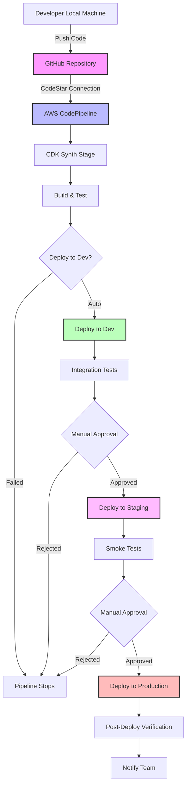

# CI/CD Guide for Serverless Microservices

## Table of Contents

- [CI/CD Guide for Serverless Microservices](#cicd-guide-for-serverless-microservices)
  - [Table of Contents](#table-of-contents)
  - [Introduction](#introduction)
  - [Core Concepts](#core-concepts)
    - [Pipeline Stages](#pipeline-stages)
      - [GitHub Integration via CodeStar Connections](#github-integration-via-codestar-connections)
    - [Environment Management](#environment-management)
    - [Three-Flow Branching Strategy](#three-flow-branching-strategy)
  - [Pipeline Architecture](#pipeline-architecture)
  - [Implementation Guide](#implementation-guide)
    - [Local Development](#local-development)
    - [Feature Development](#feature-development)
    - [Release Process](#release-process)
    - [Hotfix Process](#hotfix-process)
  - [Best Practices](#best-practices)
    - [Feature Toggles](#feature-toggles)
    - [Commit Messages](#commit-messages)
    - [Testing](#testing)
    - [Security](#security)
  - [CodeStar Connection Setup](#codestar-connection-setup)
    - [1. Create CodeStar Connection](#1-create-codestar-connection)
    - [2. Configure Environment Variables](#2-configure-environment-variables)
    - [3. Repository Permissions](#3-repository-permissions)
    - [4. Deployment](#4-deployment)
  - [Reference Implementation](#reference-implementation)
    - [Pipeline Configuration](#pipeline-configuration)
    - [Stage Configuration](#stage-configuration)
  - [Monitoring and Observability](#monitoring-and-observability)
  - [Rollback Strategy](#rollback-strategy)
  - [Team Collaboration](#team-collaboration)
  - [Further Reading](#further-reading)

## Introduction

This guide outlines the CI/CD practices and branching strategy for our serverless microservices architecture. It combines modern DevOps principles with the Three-Flow branching strategy to create a robust, maintainable deployment pipeline.

## Core Concepts

### Pipeline Stages

Our CI/CD pipeline consists of the following stages:

1. **Source**: Code is committed to version control (GitHub) and accessed via AWS CodeStar connections
2. **Build**: Application is compiled, dependencies installed, and CDK synthesized
3. **Test**: Automated tests are executed (unit, integration, etc.)
4. **Deploy**: Application is deployed to the target environment using CDK
5. **Verify**: Post-deployment verification and smoke tests
6. **Notify**: Team is notified of deployment status

#### GitHub Integration via CodeStar Connections

We use **AWS CodeStar connections** for secure GitHub integration:

- **OAuth-based authentication**: No need to manage GitHub tokens manually
- **Automatic token refresh**: AWS handles token lifecycle management
- **Multi-repository support**: One connection works across multiple repositories
- **Secure**: Uses AWS-managed OAuth flow instead of hardcoded tokens

**Setup Process:**

1. Create a CodeStar connection in AWS Console (Developer Tools → CodeStar → Connections)
2. Authorize AWS to access your GitHub repositories via OAuth
3. Configure the connection ID in your environment variables
4. Deploy your pipeline - GitHub integration works automatically

### Environment Management

We use separate AWS accounts for different environments:

- **Development (dev)**: For active development and integration testing
- **Staging (staging)**: Mirrors production for final testing
- **Production (prod)**: Live environment serving real users

### Three-Flow Branching Strategy

Our branching strategy is based on Three-Flow, which uses three main branches:

1. **`master` (main development branch)**

   - All new development happens here
   - Developers work in small, incremental changes
   - Feature toggles are used to hide incomplete work
   - Direct commits or pull requests can be used based on team preference

2. **`candidate` (QA/Staging branch)**

   - Created from `master` when preparing a release
   - Used for QA testing and final verification
   - Only bugfixes should be committed here
   - Changes must be merged back to `master`

3. **`release` (Production branch)**
   - Tracks exactly what's in production
   - Only updated by promoting from `candidate`
   - Used for hotfixes when needed

## Pipeline Architecture

The following diagram illustrates our complete CI/CD pipeline flow:



**Key Components:**

- **CodeStar Connection**: Secure OAuth-based GitHub integration
- **CDK Synth**: Synthesizes CloudFormation templates from CDK code
- **Multi-Stage Deployment**: Automatic dev deployment, manual approvals for staging/prod
- **Cross-Account**: Each environment deploys to separate AWS accounts

## Implementation Guide

### Local Development

1. Clone the repository:

   ```bash
   git clone <repository-url>
   cd <repository-name>
   ```

2. Install dependencies:

   ```bash
   npm install
   ```

3. Start local development:
   ```bash
   npm run dev
   ```

### Feature Development

1. Ensure you're on the latest `master`:

   ```bash
   git checkout master
   git pull origin master
   ```

2. Make small, focused changes directly on `master` or use feature toggles:

   ```typescript
   // Example feature toggle
   if (featureToggles.isEnabled("new-checkout-flow")) {
     // New implementation
   } else {
     // Old implementation
   }
   ```

3. Commit and push changes:
   ```bash
   git add .
   git commit -m "feat: implement new checkout flow"
   git push origin master
   ```

### Release Process

1. Create a release candidate:

   ```bash
   git checkout candidate
   git merge --no-ff master
   git push origin candidate
   ```

2. The CI/CD pipeline will automatically:

   - Build and test the application
   - Deploy to the staging environment
   - Run integration and performance tests

3. After QA approval, promote to production:
   ```bash
   git checkout release
   git reset --hard candidate  # Force update release to match candidate
   git push --force-with-lease origin release
   ```

### Hotfix Process

1. Create a hotfix branch from `release`:

   ```bash
   git checkout release
   git checkout -b hotfix/critical-bug
   ```

2. Make and test the fix:

   ```bash
   # Make your changes
   git add .
   git commit -m "fix: resolve critical security issue"
   ```

3. Merge the hotfix to all branches:

   ```bash
   # Merge to release
   git checkout release
   git merge --no-ff hotfix/critical-bug

   # Merge to candidate
   git checkout candidate
   git merge --no-ff release

   # Merge to master
   git checkout master
   git merge --no-ff candidate

   # Push all branches
   git push origin release candidate master
   ```

## Best Practices

### Feature Toggles

- Use feature toggles for all new features
- Keep toggle lifetime short (days, not weeks)
- Remove toggle code once the feature is fully rolled out

### Commit Messages

- Use conventional commits format: `type(scope): description`
- Types: `feat`, `fix`, `docs`, `style`, `refactor`, `test`, `chore`
- Keep commits small and focused

### Testing

- Write unit tests for all new code
- Include integration tests for critical paths
- Run tests locally before pushing

### Security

- Never commit secrets to version control
- Use AWS Secrets Manager or Parameter Store for configuration
- Follow least privilege principle for IAM roles

## CodeStar Connection Setup

To enable GitHub integration via CodeStar connections, follow these steps:

### 1. Create CodeStar Connection

**Via AWS Console:**

1. Navigate to **AWS Console** → **Developer Tools** → **CodeStar** → **Connections**
2. Click **Create connection**
3. Select **GitHub** as the provider
4. Name your connection (e.g., `super-deals-github-connection`)
5. Click **Connect to GitHub** and complete the OAuth authorization
6. Copy the **Connection ID** from the connection ARN

**Via AWS CLI:**

```bash
# Create the connection
aws codestar-connections create-connection \
  --provider-type GitHub \
  --connection-name "super-deals-github-connection"

# Note: You'll need to complete OAuth authorization in the console
```

### 2. Configure Environment Variables

Add the connection ID to your `.env` file:

```bash
# Extract the connection ID from the full ARN
# ARN format: arn:aws:codestar-connections:region:account:connection/CONNECTION_ID
CODESTAR_CONNECTION_ID=12345678-1234-1234-1234-123456789012
```

### 3. Repository Permissions

Ensure your CodeStar connection has access to the required repositories:

- The connection must be authorized for your GitHub account/organization
- Repository access can be configured during the OAuth flow
- You can modify permissions later in GitHub Settings → Applications

### 4. Deployment

Once configured, deploy your pipeline:

```bash
npm run deploy:staging
# or
npm run deploy:production
```

The pipeline will automatically use the CodeStar connection for GitHub integration.

## Reference Implementation

Our CDK pipeline is configured in `lib/pipeline/construct.ts` using AWS CodeStar connections for GitHub integration:

### Pipeline Configuration

```typescript
// GitHub configuration with fallbacks to config values
const gitHubRepo =
  props.gitHubRepo ?? config.gitHubRepo ?? "nickthiru3/super-deals-deals-ms";
const gitHubBranch = props.gitHubBranch ?? config.gitHubBranch ?? "main";

// Create the pipeline with CodeStar connection
const pipeline = new pipelines.CodePipeline(this, "Pipeline", {
  pipelineName: `super-deals-deals-ms-${envName}-pipeline`,
  crossAccountKeys: true,
  synth: new pipelines.CodeBuildStep("Synth", {
    input: pipelines.CodePipelineSource.connection(gitHubRepo, gitHubBranch, {
      connectionArn: `arn:aws:codestar-connections:${env.region}:${env.account}:connection/${config.codestarConnectionId}`,
    }),
    installCommands: ["npm ci"],
    commands: ["npm run build", "npx cdk synth"],
    primaryOutputDirectory: "cdk.out",
  }),
  codeBuildDefaults: {
    buildEnvironment: {
      buildImage: codebuild.LinuxBuildImage.STANDARD_7_0,
      privileged: true,
    },
  },
});
```

### Stage Configuration

```typescript
// Add stages based on environment configuration
if (pipelineConfig.stages) {
  for (const [stageName, stageConfig] of Object.entries(
    pipelineConfig.stages
  )) {
    if (stageConfig?.enabled !== false) {
      const stageEnv: cdk.Environment = {
        account: stageConfig?.account || env.account,
        region: stageConfig?.region || env.region,
      };

      const stage = new PipelineStage(this, `${stageName}Stage`, {
        envName: stageName,
        env: stageEnv,
        config: { ...pipelineConfig, ...stageConfig, envName: stageName },
      });

      // Add manual approval for production stages
      const stageOptions: pipelines.AddStageOptions = {
        pre:
          stageName === "production" || stageName === "prod"
            ? [
                new pipelines.ManualApprovalStep(
                  `Approve${stageName}Deployment`
                ),
              ]
            : undefined,
      };

      pipeline.addStage(stage, stageOptions);
    }
  }
}
```

## Monitoring and Observability

- **Logs**: Centralized logging with CloudWatch Logs
- **Metrics**: Track key performance indicators
- **Alarms**: Set up alarms for critical issues
- **Tracing**: Enable AWS X-Ray for distributed tracing

## Rollback Strategy

- Automated rollback on deployment failures
- Canary deployments for high-risk changes
- Feature toggles for quick feature disabling

## Team Collaboration

- Regular syncs between developers and operations
- Shared on-call rotation
- Post-mortems for production incidents

## Further Reading

- [Three-Flow Branching Strategy](https://www.rodhilton.com/2017/04/09/a-different-branching-strategy/)
- [Feature Toggles](https://martinfowler.com/articles/feature-toggles.html)
- [AWS Well-Architected Framework](https://aws.amazon.com/architecture/well-architected/)
- [Serverless Best Practices](https://docs.aws.amazon.com/serverless-application-model/latest/developerguide/serverless-best-practices.html)
- [AWS CodeStar Connections Documentation](https://docs.aws.amazon.com/codepipeline/latest/userguide/connections.html)
