<!-- # CI/CD Guide for Serverless Microservices -->

<!-- ## Table of Contents -->

- [CI/CD Guide for Serverless Microservices](#cicd-guide-for-serverless-microservices)
  - [Introduction](#introduction)
  - [Core Concepts](#core-concepts)
    - [Pipeline Stages](#pipeline-stages)
      - [GitHub Integration via CodeStar Connections](#github-integration-via-codestar-connections)
    - [Environment Management](#environment-management)
    - [Three-Flow Branching Strategy](#three-flow-branching-strategy)
  - [LocalStack Integration for Local Development](#localstack-integration-for-local-development)
    - [Overview](#overview)
    - [Environment Strategy](#environment-strategy)
    - [Quick Setup](#quick-setup)
      - [1. Initial LocalStack Setup](#1-initial-localstack-setup)
      - [2. Daily Development Workflow](#2-daily-development-workflow)
    - [Configuration Management](#configuration-management)
      - [Environment-Specific Configuration](#environment-specific-configuration)
      - [AWS SDK Integration](#aws-sdk-integration)
    - [Available Services](#available-services)
    - [Development Workflow Integration](#development-workflow-integration)
      - [Local Development Process](#local-development-process)
      - [CI/CD Pipeline Integration](#cicd-pipeline-integration)
    - [Troubleshooting](#troubleshooting)
      - [Common Issues and Solutions](#common-issues-and-solutions)
      - [Debug Mode](#debug-mode)
    - [Performance Optimization](#performance-optimization)
      - [LocalStack Performance Tips](#localstack-performance-tips)
    - [Team Collaboration](#team-collaboration)
      - [Shared Configuration](#shared-configuration)
      - [Best Practices](#best-practices)
    - [Cost Analysis](#cost-analysis)
      - [Development Cost Comparison](#development-cost-comparison)
      - [ROI Calculation](#roi-calculation)
    - [Migration Guide](#migration-guide)
      - [Moving Existing Code to LocalStack](#moving-existing-code-to-localstack)
    - [Next Steps](#next-steps)
  - [GitHub Actions Integration for Git Tag-Based Deployments](#github-actions-integration-for-git-tag-based-deployments)
    - [Overview](#overview-1)
    - [Architecture](#architecture)
    - [Benefits](#benefits)
    - [Platform Team IAM Management Strategy](#platform-team-iam-management-strategy)
      - [Single IAM User Approach (Recommended)](#single-iam-user-approach-recommended)
      - [Access Key Rotation Strategy](#access-key-rotation-strategy)
      - [Team Coordination Process](#team-coordination-process)
    - [Setup Instructions](#setup-instructions)
      - [1. Platform Team: Create Shared IAM User](#1-platform-team-create-shared-iam-user)
      - [2. Development Teams: Configure Repository Secrets](#2-development-teams-configure-repository-secrets)
      - [3. GitHub Actions Workflow Configuration](#3-github-actions-workflow-configuration)
    - [Development Workflow](#development-workflow)
      - [Daily Development](#daily-development)
      - [Release Deployment](#release-deployment)
      - [Version Tag Patterns](#version-tag-patterns)
    - [AWS CDK Pipeline Configuration](#aws-cdk-pipeline-configuration)
    - [Monitoring and Troubleshooting](#monitoring-and-troubleshooting)
      - [View Deployment Status](#view-deployment-status)
      - [Common Issues](#common-issues)
    - [Security Best Practices](#security-best-practices)
    - [Team Workflow](#team-workflow)
      - [For Developers](#for-developers)
      - [For Platform Team](#for-platform-team)
    - [Migration from Direct CDK Triggers](#migration-from-direct-cdk-triggers)
  - [Three-Flow Branching Strategy Integration](#three-flow-branching-strategy-integration)
    - [Overview](#overview-2)
    - [Complete Enterprise Architecture](#complete-enterprise-architecture)
      - [Environment Strategy](#environment-strategy-1)
      - [Complete Workflow Summary](#complete-workflow-summary)
      - [Automatic Merge-Back Strategy](#automatic-merge-back-strategy)
    - [Three-Flow Branch Structure](#three-flow-branch-structure)
      - [1. Master Branch (Development Integration)](#1-master-branch-development-integration)
      - [2. Candidate Branch (QA Testing)](#2-candidate-branch-qa-testing)
      - [3. Release Branch (Production)](#3-release-branch-production)
    - [GitHub Actions Integration](#github-actions-integration)
      - [Workflow Configuration](#workflow-configuration)
    - [Team Roles and Responsibilities](#team-roles-and-responsibilities)
      - [Team Leader](#team-leader)
      - [Release Manager](#release-manager)
      - [Development Team](#development-team)
      - [QA Team](#qa-team)
    - [Automation Scripts](#automation-scripts)
      - [Package.json Scripts](#packagejson-scripts)
      - [Three-Flow Setup Script (`scripts/three-flow-setup.sh`)](#three-flow-setup-script-scriptsthree-flow-setupsh)
      - [Feature Branch Integration Script (`scripts/integrate-feature.sh`)](#feature-branch-integration-script-scriptsintegrate-featuresh)
      - [Release Cut Script (`scripts/cut-release.sh`)](#release-cut-script-scriptscut-releasesh)
      - [Candidate Fix Script (`scripts/fix-candidate.sh`)](#candidate-fix-script-scriptsfix-candidatesh)
    - [Manual Approval Integration](#manual-approval-integration)
      - [AWS CodePipeline Manual Approval (Recommended)](#aws-codepipeline-manual-approval-recommended)
    - [Rollback Strategies](#rollback-strategies)
      - [Production Rollback Options](#production-rollback-options)
    - [Alternative Approaches (Reference)](#alternative-approaches-reference)
      - [Manual Approval Alternatives](#manual-approval-alternatives)
      - [Custom Domain Alternatives](#custom-domain-alternatives)
      - [Deployment Alternatives](#deployment-alternatives)
    - [Migration from Current Implementation](#migration-from-current-implementation)
      - [2. Release Preparation](#2-release-preparation)
      - [3. Create Release Tag](#3-create-release-tag)
      - [4. Trigger Pipeline](#4-trigger-pipeline)
    - [Tag Naming Convention](#tag-naming-convention)
    - [Pipeline Configuration](#pipeline-configuration)
      - [Current Implementation Status](#current-implementation-status)
      - [CodeStar Connection Configuration](#codestar-connection-configuration)
      - [Build-Time Tag Detection](#build-time-tag-detection)
    - [Release Workflow Examples](#release-workflow-examples)
      - [Example 1: Feature Release](#example-1-feature-release)
      - [Example 2: Hotfix Release](#example-2-hotfix-release)
    - [Benefits of Tag-Based Releases](#benefits-of-tag-based-releases)
    - [Team Workflow Integration](#team-workflow-integration)
      - [Developer Responsibilities](#developer-responsibilities)
      - [Release Manager Responsibilities](#release-manager-responsibilities)
    - [Troubleshooting](#troubleshooting-1)
      - [Pipeline Not Triggering on Tags](#pipeline-not-triggering-on-tags)
      - [Build Fails on Tag](#build-fails-on-tag)
  - [Pipeline Architecture](#pipeline-architecture)
  - [Implementation Guide](#implementation-guide)
    - [Local Development](#local-development)
    - [Feature Development](#feature-development)
    - [Release Process](#release-process)
    - [Hotfix Process](#hotfix-process)
  - [Best Practices](#best-practices-1)
    - [Feature Toggles](#feature-toggles)
    - [Commit Messages](#commit-messages)
    - [Testing](#testing)
    - [Security](#security)
  - [Teams Coordination \& Workflow](#teams-coordination--workflow)
    - [Overview](#overview-3)
    - [Connection Strategy](#connection-strategy)
      - [Recommended: Single App-Wide Connection](#recommended-single-app-wide-connection)
      - [Alternative: Per-Service Connections](#alternative-per-service-connections)
    - [Platform Team Responsibilities](#platform-team-responsibilities)
      - [Phase 1: Initial Connection Setup (One-time per AWS Account)](#phase-1-initial-connection-setup-one-time-per-aws-account)
      - [Phase 2: GitHub App Authorization (Manual - One Time)](#phase-2-github-app-authorization-manual---one-time)
      - [Phase 3: Parameter Store Structure](#phase-3-parameter-store-structure)
    - [Development Team Integration](#development-team-integration)
      - [CDK Configuration](#cdk-configuration)
      - [Local Development Override](#local-development-override)
    - [Automation Opportunities](#automation-opportunities)
      - [What Can Be Automated](#what-can-be-automated)
      - [What Must Remain Manual](#what-must-remain-manual)
    - [Multi-Account Strategy](#multi-account-strategy)
    - [Troubleshooting Common Issues](#troubleshooting-common-issues)
      - [Connection Shows "Pending" Status](#connection-shows-pending-status)
      - [Pipeline Fails with "Insufficient Permissions"](#pipeline-fails-with-insufficient-permissions)
      - [Parameter Store Access Denied](#parameter-store-access-denied)
    - [Security Considerations](#security-considerations)
    - [Team Coordination Checklist](#team-coordination-checklist)
  - [Reference Implementation](#reference-implementation)
    - [Pipeline Configuration](#pipeline-configuration-1)
    - [Stage Configuration](#stage-configuration)
  - [Monitoring and Observability](#monitoring-and-observability)
  - [Rollback Strategy](#rollback-strategy)
  - [Team Collaboration](#team-collaboration-1)
  - [Further Reading](#further-reading)

# CI/CD Guide for Serverless Microservices

## Introduction

This guide outlines the CI/CD practices and branching strategy for our serverless microservices architecture. It combines modern DevOps principles with the Three-Flow branching strategy to create a robust, maintainable deployment pipeline.

## Core Concepts

### Pipeline Stages

Our CI/CD pipeline consists of the following stages:

1. **Source**: Code is committed to version control (GitHub) and accessed via AWS CodeStar connections
2. **Build**: Application is compiled, dependencies installed, and CDK synthesized
3. **Test**: Automated tests are executed (unit, integration, etc.)
4. **Deploy**: Application is deployed to the target environment using CDK
5. **Verify**: Post-deployment verification and smoke tests
6. **Notify**: Team is notified of deployment status

#### GitHub Integration via CodeStar Connections

We use **AWS CodeStar connections** for secure GitHub integration:

- **OAuth-based authentication**: No need to manage GitHub tokens manually
- **Automatic token refresh**: AWS handles token lifecycle management
- **Multi-repository support**: One connection works across multiple repositories
- **Secure**: Uses AWS-managed OAuth flow instead of hardcoded tokens

**Setup Process:**

1. Create a CodeStar connection in AWS Console (Developer Tools → CodeStar → Connections)
2. Authorize AWS to access your GitHub repositories via OAuth
3. Configure the connection ID in your environment variables
4. Deploy your pipeline - GitHub integration works automatically

### Environment Management

We use separate AWS accounts for different environments:

- **Development (dev)**: For active development and integration testing
- **Staging (staging)**: Mirrors production for final testing
- **Production (prod)**: Live environment serving real users

_Note_: We are using LocalStack for local development and testing, so the development AWS account may not be necessary.

### Three-Flow Branching Strategy

Our branching strategy is based on Three-Flow, which uses three main branches:

1. **`master` (main development branch)**

   - All new development happens here
   - Developers work in small, incremental changes
   - Feature toggles are used to hide incomplete work
   - Direct commits or pull requests can be used based on team preference

2. **`candidate` (QA/Staging branch)**

   - Created from `master` when preparing a release
   - Used for QA testing and final verification
   - Only bugfixes should be committed here
   - Changes must be merged back to `master`

3. **`release` (Production branch)**
   - Tracks exactly what's in production
   - Only updated by promoting from `candidate`
   - Used for hotfixes when needed

## LocalStack Integration for Local Development

### Overview

LocalStack integration provides a complete local AWS development environment, eliminating the need for a separate development AWS account and reducing costs during development.

### Environment Strategy

Our multi-environment approach leverages LocalStack for cost-effective local development:

```mermaid
graph LR
    A[👨‍💻 Developer] --> B[🐳 LocalStack<br/>Development]
    B --> C[☁️ AWS Free Tier<br/>Staging]
    C --> D[🏭 AWS Production<br/>Future]

    B -.-> E[Local Testing]
    C -.-> F[Integration Testing]
    D -.-> G[Production Release]
```



**Benefits:**

- **$0 development costs** - No AWS charges for local development
- **Fast iteration cycles** - No network latency or cold starts
- **Complete isolation** - Each developer has their own environment
- **Offline development** - Work without internet connectivity

### Quick Setup

#### 1. Initial LocalStack Setup

```bash
# Install and configure LocalStack
npm run localstack:setup

# This script will:
# - Check Docker installation
# - Install cdklocal globally
# - Configure AWS CLI for LocalStack
# - Start LocalStack container
# - Test service connectivity
```

#### 2. Daily Development Workflow

```bash
# Start your development session
npm run localstack:start          # Start LocalStack services
npm run deploy:localstack         # Deploy infrastructure
npm run dev:localstack            # Run application

# Development and testing
npm run test:localstack           # Run tests against LocalStack
npm run localstack:logs           # Monitor LocalStack logs
npm run localstack:health         # Check service health

# End development session
npm run localstack:stop           # Stop LocalStack container
```

### Configuration Management

#### Environment-Specific Configuration

The project automatically loads LocalStack configuration when `ENV_NAME=localstack`:

```typescript
// config/localstack.ts
export const localstackConfig: Config = {
  envName: "localstack",

  // All AWS services point to LocalStack gateway
  endpoints: {
    dynamodb: "http://localhost:4566",
    s3: "http://localhost:4566",
    lambda: "http://localhost:4566",
    apigateway: "http://localhost:4566",
    sns: "http://localhost:4566",
    sqs: "http://localhost:4566",
    cloudwatch: "http://localhost:4566",
  },

  // Development-optimized settings
  development: {
    enableDebugLogs: true,
    lambdaTimeout: 30,
    enableHotReload: true,
    skipValidations: true,
  },
};
```

#### AWS SDK Integration

Services automatically connect to LocalStack when running in LocalStack mode:

```typescript
// Example: DynamoDB client configuration
const config = loadConfig();
const dynamoClient = new DynamoDBClient({
  region: config.aws?.region || "us-east-1",
  ...(config.endpoints?.dynamodb && {
    endpoint: config.endpoints.dynamodb,
  }),
});
```

### Available Services

LocalStack Community Edition provides all core AWS services needed for microservice development:

| Service            | Status | Use Case               |
| ------------------ | ------ | ---------------------- |
| **Lambda**         | ✅     | Serverless functions   |
| **API Gateway**    | ✅     | REST API endpoints     |
| **DynamoDB**       | ✅     | NoSQL database         |
| **S3**             | ✅     | File storage           |
| **SNS/SQS**        | ✅     | Messaging              |
| **CloudWatch**     | ✅     | Logging/monitoring     |
| **IAM**            | ✅     | Access control         |
| **CloudFormation** | ✅     | Infrastructure as Code |

### Development Workflow Integration

#### Local Development Process

1. **Feature Development**

   ```bash
   # Start LocalStack environment
   npm run localstack:start
   npm run deploy:localstack

   # Develop feature with hot reload
   npm run dev:localstack

   # Test changes locally
   npm run test:localstack
   ```

2. **Pre-Commit Testing**

   ```bash
   # Run full test suite against LocalStack
   npm run test:localstack

   # Verify infrastructure deployment
   npm run deploy:localstack

   # Clean up
   npm run localstack:stop
   ```

3. **Integration Testing**
   ```bash
   # After local validation, test against real AWS
   npm run deploy:staging
   npm run test:staging
   ```

#### CI/CD Pipeline Integration

LocalStack can be integrated into CI/CD for fast testing:

```yaml
# .github/workflows/ci.yml (example)
name: CI
on: [push, pull_request]

jobs:
  test-localstack:
    runs-on: ubuntu-latest
    steps:
      - uses: actions/checkout@v3
      - name: Start LocalStack
        run: |
          docker run -d -p 4566:4566 localstack/localstack
          npm run localstack:setup
      - name: Run Tests
        run: npm run test:localstack
```

### Troubleshooting

#### Common Issues and Solutions

**LocalStack Container Won't Start**

```bash
# Check Docker is running
docker info

# Check port availability
lsof -i :4566

# Restart with fresh container
npm run localstack:stop
docker system prune -f
npm run localstack:start
```

**CDK Deployment Failures**

```bash
# Verify LocalStack health
curl http://localhost:4566/health

# Check AWS CLI configuration
aws configure list --profile localstack

# View detailed logs
npm run localstack:logs
```

**Service Connection Issues**

```bash
# Test basic connectivity
aws --endpoint-url=http://localhost:4566 sts get-caller-identity --profile localstack

# Verify service endpoints
aws --endpoint-url=http://localhost:4566 dynamodb list-tables --profile localstack
```

#### Debug Mode

Enable verbose logging for troubleshooting:

```bash
# Enable debug mode
DEBUG=1 npm run localstack:start

# Or set in docker-compose.localstack.yml
environment:
  - DEBUG=1
  - LS_LOG=debug
```

### Performance Optimization

#### LocalStack Performance Tips

1. **Enable Persistence**

   ```yaml
   # docker-compose.localstack.yml
   environment:
     - PERSISTENCE=1 # Keeps data between restarts
   ```

2. **Optimize Lambda Execution**

   ```yaml
   environment:
     - LAMBDA_EXECUTOR=local # Faster than docker executor
   ```

3. **Limit Services**

   ```yaml
   environment:
     - SERVICES=lambda,dynamodb,s3,apigateway # Only what you need
   ```

4. **Resource Cleanup**
   ```bash
   # Clean up periodically
   docker-compose -f docker-compose.localstack.yml down -v
   docker system prune -f
   ```

### Team Collaboration

#### Shared Configuration

All team members use the same LocalStack setup:

- **Consistent Docker Compose configuration**
- **Shared service versions and settings**
- **Standardized AWS CLI profiles**
- **Common troubleshooting procedures**

#### Best Practices

1. **Always use environment variables**

   ```bash
   ENV_NAME=localstack npm run dev
   ```

2. **Test against real AWS regularly**

   - Deploy to staging weekly
   - Validate LocalStack behavior matches AWS

3. **Document LocalStack-specific behaviors**

   - Note any differences from real AWS
   - Share solutions to common issues

4. **Use separate resource naming**
   ```typescript
   resources: {
     tablePrefix: 'localstack-deals',
     bucketPrefix: 'localstack-deals'
   }
   ```

### Cost Analysis

#### Development Cost Comparison

| Approach               | Monthly Cost | Setup Time | Isolation |
| ---------------------- | ------------ | ---------- | --------- |
| **LocalStack**         | $0           | 5 minutes  | Complete  |
| **Shared AWS Dev**     | $50-100      | 1 hour     | None      |
| **Individual AWS Dev** | $50-200/dev  | 2 hours    | Good      |

#### ROI Calculation

For a team of 5 developers:

- **LocalStack**: $0/month + faster development
- **AWS Dev Accounts**: $250-1000/month + slower iteration
- **Annual Savings**: $3,000-12,000 + productivity gains

### Migration Guide

#### Moving Existing Code to LocalStack

1. **Update AWS SDK clients to use endpoints**
2. **Add environment-specific configuration**
3. **Update deployment scripts**
4. **Test service compatibility**
5. **Document any LocalStack-specific behaviors**

See the [LocalStack Guide](./localstack-guide.md#super-deals-microservice-localstack-implementation) for detailed implementation instructions.

### Next Steps

1. **Set up LocalStack** using `npm run localstack:setup`
2. **Deploy your first stack** with `npm run deploy:localstack`
3. **Integrate with your development workflow**
4. **Set up team standards and documentation**
5. **Plan regular staging deployments** for validation

## GitHub Actions Integration for Git Tag-Based Deployments

### Overview

We use GitHub Actions to implement Git tag-based deployments, providing clean separation between CI (continuous integration) and CD (continuous deployment). This approach keeps the AWS CDK pipeline focused on infrastructure while GitHub Actions handles the deployment triggers.

### Architecture


### Benefits

- **🎯 Precise Control**: Only version tags trigger deployments
- **🧹 Clean Separation**: GitHub Actions handles "when", CDK handles "what"
- **💰 Cost Efficient**: No unnecessary AWS CodePipeline runs
- **🔍 Transparent**: Deployment logic visible in GitHub Actions workflow
- **🔒 Secure**: Minimal IAM permissions, repository-scoped secrets

### Platform Team IAM Management Strategy

#### Single IAM User Approach (Recommended)

**Why Single User vs. Per-Team Users:**

| Approach               | Pros                                                          | Cons                                               | Coordination Cost |
| ---------------------- | ------------------------------------------------------------- | -------------------------------------------------- | ----------------- |
| **Single Shared User** | Simple management, consistent permissions, one rotation cycle | Shared credentials, broader blast radius           | **Low**           |
| **Per-Team Users**     | Isolated credentials, granular access                         | Complex naming, many rotation cycles, policy drift | **High**          |

**Recommendation**: Use a **single shared IAM user** for all `super-deals-*` repositories to minimize platform team coordination overhead.

#### Access Key Rotation Strategy

**Rotation Schedule**: Every **90 days** (quarterly)

**Rotation Process**:

1. **Week 1**: Platform team creates new access key (user can have 2 keys)
2. **Week 2**: Platform team updates all repository secrets with new key
3. **Week 3**: Development teams test deployments with new key
4. **Week 4**: Platform team deactivates old access key

**Automation Opportunities**:

- Use AWS Secrets Manager for automatic rotation (advanced)
- Script to update multiple GitHub repositories (GitHub API)
- Slack notifications for rotation reminders

#### Team Coordination Process

**Platform Team Responsibilities**:

1. **IAM User Management**: Create and maintain shared IAM user
2. **Policy Management**: Update permissions as new services are added
3. **Access Key Rotation**: Quarterly rotation with team coordination
4. **Documentation**: Maintain this guide and rotation procedures
5. **Support**: Help development teams with GitHub secrets setup

**Development Team Responsibilities**:

1. **Repository Setup**: Add GitHub secrets to their repositories
2. **Testing**: Verify deployments work after key rotation
3. **Communication**: Report issues to platform team
4. **Compliance**: Follow naming conventions and security practices

**Coordination Channels**:

- **Slack**: `#platform-team` for IAM-related requests
- **Email**: Quarterly rotation notifications
- **Documentation**: This guide for self-service setup
- **Tickets**: Jira/GitHub issues for complex requests

### Setup Instructions

#### 1. Platform Team: Create Shared IAM User

**Step 1: Create IAM User** (Platform Team)

```bash
# In AWS Console: IAM → Users → Create user
User name: github-actions-super-deals-cicd
Access type: Programmatic access (Access key)
Description: Shared IAM user for GitHub Actions CI/CD across all super-deals microservices
```

**Step 2: Create Custom Policy** (Platform Team)

```json
{
  "Version": "2012-10-17",
  "Statement": [
    {
      "Effect": "Allow",
      "Action": [
        "codepipeline:StartPipelineExecution",
        "codepipeline:GetPipelineState",
        "codepipeline:GetPipelineExecution"
      ],
      "Resource": ["arn:aws:codepipeline:us-east-1:*:pipeline/super-deals-*"]
    }
  ]
}
```

**Policy Name**: `GitHubActions-SuperDeals-CodePipeline`

**Step 3: Attach Policy to User** (Platform Team)

- Go to IAM → Users → `github-actions-super-deals-cicd`
- Permissions tab → Add permissions → Attach policies directly
- Select `GitHubActions-SuperDeals-CodePipeline`

**Step 4: Create Access Key** (Platform Team)

- Security credentials tab → Create access key
- Use case: Application running outside AWS
- Description: `Q1-2024-GitHub-Actions` (include rotation quarter)
- **Save securely**: Access Key ID and Secret Access Key

**Step 5: Document and Distribute** (Platform Team)

- Add credentials to platform team password manager
- Create Slack announcement with setup instructions
- Update this documentation with any changes

#### 2. Development Teams: Configure Repository Secrets

**Step 1: Navigate to Repository Settings**

```
GitHub Repository → Settings → Secrets and variables → Actions
```

**Step 2: Add Repository Secrets**

- Click "New repository secret"
- Add these secrets:
  - Name: `AWS_ACCESS_KEY_ID`, Value: [Your Access Key ID]
  - Name: `AWS_SECRET_ACCESS_KEY`, Value: [Your Secret Access Key]

**Step 3: Verify Secrets**

- Secrets are repository-specific (perfect for security)
- Each `super-deals-*` repository needs its own secrets
- Secrets are encrypted and only visible to repository collaborators

#### 3. GitHub Actions Workflow Configuration

The workflow in `.github/workflows/cicd.yml` is configured to:

```yaml
# Trigger on version tags only for deployment
on:
  push:
    branches: [master, candidate, release] # CI only
    tags:
      - "v*" # Deployment trigger
  pull_request:
    branches: [master, candidate, release] # CI only

jobs:
  # CI: Always runs on pushes/PRs
  test:
    name: Test
    runs-on: ubuntu-latest
    # ... test steps

  # CD: Only runs on version tags
  deploy:
    name: Deploy to AWS
    needs: test
    if: startsWith(github.ref, 'refs/tags/v')
    runs-on: ubuntu-latest
    steps:
      - name: Configure AWS credentials
        uses: aws-actions/configure-aws-credentials@v2
        with:
          aws-access-key-id: ${{ secrets.AWS_ACCESS_KEY_ID }}
          aws-secret-access-key: ${{ secrets.AWS_SECRET_ACCESS_KEY }}
          aws-region: us-east-1

      - name: Trigger AWS CodePipeline
        run: |
          aws codepipeline start-pipeline-execution \
            --name "super-deals-deals-ms-staging-pipeline"
```

### Development Workflow

#### Daily Development

```bash
# Regular development - triggers CI only
git checkout -b feature/new-api
git add .
git commit -m "Add new API endpoint"
git push origin feature/new-api
# → GitHub Actions runs tests, linting, validation
# → No deployment occurs
```

#### Release Deployment

```bash
# Create and push version tag - triggers deployment
git checkout master
git pull origin master
git tag v1.0.0
git push origin v1.0.0
# → GitHub Actions runs CI + triggers AWS CodePipeline
# → Infrastructure deployed to staging environment
```

#### Version Tag Patterns

- `v1.0.0` - Production release
- `v1.0.1` - Patch release
- `v2.0.0-beta` - Pre-release
- `v1.0.0-rc.1` - Release candidate

### AWS CDK Pipeline Configuration

The CDK pipeline is configured for GitHub Actions triggering:

```typescript
// lib/pipeline/stack.ts
input: pipelines.CodePipelineSource.connection(gitHubRepo, gitHubBranch, {
  connectionArn: `arn:aws:codestar-connections:${env.region}:${env.account}:connection/${config.codestarConnectionId}`,
  triggerOnPush: false, // Disabled - GitHub Actions handles triggering
});
```

### Monitoring and Troubleshooting

#### View Deployment Status

1. **GitHub Actions**: Repository → Actions tab
2. **AWS CodePipeline**: AWS Console → CodePipeline → Pipeline name
3. **CloudWatch Logs**: AWS Console → CloudWatch → Log groups

#### Common Issues

**GitHub Actions fails with AWS credentials error:**

```bash
# Check if secrets are properly set
# GitHub Repository → Settings → Secrets and variables → Actions
# Verify AWS_ACCESS_KEY_ID and AWS_SECRET_ACCESS_KEY exist
```

**Pipeline not found error:**

```bash
# Verify pipeline name matches in workflow
# Check AWS Console → CodePipeline for exact pipeline name
```

**Permission denied error:**

```bash
# Verify IAM policy allows codepipeline:StartPipelineExecution
# Check resource ARN pattern matches your pipeline
```

### Security Best Practices

1. **Minimal Permissions**: IAM policy only allows pipeline execution
2. **Resource Scoping**: Policy limited to `super-deals-*` pipelines
3. **Repository Secrets**: Credentials scoped to specific repositories
4. **Access Key Rotation**: Rotate access keys every 90 days
5. **Audit Logging**: Monitor CloudTrail for pipeline execution events

### Team Workflow

#### For Developers

1. **Feature Development**: Push to feature branches (CI only)
2. **Pull Requests**: Create PRs to master (CI validation)
3. **Release Preparation**: Merge to master, create version tag
4. **Deployment**: Push version tag (triggers deployment)

#### For Platform Team

1. **Pipeline Monitoring**: Watch AWS CodePipeline executions
2. **Secret Management**: Rotate IAM access keys regularly
3. **Policy Updates**: Adjust IAM permissions as needed
4. **Documentation**: Keep deployment procedures updated

### Migration from Direct CDK Triggers

If migrating from direct CDK pipeline triggers:

1. **Update CDK Pipeline**: Set `triggerOnPush: false`
2. **Deploy Pipeline**: `cdk deploy PipelineStack`
3. **Configure GitHub**: Add repository secrets
4. **Test Workflow**: Create test version tag
5. **Update Documentation**: Inform team of new process

## Three-Flow Branching Strategy Integration

### Overview

We implement the **Three-Flow branching strategy** with AWS multi-account architecture for enterprise-grade release management. This approach provides:

- **Deliberate, controlled releases** through branch-based workflows
- **Clear separation** between development, QA, and production environments
- **Robust hotfix capabilities** for production emergencies
- **Automated CI/CD integration** with manual approval gates
- **Multi-account isolation** for security and blast radius containment

### Complete Enterprise Architecture

#### Environment Strategy

| Environment     | Branch           | AWS Account                 | Purpose                | Trigger                |
| --------------- | ---------------- | --------------------------- | ---------------------- | ---------------------- |
| **Development** | `master`         | Dev Account (Current)       | Integration testing    | Push to master         |
| **Staging**     | `candidate`      | Staging Account (Future)    | QA testing             | `v*` tags on candidate |
| **Production**  | `release`        | Production Account (Future) | Live deployment        | `v*` tags on release   |
| **Local**       | Feature branches | LocalStack                  | Individual development | Manual                 |

#### Complete Workflow Summary

```
1. Development: master branch + LocalStack (individual) + AWS Dev (integration)
2. Release Cut: master → candidate branch
3. Release Tag: v1.2.3 → AWS Staging deployment
4. QA Testing: In AWS staging environment
5. Defect Fixes: candidate branch → v1.2.4 → AWS Staging re-deployment
6. Candidate Merge-back: candidate fixes → master (automated with --no-ff)
7. QA Approval: After all fixes validated
8. Release: candidate → release (force push) → v1.2.4 → AWS Production deployment
9. Hotfixes: release branch → v1.2.5 → AWS Production deployment
10. Hotfix Merge-back: release → candidate → master (automated with --no-ff)
```

#### Automatic Merge-Back Strategy

**Purpose**: Ensure all branches stay synchronized and no fixes are lost

**Merge-Back Triggers**:

1. **After Candidate Fixes**: `candidate` → `master` (keep development in sync)
2. **After Production Hotfixes**: `release` → `candidate` → `master` (propagate fixes)
3. **After Release Promotion**: Already handled by force push

**Automated Merge-Back Workflow**:

```yaml
# GitHub Actions: Automatic Merge-Back
merge-back:
  name: Automatic Merge-Back
  runs-on: ubuntu-latest
  if: |
    startsWith(github.ref, 'refs/tags/candidate-') ||
    startsWith(github.ref, 'refs/tags/release-')
  steps:
    - uses: actions/checkout@v3
      with:
        fetch-depth: 0 # Full history for merge operations
        token: ${{ secrets.GITHUB_TOKEN }}

    - name: Configure Git
      run: |
        git config user.name "GitHub Actions"
        git config user.email "actions@github.com"

    - name: Merge candidate fixes to master
      if: startsWith(github.ref, 'refs/tags/candidate-')
      run: |
        echo "🔄 Merging candidate fixes back to master"
        git checkout master
        git pull origin master
        git merge candidate --no-ff -m "Merge candidate fixes back to master"
        git push origin master

    - name: Merge release hotfixes to candidate and master
      if: startsWith(github.ref, 'refs/tags/release-')
      run: |
        echo "🔄 Merging release hotfixes back to candidate and master"
        # First merge to candidate
        git checkout candidate
        git pull origin candidate
        git merge release --no-ff -m "Merge release hotfix back to candidate"
        git push origin candidate

        # Then merge candidate to master
        git checkout master
        git pull origin master
        git merge candidate --no-ff -m "Merge hotfix from candidate to master"
        git push origin master
```

**Manual Merge-Back Scripts** (Alternative to automation):

```bash
# scripts/merge-back-candidate.sh
#!/bin/bash
set -e

echo "🔄 Merging candidate fixes back to master..."
git checkout master
git pull origin master
git merge candidate --no-ff -m "Merge candidate fixes back to master"
git push origin master
echo "✅ Candidate fixes merged to master"
```

```bash
# scripts/merge-back-hotfix.sh
#!/bin/bash
set -e

echo "🔄 Merging release hotfix back to candidate and master..."

# Merge to candidate first
git checkout candidate
git pull origin candidate
git merge release --no-ff -m "Merge release hotfix back to candidate"
git push origin candidate

# Then merge to master
git checkout master
git pull origin master
git merge candidate --no-ff -m "Merge hotfix from candidate to master"
git push origin master

echo "✅ Hotfix merged back to all branches"
```

**Why Merge-Back is Critical**:

- **Candidate Fixes**: Ensure QA-validated fixes reach ongoing development
- **Production Hotfixes**: Prevent hotfixes from being lost in future releases
- **Branch Synchronization**: Maintain consistency across all environments
- **Developer Awareness**: Team sees all fixes in their daily master branch work

### Three-Flow Branch Structure

#### 1. Master Branch (Development Integration)

**Purpose**: Primary development branch where all team members collaborate

**Git Configuration**:

```bash
# Configure automatic rebase for master branch (clean history)
git config branch.master.rebase true
```

**Workflow**:

- All developers work off master branch
- Individual development uses LocalStack for testing
- Feature branches must rebase onto master before merging
- Pushes to master trigger CI validation + AWS Dev deployment
- Regular pushes (2x daily minimum) to keep team in sync

**Feature Branch Integration Process**:

1. `git checkout feature-branch`
2. `git rebase master` (resolve conflicts if any)
3. `git checkout master`
4. `git merge feature-branch` (fast-forward due to rebase)

**CI Triggers**:

- **Push to master**: CI validation + AWS Dev deployment
- **Pull requests**: CI validation only

**Why CI on Master?**

- **Integration validation**: Catch conflicts between developers
- **Dependency consistency**: Validate in clean environment
- **Code quality gates**: Linting, TypeScript, security scanning
- **Early feedback**: Issues caught before release candidate

#### 2. Candidate Branch (QA Testing)

**Purpose**: Release candidate for QA testing in staging environment

**Creation Process**:

```bash
# Release cut (Team Leader)
git checkout master
git pull origin master
git checkout -b candidate
git tag candidate-3.2.647
git push origin candidate candidate-3.2.647 --follow-tags
```

**QA Defect Fix Process**:

```bash
# Fix bugs on candidate branch
git checkout candidate
# Make fixes...
git add .
git commit -m "Fix: QA defect #123"
git tag candidate-3.2.648  # Increment patch version
git push origin candidate-3.2.648 --follow-tags
```

**Tag Format**:

- Initial candidate: `candidate-3.2.647`
- Defect fixes: `candidate-3.2.648`, `candidate-3.2.649`, etc.

#### 3. Release Branch (Production)

**Purpose**: Production deployment pointer and hotfix base

**Release Promotion** (Team Leader/Release Manager):

```bash
# Promote candidate to production
git checkout candidate
git pull origin candidate
git push --force origin candidate:release
```

**Production Hotfix Process**:

```bash
# Emergency hotfix
git checkout release
git pull origin release
# Make hotfix...
git add .
git commit -m "Hotfix: Critical production issue"
git tag hotfix-3.2.648  # Increment patch version
git push origin release hotfix-3.2.648 --follow-tags
```

**Key Characteristics**:

- **No history**: Updated via force push only
- **No release tags**: Only candidate and hotfix tags exist
- **Production pointer**: Always points to current production code

### GitHub Actions Integration

#### Workflow Configuration

```yaml
name: Three-Flow CI/CD Pipeline

on:
  push:
    branches: [master, release]
    tags: ["candidate-*", "hotfix-*"]
  pull_request:
    branches: [master]

env:
  AWS_REGION: us-east-1
  NODE_VERSION: 20.x

jobs:
  test:
    name: CI Validation
    runs-on: ubuntu-latest
    steps:
      - uses: actions/checkout@v3
      - name: Setup Node.js
        uses: actions/setup-node@v3
        with:
          node-version: ${{ env.NODE_VERSION }}
          cache: "npm"
      - name: Install dependencies
        run: npm ci
      - name: Run tests
        run: npm test
      - name: Run linting
        run: npm run lint
      - name: TypeScript check
        run: npm run type-check

  deploy-dev:
    name: Deploy to Development
    needs: test
    if: github.ref == 'refs/heads/master'
    runs-on: ubuntu-latest
    steps:
      - name: Configure AWS credentials
        uses: aws-actions/configure-aws-credentials@v2
        with:
          aws-access-key-id: ${{ secrets.AWS_ACCESS_KEY_ID }}
          aws-secret-access-key: ${{ secrets.AWS_SECRET_ACCESS_KEY }}
          aws-region: ${{ env.AWS_REGION }}
      - name: Deploy to Development
        run: |
          echo "🚀 Deploying master branch to development environment"
          aws codepipeline start-pipeline-execution \
            --name "super-deals-deals-ms-dev-pipeline"

  deploy-staging:
    name: Deploy to Staging
    needs: test
    if: startsWith(github.ref, 'refs/tags/candidate-')
    runs-on: ubuntu-latest
    steps:
      - name: Configure AWS credentials
        uses: aws-actions/configure-aws-credentials@v2
        with:
          aws-access-key-id: ${{ secrets.AWS_ACCESS_KEY_ID }}
          aws-secret-access-key: ${{ secrets.AWS_SECRET_ACCESS_KEY }}
          aws-region: ${{ env.AWS_REGION }}
      - name: Extract version from tag
        id: version
        run: |
          VERSION=${GITHUB_REF#refs/tags/candidate-}
          echo "version=$VERSION" >> $GITHUB_OUTPUT
          echo "🏷️ Deploying candidate version: $VERSION"
      - name: Deploy to Staging
        run: |
          echo "🚀 Deploying candidate-${{ steps.version.outputs.version }} to staging"
          aws codepipeline start-pipeline-execution \
            --name "super-deals-deals-ms-staging-pipeline" \
            --source-revisions actionName=Source,revisionId=${{ github.sha }}

  deploy-production:
    name: Deploy to Production
    needs: test
    if: |
      github.ref == 'refs/heads/release' ||
      startsWith(github.ref, 'refs/tags/hotfix-')
    runs-on: ubuntu-latest
    steps:
      - name: Configure AWS credentials
        uses: aws-actions/configure-aws-credentials@v2
        with:
          aws-access-key-id: ${{ secrets.AWS_ACCESS_KEY_ID }}
          aws-secret-access-key: ${{ secrets.AWS_SECRET_ACCESS_KEY }}
          aws-region: ${{ env.AWS_REGION }}
      - name: Determine deployment type
        id: deploy-type
        run: |
          if [[ $GITHUB_REF == refs/heads/release ]]; then
            echo "type=release" >> $GITHUB_OUTPUT
            echo "🚀 Production release deployment"
          else
            VERSION=${GITHUB_REF#refs/tags/hotfix-}
            echo "type=hotfix" >> $GITHUB_OUTPUT
            echo "version=$VERSION" >> $GITHUB_OUTPUT
            echo "🚨 Production hotfix deployment: $VERSION"
          fi
      - name: Deploy to Production
        run: |
          echo "🚀 Deploying to production environment"
          aws codepipeline start-pipeline-execution \
            --name "super-deals-deals-ms-production-pipeline" \
            --source-revisions actionName=Source,revisionId=${{ github.sha }}
```

### Team Roles and Responsibilities

#### Team Leader

- **Release Cuts**: Create candidate branches from master
- **Release Promotion**: Promote candidate to release branch
- **Emergency Decisions**: Approve critical hotfixes
- **Branch Management**: Ensure proper Three-Flow workflow

#### Release Manager

- **Release Planning**: Coordinate release schedules with stakeholders
- **Quality Gates**: Final approval for production deployments
- **Risk Assessment**: Evaluate hotfix urgency and impact
- **Communication**: Update stakeholders on release status
- **Manual Approval**: Use AWS CodePipeline console for production approvals

#### Development Team

- **Daily Development**: Work on master branch with LocalStack
- **Integration**: Push/pull to master 2x daily minimum
- **QA Support**: Fix defects on candidate branch when requested
- **Code Quality**: Ensure CI passes before pushing to master

#### QA Team

- **Candidate Testing**: Test in AWS staging environment
- **Defect Reporting**: Document issues found during candidate testing
- **Release Approval**: Sign off on candidate readiness for production
- **Regression Testing**: Validate defect fixes on candidate branch

### Automation Scripts

#### Package.json Scripts

```json
{
  "scripts": {
    "release:cut": "./scripts/cut-release.sh",
    "release:promote": "./scripts/promote-release.sh",
    "release:fix": "./scripts/fix-candidate.sh",
    "hotfix:create": "./scripts/create-hotfix.sh",
    "hotfix:deploy": "./scripts/deploy-hotfix.sh"
  }
}
```

#### Three-Flow Setup Script (`scripts/three-flow-setup.sh`)

```bash
#!/bin/bash
set -e

echo "🔧 Setting up Three-Flow branching strategy..."

# Configure automatic rebase for master branch only
echo "📝 Configuring automatic rebase for master branch..."
git config branch.master.rebase true
echo "✅ Master branch configured for automatic rebase on pull"

# Create Three-Flow branches if they don't exist
echo "🌿 Setting up Three-Flow branches..."

# Ensure we're on master
git checkout master
git pull --rebase origin master

# Create candidate branch if it doesn't exist
if ! git show-ref --verify --quiet refs/heads/candidate; then
  echo "📦 Creating candidate branch..."
  git checkout -b candidate
  git push -u origin candidate
  git checkout master
else
  echo "✅ Candidate branch already exists"
fi

# Create release branch if it doesn't exist
if ! git show-ref --verify --quiet refs/heads/release; then
  echo "🚀 Creating release branch..."
  git checkout -b release
  git push -u origin release
  git checkout master
else
  echo "✅ Release branch already exists"
fi

echo "✅ Three-Flow setup complete!"
echo ""
echo "📋 Next steps:"
echo "   1. Configure GitHub repository secrets for CI/CD"
echo "   2. Set up AWS CodeStar connections"
echo "   3. Deploy pipeline infrastructure with CDK"
echo ""
echo "🔒 Enterprise Setup (Optional - commented out for solo development):"
echo "   - Configure branch protection rules in GitHub"
echo "   - Set up required status checks"
echo "   - Enable pull request reviews"

# Enterprise branch protection setup (commented out)
# echo "⚠️  To enable enterprise branch protection:"
# echo "   1. Go to GitHub Repository Settings → Branches"
# echo "   2. Add branch protection rule for 'master':"
# echo "      - Require pull request reviews before merging"
# echo "      - Require status checks to pass before merging"
# echo "      - Require branches to be up to date before merging"
# echo "      - Restrict pushes to matching branches"
```

#### Feature Branch Integration Script (`scripts/integrate-feature.sh`)

```bash
#!/bin/bash
set -e

# Check if feature branch name is provided
if [ $# -eq 0 ]; then
  echo "❌ Usage: $0 <feature-branch-name>"
  echo "   Example: $0 feature/new-api-endpoint"
  exit 1
fi

FEATURE_BRANCH=$1

echo "🔄 Integrating feature branch: $FEATURE_BRANCH"

# Verify feature branch exists
if ! git show-ref --verify --quiet refs/heads/$FEATURE_BRANCH; then
  echo "❌ Feature branch '$FEATURE_BRANCH' does not exist"
  exit 1
fi

# Step 1: Checkout feature branch
echo "📦 Checking out feature branch..."
git checkout $FEATURE_BRANCH

# Step 2: Rebase onto master
echo "🔄 Rebasing feature branch onto master..."
git rebase master || {
  echo "❌ Rebase conflicts detected. Please resolve conflicts and run:"
  echo "   git rebase --continue"
  echo "   Then re-run this script"
  exit 1
}

# Step 3: Checkout master
echo "🌿 Switching to master branch..."
git checkout master
git pull --rebase origin master

# Step 4: Merge feature branch (fast-forward due to rebase)
echo "🔀 Merging feature branch..."
git merge $FEATURE_BRANCH

# Push to origin
echo "📤 Pushing to origin..."
git push origin master

echo "✅ Feature branch '$FEATURE_BRANCH' integrated successfully"
echo "🚀 AWS Dev deployment will begin automatically"
echo ""
echo "🧹 Cleanup (optional):"
echo "   git branch -d $FEATURE_BRANCH  # Delete local feature branch"
echo "   git push origin --delete $FEATURE_BRANCH  # Delete remote feature branch"
```

#### Release Cut Script (`scripts/cut-release.sh`)

```bash
#!/bin/bash
set -e

# Get version from user
read -p "Enter release version (e.g., 1.2.3): " VERSION

# Validate version format
if [[ ! $VERSION =~ ^[0-9]+\.[0-9]+\.[0-9]+$ ]]; then
  echo "❌ Invalid version format. Use X.Y.Z"
  exit 1
fi

echo "🔄 Creating release candidate v$VERSION..."

# Cut release
git checkout master
git pull --rebase origin master  # Use rebase for clean history
git checkout -b candidate
git tag v$VERSION
git push origin candidate v$VERSION --follow-tags

echo "✅ Release candidate v$VERSION created and tagged"
echo "🚀 Staging deployment will begin automatically"
echo "📋 Next steps:"
echo "   1. Monitor GitHub Actions for deployment status"
echo "   2. Notify QA team that v$VERSION is ready for testing"
echo "   3. Use 'npm run release:fix' for any defect fixes"
```

#### Candidate Fix Script (`scripts/fix-candidate.sh`)

```bash
#!/bin/bash
set -e

# Get current candidate version
CURRENT_TAG=$(git describe --tags --match="v*" --abbrev=0 2>/dev/null || echo "")

if [[ -z "$CURRENT_TAG" ]]; then
  echo "❌ No version tag found. Create a release candidate first."
  exit 1
fi

# Extract version and increment patch
CURRENT_VERSION=${CURRENT_TAG#v}
IFS='.' read -r MAJOR MINOR PATCH <<< "$CURRENT_VERSION"
NEW_PATCH=$((PATCH + 1))
NEW_VERSION="$MAJOR.$MINOR.$NEW_PATCH"

echo "🔄 Creating candidate fix v$NEW_VERSION..."

# Create fix tag
git checkout candidate
git pull origin candidate
read -p "Enter fix description: " FIX_DESC
git add .
git commit -m "Fix: $FIX_DESC"
git tag v$NEW_VERSION
git push origin candidate v$NEW_VERSION --follow-tags

echo "✅ Candidate fix v$NEW_VERSION created and tagged"
echo "🚀 Staging re-deployment will begin automatically"
```

### Manual Approval Integration

#### AWS CodePipeline Manual Approval (Recommended)

**Setup in Pipeline Stack**:

```typescript
// Add manual approval for production stages
const stageOptions: pipelines.AddStageOpts = {
  pre:
    stageName === "production" || stageName === "prod"
      ? [
          new pipelines.ManualApprovalStep("PromoteToProduction", {
            comment: "Please review and approve production deployment",
          }),
        ]
      : undefined,
};
```

**Approval Process**:

1. **Notification**: AWS sends email/SNS notification to approvers
2. **Review**: Release manager reviews deployment in AWS Console
3. **Approval**: Click "Approve" in CodePipeline console
4. **Deployment**: Pipeline continues to production deployment
5. **Audit**: All approvals logged in CloudTrail

**Alternative: GitHub Environments**

- Repository-level approval gates
- Required reviewers configuration
- Deployment protection rules
- Integration with GitHub notifications

### Rollback Strategies

#### Production Rollback Options

**1. AWS CodePipeline Console (Recommended)**:

- Navigate to pipeline execution history
- Select previous successful deployment
- Click "Retry" to redeploy previous version
- Fastest rollback method (5-10 minutes)

**2. Git-Based Rollback**:

```bash
# Emergency rollback
git checkout release
git reset --hard <previous-good-commit>
git push --force origin release
# Triggers automatic redeployment
```

**3. Hotfix Rollback**:

```bash
# Create rollback hotfix
git checkout release
git revert <problematic-commit>
git tag hotfix-3.2.649
git push origin release hotfix-3.2.649 --follow-tags
```

### Alternative Approaches (Reference)

While we recommend the above approaches, here are alternatives for future consideration:

#### Manual Approval Alternatives

- **GitHub Environments**: Repository-level approval gates
- **Slack Integration**: Custom approval workflows via Slack bots
- **JIRA Integration**: Approval tied to release tickets

#### Custom Domain Alternatives

- **Single Domain with Path Routing**: More complex but unified URL structure
- **API Gateway Custom Authorizers**: Advanced routing logic

#### Deployment Alternatives

- **Direct CDK Triggers**: Less flexible but simpler setup
- **AWS EventBridge**: Event-driven pipeline triggers
- **Lambda-based Orchestration**: Custom deployment logic

### Migration from Current Implementation

If migrating from our current tag-based approach:

1. **Update GitHub Actions**: Replace `v*` tags with `candidate-*` and `hotfix-*`
2. **Create Branch Structure**: Set up candidate and release branches
3. **Deploy Multi-Account Pipelines**: Add dev and staging pipelines
4. **Configure Manual Approval**: Add production approval gates
5. **Train Team**: Document new Three-Flow processes
6. **Test Workflow**: Validate with test releases before production use

---

Developers work normally on the `master` branch:

```bash
# Normal development workflow
git add .
git commit -m "feat: add new feature"
git push origin master
```

**Important**: These pushes do NOT trigger the CI/CD pipeline automatically.

#### 2. Release Preparation

When ready to create a release:

```bash
# Ensure you have the latest changes
git pull origin master

# Verify everything is ready for release
npm test
npm run build
npm run lint
```

#### 3. Create Release Tag

Create an annotated Git tag following semantic versioning:

```bash
# Create annotated tag with descriptive message
git tag -a v1.0.0 -m "Release v1.0.0: Initial production release

- Add user authentication
- Implement deal creation API
- Add S3 integration for logo uploads
- Set up DynamoDB for deal storage"

# Or for patch releases
git tag -a v1.0.1 -m "Release v1.0.1: Bug fixes

- Fix logo upload validation
- Resolve DynamoDB connection timeout"
```

#### 4. Trigger Pipeline

Push the tag to trigger the CI/CD pipeline:

```bash
# Push the tag to remote repository
git push origin v1.0.0
```

**This action triggers the automated CI/CD pipeline**, which will:

1. ✅ **Source**: Checkout code at the tagged commit
2. ✅ **Build**: Install dependencies and compile TypeScript
3. ✅ **Test**: Run automated tests
4. ✅ **Deploy**: Deploy to staging environment
5. ✅ **Promote**: (Manual approval) Deploy to production

### Tag Naming Convention

Use semantic versioning with the `v` prefix:

- **Major releases**: `v1.0.0`, `v2.0.0` (breaking changes)
- **Minor releases**: `v1.1.0`, `v1.2.0` (new features)
- **Patch releases**: `v1.0.1`, `v1.0.2` (bug fixes)
- **Pre-releases**: `v1.0.0-alpha.1`, `v1.0.0-beta.1` (testing)

### Pipeline Configuration

#### Current Implementation Status

**Note**: The high-level AWS CDK pipelines construct doesn't directly support Git tag filtering. We use a hybrid approach:

1. **Pipeline triggers on push** (current CDK limitation)
2. **Manual CodeStar webhook configuration** for tag-only triggers
3. **Build-time tag detection** to handle non-tag builds gracefully

#### CodeStar Connection Configuration

To configure tag-only triggers:

1. **Navigate to AWS CodePipeline Console**
2. **Select your pipeline** → Edit
3. **Edit Source stage** → Advanced settings
4. **Configure webhook events**:
   - Filter type: `Tags`
   - Pattern: `v*`

#### Build-Time Tag Detection

The build process includes tag detection:

```bash
# In buildspec or build commands
if [[ $CODEBUILD_WEBHOOK_HEAD_REF =~ ^refs/tags/v[0-9]+\.[0-9]+\.[0-9]+ ]]; then
  echo "✅ Release build triggered by tag: $CODEBUILD_WEBHOOK_HEAD_REF"
  # Continue with full build and deployment
else
  echo "ℹ️ Non-release build - skipping deployment stages"
  # Run tests only, skip deployment
fi
```

### Release Workflow Examples

#### Example 1: Feature Release

```bash
# After completing feature development
git pull origin master
git tag -a v1.1.0 -m "Release v1.1.0: Add deal search functionality

- Implement ElasticSearch integration
- Add search API endpoints
- Update frontend with search UI"
git push origin v1.1.0
```

#### Example 2: Hotfix Release

```bash
# Create hotfix branch from production
git checkout release
git checkout -b hotfix/critical-bug-fix

# Make the fix
git add .
git commit -m "fix: resolve critical authentication bug"

# Merge back to release and master
git checkout release
git merge hotfix/critical-bug-fix
git checkout master
git merge hotfix/critical-bug-fix

# Tag the hotfix
git tag -a v1.0.3 -m "Release v1.0.3: Critical hotfix

- Fix authentication token validation
- Resolve user session timeout issue"
git push origin v1.0.3
```

### Benefits of Tag-Based Releases

1. **Deliberate Releases**: No accidental deployments from development commits
2. **Clear History**: Git tags provide a clear release timeline
3. **Rollback Support**: Easy to identify and rollback to specific versions
4. **Team Coordination**: Release process is explicit and visible
5. **Semantic Versioning**: Clear communication of change impact

### Team Workflow Integration

#### Developer Responsibilities

- **Development**: Work normally on feature branches or master
- **Testing**: Ensure code is tested before tagging
- **Documentation**: Update CHANGELOG.md before releases
- **Coordination**: Communicate release plans with team

#### Release Manager Responsibilities

- **Tag Creation**: Create and push release tags
- **Pipeline Monitoring**: Watch pipeline execution
- **Approval**: Approve production deployments
- **Communication**: Notify stakeholders of releases

### Troubleshooting

#### Pipeline Not Triggering on Tags

1. **Check CodeStar webhook configuration**
2. **Verify tag naming convention** (must match `v*` pattern)
3. **Confirm tag was pushed** to remote repository

#### Build Fails on Tag

1. **Check build logs** for specific errors
2. **Verify tag points to working commit**
3. **Test locally** before tagging

```bash
# Test before tagging
npm ci
npm run build
npm test
npm run lint
```

## Pipeline Architecture

The following diagram illustrates our complete CI/CD pipeline flow:


**Key Components:**

- **CodeStar Connection**: Secure OAuth-based GitHub integration
- **CDK Synth**: Synthesizes CloudFormation templates from CDK code
- **Multi-Stage Deployment**: Automatic dev deployment, manual approvals for staging/prod
- **Cross-Account**: Each environment deploys to separate AWS accounts

## Implementation Guide

### Local Development

1. Clone the repository:

   ```bash
   git clone <repository-url>
   cd <repository-name>
   ```

2. Install dependencies:

   ```bash
   npm install
   ```

3. Start local development:
   ```bash
   npm run dev
   ```

### Feature Development

1. Ensure you're on the latest `master`:

   ```bash
   git checkout master
   git pull origin master
   ```

2. Make small, focused changes directly on `master` or use feature toggles:

   ```typescript
   // Example feature toggle
   if (featureToggles.isEnabled("new-checkout-flow")) {
     // New implementation
   } else {
     // Old implementation
   }
   ```

3. Commit and push changes:
   ```bash
   git add .
   git commit -m "feat: implement new checkout flow"
   git push origin master
   ```

### Release Process

1. Create a release candidate:

   ```bash
   git checkout candidate
   git merge --no-ff master
   git push origin candidate
   ```

2. The CI/CD pipeline will automatically:

   - Build and test the application
   - Deploy to the staging environment
   - Run integration and performance tests

3. After QA approval, promote to production:
   ```bash
   git checkout release
   git reset --hard candidate  # Force update release to match candidate
   git push --force-with-lease origin release
   ```

### Hotfix Process

1. Create a hotfix branch from `release`:

   ```bash
   git checkout release
   git checkout -b hotfix/critical-bug
   ```

2. Make and test the fix:

   ```bash
   # Make your changes
   git add .
   git commit -m "fix: resolve critical security issue"
   ```

3. Merge the hotfix to all branches:

   ```bash
   # Merge to release
   git checkout release
   git merge --no-ff hotfix/critical-bug

   # Merge to candidate
   git checkout candidate
   git merge --no-ff release

   # Merge to master
   git checkout master
   git merge --no-ff candidate

   # Push all branches
   git push origin release candidate master
   ```

## Best Practices

### Feature Toggles

- Use feature toggles for all new features
- Keep toggle lifetime short (days, not weeks)
- Remove toggle code once the feature is fully rolled out

### Commit Messages

- Use conventional commits format: `type(scope): description`
- Types: `feat`, `fix`, `docs`, `style`, `refactor`, `test`, `chore`
- Keep commits small and focused

### Testing

- Write unit tests for all new code
- Include integration tests for critical paths
- Run tests locally before pushing

### Security

- Never commit secrets to version control
- Use AWS Secrets Manager or Parameter Store for configuration
- Follow least privilege principle for IAM roles

## Teams Coordination & Workflow

### Overview

CodeStar connections are a shared platform resource that require coordination between the platform team and development teams. This section outlines the recommended workflow for creating, managing, and distributing CodeStar connections across multiple microservices.

### Connection Strategy

#### Recommended: Single App-Wide Connection

For optimal operational efficiency, use **one CodeStar connection per AWS account/environment** that covers all repositories:

**Benefits:**

- ✅ Reduced operational overhead
- ✅ Centralized permission management
- ✅ Cost-effective coordination
- ✅ Immediate availability for new services
- ✅ Consistent security posture

**GitHub App Installation Scope:**

- Choose **"All repositories"** during OAuth setup
- Covers current and future repositories automatically
- Single GitHub App installation per organization

#### Alternative: Per-Service Connections

Only consider individual connections if you have:

- Different GitHub organizations per service
- Strict security isolation requirements
- Different permission needs per service

### Platform Team Responsibilities

#### Phase 1: Initial Connection Setup (One-time per AWS Account)

```bash
# 1. Create CodeStar Connection
aws codestar-connections create-connection \
  --provider-type GitHub \
  --connection-name "super-deals-github-connection-${ENV}"

# 2. Store connection ID in Parameter Store
aws ssm put-parameter \
  --name "/platform/github/codestar-connection-id" \
  --value "your-connection-id-here" \
  --type "String" \
  --description "GitHub CodeStar connection for all Super Deals services"

# 3. Set appropriate permissions for development teams
aws ssm put-parameter \
  --name "/platform/github/codestar-connection-id" \
  --policy '{"Version":"2012-10-17","Statement":[{"Effect":"Allow","Principal":{"AWS":"arn:aws:iam::ACCOUNT:role/DeveloperRole"},"Action":"ssm:GetParameter"}]}'
```

#### Phase 2: GitHub App Authorization (Manual - One Time)

1. **Navigate to AWS Console** → Developer Tools → CodeStar → Connections
2. **Find the pending connection** and click "Update pending connection"
3. **Complete GitHub OAuth flow:**
   - Choose **"Install & Authorize on your personal account/organization"**
   - Select **"All repositories"** for app-wide access
   - Grant required permissions:
     - ✅ Read access to actions, deployments, environments, issues, and metadata
     - ✅ Read and write access to administration, code, commit statuses, pull requests, and repository hooks
   - Click **"Install & Authorize"**
4. **Verify connection status** becomes "Available"

#### Phase 3: Parameter Store Structure

**Recommended Parameter Naming Convention:**

```
# Production Environment
/platform/prod/github/codestar-connection-id

# Staging Environment
/platform/staging/github/codestar-connection-id

# Development Environment
/platform/dev/github/codestar-connection-id

# Cross-account connections (if using separate AWS accounts)
/platform/github/codestar-connection-arn  # Full ARN for cross-account access
```

### Development Team Integration

#### CDK Configuration

Development teams should reference Parameter Store values instead of hardcoding connection IDs:

```typescript
// config/default.ts
import { StringParameter } from "aws-cdk-lib/aws-ssm";

export const config: Config = {
  // Fallback hierarchy: env var → Parameter Store → error
  codestarConnectionId:
    process.env.CODESTAR_CONNECTION_ID ||
    StringParameter.valueFromLookup(
      scope,
      "/platform/github/codestar-connection-id"
    ),
};
```

#### Local Development Override

For local development and testing, teams can override via `.env`:

```bash
# .env (for local development only)
CODESTAR_CONNECTION_ID=ee09873d-26e0-47d7-ab62-ef08cc0d6549
```

### Automation Opportunities

#### What Can Be Automated

- ✅ Connection creation via Infrastructure as Code
- ✅ Parameter Store updates and permissions
- ✅ IAM role configuration for pipeline access
- ✅ Pipeline deployment and updates

#### What Must Remain Manual

- ❌ GitHub OAuth authorization (security requirement)
- ❌ GitHub App installation approval
- ❌ Initial connection activation

### Multi-Account Strategy

For organizations using separate AWS accounts per environment:

```bash
# Development Account (111111111111)
aws ssm put-parameter --name "/platform/github/codestar-connection-id" --value "dev-connection-id"

# Staging Account (222222222222)
aws ssm put-parameter --name "/platform/github/codestar-connection-id" --value "staging-connection-id"

# Production Account (333333333333)
aws ssm put-parameter --name "/platform/github/codestar-connection-id" --value "prod-connection-id"
```

### Troubleshooting Common Issues

#### Connection Shows "Pending" Status

- **Cause**: GitHub OAuth flow not completed
- **Solution**: Complete GitHub App installation as described in Phase 2

#### Pipeline Fails with "Insufficient Permissions"

- **Cause**: Connection not properly authorized or GitHub App not installed
- **Solution**: Verify GitHub App installation and repository access

#### Parameter Store Access Denied

- **Cause**: Development team roles lack SSM permissions
- **Solution**: Add `ssm:GetParameter` permission to development team roles

### Security Considerations

- **Principle of Least Privilege**: Grant only necessary repository access
- **Regular Audits**: Review GitHub App permissions quarterly
- **Connection Rotation**: Plan for periodic connection renewal
- **Access Logging**: Monitor Parameter Store access via CloudTrail

### Team Coordination Checklist

**Platform Team:**

- [ ] Create CodeStar connections for each AWS account/environment
- [ ] Complete GitHub App authorization with appropriate scope
- [ ] Store connection IDs in Parameter Store with proper naming
- [ ] Configure IAM permissions for development team access
- [ ] Document connection IDs and Parameter Store paths
- [ ] Set up monitoring for connection health

**Development Teams:**

- [ ] Update CDK configurations to use Parameter Store lookups
- [ ] Remove hardcoded connection IDs from code
- [ ] Test pipeline deployment with shared connections
- [ ] Document any service-specific requirements
- [ ] Report connection issues to platform team

## Reference Implementation

Our CDK pipeline is configured in `lib/pipeline/construct.ts` using AWS CodeStar connections for GitHub integration:

### Pipeline Configuration

```typescript
// GitHub configuration with fallbacks to config values
const gitHubRepo =
  props.gitHubRepo ?? config.gitHubRepo ?? "nickthiru3/super-deals-deals-ms";
const gitHubBranch = props.gitHubBranch ?? config.gitHubBranch ?? "main";

// Create the pipeline with CodeStar connection
const pipeline = new pipelines.CodePipeline(this, "Pipeline", {
  pipelineName: `super-deals-deals-ms-${envName}-pipeline`,
  crossAccountKeys: true,
  synth: new pipelines.CodeBuildStep("Synth", {
    input: pipelines.CodePipelineSource.connection(gitHubRepo, gitHubBranch, {
      connectionArn: `arn:aws:codestar-connections:${env.region}:${env.account}:connection/${config.codestarConnectionId}`,
    }),
    installCommands: ["npm ci"],
    commands: ["npm run build", "npx cdk synth"],
    primaryOutputDirectory: "cdk.out",
  }),
  codeBuildDefaults: {
    buildEnvironment: {
      buildImage: codebuild.LinuxBuildImage.STANDARD_7_0,
      privileged: true,
    },
  },
});
```

### Stage Configuration

```typescript
// Add stages based on environment configuration
if (pipelineConfig.stages) {
  for (const [stageName, stageConfig] of Object.entries(
    pipelineConfig.stages
  )) {
    if (stageConfig?.enabled !== false) {
      const stageEnv: cdk.Environment = {
        account: stageConfig?.account || env.account,
        region: stageConfig?.region || env.region,
      };

      const stage = new PipelineStage(this, `${stageName}Stage`, {
        envName: stageName,
        env: stageEnv,
        config: { ...pipelineConfig, ...stageConfig, envName: stageName },
      });

      // Add manual approval for production stages
      const stageOptions: pipelines.AddStageOptions = {
        pre:
          stageName === "production" || stageName === "prod"
            ? [
                new pipelines.ManualApprovalStep(
                  `Approve${stageName}Deployment`
                ),
              ]
            : undefined,
      };

      pipeline.addStage(stage, stageOptions);
    }
  }
}
```

## Monitoring and Observability

- **Logs**: Centralized logging with CloudWatch Logs
- **Metrics**: Track key performance indicators
- **Alarms**: Set up alarms for critical issues
- **Tracing**: Enable AWS X-Ray for distributed tracing

## Rollback Strategy

- Automated rollback on deployment failures
- Canary deployments for high-risk changes
- Feature toggles for quick feature disabling

## Team Collaboration

- Regular syncs between developers and operations
- Shared on-call rotation
- Post-mortems for production incidents

## Further Reading

- [Three-Flow Branching Strategy](https://www.rodhilton.com/2017/04/09/a-different-branching-strategy/)
- [Feature Toggles](https://martinfowler.com/articles/feature-toggles.html)
- [AWS Well-Architected Framework](https://aws.amazon.com/architecture/well-architected/)
- [Serverless Best Practices](https://docs.aws.amazon.com/serverless-application-model/latest/developerguide/serverless-best-practices.html)
- [AWS CodeStar Connections Documentation](https://docs.aws.amazon.com/codepipeline/latest/userguide/connections.html)
